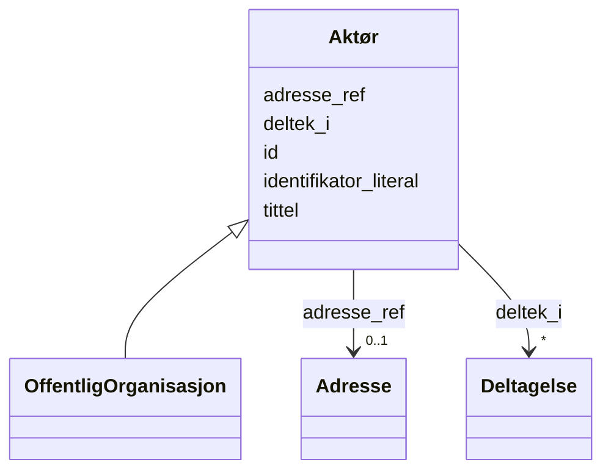

# Class: Aktør 


_Ein aktør (person eller organisasjon) relatert til ei teneste._


URI: [foaf:Agent](http://xmlns.com/foaf/0.1/Agent)





## Inheritance
* **Aktør**
    * [OffentligOrganisasjon](OffentligOrganisasjon.md)


## Class Properties

| Property | Value |
| --- | --- |
| Class URI | [foaf:Agent](http://xmlns.com/foaf/0.1/Agent) |


## Eigenskapar


  
  

  
  
    
  

  
  
    
  

  
  

  
  


### Obligatorisk

| Namn | Kardinalitet og domene | Beskriving |
| --- | --- | --- |
| [tittel](tittel.md) | 1..* <br/> [LangString](LangString.md) | Namn/tittel på ressursen (dct:title) |
| [identifikator_literal](identifikator_literal.md) | 1 <br/> [String](String.md) | Tekstleg identifikator for ressursen (dct:identifier) |


  
  

  
  

  
  

  
  

  
  


  
  

  
  

  
  

  
  
    
  

  
  
    
  


### Valgfri

| Namn | Kardinalitet og domene | Beskriving |
| --- | --- | --- |
| [adresse_ref](adresse_ref.md) | 0..1 <br/> [Adresse](Adresse.md) | Postadresse knytt til aktøren |
| [deltek_i](deltek_i.md) | * <br/> [Deltagelse](Deltagelse.md) | Deltakingar aktøren er del av |


  
  
  
  
    
  

  
  
  
    
      
    
      
    
      
    
  
  

  
  
  
    
      
    
      
    
      
    
  
  

  
  
  
    
      
    
      
    
      
    
  
  

  
  
  
    
      
    
      
    
      
    
  
  


### Andre

| Namn | Kardinalitet og domene | Beskriving |
| --- | --- | --- |
| [id](id.md) | 1 <br/> [Uriorcurie](Uriorcurie.md) | URI-identifikator for ressursen |


## Usages

| used by | used in | type | used |
| ---  | --- | --- | --- |
| [Tjeneste](Tjeneste.md) | [eigd_av](eigd_av.md) | range | [Aktør](Aktør.md) |
| [Deltagelse](Deltagelse.md) | [deltakar](deltakar.md) | range | [Aktør](Aktør.md) |
| [Katalog](Katalog.md) | [utgjevar](utgjevar.md) | range | [Aktør](Aktør.md) |


## Identifier and Mapping Information


### Schema Source


* from schema: https://data.norge.no/linkml/cpsv-ap-no


## Mappings

| Mapping Type | Mapped Value |
| ---  | ---  |
| self | foaf:Agent |
| native | https://data.norge.no/linkml/cpsv-ap-no/Aktør |


## LinkML Source

<!-- TODO: investigate https://stackoverflow.com/questions/37606292/how-to-create-tabbed-code-blocks-in-mkdocs-or-sphinx -->

### Direct

<details>
```yaml
name: Aktør
description: Ein aktør (person eller organisasjon) relatert til ei teneste.
from_schema: https://data.norge.no/linkml/cpsv-ap-no
slots:
- id
- tittel
- identifikator_literal
- adresse_ref
- deltek_i
slot_usage:
  tittel:
    name: tittel
    in_subset:
    - Obligatorisk
    required: true
  identifikator_literal:
    name: identifikator_literal
    in_subset:
    - Obligatorisk
    required: true
  adresse_ref:
    name: adresse_ref
    in_subset:
    - Valgfri
  deltek_i:
    name: deltek_i
    in_subset:
    - Valgfri
class_uri: foaf:Agent

```
</details>

### Induced

<details>
```yaml
name: Aktør
description: Ein aktør (person eller organisasjon) relatert til ei teneste.
from_schema: https://data.norge.no/linkml/cpsv-ap-no
slot_usage:
  tittel:
    name: tittel
    in_subset:
    - Obligatorisk
    required: true
  identifikator_literal:
    name: identifikator_literal
    in_subset:
    - Obligatorisk
    required: true
  adresse_ref:
    name: adresse_ref
    in_subset:
    - Valgfri
  deltek_i:
    name: deltek_i
    in_subset:
    - Valgfri
attributes:
  id:
    name: id
    description: URI-identifikator for ressursen.
    from_schema: https://data.norge.no/linkml/cpsv-ap-no
    rank: 1000
    identifier: true
    alias: id
    owner: Aktør
    domain_of:
    - LovpalagtTjeneste
    - OffentligTjeneste
    - Tjeneste
    - Hendelse
    - Aktør
    - Kontaktpunkt
    - Tjenestekanal
    - Dokumentasjonstype
    - Tjenesteresultattype
    - Tjenesteresultattypeliste
    - Gebyr
    - Regel
    - RegulativRessurs
    - Deltagelse
    - Adresse
    - Katalog
    - Spraak
    - Mediatype
    - Konsept
    - Begrepssamling
    range: uriorcurie
    required: true
  tittel:
    name: tittel
    description: Namn/tittel på ressursen (dct:title).
    in_subset:
    - Obligatorisk
    from_schema: https://data.norge.no/linkml/cpsv-ap-no
    rank: 1000
    slot_uri: dct:title
    alias: tittel
    owner: Aktør
    domain_of:
    - LovpalagtTjeneste
    - OffentligTjeneste
    - Tjeneste
    - Hendelse
    - Aktør
    - Dokumentasjonstype
    - Tjenesteresultattype
    - Tjenesteresultattypeliste
    - Regel
    - RegulativRessurs
    - Katalog
    range: LangString
    required: true
    multivalued: true
  identifikator_literal:
    name: identifikator_literal
    description: Tekstleg identifikator for ressursen (dct:identifier).
    in_subset:
    - Obligatorisk
    from_schema: https://data.norge.no/linkml/cpsv-ap-no
    rank: 1000
    slot_uri: dct:identifier
    alias: identifikator_literal
    owner: Aktør
    domain_of:
    - LovpalagtTjeneste
    - OffentligTjeneste
    - Tjeneste
    - Hendelse
    - Aktør
    - Tjenestekanal
    - Dokumentasjonstype
    - Tjenesteresultattype
    - Gebyr
    - Regel
    - RegulativRessurs
    - Katalog
    range: string
    required: true
  adresse_ref:
    name: adresse_ref
    description: Postadresse knytt til aktøren.
    in_subset:
    - Valgfri
    from_schema: https://data.norge.no/linkml/cpsv-ap-no
    rank: 1000
    slot_uri: locn:address
    alias: adresse_ref
    owner: Aktør
    domain_of:
    - Aktør
    range: Adresse
  deltek_i:
    name: deltek_i
    description: Deltakingar aktøren er del av.
    in_subset:
    - Valgfri
    from_schema: https://data.norge.no/linkml/cpsv-ap-no
    rank: 1000
    slot_uri: cv:participates
    alias: deltek_i
    owner: Aktør
    domain_of:
    - Aktør
    range: Deltagelse
    multivalued: true
class_uri: foaf:Agent

```
</details>