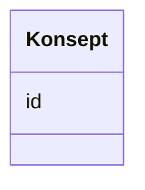

# Class: Konsept 


_Referanse til eit SKOS-omgrep frå eit kontrollert vokabular._


URI: [skos:Concept](http://www.w3.org/2004/02/skos/core#Concept)





<!-- no inheritance hierarchy -->

## Class Properties

| Property | Value |
| --- | --- |
| Class URI | [skos:Concept](http://www.w3.org/2004/02/skos/core#Concept) |


## Eigenskapar


  
  


  
  


  
  


  
  
  
  
    
  


### Andre

| Namn | Kardinalitet og domene | Beskriving |
| --- | --- | --- |
| [id](id.md) | 1 <br/> [Uriorcurie](Uriorcurie.md) | URI-identifikator for ressursen |


## Usages

| used by | used in | type | used |
| ---  | --- | --- | --- |
| [LovpalagtTjeneste](LovpalagtTjeneste.md) | [tema](tema.md) | range | [Konsept](Konsept.md) |
| [LovpalagtTjeneste](LovpalagtTjeneste.md) | [dekningsomrade](dekningsomrade.md) | range | [Konsept](Konsept.md) |
| [LovpalagtTjeneste](LovpalagtTjeneste.md) | [type_concept](type_concept.md) | range | [Konsept](Konsept.md) |
| [LovpalagtTjeneste](LovpalagtTjeneste.md) | [temaomrade](temaomrade.md) | range | [Konsept](Konsept.md) |
| [LovpalagtTjeneste](LovpalagtTjeneste.md) | [er_klassifisert_av](er_klassifisert_av.md) | range | [Konsept](Konsept.md) |
| [LovpalagtTjeneste](LovpalagtTjeneste.md) | [malgruppe](malgruppe.md) | range | [Konsept](Konsept.md) |
| [LovpalagtTjeneste](LovpalagtTjeneste.md) | [sektor](sektor.md) | range | [Konsept](Konsept.md) |
| [OffentligTjeneste](OffentligTjeneste.md) | [tema](tema.md) | range | [Konsept](Konsept.md) |
| [OffentligTjeneste](OffentligTjeneste.md) | [dekningsomrade](dekningsomrade.md) | range | [Konsept](Konsept.md) |
| [OffentligTjeneste](OffentligTjeneste.md) | [type_concept](type_concept.md) | range | [Konsept](Konsept.md) |
| [OffentligTjeneste](OffentligTjeneste.md) | [status](status.md) | range | [Konsept](Konsept.md) |
| [OffentligTjeneste](OffentligTjeneste.md) | [temaomrade](temaomrade.md) | range | [Konsept](Konsept.md) |
| [OffentligTjeneste](OffentligTjeneste.md) | [er_klassifisert_av](er_klassifisert_av.md) | range | [Konsept](Konsept.md) |
| [OffentligTjeneste](OffentligTjeneste.md) | [malgruppe](malgruppe.md) | range | [Konsept](Konsept.md) |
| [OffentligTjeneste](OffentligTjeneste.md) | [sektor](sektor.md) | range | [Konsept](Konsept.md) |
| [Tjeneste](Tjeneste.md) | [tema](tema.md) | range | [Konsept](Konsept.md) |
| [Tjeneste](Tjeneste.md) | [dekningsomrade](dekningsomrade.md) | range | [Konsept](Konsept.md) |
| [Tjeneste](Tjeneste.md) | [type_concept](type_concept.md) | range | [Konsept](Konsept.md) |
| [Tjeneste](Tjeneste.md) | [status](status.md) | range | [Konsept](Konsept.md) |
| [Tjeneste](Tjeneste.md) | [temaomrade](temaomrade.md) | range | [Konsept](Konsept.md) |
| [Tjeneste](Tjeneste.md) | [er_klassifisert_av](er_klassifisert_av.md) | range | [Konsept](Konsept.md) |
| [Tjeneste](Tjeneste.md) | [malgruppe](malgruppe.md) | range | [Konsept](Konsept.md) |
| [Tjeneste](Tjeneste.md) | [sektor](sektor.md) | range | [Konsept](Konsept.md) |
| [Hendelse](Hendelse.md) | [tema](tema.md) | range | [Konsept](Konsept.md) |
| [Hendelse](Hendelse.md) | [type_concept](type_concept.md) | range | [Konsept](Konsept.md) |
| [Livshendelse](Livshendelse.md) | [tema](tema.md) | range | [Konsept](Konsept.md) |
| [Livshendelse](Livshendelse.md) | [type_concept](type_concept.md) | range | [Konsept](Konsept.md) |
| [Virksomhetshendelse](Virksomhetshendelse.md) | [tema](tema.md) | range | [Konsept](Konsept.md) |
| [Virksomhetshendelse](Virksomhetshendelse.md) | [type_concept](type_concept.md) | range | [Konsept](Konsept.md) |
| [OffentligOrganisasjon](OffentligOrganisasjon.md) | [dekningsomrade](dekningsomrade.md) | range | [Konsept](Konsept.md) |
| [OffentligOrganisasjon](OffentligOrganisasjon.md) | [type_concept](type_concept.md) | range | [Konsept](Konsept.md) |
| [Tjenestekanal](Tjenestekanal.md) | [type_concept](type_concept.md) | range | [Konsept](Konsept.md) |
| [Dokumentasjonstype](Dokumentasjonstype.md) | [klassifisering](klassifisering.md) | range | [Konsept](Konsept.md) |
| [Dokumentasjonstype](Dokumentasjonstype.md) | [utstedingsstad](utstedingsstad.md) | range | [Konsept](Konsept.md) |
| [Tjenesteresultattype](Tjenesteresultattype.md) | [type_concept](type_concept.md) | range | [Konsept](Konsept.md) |
| [Gebyr](Gebyr.md) | [valuta](valuta.md) | range | [Konsept](Konsept.md) |
| [Regel](Regel.md) | [type_concept](type_concept.md) | range | [Konsept](Konsept.md) |
| [RegulativRessurs](RegulativRessurs.md) | [type_concept](type_concept.md) | range | [Konsept](Konsept.md) |
| [Deltagelse](Deltagelse.md) | [har_rolle](har_rolle.md) | range | [Konsept](Konsept.md) |
| [Katalog](Katalog.md) | [dekningsomrade](dekningsomrade.md) | range | [Konsept](Konsept.md) |
| [Katalog](Katalog.md) | [oppdateringsfrekvens](oppdateringsfrekvens.md) | range | [Konsept](Konsept.md) |


## Identifier and Mapping Information


### Schema Source


* from schema: https://data.norge.no/linkml/cpsv-ap-no


## Mappings

| Mapping Type | Mapped Value |
| ---  | ---  |
| self | skos:Concept |
| native | https://data.norge.no/linkml/cpsv-ap-no/Konsept |


## LinkML Source

<!-- TODO: investigate https://stackoverflow.com/questions/37606292/how-to-create-tabbed-code-blocks-in-mkdocs-or-sphinx -->

### Direct

<details>
```yaml
name: Konsept
description: Referanse til eit SKOS-omgrep frå eit kontrollert vokabular.
from_schema: https://data.norge.no/linkml/cpsv-ap-no
slots:
- id
class_uri: skos:Concept

```
</details>

### Induced

<details>
```yaml
name: Konsept
description: Referanse til eit SKOS-omgrep frå eit kontrollert vokabular.
from_schema: https://data.norge.no/linkml/cpsv-ap-no
attributes:
  id:
    name: id
    description: URI-identifikator for ressursen.
    from_schema: https://data.norge.no/linkml/cpsv-ap-no
    rank: 1000
    identifier: true
    alias: id
    owner: Konsept
    domain_of:
    - LovpalagtTjeneste
    - OffentligTjeneste
    - Tjeneste
    - Hendelse
    - Aktor
    - Kontaktpunkt
    - Tjenestekanal
    - Dokumentasjonstype
    - Tjenesteresultattype
    - Tjenesteresultattypeliste
    - Gebyr
    - Regel
    - RegulativRessurs
    - Deltagelse
    - Adresse
    - Katalog
    - Spraak
    - Mediatype
    - Konsept
    - Begrepssamling
    range: uriorcurie
    required: true
class_uri: skos:Concept

```
</details>