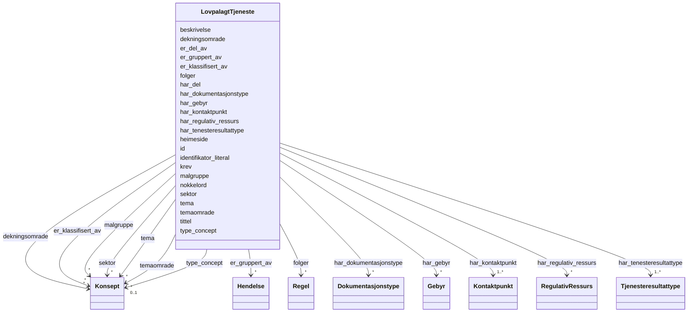

# Class: LovpalagtTjeneste 


_Ei lovpålagd teneste som offentlege organ er pålagde å utføre._


URI: [cpsvno:StatutoryService](https://data.norge.no/vocabulary/cpsvno#StatutoryService)





<!-- no inheritance hierarchy -->

## Class Properties

| Property | Value |
| --- | --- |
| Class URI | [cpsvno:StatutoryService](https://data.norge.no/vocabulary/cpsvno#StatutoryService) |


## Eigenskapar


  
  

  
  
    
  

  
  
    
  

  
  
    
  

  
  
    
  

  
  
    
  

  
  

  
  

  
  

  
  

  
  

  
  

  
  

  
  

  
  

  
  

  
  

  
  

  
  

  
  

  
  

  
  

  
  


### Obligatorisk

| Namn | Kardinalitet og domene | Beskriving |
| --- | --- | --- |
| [tittel](tittel.md) | 1..* <br/> [LangString](langstring.md) | Namn/tittel på ressursen (dct:title) |
| [beskrivelse](beskrivelse.md) | 1..* <br/> [LangString](langstring.md) | Fritekstbeskrivelse av ressursen (dct:description) |
| [identifikator_literal](identifikator_literal.md) | 1 <br/> [String](string.md) | Tekstleg identifikator for ressursen (dct:identifier) |
| [har_kontaktpunkt](har_kontaktpunkt.md) | 1..* <br/> [Kontaktpunkt](kontaktpunkt.md) | Kontaktpunkt for tenesta eller organisasjonen |
| [har_tenesteresultattype](har_tenesteresultattype.md) | 1..* <br/> [Tjenesteresultattype](tjenesteresultattype.md) | Typen resultat tenesta kan produsere |


  
  

  
  

  
  

  
  

  
  

  
  

  
  
    
  

  
  
    
  

  
  
    
  

  
  
    
  

  
  
    
  

  
  
    
  

  
  

  
  

  
  

  
  

  
  

  
  

  
  

  
  

  
  

  
  

  
  


### Anbefalt

| Namn | Kardinalitet og domene | Beskriving |
| --- | --- | --- |
| [tema](tema.md) | * <br/> [Konsept](konsept.md) | Emne/tema tenesta handlar om |
| [dekningsomrade](dekningsomrade.md) | * <br/> [Konsept](konsept.md) | Geografisk dekningsområde (dct:spatial) |
| [har_dokumentasjonstype](har_dokumentasjonstype.md) | * <br/> [Dokumentasjonstype](dokumentasjonstype.md) | Dokumentasjon som krevst for tenesta |
| [heimeside](heimeside.md) | * <br/> [Uri](uri.md) | Heimeside for ressursen eller organisasjonen (foaf:homepage) |
| [type_concept](type_concept.md) | 0..1 <br/> [Konsept](konsept.md) | Type ressurs frå eit kontrollert vokabular (dct:type) |
| [temaomrade](temaomrade.md) | * <br/> [Konsept](konsept.md) | Tematisk område for tenesta |


  
  

  
  

  
  

  
  

  
  

  
  

  
  

  
  

  
  

  
  

  
  

  
  

  
  
    
  

  
  
    
  

  
  
    
  

  
  
    
  

  
  
    
  

  
  
    
  

  
  
    
  

  
  
    
  

  
  
    
  

  
  
    
  

  
  
    
  


### Valgfri

| Namn | Kardinalitet og domene | Beskriving |
| --- | --- | --- |
| [er_del_av](er_del_av.md) | 0..1 <br/> [Uriorcurie](uriorcurie.md) | Tenesta er del av ei anna teneste |
| [har_del](har_del.md) | * <br/> [Uriorcurie](uriorcurie.md) | Deltenester som inngår i denne tenesta |
| [er_gruppert_av](er_gruppert_av.md) | * <br/> [Hendelse](hendelse.md) | Hending(ar) som grupperer tenesta |
| [er_klassifisert_av](er_klassifisert_av.md) | * <br/> [Konsept](konsept.md) | Omgrep tenesta er klassifisert med |
| [folger](folger.md) | * <br/> [Regel](regel.md) | Regelverk tenesta følgjer |
| [har_gebyr](har_gebyr.md) | * <br/> [Gebyr](gebyr.md) | Gebyr knytt til tenesta |
| [har_regulativ_ressurs](har_regulativ_ressurs.md) | * <br/> [RegulativRessurs](regulativressurs.md) | Regulativ ressurs (lov, forskrift) knytt til tenesta |
| [krev](krev.md) | * <br/> [Uriorcurie](uriorcurie.md) | Teneste eller ressurs denne tenesta krev |
| [malgruppe](malgruppe.md) | * <br/> [Konsept](konsept.md) | Målgruppe for tenesta |
| [nokkelord](nokkelord.md) | * <br/> [LangString](langstring.md) | Nøkkelord som beskriv ressursen (dcat:keyword) |
| [sektor](sektor.md) | * <br/> [Konsept](konsept.md) | Industri/sektor tenesta tilhøyrer |


  
  
  
  
    
  

  
  
  
    
      
    
      
    
      
    
  
  

  
  
  
    
      
    
      
    
      
    
  
  

  
  
  
    
      
    
      
    
      
    
  
  

  
  
  
    
      
    
      
    
      
    
  
  

  
  
  
    
      
    
      
    
      
    
  
  

  
  
  
    
      
    
      
    
      
    
  
  

  
  
  
    
      
    
      
    
      
    
  
  

  
  
  
    
      
    
      
    
      
    
  
  

  
  
  
    
      
    
      
    
      
    
  
  

  
  
  
    
      
    
      
    
      
    
  
  

  
  
  
    
      
    
      
    
      
    
  
  

  
  
  
    
      
    
      
    
      
    
  
  

  
  
  
    
      
    
      
    
      
    
  
  

  
  
  
    
      
    
      
    
      
    
  
  

  
  
  
    
      
    
      
    
      
    
  
  

  
  
  
    
      
    
      
    
      
    
  
  

  
  
  
    
      
    
      
    
      
    
  
  

  
  
  
    
      
    
      
    
      
    
  
  

  
  
  
    
      
    
      
    
      
    
  
  

  
  
  
    
      
    
      
    
      
    
  
  

  
  
  
    
      
    
      
    
      
    
  
  

  
  
  
    
      
    
      
    
      
    
  
  


### Andre

| Namn | Kardinalitet og domene | Beskriving |
| --- | --- | --- |
| [id](id.md) | 1 <br/> [Uriorcurie](uriorcurie.md) | URI-identifikator for ressursen |


## Usages

| used by | used in | type | used |
| ---  | --- | --- | --- |
| [OffentligTjeneste](offentligtjeneste.md) | [realiserer](realiserer.md) | range | [LovpalagtTjeneste](lovpalagttjeneste.md) |


## Identifier and Mapping Information


### Schema Source


* from schema: https://data.norge.no/linkml/cpsv-ap-no


## Mappings

| Mapping Type | Mapped Value |
| ---  | ---  |
| self | cpsvno:StatutoryService |
| native | https://data.norge.no/linkml/cpsv-ap-no/LovpalagtTjeneste |


## LinkML Source

<!-- TODO: investigate https://stackoverflow.com/questions/37606292/how-to-create-tabbed-code-blocks-in-mkdocs-or-sphinx -->

### Direct

<details>
```yaml
name: LovpalagtTjeneste
description: Ei lovpålagd teneste som offentlege organ er pålagde å utføre.
from_schema: https://data.norge.no/linkml/cpsv-ap-no
slots:
- id
- tittel
- beskrivelse
- identifikator_literal
- har_kontaktpunkt
- har_tenesteresultattype
- tema
- dekningsomrade
- har_dokumentasjonstype
- heimeside
- type_concept
- temaomrade
- er_del_av
- har_del
- er_gruppert_av
- er_klassifisert_av
- folger
- har_gebyr
- har_regulativ_ressurs
- krev
- malgruppe
- nokkelord
- sektor
slot_usage:
  tittel:
    name: tittel
    in_subset:
    - Obligatorisk
    required: true
  beskrivelse:
    name: beskrivelse
    in_subset:
    - Obligatorisk
    required: true
  identifikator_literal:
    name: identifikator_literal
    in_subset:
    - Obligatorisk
    required: true
  har_kontaktpunkt:
    name: har_kontaktpunkt
    in_subset:
    - Obligatorisk
    required: true
  har_tenesteresultattype:
    name: har_tenesteresultattype
    in_subset:
    - Obligatorisk
    required: true
  tema:
    name: tema
    in_subset:
    - Anbefalt
  dekningsomrade:
    name: dekningsomrade
    in_subset:
    - Anbefalt
  har_dokumentasjonstype:
    name: har_dokumentasjonstype
    in_subset:
    - Anbefalt
  heimeside:
    name: heimeside
    in_subset:
    - Anbefalt
  type_concept:
    name: type_concept
    in_subset:
    - Anbefalt
  temaomrade:
    name: temaomrade
    in_subset:
    - Anbefalt
  er_del_av:
    name: er_del_av
    in_subset:
    - Valgfri
  har_del:
    name: har_del
    in_subset:
    - Valgfri
  er_gruppert_av:
    name: er_gruppert_av
    in_subset:
    - Valgfri
  er_klassifisert_av:
    name: er_klassifisert_av
    in_subset:
    - Valgfri
  folger:
    name: folger
    in_subset:
    - Valgfri
  har_gebyr:
    name: har_gebyr
    in_subset:
    - Valgfri
  har_regulativ_ressurs:
    name: har_regulativ_ressurs
    in_subset:
    - Valgfri
  krev:
    name: krev
    in_subset:
    - Valgfri
  malgruppe:
    name: malgruppe
    in_subset:
    - Valgfri
  nokkelord:
    name: nokkelord
    in_subset:
    - Valgfri
  sektor:
    name: sektor
    in_subset:
    - Valgfri
class_uri: cpsvno:StatutoryService

```
</details>

### Induced

<details>
```yaml
name: LovpalagtTjeneste
description: Ei lovpålagd teneste som offentlege organ er pålagde å utføre.
from_schema: https://data.norge.no/linkml/cpsv-ap-no
slot_usage:
  tittel:
    name: tittel
    in_subset:
    - Obligatorisk
    required: true
  beskrivelse:
    name: beskrivelse
    in_subset:
    - Obligatorisk
    required: true
  identifikator_literal:
    name: identifikator_literal
    in_subset:
    - Obligatorisk
    required: true
  har_kontaktpunkt:
    name: har_kontaktpunkt
    in_subset:
    - Obligatorisk
    required: true
  har_tenesteresultattype:
    name: har_tenesteresultattype
    in_subset:
    - Obligatorisk
    required: true
  tema:
    name: tema
    in_subset:
    - Anbefalt
  dekningsomrade:
    name: dekningsomrade
    in_subset:
    - Anbefalt
  har_dokumentasjonstype:
    name: har_dokumentasjonstype
    in_subset:
    - Anbefalt
  heimeside:
    name: heimeside
    in_subset:
    - Anbefalt
  type_concept:
    name: type_concept
    in_subset:
    - Anbefalt
  temaomrade:
    name: temaomrade
    in_subset:
    - Anbefalt
  er_del_av:
    name: er_del_av
    in_subset:
    - Valgfri
  har_del:
    name: har_del
    in_subset:
    - Valgfri
  er_gruppert_av:
    name: er_gruppert_av
    in_subset:
    - Valgfri
  er_klassifisert_av:
    name: er_klassifisert_av
    in_subset:
    - Valgfri
  folger:
    name: folger
    in_subset:
    - Valgfri
  har_gebyr:
    name: har_gebyr
    in_subset:
    - Valgfri
  har_regulativ_ressurs:
    name: har_regulativ_ressurs
    in_subset:
    - Valgfri
  krev:
    name: krev
    in_subset:
    - Valgfri
  malgruppe:
    name: malgruppe
    in_subset:
    - Valgfri
  nokkelord:
    name: nokkelord
    in_subset:
    - Valgfri
  sektor:
    name: sektor
    in_subset:
    - Valgfri
attributes:
  id:
    name: id
    description: URI-identifikator for ressursen.
    from_schema: https://data.norge.no/linkml/cpsv-ap-no
    rank: 1000
    identifier: true
    alias: id
    owner: LovpalagtTjeneste
    domain_of:
    - LovpalagtTjeneste
    - OffentligTjeneste
    - Tjeneste
    - Hendelse
    - Aktor
    - Kontaktpunkt
    - Tjenestekanal
    - Dokumentasjonstype
    - Tjenesteresultattype
    - Tjenesteresultattypeliste
    - Gebyr
    - Regel
    - RegulativRessurs
    - Deltagelse
    - Adresse
    - Katalog
    - Spraak
    - Mediatype
    - Konsept
    - Begrepssamling
    range: uriorcurie
  tittel:
    name: tittel
    description: Namn/tittel på ressursen (dct:title).
    in_subset:
    - Obligatorisk
    from_schema: https://data.norge.no/linkml/cpsv-ap-no
    rank: 1000
    slot_uri: dct:title
    alias: tittel
    owner: LovpalagtTjeneste
    domain_of:
    - LovpalagtTjeneste
    - OffentligTjeneste
    - Tjeneste
    - Hendelse
    - Aktor
    - Dokumentasjonstype
    - Tjenesteresultattype
    - Tjenesteresultattypeliste
    - Regel
    - RegulativRessurs
    - Katalog
    range: LangString
    required: true
    multivalued: true
  beskrivelse:
    name: beskrivelse
    description: Fritekstbeskrivelse av ressursen (dct:description).
    in_subset:
    - Obligatorisk
    from_schema: https://data.norge.no/linkml/cpsv-ap-no
    rank: 1000
    slot_uri: dct:description
    alias: beskrivelse
    owner: LovpalagtTjeneste
    domain_of:
    - LovpalagtTjeneste
    - OffentligTjeneste
    - Tjeneste
    - Hendelse
    - Tjenestekanal
    - Dokumentasjonstype
    - Tjenesteresultattype
    - Tjenesteresultattypeliste
    - Gebyr
    - Regel
    - Katalog
    range: LangString
    required: true
    multivalued: true
  identifikator_literal:
    name: identifikator_literal
    description: Tekstleg identifikator for ressursen (dct:identifier).
    in_subset:
    - Obligatorisk
    from_schema: https://data.norge.no/linkml/cpsv-ap-no
    rank: 1000
    slot_uri: dct:identifier
    alias: identifikator_literal
    owner: LovpalagtTjeneste
    domain_of:
    - LovpalagtTjeneste
    - OffentligTjeneste
    - Tjeneste
    - Hendelse
    - Aktor
    - Tjenestekanal
    - Dokumentasjonstype
    - Tjenesteresultattype
    - Gebyr
    - Regel
    - RegulativRessurs
    - Katalog
    range: string
    required: true
  har_kontaktpunkt:
    name: har_kontaktpunkt
    description: Kontaktpunkt for tenesta eller organisasjonen.
    in_subset:
    - Obligatorisk
    from_schema: https://data.norge.no/linkml/cpsv-ap-no
    rank: 1000
    slot_uri: cv:contactPoint
    alias: har_kontaktpunkt
    owner: LovpalagtTjeneste
    domain_of:
    - LovpalagtTjeneste
    - OffentligTjeneste
    - Tjeneste
    - Hendelse
    - Katalog
    range: Kontaktpunkt
    required: true
    multivalued: true
  har_tenesteresultattype:
    name: har_tenesteresultattype
    description: Typen resultat tenesta kan produsere.
    in_subset:
    - Obligatorisk
    from_schema: https://data.norge.no/linkml/cpsv-ap-no
    rank: 1000
    slot_uri: cpsvno:hasOutputType
    alias: har_tenesteresultattype
    owner: LovpalagtTjeneste
    domain_of:
    - LovpalagtTjeneste
    - OffentligTjeneste
    - Tjeneste
    range: Tjenesteresultattype
    required: true
    multivalued: true
  tema:
    name: tema
    description: Emne/tema tenesta handlar om.
    in_subset:
    - Anbefalt
    from_schema: https://data.norge.no/linkml/cpsv-ap-no
    rank: 1000
    slot_uri: dct:subject
    alias: tema
    owner: LovpalagtTjeneste
    domain_of:
    - LovpalagtTjeneste
    - OffentligTjeneste
    - Tjeneste
    - Hendelse
    range: Konsept
    multivalued: true
  dekningsomrade:
    name: dekningsomrade
    description: Geografisk dekningsområde (dct:spatial).
    in_subset:
    - Anbefalt
    from_schema: https://data.norge.no/linkml/cpsv-ap-no
    rank: 1000
    slot_uri: dct:spatial
    alias: dekningsomrade
    owner: LovpalagtTjeneste
    domain_of:
    - LovpalagtTjeneste
    - OffentligTjeneste
    - Tjeneste
    - OffentligOrganisasjon
    - Katalog
    range: Konsept
    multivalued: true
  har_dokumentasjonstype:
    name: har_dokumentasjonstype
    description: Dokumentasjon som krevst for tenesta.
    in_subset:
    - Anbefalt
    from_schema: https://data.norge.no/linkml/cpsv-ap-no
    rank: 1000
    slot_uri: cv:hasInputType
    alias: har_dokumentasjonstype
    owner: LovpalagtTjeneste
    domain_of:
    - LovpalagtTjeneste
    - OffentligTjeneste
    - Tjeneste
    range: Dokumentasjonstype
    multivalued: true
  heimeside:
    name: heimeside
    description: Heimeside for ressursen eller organisasjonen (foaf:homepage).
    in_subset:
    - Anbefalt
    from_schema: https://data.norge.no/linkml/cpsv-ap-no
    rank: 1000
    slot_uri: foaf:homepage
    alias: heimeside
    owner: LovpalagtTjeneste
    domain_of:
    - LovpalagtTjeneste
    - OffentligTjeneste
    - Tjeneste
    - OffentligOrganisasjon
    - Katalog
    range: uri
    multivalued: true
  type_concept:
    name: type_concept
    description: Type ressurs frå eit kontrollert vokabular (dct:type).
    in_subset:
    - Anbefalt
    from_schema: https://data.norge.no/linkml/cpsv-ap-no
    rank: 1000
    slot_uri: dct:type
    alias: type_concept
    owner: LovpalagtTjeneste
    domain_of:
    - LovpalagtTjeneste
    - OffentligTjeneste
    - Tjeneste
    - Hendelse
    - OffentligOrganisasjon
    - Tjenestekanal
    - Tjenesteresultattype
    - Regel
    - RegulativRessurs
    range: Konsept
  temaomrade:
    name: temaomrade
    description: Tematisk område for tenesta.
    in_subset:
    - Anbefalt
    from_schema: https://data.norge.no/linkml/cpsv-ap-no
    rank: 1000
    slot_uri: cv:thematicArea
    alias: temaomrade
    owner: LovpalagtTjeneste
    domain_of:
    - LovpalagtTjeneste
    - OffentligTjeneste
    - Tjeneste
    range: Konsept
    multivalued: true
  er_del_av:
    name: er_del_av
    description: Tenesta er del av ei anna teneste.
    in_subset:
    - Valgfri
    from_schema: https://data.norge.no/linkml/cpsv-ap-no
    rank: 1000
    slot_uri: dct:isPartOf
    alias: er_del_av
    owner: LovpalagtTjeneste
    domain_of:
    - LovpalagtTjeneste
    - OffentligTjeneste
    - Tjeneste
    range: uriorcurie
  har_del:
    name: har_del
    description: Deltenester som inngår i denne tenesta.
    in_subset:
    - Valgfri
    from_schema: https://data.norge.no/linkml/cpsv-ap-no
    rank: 1000
    slot_uri: dct:hasPart
    alias: har_del
    owner: LovpalagtTjeneste
    domain_of:
    - LovpalagtTjeneste
    - OffentligTjeneste
    - Tjeneste
    range: uriorcurie
    multivalued: true
  er_gruppert_av:
    name: er_gruppert_av
    description: Hending(ar) som grupperer tenesta.
    in_subset:
    - Valgfri
    from_schema: https://data.norge.no/linkml/cpsv-ap-no
    rank: 1000
    slot_uri: cv:isGroupedBy
    alias: er_gruppert_av
    owner: LovpalagtTjeneste
    domain_of:
    - LovpalagtTjeneste
    - OffentligTjeneste
    - Tjeneste
    range: Hendelse
    multivalued: true
  er_klassifisert_av:
    name: er_klassifisert_av
    description: Omgrep tenesta er klassifisert med.
    in_subset:
    - Valgfri
    from_schema: https://data.norge.no/linkml/cpsv-ap-no
    rank: 1000
    slot_uri: cv:isClassifiedBy
    alias: er_klassifisert_av
    owner: LovpalagtTjeneste
    domain_of:
    - LovpalagtTjeneste
    - OffentligTjeneste
    - Tjeneste
    range: Konsept
    multivalued: true
  folger:
    name: folger
    description: Regelverk tenesta følgjer.
    in_subset:
    - Valgfri
    from_schema: https://data.norge.no/linkml/cpsv-ap-no
    rank: 1000
    slot_uri: cpsv:follows
    alias: folger
    owner: LovpalagtTjeneste
    domain_of:
    - LovpalagtTjeneste
    - OffentligTjeneste
    - Tjeneste
    range: Regel
    multivalued: true
  har_gebyr:
    name: har_gebyr
    description: Gebyr knytt til tenesta.
    in_subset:
    - Valgfri
    from_schema: https://data.norge.no/linkml/cpsv-ap-no
    rank: 1000
    slot_uri: cv:hasCost
    alias: har_gebyr
    owner: LovpalagtTjeneste
    domain_of:
    - LovpalagtTjeneste
    - OffentligTjeneste
    - Tjeneste
    range: Gebyr
    multivalued: true
  har_regulativ_ressurs:
    name: har_regulativ_ressurs
    description: Regulativ ressurs (lov, forskrift) knytt til tenesta.
    in_subset:
    - Valgfri
    from_schema: https://data.norge.no/linkml/cpsv-ap-no
    rank: 1000
    slot_uri: cv:hasLegalResource
    alias: har_regulativ_ressurs
    owner: LovpalagtTjeneste
    domain_of:
    - LovpalagtTjeneste
    - OffentligTjeneste
    - Tjeneste
    range: RegulativRessurs
    multivalued: true
  krev:
    name: krev
    description: Teneste eller ressurs denne tenesta krev.
    in_subset:
    - Valgfri
    from_schema: https://data.norge.no/linkml/cpsv-ap-no
    rank: 1000
    slot_uri: dct:requires
    alias: krev
    owner: LovpalagtTjeneste
    domain_of:
    - LovpalagtTjeneste
    - OffentligTjeneste
    - Tjeneste
    range: uriorcurie
    multivalued: true
  malgruppe:
    name: malgruppe
    description: Målgruppe for tenesta.
    in_subset:
    - Valgfri
    from_schema: https://data.norge.no/linkml/cpsv-ap-no
    rank: 1000
    slot_uri: dct:audience
    alias: malgruppe
    owner: LovpalagtTjeneste
    domain_of:
    - LovpalagtTjeneste
    - OffentligTjeneste
    - Tjeneste
    range: Konsept
    multivalued: true
  nokkelord:
    name: nokkelord
    description: Nøkkelord som beskriv ressursen (dcat:keyword).
    in_subset:
    - Valgfri
    from_schema: https://data.norge.no/linkml/cpsv-ap-no
    rank: 1000
    slot_uri: dcat:keyword
    alias: nokkelord
    owner: LovpalagtTjeneste
    domain_of:
    - LovpalagtTjeneste
    - OffentligTjeneste
    - Tjeneste
    range: LangString
    multivalued: true
  sektor:
    name: sektor
    description: Industri/sektor tenesta tilhøyrer.
    in_subset:
    - Valgfri
    from_schema: https://data.norge.no/linkml/cpsv-ap-no
    rank: 1000
    slot_uri: cv:sector
    alias: sektor
    owner: LovpalagtTjeneste
    domain_of:
    - LovpalagtTjeneste
    - OffentligTjeneste
    - Tjeneste
    range: Konsept
    multivalued: true
class_uri: cpsvno:StatutoryService

```
</details>