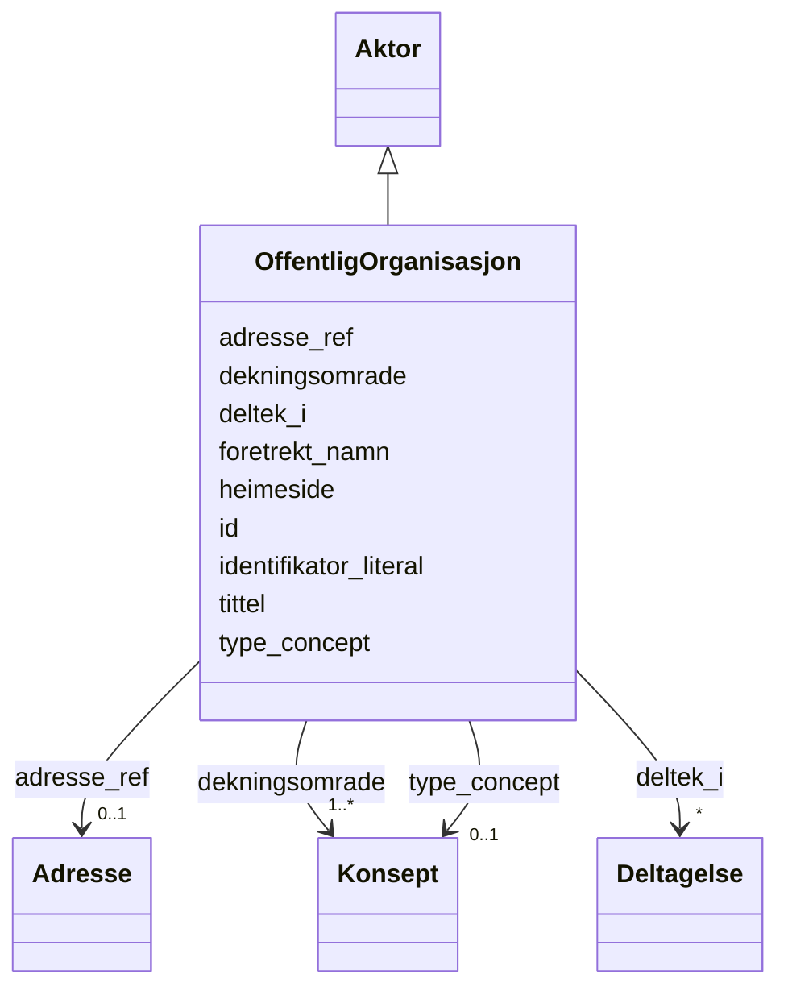

# Class: OffentligOrganisasjon 


_Ein offentleg organisasjon som er ansvarleg for ei teneste._


URI: [cv:PublicOrganisation](http://data.europa.eu/m8g/PublicOrganisation)





## Inheritance
* [Aktor](Aktor.md)
    * **OffentligOrganisasjon**


## Class Properties

| Property | Value |
| --- | --- |
| Class URI | [cv:PublicOrganisation](http://data.europa.eu/m8g/PublicOrganisation) |


## Eigenskapar


  
  
    
  

  
  
    
  

  
  

  
  


### Obligatorisk

| Namn | Kardinalitet og domene | Beskriving |
| --- | --- | --- |
| [foretrekt_namn](foretrekt_namn.md) | 1..* <br/> [LangString](LangString.md) | Føretrekt namn/term for organisasjonen |
| [dekningsomrade](dekningsomrade.md) | 1..* <br/> [Konsept](Konsept.md) | Geografisk dekningsområde (dct:spatial) |


  
  

  
  

  
  

  
  
    
  


### Anbefalt

| Namn | Kardinalitet og domene | Beskriving |
| --- | --- | --- |
| [type_concept](type_concept.md) | 0..1 <br/> [Konsept](Konsept.md) | Type ressurs frå eit kontrollert vokabular (dct:type) |


  
  

  
  

  
  
    
  

  
  


### Valgfri

| Namn | Kardinalitet og domene | Beskriving |
| --- | --- | --- |
| [heimeside](heimeside.md) | * <br/> [Uri](Uri.md) | Heimeside for ressursen eller organisasjonen (foaf:homepage) |


  
  
  
    
      
    
      
    
      
    
  
  

  
  
  
    
      
    
      
    
      
    
  
  

  
  
  
    
      
    
      
    
      
    
  
  

  
  
  
    
      
    
      
    
      
    
  
  


### Arva

| Namn | Kardinalitet og domene | Beskriving | Frå |
| --- | --- | --- | --- || [id](id.md) | 1 <br/> [Uriorcurie](Uriorcurie.md) | URI-identifikator for ressursen | [Aktor](Aktor.md) |
| [tittel](tittel.md) | 1..* <br/> [LangString](LangString.md) | Namn/tittel på ressursen (dct:title) | [Aktor](Aktor.md) |
| [identifikator_literal](identifikator_literal.md) | 1 <br/> [String](String.md) | Tekstleg identifikator for ressursen (dct:identifier) | [Aktor](Aktor.md) |
| [adresse_ref](adresse_ref.md) | 0..1 <br/> [Adresse](Adresse.md) | Postadresse knytt til aktøren | [Aktor](Aktor.md) |
| [deltek_i](deltek_i.md) | * <br/> [Deltagelse](Deltagelse.md) | Deltakingar aktøren er del av | [Aktor](Aktor.md) |


## Usages

| used by | used in | type | used |
| ---  | --- | --- | --- |
| [OffentligTjeneste](OffentligTjeneste.md) | [har_ansvarleg_styremakt](har_ansvarleg_styremakt.md) | range | [OffentligOrganisasjon](OffentligOrganisasjon.md) |


## Identifier and Mapping Information


### Schema Source


* from schema: https://data.norge.no/linkml/cpsv-ap-no


## Mappings

| Mapping Type | Mapped Value |
| ---  | ---  |
| self | cv:PublicOrganisation |
| native | https://data.norge.no/linkml/cpsv-ap-no/OffentligOrganisasjon |


## LinkML Source

<!-- TODO: investigate https://stackoverflow.com/questions/37606292/how-to-create-tabbed-code-blocks-in-mkdocs-or-sphinx -->

### Direct

<details>
```yaml
name: OffentligOrganisasjon
description: Ein offentleg organisasjon som er ansvarleg for ei teneste.
from_schema: https://data.norge.no/linkml/cpsv-ap-no
is_a: Aktor
slots:
- foretrekt_namn
- dekningsomrade
- heimeside
- type_concept
slot_usage:
  dekningsomrade:
    name: dekningsomrade
    in_subset:
    - Obligatorisk
    required: true
  foretrekt_namn:
    name: foretrekt_namn
    in_subset:
    - Obligatorisk
    required: true
  type_concept:
    name: type_concept
    in_subset:
    - Anbefalt
  heimeside:
    name: heimeside
    in_subset:
    - Valgfri
  adresse_ref:
    name: adresse_ref
    in_subset:
    - Valgfri
class_uri: cv:PublicOrganisation

```
</details>

### Induced

<details>
```yaml
name: OffentligOrganisasjon
description: Ein offentleg organisasjon som er ansvarleg for ei teneste.
from_schema: https://data.norge.no/linkml/cpsv-ap-no
is_a: Aktor
slot_usage:
  dekningsomrade:
    name: dekningsomrade
    in_subset:
    - Obligatorisk
    required: true
  foretrekt_namn:
    name: foretrekt_namn
    in_subset:
    - Obligatorisk
    required: true
  type_concept:
    name: type_concept
    in_subset:
    - Anbefalt
  heimeside:
    name: heimeside
    in_subset:
    - Valgfri
  adresse_ref:
    name: adresse_ref
    in_subset:
    - Valgfri
attributes:
  foretrekt_namn:
    name: foretrekt_namn
    description: Føretrekt namn/term for organisasjonen.
    in_subset:
    - Obligatorisk
    from_schema: https://data.norge.no/linkml/cpsv-ap-no
    rank: 1000
    slot_uri: skos:prefLabel
    alias: foretrekt_namn
    owner: OffentligOrganisasjon
    domain_of:
    - OffentligOrganisasjon
    range: LangString
    required: true
    multivalued: true
  dekningsomrade:
    name: dekningsomrade
    description: Geografisk dekningsområde (dct:spatial).
    in_subset:
    - Obligatorisk
    from_schema: https://data.norge.no/linkml/cpsv-ap-no
    rank: 1000
    slot_uri: dct:spatial
    alias: dekningsomrade
    owner: OffentligOrganisasjon
    domain_of:
    - LovpalagtTjeneste
    - OffentligTjeneste
    - Tjeneste
    - OffentligOrganisasjon
    - Katalog
    range: Konsept
    required: true
    multivalued: true
  heimeside:
    name: heimeside
    description: Heimeside for ressursen eller organisasjonen (foaf:homepage).
    in_subset:
    - Valgfri
    from_schema: https://data.norge.no/linkml/cpsv-ap-no
    rank: 1000
    slot_uri: foaf:homepage
    alias: heimeside
    owner: OffentligOrganisasjon
    domain_of:
    - LovpalagtTjeneste
    - OffentligTjeneste
    - Tjeneste
    - OffentligOrganisasjon
    - Katalog
    range: uri
    multivalued: true
  type_concept:
    name: type_concept
    description: Type ressurs frå eit kontrollert vokabular (dct:type).
    in_subset:
    - Anbefalt
    from_schema: https://data.norge.no/linkml/cpsv-ap-no
    rank: 1000
    slot_uri: dct:type
    alias: type_concept
    owner: OffentligOrganisasjon
    domain_of:
    - LovpalagtTjeneste
    - OffentligTjeneste
    - Tjeneste
    - Hendelse
    - OffentligOrganisasjon
    - Tjenestekanal
    - Tjenesteresultattype
    - Regel
    - RegulativRessurs
    range: Konsept
  id:
    name: id
    description: URI-identifikator for ressursen.
    from_schema: https://data.norge.no/linkml/cpsv-ap-no
    rank: 1000
    identifier: true
    alias: id
    owner: OffentligOrganisasjon
    domain_of:
    - LovpalagtTjeneste
    - OffentligTjeneste
    - Tjeneste
    - Hendelse
    - Aktor
    - Kontaktpunkt
    - Tjenestekanal
    - Dokumentasjonstype
    - Tjenesteresultattype
    - Tjenesteresultattypeliste
    - Gebyr
    - Regel
    - RegulativRessurs
    - Deltagelse
    - Adresse
    - Katalog
    - Spraak
    - Mediatype
    - Konsept
    - Begrepssamling
    range: uriorcurie
    required: true
  tittel:
    name: tittel
    description: Namn/tittel på ressursen (dct:title).
    in_subset:
    - Obligatorisk
    from_schema: https://data.norge.no/linkml/cpsv-ap-no
    rank: 1000
    slot_uri: dct:title
    alias: tittel
    owner: OffentligOrganisasjon
    domain_of:
    - LovpalagtTjeneste
    - OffentligTjeneste
    - Tjeneste
    - Hendelse
    - Aktor
    - Dokumentasjonstype
    - Tjenesteresultattype
    - Tjenesteresultattypeliste
    - Regel
    - RegulativRessurs
    - Katalog
    range: LangString
    required: true
    multivalued: true
  identifikator_literal:
    name: identifikator_literal
    description: Tekstleg identifikator for ressursen (dct:identifier).
    in_subset:
    - Obligatorisk
    from_schema: https://data.norge.no/linkml/cpsv-ap-no
    rank: 1000
    slot_uri: dct:identifier
    alias: identifikator_literal
    owner: OffentligOrganisasjon
    domain_of:
    - LovpalagtTjeneste
    - OffentligTjeneste
    - Tjeneste
    - Hendelse
    - Aktor
    - Tjenestekanal
    - Dokumentasjonstype
    - Tjenesteresultattype
    - Gebyr
    - Regel
    - RegulativRessurs
    - Katalog
    range: string
    required: true
  adresse_ref:
    name: adresse_ref
    description: Postadresse knytt til aktøren.
    in_subset:
    - Valgfri
    from_schema: https://data.norge.no/linkml/cpsv-ap-no
    rank: 1000
    slot_uri: locn:address
    alias: adresse_ref
    owner: OffentligOrganisasjon
    domain_of:
    - Aktor
    range: Adresse
  deltek_i:
    name: deltek_i
    description: Deltakingar aktøren er del av.
    in_subset:
    - Valgfri
    from_schema: https://data.norge.no/linkml/cpsv-ap-no
    rank: 1000
    slot_uri: cv:participates
    alias: deltek_i
    owner: OffentligOrganisasjon
    domain_of:
    - Aktor
    range: Deltagelse
    multivalued: true
class_uri: cv:PublicOrganisation

```
</details>