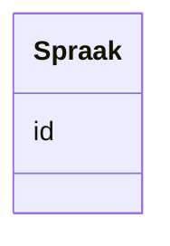

# Class: Spraak 


_Ein språkreferanse (dct:LinguisticSystem)._


URI: [dct:LinguisticSystem](http://purl.org/dc/terms/LinguisticSystem)





<!-- no inheritance hierarchy -->

## Class Properties

| Property | Value |
| --- | --- |
| Class URI | [dct:LinguisticSystem](http://purl.org/dc/terms/LinguisticSystem) |


## Eigenskapar


  
  


  
  


  
  


  
  
  
  
    
  


### Andre

| Namn | Kardinalitet og domene | Beskriving |
| --- | --- | --- |
| [id](id.md) | 1 <br/> [Uriorcurie](Uriorcurie.md) | URI-identifikator for ressursen |


## Usages

| used by | used in | type | used |
| ---  | --- | --- | --- |
| [OffentligTjeneste](OffentligTjeneste.md) | [sprak](sprak.md) | range | [Spraak](Spraak.md) |
| [Tjeneste](Tjeneste.md) | [sprak](sprak.md) | range | [Spraak](Spraak.md) |
| [Kontaktpunkt](Kontaktpunkt.md) | [sprak](sprak.md) | range | [Spraak](Spraak.md) |
| [Dokumentasjonstype](Dokumentasjonstype.md) | [godtek_sprak](godtek_sprak.md) | range | [Spraak](Spraak.md) |
| [Tjenesteresultattype](Tjenesteresultattype.md) | [mogleg_sprak](mogleg_sprak.md) | range | [Spraak](Spraak.md) |
| [Regel](Regel.md) | [sprak](sprak.md) | range | [Spraak](Spraak.md) |
| [Katalog](Katalog.md) | [sprak](sprak.md) | range | [Spraak](Spraak.md) |


## Identifier and Mapping Information


### Schema Source


* from schema: https://data.norge.no/linkml/cpsv-ap-no


## Mappings

| Mapping Type | Mapped Value |
| ---  | ---  |
| self | dct:LinguisticSystem |
| native | https://data.norge.no/linkml/cpsv-ap-no/Spraak |


## LinkML Source

<!-- TODO: investigate https://stackoverflow.com/questions/37606292/how-to-create-tabbed-code-blocks-in-mkdocs-or-sphinx -->

### Direct

<details>
```yaml
name: Spraak
description: Ein språkreferanse (dct:LinguisticSystem).
from_schema: https://data.norge.no/linkml/cpsv-ap-no
slots:
- id
class_uri: dct:LinguisticSystem

```
</details>

### Induced

<details>
```yaml
name: Spraak
description: Ein språkreferanse (dct:LinguisticSystem).
from_schema: https://data.norge.no/linkml/cpsv-ap-no
attributes:
  id:
    name: id
    description: URI-identifikator for ressursen.
    from_schema: https://data.norge.no/linkml/cpsv-ap-no
    rank: 1000
    identifier: true
    alias: id
    owner: Spraak
    domain_of:
    - LovpalagtTjeneste
    - OffentligTjeneste
    - Tjeneste
    - Hendelse
    - Aktor
    - Kontaktpunkt
    - Tjenestekanal
    - Dokumentasjonstype
    - Tjenesteresultattype
    - Tjenesteresultattypeliste
    - Gebyr
    - Regel
    - RegulativRessurs
    - Deltagelse
    - Adresse
    - Katalog
    - Spraak
    - Mediatype
    - Konsept
    - Begrepssamling
    range: uriorcurie
    required: true
class_uri: dct:LinguisticSystem

```
</details>