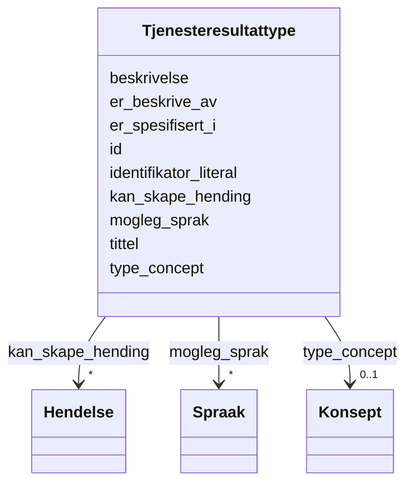

# Class: Tjenesteresultattype 


_Typen resultat som ei teneste produserer._


URI: [cpsvno:OutputType](https://data.norge.no/vocabulary/cpsvno#OutputType)





<!-- no inheritance hierarchy -->

## Class Properties

| Property | Value |
| --- | --- |
| Class URI | [cpsvno:OutputType](https://data.norge.no/vocabulary/cpsvno#OutputType) |


## Eigenskapar


  
  

  
  
    
  

  
  
    
  

  
  

  
  

  
  

  
  

  
  

  
  


### Obligatorisk

| Namn | Kardinalitet og domene | Beskriving |
| --- | --- | --- |
| [tittel](tittel.md) | 1..* <br/> [LangString](LangString.md) | Namn/tittel på ressursen (dct:title) |
| [beskrivelse](beskrivelse.md) | 1..* <br/> [LangString](LangString.md) | Fritekstbeskrivelse av ressursen (dct:description) |


  
  

  
  

  
  

  
  

  
  
    
  

  
  

  
  

  
  

  
  


### Anbefalt

| Namn | Kardinalitet og domene | Beskriving |
| --- | --- | --- |
| [mogleg_sprak](mogleg_sprak.md) | * <br/> [Spraak](Spraak.md) | Mogleg språk for tenesteresultatet |


  
  

  
  

  
  

  
  
    
  

  
  

  
  
    
  

  
  
    
  

  
  
    
  

  
  
    
  


### Valgfri

| Namn | Kardinalitet og domene | Beskriving |
| --- | --- | --- |
| [identifikator_literal](identifikator_literal.md) | 0..1 <br/> [String](String.md) | Tekstleg identifikator for ressursen (dct:identifier) |
| [er_beskrive_av](er_beskrive_av.md) | * <br/> [Uri](Uri.md) | Datasett som beskriv ressursen |
| [er_spesifisert_i](er_spesifisert_i.md) | 0..1 <br/> [Uriorcurie](Uriorcurie.md) | Liste eller spesifikasjon ressursen er del av |
| [kan_skape_hending](kan_skape_hending.md) | * <br/> [Hendelse](Hendelse.md) | Hending tenesteresultatet kan skape |
| [type_concept](type_concept.md) | 0..1 <br/> [Konsept](Konsept.md) | Type ressurs frå eit kontrollert vokabular (dct:type) |


  
  
  
  
    
  

  
  
  
    
      
    
      
    
      
    
  
  

  
  
  
    
      
    
      
    
      
    
  
  

  
  
  
    
      
    
      
    
      
    
  
  

  
  
  
    
      
    
      
    
      
    
  
  

  
  
  
    
      
    
      
    
      
    
  
  

  
  
  
    
      
    
      
    
      
    
  
  

  
  
  
    
      
    
      
    
      
    
  
  

  
  
  
    
      
    
      
    
      
    
  
  


### Andre

| Namn | Kardinalitet og domene | Beskriving |
| --- | --- | --- |
| [id](id.md) | 1 <br/> [Uriorcurie](Uriorcurie.md) | URI-identifikator for ressursen |


## Usages

| used by | used in | type | used |
| ---  | --- | --- | --- |
| [LovpalagtTjeneste](LovpalagtTjeneste.md) | [har_tenesteresultattype](har_tenesteresultattype.md) | range | [Tjenesteresultattype](Tjenesteresultattype.md) |
| [OffentligTjeneste](OffentligTjeneste.md) | [har_tenesteresultattype](har_tenesteresultattype.md) | range | [Tjenesteresultattype](Tjenesteresultattype.md) |
| [Tjeneste](Tjeneste.md) | [har_tenesteresultattype](har_tenesteresultattype.md) | range | [Tjenesteresultattype](Tjenesteresultattype.md) |


## Identifier and Mapping Information


### Schema Source


* from schema: https://data.norge.no/linkml/cpsv-ap-no


## Mappings

| Mapping Type | Mapped Value |
| ---  | ---  |
| self | cpsvno:OutputType |
| native | https://data.norge.no/linkml/cpsv-ap-no/Tjenesteresultattype |


## LinkML Source

<!-- TODO: investigate https://stackoverflow.com/questions/37606292/how-to-create-tabbed-code-blocks-in-mkdocs-or-sphinx -->

### Direct

<details>
```yaml
name: Tjenesteresultattype
description: Typen resultat som ei teneste produserer.
from_schema: https://data.norge.no/linkml/cpsv-ap-no
slots:
- id
- tittel
- beskrivelse
- identifikator_literal
- mogleg_sprak
- er_beskrive_av
- er_spesifisert_i
- kan_skape_hending
- type_concept
slot_usage:
  tittel:
    name: tittel
    in_subset:
    - Obligatorisk
    required: true
  beskrivelse:
    name: beskrivelse
    in_subset:
    - Obligatorisk
    required: true
  mogleg_sprak:
    name: mogleg_sprak
    in_subset:
    - Anbefalt
  identifikator_literal:
    name: identifikator_literal
    in_subset:
    - Valgfri
  er_beskrive_av:
    name: er_beskrive_av
    in_subset:
    - Valgfri
  er_spesifisert_i:
    name: er_spesifisert_i
    in_subset:
    - Valgfri
  kan_skape_hending:
    name: kan_skape_hending
    in_subset:
    - Valgfri
  type_concept:
    name: type_concept
    in_subset:
    - Valgfri
class_uri: cpsvno:OutputType

```
</details>

### Induced

<details>
```yaml
name: Tjenesteresultattype
description: Typen resultat som ei teneste produserer.
from_schema: https://data.norge.no/linkml/cpsv-ap-no
slot_usage:
  tittel:
    name: tittel
    in_subset:
    - Obligatorisk
    required: true
  beskrivelse:
    name: beskrivelse
    in_subset:
    - Obligatorisk
    required: true
  mogleg_sprak:
    name: mogleg_sprak
    in_subset:
    - Anbefalt
  identifikator_literal:
    name: identifikator_literal
    in_subset:
    - Valgfri
  er_beskrive_av:
    name: er_beskrive_av
    in_subset:
    - Valgfri
  er_spesifisert_i:
    name: er_spesifisert_i
    in_subset:
    - Valgfri
  kan_skape_hending:
    name: kan_skape_hending
    in_subset:
    - Valgfri
  type_concept:
    name: type_concept
    in_subset:
    - Valgfri
attributes:
  id:
    name: id
    description: URI-identifikator for ressursen.
    from_schema: https://data.norge.no/linkml/cpsv-ap-no
    rank: 1000
    identifier: true
    alias: id
    owner: Tjenesteresultattype
    domain_of:
    - LovpalagtTjeneste
    - OffentligTjeneste
    - Tjeneste
    - Hendelse
    - Aktor
    - Kontaktpunkt
    - Tjenestekanal
    - Dokumentasjonstype
    - Tjenesteresultattype
    - Tjenesteresultattypeliste
    - Gebyr
    - Regel
    - RegulativRessurs
    - Deltagelse
    - Adresse
    - Katalog
    - Spraak
    - Mediatype
    - Konsept
    - Begrepssamling
    range: uriorcurie
    required: true
  tittel:
    name: tittel
    description: Namn/tittel på ressursen (dct:title).
    in_subset:
    - Obligatorisk
    from_schema: https://data.norge.no/linkml/cpsv-ap-no
    rank: 1000
    slot_uri: dct:title
    alias: tittel
    owner: Tjenesteresultattype
    domain_of:
    - LovpalagtTjeneste
    - OffentligTjeneste
    - Tjeneste
    - Hendelse
    - Aktor
    - Dokumentasjonstype
    - Tjenesteresultattype
    - Tjenesteresultattypeliste
    - Regel
    - RegulativRessurs
    - Katalog
    range: LangString
    required: true
    multivalued: true
  beskrivelse:
    name: beskrivelse
    description: Fritekstbeskrivelse av ressursen (dct:description).
    in_subset:
    - Obligatorisk
    from_schema: https://data.norge.no/linkml/cpsv-ap-no
    rank: 1000
    slot_uri: dct:description
    alias: beskrivelse
    owner: Tjenesteresultattype
    domain_of:
    - LovpalagtTjeneste
    - OffentligTjeneste
    - Tjeneste
    - Hendelse
    - Tjenestekanal
    - Dokumentasjonstype
    - Tjenesteresultattype
    - Tjenesteresultattypeliste
    - Gebyr
    - Regel
    - Katalog
    range: LangString
    required: true
    multivalued: true
  identifikator_literal:
    name: identifikator_literal
    description: Tekstleg identifikator for ressursen (dct:identifier).
    in_subset:
    - Valgfri
    from_schema: https://data.norge.no/linkml/cpsv-ap-no
    rank: 1000
    slot_uri: dct:identifier
    alias: identifikator_literal
    owner: Tjenesteresultattype
    domain_of:
    - LovpalagtTjeneste
    - OffentligTjeneste
    - Tjeneste
    - Hendelse
    - Aktor
    - Tjenestekanal
    - Dokumentasjonstype
    - Tjenesteresultattype
    - Gebyr
    - Regel
    - RegulativRessurs
    - Katalog
    range: string
  mogleg_sprak:
    name: mogleg_sprak
    description: Mogleg språk for tenesteresultatet.
    in_subset:
    - Anbefalt
    from_schema: https://data.norge.no/linkml/cpsv-ap-no
    rank: 1000
    slot_uri: cpsvno:possibleLanguage
    alias: mogleg_sprak
    owner: Tjenesteresultattype
    domain_of:
    - Tjenesteresultattype
    range: Spraak
    multivalued: true
  er_beskrive_av:
    name: er_beskrive_av
    description: Datasett som beskriv ressursen.
    in_subset:
    - Valgfri
    from_schema: https://data.norge.no/linkml/cpsv-ap-no
    rank: 1000
    slot_uri: cccevno:isDescribedBy
    alias: er_beskrive_av
    owner: Tjenesteresultattype
    domain_of:
    - OffentligTjeneste
    - Tjeneste
    - Hendelse
    - Dokumentasjonstype
    - Tjenesteresultattype
    range: uri
    multivalued: true
  er_spesifisert_i:
    name: er_spesifisert_i
    description: Liste eller spesifikasjon ressursen er del av.
    in_subset:
    - Valgfri
    from_schema: https://data.norge.no/linkml/cpsv-ap-no
    rank: 1000
    slot_uri: cv:isSpecifiedIn
    alias: er_spesifisert_i
    owner: Tjenesteresultattype
    domain_of:
    - Dokumentasjonstype
    - Tjenesteresultattype
    range: uriorcurie
  kan_skape_hending:
    name: kan_skape_hending
    description: Hending tenesteresultatet kan skape.
    in_subset:
    - Valgfri
    from_schema: https://data.norge.no/linkml/cpsv-ap-no
    rank: 1000
    slot_uri: xkos:causes
    alias: kan_skape_hending
    owner: Tjenesteresultattype
    domain_of:
    - Tjenesteresultattype
    range: Hendelse
    multivalued: true
  type_concept:
    name: type_concept
    description: Type ressurs frå eit kontrollert vokabular (dct:type).
    in_subset:
    - Valgfri
    from_schema: https://data.norge.no/linkml/cpsv-ap-no
    rank: 1000
    slot_uri: dct:type
    alias: type_concept
    owner: Tjenesteresultattype
    domain_of:
    - LovpalagtTjeneste
    - OffentligTjeneste
    - Tjeneste
    - Hendelse
    - OffentligOrganisasjon
    - Tjenestekanal
    - Tjenesteresultattype
    - Regel
    - RegulativRessurs
    range: Konsept
class_uri: cpsvno:OutputType

```
</details>