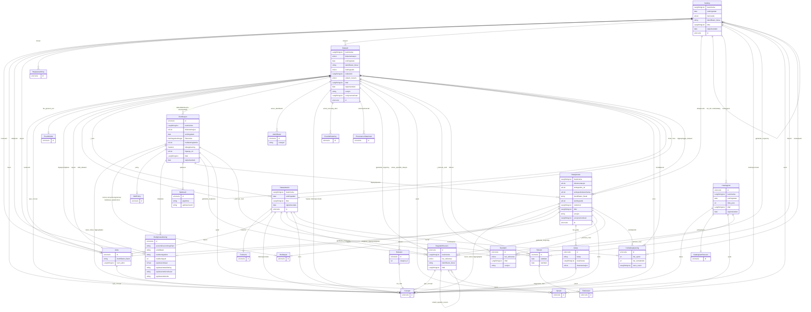

```mermaid
erDiagram
Aktor {
    uriorcurie id  
    string identifikator_literal  
    LangStringList navn_aktor  
}
Begrepssamling {
    uriorcurie id  
}
Datasett {
    LangStringList beskrivelse  
    uriList dokumentasjon  
    date endringsdato  
    string identifikator_literal  
    uriList landingsside  
    LangStringList nokkelord  
    uriList relatert_ressurs  
    LangStringList tittel  
    date utgivelsesdato  
    string versjon  
    LangStringList versjonsmerknad  
    uriorcurie id  
}
Datasettserie {
    LangStringList beskrivelse  
    date endringsdato  
    LangStringList tittel  
    date utgivelsesdato  
    uriorcurie id  
}
Datatjeneste {
    LangStringList beskrivelse  
    uriList dokumentasjon  
    uriList endepunkts_url  
    uriList endepunktsbeskrivelse  
    string identifikator_literal  
    uriList landingsside  
    LangStringList nokkelord  
    LangStringList tittel  
    string versjon  
    LangStringList versjonsmerknad  
    uriorcurie id  
}
Distribusjon {
    uriorcurie id  
    LangStringList beskrivelse  
    uriList dokumentasjon  
    date endringsdato  
    NonNegativeInteger filstorrelse  
    uriList nedlastningslenke  
    Duration tidsopplosning  
    uriList tilgangs_url  
    LangStringList tittel  
    date utgivelsesdato  
}
Frekvens {
    uriorcurie id  
}
Gebyr {
    uriorcurie id  
    string belop  
    LangStringList beskrivelse  
    uriList dokumentasjon  
}
Identifikator {
    uriorcurie id  
    string notasjon  
}
Katalog {
    LangStringList beskrivelse  
    date endringsdato  
    uriList heimeside  
    string identifikator_literal  
    LangStringList tittel  
    date utgivelsesdato  
    uriorcurie id  
}
KatalogisertRessurs {
    uriorcurie id  
}
Katalogpost {
    uriorcurie id  
    LangStringList beskrivelse  
    date endringsdato  
    uri kilde_post  
    LangStringList tittel  
    date utgivelsesdato  
}
Konsept {
    uriorcurie id  
}
Kontaktopplysning {
    uriorcurie id  
    uri har_epost  
    uri har_kontaktside  
    LangStringList navn_vcard  
}
Mediatype {
    uriorcurie id  
}
OdrlPolicy {
    uriorcurie id  
}
ProvAktivitet {
    uriorcurie id  
}
ProvAttributering {
    uriorcurie id  
}
ProvenanceStatement {
    uriorcurie id  
}
RegulativRessurs {
    uriorcurie id  
    LangStringList beskrivelse  
    uriList har_referanse  
    string identifikator_literal  
    LangStringList tittel  
}
Relasjon {
    uriorcurie id  
    uri relasjon_til  
}
Rettighetserklaring {
    uriorcurie id  
    string anvendelsesretningslinjer  
    string jurisdiksjon  
    string krediteringstekst  
    uri krediteringsurl  
    GYear opphavsrettsaar  
    string opphavsrettserklaring  
    string opphavsrettsinnehaver  
    string opphavsrettsnotis  
}
Sjekksum {
    uriorcurie id  
    string algoritme  
    string sjekksumverdi  
}
Spraak {
    uriorcurie id  
}
Standard {
    uriorcurie id  
    uriList har_referanse  
    LangStringList tittel  
    string versjon  
}
Tidsinstant {
    uriorcurie id  
}
Tidsrom {
    uriorcurie id  
    date sluttdato  
    date startdato  
}

Aktor ||--|o Konsept : "type_concept"
Datasett ||--|o Aktor : "produsent"
Datasett ||--|o Konsept : "type_concept"
Datasett ||--|o ProvAktivitet : "ble_generert_ved"
Datasett ||--|o Rettighetserklaring : "tilgangsrettigheter"
Datasett ||--|| Aktor : "utgiver"
Datasett ||--}o Datasett : "kilde_datasett"
Datasett ||--}o Datasettserie : "i_serie"
Datasett ||--}o Distribusjon : "datasettdistribusjon, eksempeldata"
Datasett ||--}o Identifikator : "annen_identifikator"
Datasett ||--}o Konsept : "begrep, dekningsomrade"
Datasett ||--}o ProvAttributering : "annen_ansvarlig_aktor"
Datasett ||--}o ProvenanceStatement : "eierskapshistorikk"
Datasett ||--}o RegulativRessurs : "gjeldende_lovgivning"
Datasett ||--}o Relasjon : "annen_spesifikk_relasjon"
Datasett ||--}o Spraak : "sprak"
Datasett ||--}o Standard : "i_samsvar_med"
Datasett ||--}o Tidsrom : "tidsrom"
Datasett ||--}| Konsept : "tema"
Datasett ||--}| Kontaktopplysning : "kontaktpunkt"
Datasettserie ||--|o Datasett : "forste, siste"
Datasettserie ||--|o Frekvens : "frekvens"
Datasettserie ||--|| Aktor : "utgiver"
Datasettserie ||--}o Konsept : "dekningsomrade"
Datasettserie ||--}o RegulativRessurs : "gjeldende_lovgivning"
Datasettserie ||--}o Tidsrom : "tidsrom"
Datasettserie ||--}| Konsept : "tema"
Datasettserie ||--}| Kontaktopplysning : "kontaktpunkt"
Datatjeneste ||--|o Konsept : "lisens, status, tilgjengelighet"
Datatjeneste ||--|o Mediatype : "format"
Datatjeneste ||--|o Rettighetserklaring : "rettigheter, tilgangsrettigheter"
Datatjeneste ||--|| Aktor : "utgiver"
Datatjeneste ||--}o Datasett : "tilgjengeliggjor_datasett"
Datatjeneste ||--}o Gebyr : "har_gebyr"
Datatjeneste ||--}o Konsept : "tema"
Datatjeneste ||--}o RegulativRessurs : "gjeldende_lovgivning"
Datatjeneste ||--}o Standard : "i_samsvar_med"
Datatjeneste ||--}| Kontaktopplysning : "kontaktpunkt"
Distribusjon ||--|o Konsept : "lisens, status, tilgjengelighet"
Distribusjon ||--|o Mediatype : "format, komprimeringsformat, medietype, pakkeformat"
Distribusjon ||--|o OdrlPolicy : "policy"
Distribusjon ||--|o Rettighetserklaring : "rettigheter"
Distribusjon ||--|o Sjekksum : "sjekksum"
Distribusjon ||--}o Datatjeneste : "tilgangstjeneste"
Distribusjon ||--}o RegulativRessurs : "gjeldende_lovgivning"
Distribusjon ||--}o Spraak : "sprak"
Distribusjon ||--}o Standard : "i_samsvar_med"
Gebyr ||--|o Konsept : "valuta"
Katalog ||--|o Aktor : "produsent"
Katalog ||--|o Konsept : "lisens"
Katalog ||--|o Rettighetserklaring : "rettigheter"
Katalog ||--|| Aktor : "utgiver"
Katalog ||--}o Begrepssamling : "temaer"
Katalog ||--}o Datasett : "datasett"
Katalog ||--}o Datatjeneste : "datatjeneste"
Katalog ||--}o Katalog : "har_del, underkatalog"
Katalog ||--}o Katalogpost : "katalogpost"
Katalog ||--}o Konsept : "dekningsomrade"
Katalog ||--}o RegulativRessurs : "gjeldende_lovgivning"
Katalog ||--}o Spraak : "sprak"
Katalog ||--}o Tidsrom : "tidsrom"
Katalog ||--}| Kontaktopplysning : "kontaktpunkt"
Katalogpost ||--|o Konsept : "status"
Katalogpost ||--|| KatalogisertRessurs : "primaertema"
Katalogpost ||--}o Spraak : "sprak"
Katalogpost ||--}o Standard : "i_samsvar_med"
RegulativRessurs ||--|o Konsept : "type_concept"
RegulativRessurs ||--}o RegulativRessurs : "relatert_regulativ_ressurs"
RegulativRessurs ||--}o Spraak : "sprak"
Relasjon ||--|| Konsept : "har_rolle"
Tidsrom ||--|o Tidsinstant : "begynnelse, slutt"

```

