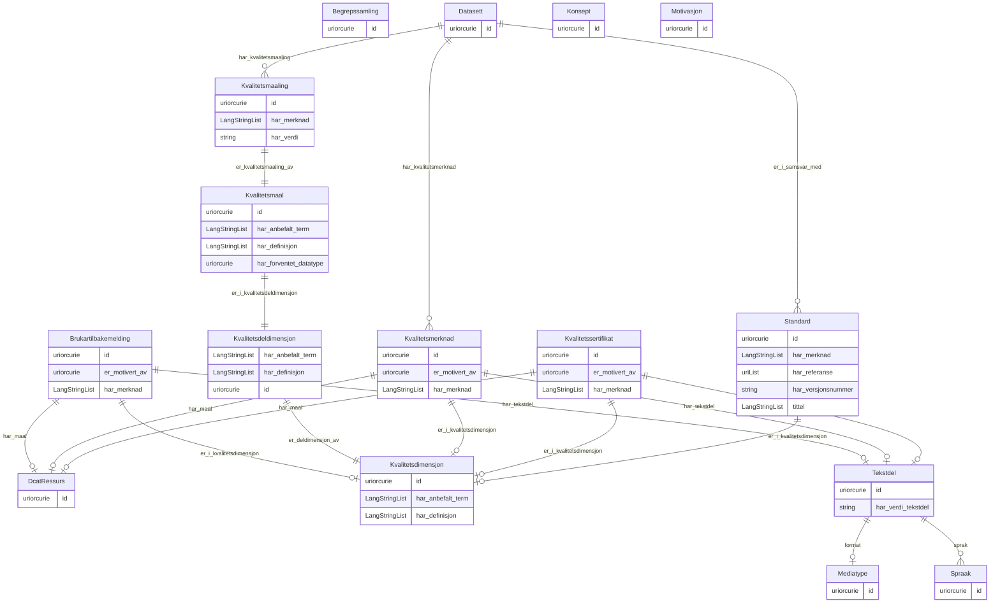

```mermaid
erDiagram
Begrepssamling {
    uriorcurie id  
}
Brukartilbakemelding {
    uriorcurie id  
    uriorcurie er_motivert_av  
    LangStringList har_merknad  
}
Datasett {
    uriorcurie id  
}
DcatRessurs {
    uriorcurie id  
}
Konsept {
    uriorcurie id  
}
Kvalitetsdeldimensjon {
    LangStringList har_anbefalt_term  
    LangStringList har_definisjon  
    uriorcurie id  
}
Kvalitetsdimensjon {
    uriorcurie id  
    LangStringList har_anbefalt_term  
    LangStringList har_definisjon  
}
Kvalitetsmaal {
    uriorcurie id  
    LangStringList har_anbefalt_term  
    LangStringList har_definisjon  
    uriorcurie har_forventet_datatype  
}
Kvalitetsmaaling {
    uriorcurie id  
    LangStringList har_merknad  
    string har_verdi  
}
Kvalitetsmerknad {
    uriorcurie id  
    uriorcurie er_motivert_av  
    LangStringList har_merknad  
}
Kvalitetssertifikat {
    uriorcurie id  
    uriorcurie er_motivert_av  
    LangStringList har_merknad  
}
Mediatype {
    uriorcurie id  
}
Motivasjon {
    uriorcurie id  
}
Spraak {
    uriorcurie id  
}
Standard {
    uriorcurie id  
    LangStringList har_merknad  
    uriList har_referanse  
    string har_versjonsnummer  
    LangStringList tittel  
}
Tekstdel {
    uriorcurie id  
    string har_verdi_tekstdel  
}

Brukartilbakemelding ||--|o DcatRessurs : "har_maal"
Brukartilbakemelding ||--|o Kvalitetsdimensjon : "er_i_kvalitetsdimensjon"
Brukartilbakemelding ||--|o Tekstdel : "har_tekstdel"
Datasett ||--}o Kvalitetsmaaling : "har_kvalitetsmaaling"
Datasett ||--}o Kvalitetsmerknad : "har_kvalitetsmerknad"
Datasett ||--}o Standard : "er_i_samsvar_med"
Kvalitetsdeldimensjon ||--|| Kvalitetsdimensjon : "er_deldimensjon_av"
Kvalitetsmaal ||--|| Kvalitetsdeldimensjon : "er_i_kvalitetsdeldimensjon"
Kvalitetsmaaling ||--|| Kvalitetsmaal : "er_kvalitetsmaaling_av"
Kvalitetsmerknad ||--|o DcatRessurs : "har_maal"
Kvalitetsmerknad ||--|o Kvalitetsdimensjon : "er_i_kvalitetsdimensjon"
Kvalitetsmerknad ||--|o Tekstdel : "har_tekstdel"
Kvalitetssertifikat ||--|o DcatRessurs : "har_maal"
Kvalitetssertifikat ||--|o Kvalitetsdimensjon : "er_i_kvalitetsdimensjon"
Kvalitetssertifikat ||--|o Tekstdel : "har_tekstdel"
Standard ||--|o Kvalitetsdimensjon : "er_i_kvalitetsdimensjon"
Tekstdel ||--|o Mediatype : "format"
Tekstdel ||--}o Spraak : "sprak"

```

