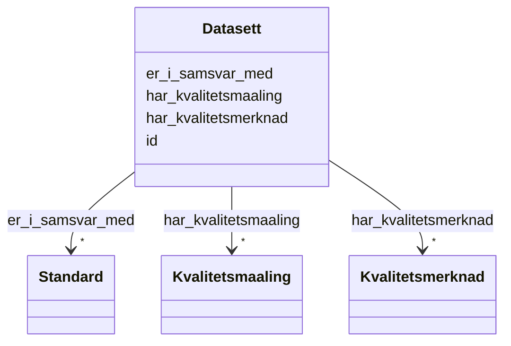

# Class: Datasett 


_Eit datasett (dcat:Dataset) utvida med DQV-AP-NO-eigenskapar for kvalitetsinformasjon._


URI: [dcat:Dataset](http://www.w3.org/ns/dcat#Dataset)





<!-- no inheritance hierarchy -->

## Class Properties

| Property | Value |
| --- | --- |
| Class URI | [dcat:Dataset](http://www.w3.org/ns/dcat#Dataset) |


## Eigenskapar


  
  

  
  

  
  

  
  


  
  

  
  
    
  

  
  
    
  

  
  
    
  


### Anbefalt

| Namn | Kardinalitet og domene | Beskriving |
| --- | --- | --- |
| [er_i_samsvar_med](er_i_samsvar_med.md) | * <br/> [Standard](standard.md) | Standard eller spesifikasjon datasettet er i samsvar med |
| [har_kvalitetsmerknad](har_kvalitetsmerknad.md) | * <br/> [Kvalitetsmerknad](kvalitetsmerknad.md) | Kvalitetsmerknad knytt til datasettet |
| [har_kvalitetsmaaling](har_kvalitetsmaaling.md) | * <br/> [Kvalitetsmaaling](kvalitetsmaaling.md) | Kvalitetsmåling knytt til datasettet |


  
  

  
  

  
  

  
  


  
  
  
  
    
  

  
  
  
    
      
    
      
    
      
    
  
  

  
  
  
    
      
    
      
    
      
    
  
  

  
  
  
    
      
    
      
    
      
    
  
  


### Andre

| Namn | Kardinalitet og domene | Beskriving |
| --- | --- | --- |
| [id](id.md) | 1 <br/> [Uriorcurie](uriorcurie.md) | URI-identifikator for ressursen |


## Identifier and Mapping Information


### Schema Source


* from schema: https://data.norge.no/linkml/dqv-ap-no


## Mappings

| Mapping Type | Mapped Value |
| ---  | ---  |
| self | dcat:Dataset |
| native | https://data.norge.no/linkml/dqv-ap-no/Datasett |


## LinkML Source

<!-- TODO: investigate https://stackoverflow.com/questions/37606292/how-to-create-tabbed-code-blocks-in-mkdocs-or-sphinx -->

### Direct

<details>
```yaml
name: Datasett
description: Eit datasett (dcat:Dataset) utvida med DQV-AP-NO-eigenskapar for kvalitetsinformasjon.
from_schema: https://data.norge.no/linkml/dqv-ap-no
slots:
- id
- er_i_samsvar_med
- har_kvalitetsmerknad
- har_kvalitetsmaaling
slot_usage:
  er_i_samsvar_med:
    name: er_i_samsvar_med
    in_subset:
    - Anbefalt
  har_kvalitetsmerknad:
    name: har_kvalitetsmerknad
    in_subset:
    - Anbefalt
  har_kvalitetsmaaling:
    name: har_kvalitetsmaaling
    in_subset:
    - Anbefalt
class_uri: dcat:Dataset

```
</details>

### Induced

<details>
```yaml
name: Datasett
description: Eit datasett (dcat:Dataset) utvida med DQV-AP-NO-eigenskapar for kvalitetsinformasjon.
from_schema: https://data.norge.no/linkml/dqv-ap-no
slot_usage:
  er_i_samsvar_med:
    name: er_i_samsvar_med
    in_subset:
    - Anbefalt
  har_kvalitetsmerknad:
    name: har_kvalitetsmerknad
    in_subset:
    - Anbefalt
  har_kvalitetsmaaling:
    name: har_kvalitetsmaaling
    in_subset:
    - Anbefalt
attributes:
  id:
    name: id
    description: URI-identifikator for ressursen.
    from_schema: https://data.norge.no/linkml/dqv-ap-no
    rank: 1000
    identifier: true
    alias: id
    owner: Datasett
    domain_of:
    - DcatRessurs
    - Datasett
    - Kvalitetsdimensjon
    - Kvalitetsmaal
    - Kvalitetsmerknad
    - Kvalitetsmaaling
    - Standard
    - Tekstdel
    - Motivasjon
    - Spraak
    - Mediatype
    - Konsept
    - Begrepssamling
    range: uriorcurie
    required: true
  er_i_samsvar_med:
    name: er_i_samsvar_med
    description: Standard eller spesifikasjon datasettet er i samsvar med.
    in_subset:
    - Anbefalt
    from_schema: https://data.norge.no/linkml/dqv-ap-no
    rank: 1000
    slot_uri: dct:conformsTo
    alias: er_i_samsvar_med
    owner: Datasett
    domain_of:
    - Datasett
    range: Standard
    multivalued: true
  har_kvalitetsmerknad:
    name: har_kvalitetsmerknad
    description: Kvalitetsmerknad knytt til datasettet.
    in_subset:
    - Anbefalt
    from_schema: https://data.norge.no/linkml/dqv-ap-no
    rank: 1000
    slot_uri: dqv:hasQualityAnnotation
    alias: har_kvalitetsmerknad
    owner: Datasett
    domain_of:
    - Datasett
    range: Kvalitetsmerknad
    multivalued: true
  har_kvalitetsmaaling:
    name: har_kvalitetsmaaling
    description: Kvalitetsmåling knytt til datasettet.
    in_subset:
    - Anbefalt
    from_schema: https://data.norge.no/linkml/dqv-ap-no
    rank: 1000
    slot_uri: dqv:hasQualityMeasurement
    alias: har_kvalitetsmaaling
    owner: Datasett
    domain_of:
    - Datasett
    range: Kvalitetsmaaling
    multivalued: true
class_uri: dcat:Dataset

```
</details>