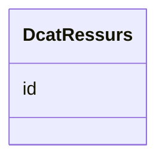

# Class: DcatRessurs 


_Ein katalogisert ressurs (brukt som målklasse for oa:hasTarget)._


URI: [dcat:Resource](http://www.w3.org/ns/dcat#Resource)





<!-- no inheritance hierarchy -->

## Class Properties

| Property | Value |
| --- | --- |
| Class URI | [dcat:Resource](http://www.w3.org/ns/dcat#Resource) |


## Eigenskapar


  
  


  
  


  
  


  
  
  
  
    
  


### Andre

| Namn | Kardinalitet og domene | Beskriving |
| --- | --- | --- |
| [id](id.md) | 1 <br/> [Uriorcurie](uriorcurie.md) | URI-identifikator for ressursen |


## Usages

| used by | used in | type | used |
| ---  | --- | --- | --- |
| [Kvalitetsmerknad](kvalitetsmerknad.md) | [har_maal](har_maal.md) | range | [DcatRessurs](dcatressurs.md) |
| [Brukartilbakemelding](brukartilbakemelding.md) | [har_maal](har_maal.md) | range | [DcatRessurs](dcatressurs.md) |
| [Kvalitetssertifikat](kvalitetssertifikat.md) | [har_maal](har_maal.md) | range | [DcatRessurs](dcatressurs.md) |


## Identifier and Mapping Information


### Schema Source


* from schema: https://data.norge.no/linkml/dqv-ap-no


## Mappings

| Mapping Type | Mapped Value |
| ---  | ---  |
| self | dcat:Resource |
| native | https://data.norge.no/linkml/dqv-ap-no/DcatRessurs |


## LinkML Source

<!-- TODO: investigate https://stackoverflow.com/questions/37606292/how-to-create-tabbed-code-blocks-in-mkdocs-or-sphinx -->

### Direct

<details>
```yaml
name: DcatRessurs
description: Ein katalogisert ressurs (brukt som målklasse for oa:hasTarget).
from_schema: https://data.norge.no/linkml/dqv-ap-no
slots:
- id
class_uri: dcat:Resource

```
</details>

### Induced

<details>
```yaml
name: DcatRessurs
description: Ein katalogisert ressurs (brukt som målklasse for oa:hasTarget).
from_schema: https://data.norge.no/linkml/dqv-ap-no
attributes:
  id:
    name: id
    description: URI-identifikator for ressursen.
    from_schema: https://data.norge.no/linkml/dqv-ap-no
    rank: 1000
    identifier: true
    alias: id
    owner: DcatRessurs
    domain_of:
    - DcatRessurs
    - Datasett
    - Kvalitetsdimensjon
    - Kvalitetsmaal
    - Kvalitetsmerknad
    - Kvalitetsmaaling
    - Standard
    - Tekstdel
    - Motivasjon
    - Spraak
    - Mediatype
    - Konsept
    - Begrepssamling
    range: uriorcurie
class_uri: dcat:Resource

```
</details>