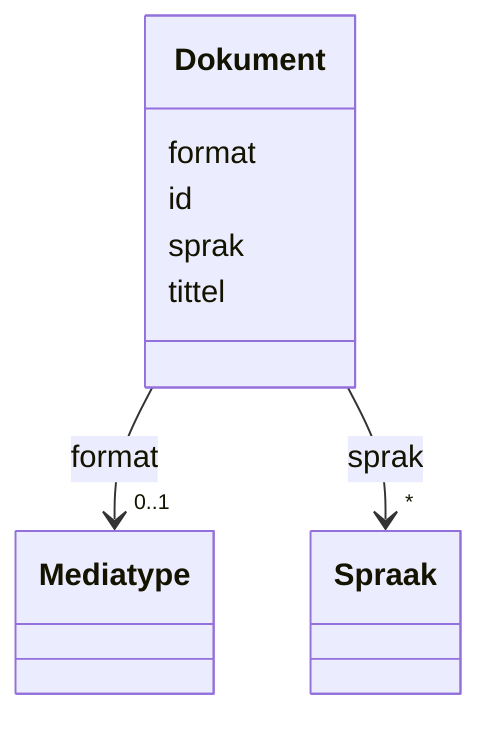

# Class: Dokument 


_Eit dokument (foaf:Document)._


URI: [foaf:Document](http://xmlns.com/foaf/0.1/Document)





<!-- no inheritance hierarchy -->

## Class Properties

| Property | Value |
| --- | --- |
| Class URI | [foaf:Document](http://xmlns.com/foaf/0.1/Document) |


## Eigenskapar


  
  

  
  

  
  

  
  


  
  

  
  

  
  

  
  


  
  

  
  

  
  

  
  


  
  
  
  
    
  

  
  
  
  
    
  

  
  
  
  
    
  

  
  
  
  
    
  


### Andre

| Namn | Kardinalitet og domene | Beskriving |
| --- | --- | --- |
| [id](id.md) | 1 <br/> [Uriorcurie](uriorcurie.md) | URI-identifikator for ressursen |
| [tittel](tittel.md) | * <br/> [LangString](langstring.md) | Namn/tittel på ressursen (dct:title) |
| [sprak](sprak.md) | * <br/> [Spraak](spraak.md) | Språk brukt i ressursen (dct:language) |
| [format](format.md) | 0..1 <br/> [Mediatype](mediatype.md) | Filformat eller medietype (dct:format) |


## Usages

| used by | used in | type | used |
| ---  | --- | --- | --- |
| [Informasjonsmodell](informasjonsmodell.md) | [har_format](har_format.md) | range | [Dokument](dokument.md) |


## Identifier and Mapping Information


### Schema Source


* from schema: https://data.norge.no/linkml/modelldcat-ap-no


## Mappings

| Mapping Type | Mapped Value |
| ---  | ---  |
| self | foaf:Document |
| native | https://data.norge.no/linkml/modelldcat-ap-no/Dokument |


## LinkML Source

<!-- TODO: investigate https://stackoverflow.com/questions/37606292/how-to-create-tabbed-code-blocks-in-mkdocs-or-sphinx -->

### Direct

<details>
```yaml
name: Dokument
description: Eit dokument (foaf:Document).
from_schema: https://data.norge.no/linkml/modelldcat-ap-no
slots:
- id
- tittel
- sprak
- format
class_uri: foaf:Document

```
</details>

### Induced

<details>
```yaml
name: Dokument
description: Eit dokument (foaf:Document).
from_schema: https://data.norge.no/linkml/modelldcat-ap-no
attributes:
  id:
    name: id
    description: URI-identifikator for ressursen.
    from_schema: https://data.norge.no/linkml/modelldcat-ap-no
    rank: 1000
    identifier: true
    alias: id
    owner: Dokument
    domain_of:
    - KatalogisertRessurs
    - Aktor
    - Kontaktopplysning
    - Standard
    - Lisensdokument
    - Lokasjon
    - Tidsperiode
    - Dokument
    - Modelkatalog
    - Informasjonsmodell
    - Modellelement
    - Eigenskap
    - Merknad
    - Kodeelement
    - Spraak
    - Mediatype
    - Konsept
    - Begrepssamling
    range: uriorcurie
    required: true
  tittel:
    name: tittel
    description: Namn/tittel på ressursen (dct:title).
    from_schema: https://data.norge.no/linkml/modelldcat-ap-no
    rank: 1000
    slot_uri: dct:title
    alias: tittel
    owner: Dokument
    domain_of:
    - Standard
    - Dokument
    - Modelkatalog
    - Informasjonsmodell
    - Modellelement
    - Eigenskap
    - Merknad
    range: LangString
    multivalued: true
  sprak:
    name: sprak
    description: Språk brukt i ressursen (dct:language).
    from_schema: https://data.norge.no/linkml/modelldcat-ap-no
    rank: 1000
    slot_uri: dct:language
    alias: sprak
    owner: Dokument
    domain_of:
    - Dokument
    - Modelkatalog
    - Informasjonsmodell
    range: Spraak
    multivalued: true
  format:
    name: format
    description: Filformat eller medietype (dct:format).
    from_schema: https://data.norge.no/linkml/modelldcat-ap-no
    rank: 1000
    slot_uri: dct:format
    alias: format
    owner: Dokument
    domain_of:
    - Dokument
    range: Mediatype
class_uri: foaf:Document

```
</details>