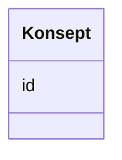

# Class: Konsept 


_Referanse til eit SKOS-omgrep frå eit kontrollert vokabular._


URI: [skos:Concept](http://www.w3.org/2004/02/skos/core#Concept)





<!-- no inheritance hierarchy -->

## Class Properties

| Property | Value |
| --- | --- |
| Class URI | [skos:Concept](http://www.w3.org/2004/02/skos/core#Concept) |


## Eigenskapar


  
  


  
  


  
  


  
  
  
  
    
  


### Andre

| Namn | Kardinalitet og domene | Beskriving |
| --- | --- | --- |
| [id](id.md) | 1 <br/> [Uriorcurie](Uriorcurie.md) | URI-identifikator for ressursen |


## Usages

| used by | used in | type | used |
| ---  | --- | --- | --- |
| [Aktor](Aktor.md) | [type_concept](type_concept.md) | range | [Konsept](Konsept.md) |
| [Lisensdokument](Lisensdokument.md) | [type_concept](type_concept.md) | range | [Konsept](Konsept.md) |
| [Modelkatalog](Modelkatalog.md) | [tema](tema.md) | range | [Konsept](Konsept.md) |
| [Informasjonsmodell](Informasjonsmodell.md) | [begrep](begrep.md) | range | [Konsept](Konsept.md) |
| [Informasjonsmodell](Informasjonsmodell.md) | [tema](tema.md) | range | [Konsept](Konsept.md) |
| [Informasjonsmodell](Informasjonsmodell.md) | [dekningsomrade](dekningsomrade.md) | range | [Konsept](Konsept.md) |
| [Informasjonsmodell](Informasjonsmodell.md) | [status](status.md) | range | [Konsept](Konsept.md) |
| [Informasjonsmodell](Informasjonsmodell.md) | [type_concept](type_concept.md) | range | [Konsept](Konsept.md) |
| [Modellelement](Modellelement.md) | [begrep](begrep.md) | range | [Konsept](Konsept.md) |
| [Objekttype](Objekttype.md) | [begrep](begrep.md) | range | [Konsept](Konsept.md) |
| [RootObjekttype](RootObjekttype.md) | [begrep](begrep.md) | range | [Konsept](Konsept.md) |
| [Datatype](Datatype.md) | [begrep](begrep.md) | range | [Konsept](Konsept.md) |
| [EnkelType](EnkelType.md) | [begrep](begrep.md) | range | [Konsept](Konsept.md) |
| [Kodeliste](Kodeliste.md) | [begrep](begrep.md) | range | [Konsept](Konsept.md) |
| [Modul](Modul.md) | [begrep](begrep.md) | range | [Konsept](Konsept.md) |
| [Eigenskap](Eigenskap.md) | [begrep](begrep.md) | range | [Konsept](Konsept.md) |
| [Attributt](Attributt.md) | [begrep](begrep.md) | range | [Konsept](Konsept.md) |
| [Assosiasjon](Assosiasjon.md) | [begrep](begrep.md) | range | [Konsept](Konsept.md) |
| [Rolle](Rolle.md) | [begrep](begrep.md) | range | [Konsept](Konsept.md) |
| [Spesialisering](Spesialisering.md) | [begrep](begrep.md) | range | [Konsept](Konsept.md) |
| [Sammensetning](Sammensetning.md) | [begrep](begrep.md) | range | [Konsept](Konsept.md) |
| [Realisering](Realisering.md) | [begrep](begrep.md) | range | [Konsept](Konsept.md) |
| [Abstraksjon](Abstraksjon.md) | [begrep](begrep.md) | range | [Konsept](Konsept.md) |
| [Avhengighet](Avhengighet.md) | [begrep](begrep.md) | range | [Konsept](Konsept.md) |
| [Samling](Samling.md) | [begrep](begrep.md) | range | [Konsept](Konsept.md) |
| [Valg](Valg.md) | [begrep](begrep.md) | range | [Konsept](Konsept.md) |
| [AlleAv](AlleAv.md) | [begrep](begrep.md) | range | [Konsept](Konsept.md) |
| [NoenAv](NoenAv.md) | [begrep](begrep.md) | range | [Konsept](Konsept.md) |
| [Kodeelement](Kodeelement.md) | [begrep](begrep.md) | range | [Konsept](Konsept.md) |


## Identifier and Mapping Information


### Schema Source


* from schema: https://data.norge.no/linkml/modelldcat-ap-no


## Mappings

| Mapping Type | Mapped Value |
| ---  | ---  |
| self | skos:Concept |
| native | https://data.norge.no/linkml/modelldcat-ap-no/Konsept |


## LinkML Source

<!-- TODO: investigate https://stackoverflow.com/questions/37606292/how-to-create-tabbed-code-blocks-in-mkdocs-or-sphinx -->

### Direct

<details>
```yaml
name: Konsept
description: Referanse til eit SKOS-omgrep frå eit kontrollert vokabular.
from_schema: https://data.norge.no/linkml/modelldcat-ap-no
slots:
- id
class_uri: skos:Concept

```
</details>

### Induced

<details>
```yaml
name: Konsept
description: Referanse til eit SKOS-omgrep frå eit kontrollert vokabular.
from_schema: https://data.norge.no/linkml/modelldcat-ap-no
attributes:
  id:
    name: id
    description: URI-identifikator for ressursen.
    from_schema: https://data.norge.no/linkml/modelldcat-ap-no
    rank: 1000
    identifier: true
    alias: id
    owner: Konsept
    domain_of:
    - KatalogisertRessurs
    - Aktor
    - Kontaktopplysning
    - Standard
    - Lisensdokument
    - Lokasjon
    - Tidsperiode
    - Dokument
    - Modelkatalog
    - Informasjonsmodell
    - Modellelement
    - Eigenskap
    - Merknad
    - Kodeelement
    - Spraak
    - Mediatype
    - Konsept
    - Begrepssamling
    range: uriorcurie
    required: true
class_uri: skos:Concept

```
</details>