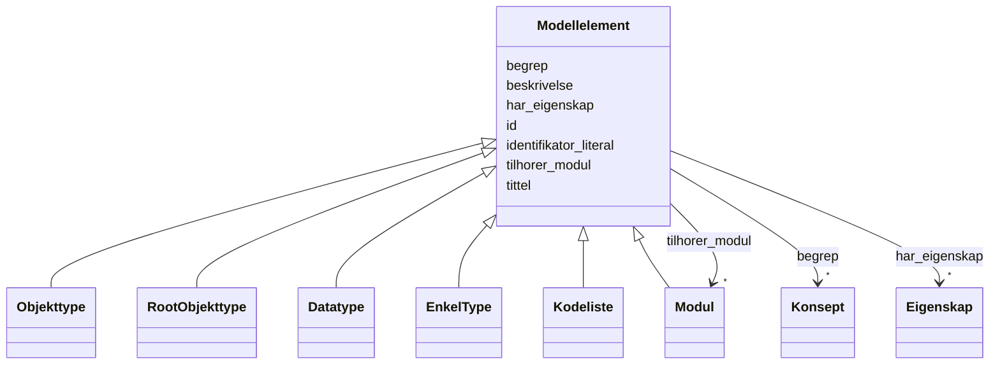

# Class: Modellelement 


_Abstrakt basisklasse for alle modellelement i ein informasjonsmodell._


* __NOTE__: this is an abstract class and should not be instantiated directly


URI: [modelldcatno:ModelElement](https://data.norge.no/vocabulary/modelldcatno#ModelElement)





## Inheritance
* **Modellelement**
    * [Objekttype](Objekttype.md)
    * [RootObjekttype](RootObjekttype.md)
    * [Datatype](Datatype.md)
    * [EnkelType](EnkelType.md)
    * [Kodeliste](Kodeliste.md)
    * [Modul](Modul.md)


## Class Properties

| Property | Value |
| --- | --- |
| Class URI | [modelldcatno:ModelElement](https://data.norge.no/vocabulary/modelldcatno#ModelElement) |


## Eigenskapar


  
  

  
  
    
  

  
  

  
  

  
  

  
  

  
  


### Obligatorisk

| Namn | Kardinalitet og domene | Beskriving |
| --- | --- | --- |
| [tittel](tittel.md) | 1..* <br/> [LangString](LangString.md) | Namn/tittel på ressursen (dct:title) |


  
  

  
  

  
  
    
  

  
  
    
  

  
  
    
  

  
  

  
  


### Anbefalt

| Namn | Kardinalitet og domene | Beskriving |
| --- | --- | --- |
| [begrep](begrep.md) | * <br/> [Konsept](Konsept.md) | Fagomgrep ressursen handlar om (dct:subject) |
| [identifikator_literal](identifikator_literal.md) | 0..1 <br/> [String](String.md) | Tekstleg identifikator for ressursen (dct:identifier) |
| [har_eigenskap](har_eigenskap.md) | * <br/> [Eigenskap](Eigenskap.md) | Eigenskapar modellelementet har (modelldcatno:hasProperty) |


  
  

  
  

  
  

  
  

  
  

  
  
    
  

  
  
    
  


### Valgfri

| Namn | Kardinalitet og domene | Beskriving |
| --- | --- | --- |
| [beskrivelse](beskrivelse.md) | * <br/> [LangString](LangString.md) | Fritekstbeskrivelse av ressursen (dct:description) |
| [tilhorer_modul](tilhorer_modul.md) | * <br/> [Modul](Modul.md) | Modul dette elementet tilhøyrer (modelldcatno:belongsToModule) |


  
  
  
  
    
  

  
  
  
    
      
    
      
    
      
    
  
  

  
  
  
    
      
    
      
    
      
    
  
  

  
  
  
    
      
    
      
    
      
    
  
  

  
  
  
    
      
    
      
    
      
    
  
  

  
  
  
    
      
    
      
    
      
    
  
  

  
  
  
    
      
    
      
    
      
    
  
  


### Andre

| Namn | Kardinalitet og domene | Beskriving |
| --- | --- | --- |
| [id](id.md) | 1 <br/> [Uriorcurie](Uriorcurie.md) | URI-identifikator for ressursen |


## Usages

| used by | used in | type | used |
| ---  | --- | --- | --- |
| [Informasjonsmodell](Informasjonsmodell.md) | [inneholder_modellelement](inneholder_modellelement.md) | range | [Modellelement](Modellelement.md) |
| [Eigenskap](Eigenskap.md) | [har_type](har_type.md) | range | [Modellelement](Modellelement.md) |
| [Attributt](Attributt.md) | [har_type](har_type.md) | range | [Modellelement](Modellelement.md) |
| [Assosiasjon](Assosiasjon.md) | [refererer_til](refererer_til.md) | range | [Modellelement](Modellelement.md) |
| [Assosiasjon](Assosiasjon.md) | [har_type](har_type.md) | range | [Modellelement](Modellelement.md) |
| [Rolle](Rolle.md) | [har_type](har_type.md) | range | [Modellelement](Modellelement.md) |
| [Spesialisering](Spesialisering.md) | [har_generelt_begrep](har_generelt_begrep.md) | range | [Modellelement](Modellelement.md) |
| [Spesialisering](Spesialisering.md) | [har_type](har_type.md) | range | [Modellelement](Modellelement.md) |
| [Sammensetning](Sammensetning.md) | [inneholder](inneholder.md) | range | [Modellelement](Modellelement.md) |
| [Sammensetning](Sammensetning.md) | [har_type](har_type.md) | range | [Modellelement](Modellelement.md) |
| [Realisering](Realisering.md) | [har_leverandor](har_leverandor.md) | range | [Modellelement](Modellelement.md) |
| [Realisering](Realisering.md) | [har_type](har_type.md) | range | [Modellelement](Modellelement.md) |
| [Abstraksjon](Abstraksjon.md) | [er_abstraksjon_av](er_abstraksjon_av.md) | range | [Modellelement](Modellelement.md) |
| [Abstraksjon](Abstraksjon.md) | [har_type](har_type.md) | range | [Modellelement](Modellelement.md) |
| [Avhengighet](Avhengighet.md) | [avhengig_av](avhengig_av.md) | range | [Modellelement](Modellelement.md) |
| [Avhengighet](Avhengighet.md) | [har_type](har_type.md) | range | [Modellelement](Modellelement.md) |
| [Samling](Samling.md) | [har_type](har_type.md) | range | [Modellelement](Modellelement.md) |
| [Valg](Valg.md) | [har_noe](har_noe.md) | range | [Modellelement](Modellelement.md) |
| [Valg](Valg.md) | [har_type](har_type.md) | range | [Modellelement](Modellelement.md) |
| [AlleAv](AlleAv.md) | [har_noe](har_noe.md) | range | [Modellelement](Modellelement.md) |
| [AlleAv](AlleAv.md) | [har_type](har_type.md) | range | [Modellelement](Modellelement.md) |
| [NoenAv](NoenAv.md) | [har_noe](har_noe.md) | range | [Modellelement](Modellelement.md) |
| [NoenAv](NoenAv.md) | [har_type](har_type.md) | range | [Modellelement](Modellelement.md) |
| [Merknad](Merknad.md) | [annoterer](annoterer.md) | range | [Modellelement](Modellelement.md) |
| [Betingelsesregel](Betingelsesregel.md) | [betinger](betinger.md) | range | [Modellelement](Modellelement.md) |
| [Betingelsesregel](Betingelsesregel.md) | [annoterer](annoterer.md) | range | [Modellelement](Modellelement.md) |
| [Og](Og.md) | [betinger](betinger.md) | range | [Modellelement](Modellelement.md) |
| [Og](Og.md) | [annoterer](annoterer.md) | range | [Modellelement](Modellelement.md) |
| [Eller](Eller.md) | [betinger](betinger.md) | range | [Modellelement](Modellelement.md) |
| [Eller](Eller.md) | [annoterer](annoterer.md) | range | [Modellelement](Modellelement.md) |
| [XEllerY](XEllerY.md) | [betinger](betinger.md) | range | [Modellelement](Modellelement.md) |
| [XEllerY](XEllerY.md) | [annoterer](annoterer.md) | range | [Modellelement](Modellelement.md) |
| [Ikke](Ikke.md) | [betinger](betinger.md) | range | [Modellelement](Modellelement.md) |
| [Ikke](Ikke.md) | [annoterer](annoterer.md) | range | [Modellelement](Modellelement.md) |


## Identifier and Mapping Information


### Schema Source


* from schema: https://data.norge.no/linkml/modelldcat-ap-no


## Mappings

| Mapping Type | Mapped Value |
| ---  | ---  |
| self | modelldcatno:ModelElement |
| native | https://data.norge.no/linkml/modelldcat-ap-no/Modellelement |


## LinkML Source

<!-- TODO: investigate https://stackoverflow.com/questions/37606292/how-to-create-tabbed-code-blocks-in-mkdocs-or-sphinx -->

### Direct

<details>
```yaml
name: Modellelement
description: Abstrakt basisklasse for alle modellelement i ein informasjonsmodell.
from_schema: https://data.norge.no/linkml/modelldcat-ap-no
abstract: true
slots:
- id
- tittel
- begrep
- identifikator_literal
- har_eigenskap
- beskrivelse
- tilhorer_modul
slot_usage:
  tittel:
    name: tittel
    in_subset:
    - Obligatorisk
    required: true
  begrep:
    name: begrep
    in_subset:
    - Anbefalt
  identifikator_literal:
    name: identifikator_literal
    in_subset:
    - Anbefalt
  har_eigenskap:
    name: har_eigenskap
    in_subset:
    - Anbefalt
  beskrivelse:
    name: beskrivelse
    in_subset:
    - Valgfri
  tilhorer_modul:
    name: tilhorer_modul
    in_subset:
    - Valgfri
class_uri: modelldcatno:ModelElement

```
</details>

### Induced

<details>
```yaml
name: Modellelement
description: Abstrakt basisklasse for alle modellelement i ein informasjonsmodell.
from_schema: https://data.norge.no/linkml/modelldcat-ap-no
abstract: true
slot_usage:
  tittel:
    name: tittel
    in_subset:
    - Obligatorisk
    required: true
  begrep:
    name: begrep
    in_subset:
    - Anbefalt
  identifikator_literal:
    name: identifikator_literal
    in_subset:
    - Anbefalt
  har_eigenskap:
    name: har_eigenskap
    in_subset:
    - Anbefalt
  beskrivelse:
    name: beskrivelse
    in_subset:
    - Valgfri
  tilhorer_modul:
    name: tilhorer_modul
    in_subset:
    - Valgfri
attributes:
  id:
    name: id
    description: URI-identifikator for ressursen.
    from_schema: https://data.norge.no/linkml/modelldcat-ap-no
    rank: 1000
    identifier: true
    alias: id
    owner: Modellelement
    domain_of:
    - KatalogisertRessurs
    - Aktor
    - Kontaktopplysning
    - Standard
    - Lisensdokument
    - Lokasjon
    - Tidsperiode
    - Dokument
    - Modelkatalog
    - Informasjonsmodell
    - Modellelement
    - Eigenskap
    - Merknad
    - Kodeelement
    - Spraak
    - Mediatype
    - Konsept
    - Begrepssamling
    range: uriorcurie
    required: true
  tittel:
    name: tittel
    description: Namn/tittel på ressursen (dct:title).
    in_subset:
    - Obligatorisk
    from_schema: https://data.norge.no/linkml/modelldcat-ap-no
    rank: 1000
    slot_uri: dct:title
    alias: tittel
    owner: Modellelement
    domain_of:
    - Standard
    - Dokument
    - Modelkatalog
    - Informasjonsmodell
    - Modellelement
    - Eigenskap
    - Merknad
    range: LangString
    required: true
    multivalued: true
  begrep:
    name: begrep
    description: Fagomgrep ressursen handlar om (dct:subject).
    in_subset:
    - Anbefalt
    from_schema: https://data.norge.no/linkml/modelldcat-ap-no
    rank: 1000
    slot_uri: dct:subject
    alias: begrep
    owner: Modellelement
    domain_of:
    - Informasjonsmodell
    - Modellelement
    - Eigenskap
    - Kodeelement
    range: Konsept
    multivalued: true
  identifikator_literal:
    name: identifikator_literal
    description: Tekstleg identifikator for ressursen (dct:identifier).
    in_subset:
    - Anbefalt
    from_schema: https://data.norge.no/linkml/modelldcat-ap-no
    rank: 1000
    slot_uri: dct:identifier
    alias: identifikator_literal
    owner: Modellelement
    domain_of:
    - Aktor
    - Modelkatalog
    - Informasjonsmodell
    - Modellelement
    - Eigenskap
    - Merknad
    - Kodeelement
    range: string
  har_eigenskap:
    name: har_eigenskap
    description: Eigenskapar modellelementet har (modelldcatno:hasProperty).
    in_subset:
    - Anbefalt
    from_schema: https://data.norge.no/linkml/modelldcat-ap-no
    rank: 1000
    slot_uri: modelldcatno:hasProperty
    alias: har_eigenskap
    owner: Modellelement
    domain_of:
    - Modellelement
    range: Eigenskap
    multivalued: true
  beskrivelse:
    name: beskrivelse
    description: Fritekstbeskrivelse av ressursen (dct:description).
    in_subset:
    - Valgfri
    from_schema: https://data.norge.no/linkml/modelldcat-ap-no
    rank: 1000
    slot_uri: dct:description
    alias: beskrivelse
    owner: Modellelement
    domain_of:
    - Modelkatalog
    - Informasjonsmodell
    - Modellelement
    - Eigenskap
    range: LangString
    multivalued: true
  tilhorer_modul:
    name: tilhorer_modul
    description: Modul dette elementet tilhøyrer (modelldcatno:belongsToModule).
    in_subset:
    - Valgfri
    from_schema: https://data.norge.no/linkml/modelldcat-ap-no
    rank: 1000
    slot_uri: modelldcatno:belongsToModule
    alias: tilhorer_modul
    owner: Modellelement
    domain_of:
    - Modellelement
    - Eigenskap
    - Merknad
    range: Modul
    multivalued: true
class_uri: modelldcatno:ModelElement

```
</details>