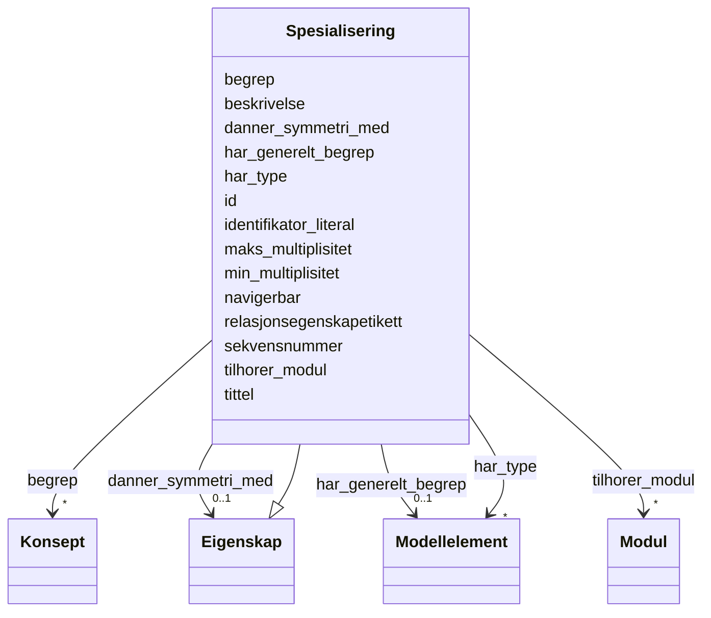

# Class: Spesialisering 


_Ein spesialisering — eit arveforhold frå eit spesielt til eit generelt modellelement._


URI: [modelldcatno:Specialization](https://data.norge.no/vocabulary/modelldcatno#Specialization)





## Inheritance
* [Eigenskap](Eigenskap.md)
    * **Spesialisering**


## Class Properties

| Property | Value |
| --- | --- |
| Class URI | [modelldcatno:Specialization](https://data.norge.no/vocabulary/modelldcatno#Specialization) |


## Eigenskapar


  
  


  
  
    
  


### Anbefalt

| Namn | Kardinalitet og domene | Beskriving |
| --- | --- | --- |
| [har_generelt_begrep](har_generelt_begrep.md) | 0..1 <br/> [Modellelement](Modellelement.md) | Det generelle modellelementet i ei spesialisering (modelldcatno:hasGeneralCon... |


  
  


  
  
  
    
      
    
      
    
      
    
  
  


### Arva

| Namn | Kardinalitet og domene | Beskriving | Frå |
| --- | --- | --- | --- || [id](id.md) | 1 <br/> [Uriorcurie](Uriorcurie.md) | URI-identifikator for ressursen | [Eigenskap](Eigenskap.md) |
| [begrep](begrep.md) | * <br/> [Konsept](Konsept.md) | Fagomgrep ressursen handlar om (dct:subject) | [Eigenskap](Eigenskap.md) |
| [identifikator_literal](identifikator_literal.md) | 0..1 <br/> [String](String.md) | Tekstleg identifikator for ressursen (dct:identifier) | [Eigenskap](Eigenskap.md) |
| [navigerbar](navigerbar.md) | 0..1 <br/> [Boolean](Boolean.md) | Om eigenskapen er navigerbar i begge retningar (modelldcatno:navigable) | [Eigenskap](Eigenskap.md) |
| [min_multiplisitet](min_multiplisitet.md) | 0..1 <br/> [NonNegativeInteger](NonNegativeInteger.md) | Minste multiplisitet for eigenskapen (modelldcatno:minOccurs) | [Eigenskap](Eigenskap.md) |
| [tittel](tittel.md) | * <br/> [LangString](LangString.md) | Namn/tittel på ressursen (dct:title) | [Eigenskap](Eigenskap.md) |
| [maks_multiplisitet](maks_multiplisitet.md) | 0..1 <br/> [String](String.md) | Høgste multiplisitet — heltalstal, "n" eller "*" (modelldcatno:maxOccurs) | [Eigenskap](Eigenskap.md) |
| [beskrivelse](beskrivelse.md) | * <br/> [LangString](LangString.md) | Fritekstbeskrivelse av ressursen (dct:description) | [Eigenskap](Eigenskap.md) |
| [har_type](har_type.md) | * <br/> [Modellelement](Modellelement.md) | Type modellelement for eigenskapen (modelldcatno:hasType) | [Eigenskap](Eigenskap.md) |
| [relasjonsegenskapetikett](relasjonsegenskapetikett.md) | * <br/> [LangString](LangString.md) | Lesetekst for eigenskapen i ein relasjon (modelldcatno:relationPropertyLabel) | [Eigenskap](Eigenskap.md) |
| [sekvensnummer](sekvensnummer.md) | 0..1 <br/> [NonNegativeInteger](NonNegativeInteger.md) | Sekvensnummer for eigenskapen i modellelementet (modelldcatno:sequenceNumber) | [Eigenskap](Eigenskap.md) |
| [tilhorer_modul](tilhorer_modul.md) | * <br/> [Modul](Modul.md) | Modul dette elementet tilhøyrer (modelldcatno:belongsToModule) | [Eigenskap](Eigenskap.md) |
| [danner_symmetri_med](danner_symmetri_med.md) | 0..1 <br/> [Eigenskap](Eigenskap.md) | Eigenskap som denne eigenskapen dannar symmetri med (modelldcatno:formsSymmet... | [Eigenskap](Eigenskap.md) |


## Identifier and Mapping Information


### Schema Source


* from schema: https://data.norge.no/linkml/modelldcat-ap-no


## Mappings

| Mapping Type | Mapped Value |
| ---  | ---  |
| self | modelldcatno:Specialization |
| native | https://data.norge.no/linkml/modelldcat-ap-no/Spesialisering |


## LinkML Source

<!-- TODO: investigate https://stackoverflow.com/questions/37606292/how-to-create-tabbed-code-blocks-in-mkdocs-or-sphinx -->

### Direct

<details>
```yaml
name: Spesialisering
description: Ein spesialisering — eit arveforhold frå eit spesielt til eit generelt
  modellelement.
from_schema: https://data.norge.no/linkml/modelldcat-ap-no
is_a: Eigenskap
slots:
- har_generelt_begrep
slot_usage:
  har_generelt_begrep:
    name: har_generelt_begrep
    in_subset:
    - Anbefalt
class_uri: modelldcatno:Specialization

```
</details>

### Induced

<details>
```yaml
name: Spesialisering
description: Ein spesialisering — eit arveforhold frå eit spesielt til eit generelt
  modellelement.
from_schema: https://data.norge.no/linkml/modelldcat-ap-no
is_a: Eigenskap
slot_usage:
  har_generelt_begrep:
    name: har_generelt_begrep
    in_subset:
    - Anbefalt
attributes:
  har_generelt_begrep:
    name: har_generelt_begrep
    description: Det generelle modellelementet i ei spesialisering (modelldcatno:hasGeneralConcept).
    in_subset:
    - Anbefalt
    from_schema: https://data.norge.no/linkml/modelldcat-ap-no
    rank: 1000
    slot_uri: modelldcatno:hasGeneralConcept
    alias: har_generelt_begrep
    owner: Spesialisering
    domain_of:
    - Spesialisering
    range: Modellelement
  id:
    name: id
    description: URI-identifikator for ressursen.
    from_schema: https://data.norge.no/linkml/modelldcat-ap-no
    rank: 1000
    identifier: true
    alias: id
    owner: Spesialisering
    domain_of:
    - KatalogisertRessurs
    - Aktor
    - Kontaktopplysning
    - Standard
    - Lisensdokument
    - Lokasjon
    - Tidsperiode
    - Dokument
    - Modelkatalog
    - Informasjonsmodell
    - Modellelement
    - Eigenskap
    - Merknad
    - Kodeelement
    - Spraak
    - Mediatype
    - Konsept
    - Begrepssamling
    range: uriorcurie
    required: true
  begrep:
    name: begrep
    description: Fagomgrep ressursen handlar om (dct:subject).
    in_subset:
    - Anbefalt
    from_schema: https://data.norge.no/linkml/modelldcat-ap-no
    rank: 1000
    slot_uri: dct:subject
    alias: begrep
    owner: Spesialisering
    domain_of:
    - Informasjonsmodell
    - Modellelement
    - Eigenskap
    - Kodeelement
    range: Konsept
    multivalued: true
  identifikator_literal:
    name: identifikator_literal
    description: Tekstleg identifikator for ressursen (dct:identifier).
    in_subset:
    - Anbefalt
    from_schema: https://data.norge.no/linkml/modelldcat-ap-no
    rank: 1000
    slot_uri: dct:identifier
    alias: identifikator_literal
    owner: Spesialisering
    domain_of:
    - Aktor
    - Modelkatalog
    - Informasjonsmodell
    - Modellelement
    - Eigenskap
    - Merknad
    - Kodeelement
    range: string
  navigerbar:
    name: navigerbar
    description: Om eigenskapen er navigerbar i begge retningar (modelldcatno:navigable).
    in_subset:
    - Anbefalt
    from_schema: https://data.norge.no/linkml/modelldcat-ap-no
    rank: 1000
    slot_uri: modelldcatno:navigable
    alias: navigerbar
    owner: Spesialisering
    domain_of:
    - Eigenskap
    range: boolean
  min_multiplisitet:
    name: min_multiplisitet
    description: Minste multiplisitet for eigenskapen (modelldcatno:minOccurs).
    in_subset:
    - Anbefalt
    from_schema: https://data.norge.no/linkml/modelldcat-ap-no
    rank: 1000
    slot_uri: modelldcatno:minOccurs
    alias: min_multiplisitet
    owner: Spesialisering
    domain_of:
    - Eigenskap
    range: NonNegativeInteger
  tittel:
    name: tittel
    description: Namn/tittel på ressursen (dct:title).
    in_subset:
    - Anbefalt
    from_schema: https://data.norge.no/linkml/modelldcat-ap-no
    rank: 1000
    slot_uri: dct:title
    alias: tittel
    owner: Spesialisering
    domain_of:
    - Standard
    - Dokument
    - Modelkatalog
    - Informasjonsmodell
    - Modellelement
    - Eigenskap
    - Merknad
    range: LangString
    multivalued: true
  maks_multiplisitet:
    name: maks_multiplisitet
    description: Høgste multiplisitet — heltalstal, "n" eller "*" (modelldcatno:maxOccurs).
    in_subset:
    - Anbefalt
    from_schema: https://data.norge.no/linkml/modelldcat-ap-no
    rank: 1000
    slot_uri: modelldcatno:maxOccurs
    alias: maks_multiplisitet
    owner: Spesialisering
    domain_of:
    - Eigenskap
    range: string
  beskrivelse:
    name: beskrivelse
    description: Fritekstbeskrivelse av ressursen (dct:description).
    in_subset:
    - Valgfri
    from_schema: https://data.norge.no/linkml/modelldcat-ap-no
    rank: 1000
    slot_uri: dct:description
    alias: beskrivelse
    owner: Spesialisering
    domain_of:
    - Modelkatalog
    - Informasjonsmodell
    - Modellelement
    - Eigenskap
    range: LangString
    multivalued: true
  har_type:
    name: har_type
    description: Type modellelement for eigenskapen (modelldcatno:hasType).
    in_subset:
    - Valgfri
    from_schema: https://data.norge.no/linkml/modelldcat-ap-no
    rank: 1000
    slot_uri: modelldcatno:hasType
    alias: har_type
    owner: Spesialisering
    domain_of:
    - Eigenskap
    range: Modellelement
    multivalued: true
  relasjonsegenskapetikett:
    name: relasjonsegenskapetikett
    description: Lesetekst for eigenskapen i ein relasjon (modelldcatno:relationPropertyLabel).
    in_subset:
    - Valgfri
    from_schema: https://data.norge.no/linkml/modelldcat-ap-no
    rank: 1000
    slot_uri: modelldcatno:relationPropertyLabel
    alias: relasjonsegenskapetikett
    owner: Spesialisering
    domain_of:
    - Eigenskap
    range: LangString
    multivalued: true
  sekvensnummer:
    name: sekvensnummer
    description: Sekvensnummer for eigenskapen i modellelementet (modelldcatno:sequenceNumber).
    in_subset:
    - Valgfri
    from_schema: https://data.norge.no/linkml/modelldcat-ap-no
    rank: 1000
    slot_uri: modelldcatno:sequenceNumber
    alias: sekvensnummer
    owner: Spesialisering
    domain_of:
    - Eigenskap
    range: NonNegativeInteger
  tilhorer_modul:
    name: tilhorer_modul
    description: Modul dette elementet tilhøyrer (modelldcatno:belongsToModule).
    in_subset:
    - Valgfri
    from_schema: https://data.norge.no/linkml/modelldcat-ap-no
    rank: 1000
    slot_uri: modelldcatno:belongsToModule
    alias: tilhorer_modul
    owner: Spesialisering
    domain_of:
    - Modellelement
    - Eigenskap
    - Merknad
    range: Modul
    multivalued: true
  danner_symmetri_med:
    name: danner_symmetri_med
    description: Eigenskap som denne eigenskapen dannar symmetri med (modelldcatno:formsSymmetryWith).
    in_subset:
    - Valgfri
    from_schema: https://data.norge.no/linkml/modelldcat-ap-no
    rank: 1000
    slot_uri: modelldcatno:formsSymmetryWith
    alias: danner_symmetri_med
    owner: Spesialisering
    domain_of:
    - Eigenskap
    range: Eigenskap
class_uri: modelldcatno:Specialization

```
</details>