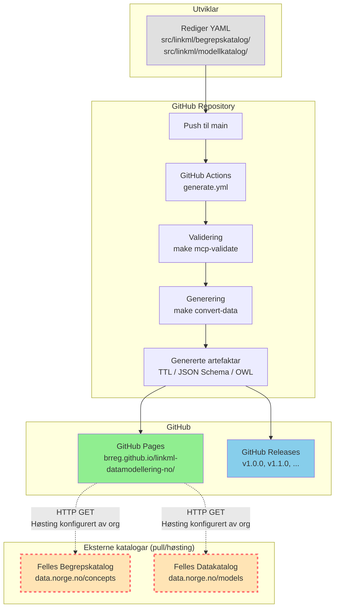
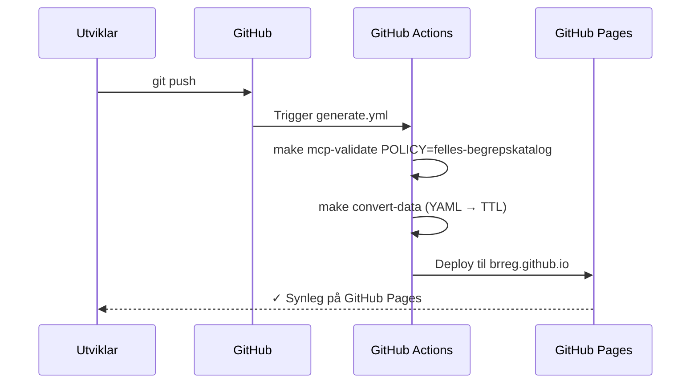
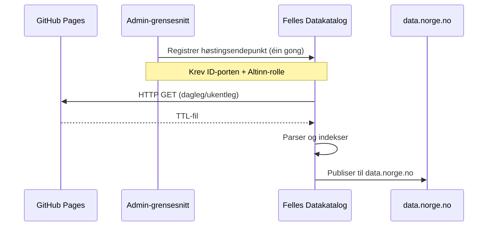

# Arkitektur-oversikt

Dette dokumentet viser arkitekturen for publiseringsflyt frå repoet til eksterne katalogar.

---

## Publiseringsflyt til eksterne system



**Nøkkel:**
- **Solid pil (→):** Automatisk prosess, kontrollert av repoet
- **Stipla pil (-.->):** Ekstern prosess, **ikkje** kontrollert av repoet
- **Raud stipla ramme:** Eksterne system utanfor repoets kontroll

---

## Prinsipp: Pull, ikkje push

Repoet følgjer "pull, ikkje push"-prinsippet:

| Kva repoet GØR | Kva repoet IKKJE gjer |
|---|---|
| ✅ Publiserer artefaktar til GitHub Pages | ❌ Pusher ikkje til data.norge.no |
| ✅ Publiserer releases til GitHub | ❌ Har ikkje API-credentials for Felles Begrepskatalog |
| ✅ Validerer data mot policies | ❌ Har ikkje API-credentials for Felles Datakatalog |
| ✅ Genererer høstingsklare TTL-filer | ❌ Kontrollerer ikkje når høsting skjer |

**Kvifor?**

- **Enklare arkitektur:** Repoet treng ikkje credentials eller integrasjon mot eksterne API-ar
- **Færre avhengigheiter:** Repoet fungerer sjølv om Felles Begrepskatalog/Datakatalog er nede
- **Fleksibilitet:** Kvar organisasjon kan velje når/om dei vil høste data

---

## Dataflyt: frå YAML til data.norge.no

### Steg 1-4: Repoet sitt ansvar (automatisk)



**Tidsbruk:** 3–5 minutt

### Steg 5-6: Ekstern prosess (manuell koordinering)



**Tidsbruk:** Varierer (minutt til dagar, avhengig av høstingsoppsett)

---

## Manifest-konfigurasjon

Kvar datafil under `src/linkml/*/data/<katalog>/` har ein `manifest.yaml`:

```yaml
publish_external: true  # Publiser til GitHub Pages?
data_policy: felles-begrepskatalog  # Valideringspolicy
```

**Effekt av `publish_external`:**

| Verdi | GitHub Pages | Høstingsendepunkt | Felles Begrepskatalog/Datakatalog |
|---|---|---|---|
| `true` | ✅ Publisert | ✅ Tilgjengeleg | ⚠️ Kan høstast (dersom konfigurert) |
| `false` | ❌ Ikkje publisert | ❌ Ikkje tilgjengeleg | ❌ Kan ikkje høstast |

---

## Sjå òg

- [publiseringsflyt-oversikt.md](https://github.com/brreg/linkml-datamodellering-no/blob/main/specs/backlog/publiseringsflyt-oversikt.md) — detaljert dokumentasjon
- [publisering-begrep.md](publisering-begrep.md) — rettleiing for begrepskatalog
- [publisering-modell.md](publisering-modell.md) — rettleiing for modellkatalog
- [GOVERNANCE.md](https://github.com/brreg/linkml-datamodellering-no/blob/main/GOVERNANCE.md) — publiseringspolicy
