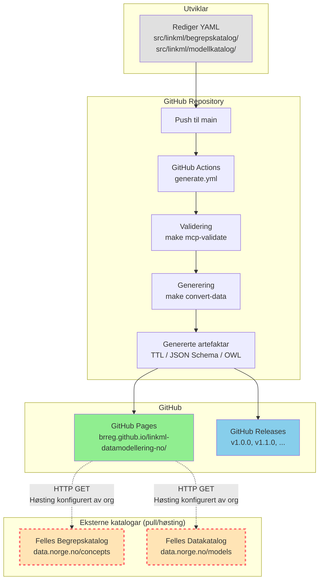
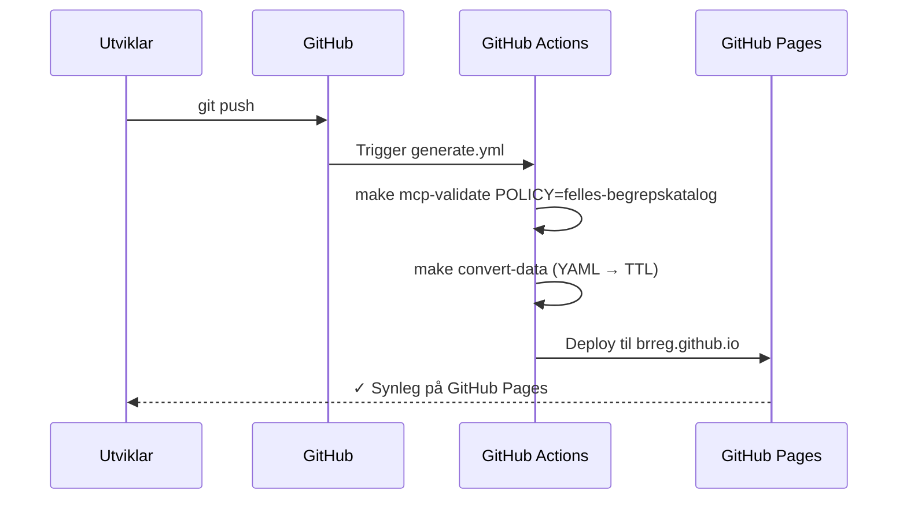
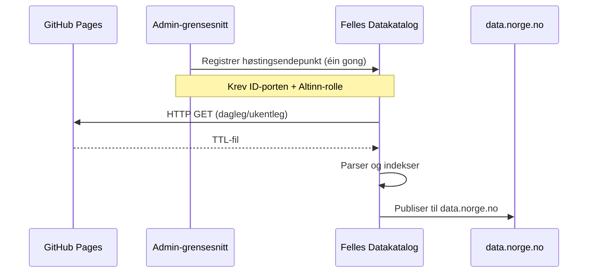

# Arkitektur-oversikt

Dette dokumentet viser arkitekturen for publiseringsflyt frå repoet til eksterne katalogar.

---

## Publiseringsflyt til eksterne system



**Nøkkel:**
- **Solid pil (→):** Automatisk prosess, kontrollert av repoet
- **Stipla pil (-.->):** Ekstern prosess, **ikkje** kontrollert av repoet
- **Raud stipla ramme:** Eksterne system utanfor repoets kontroll

---

## Prinsipp: Pull, ikkje push

Repoet følgjer "pull, ikkje push"-prinsippet:

| Kva repoet GØR | Kva repoet IKKJE gjer |
|---|---|
| ✅ Publiserer artefaktar til GitHub Pages | ❌ Pusher ikkje til data.norge.no |
| ✅ Publiserer releases til GitHub | ❌ Har ikkje API-credentials for Felles Begrepskatalog |
| ✅ Validerer data mot policies | ❌ Har ikkje API-credentials for Felles Datakatalog |
| ✅ Genererer høstingsklare TTL-filer | ❌ Kontrollerer ikkje når høsting skjer |

**Kvifor?**

- **Enklare arkitektur:** Repoet treng ikkje credentials eller integrasjon mot eksterne API-ar
- **Færre avhengigheiter:** Repoet fungerer sjølv om Felles Begrepskatalog/Datakatalog er nede
- **Fleksibilitet:** Kvar organisasjon kan velje når/om dei vil høste data

---

## Kvar genererte filer endar

### 1. `generated/` (lokal build)

**Kvar:** `/generated/<domain>/<modell>/`

**Innhald:**
- SHACL shapes (`.ttl`)
- JSON Schema (`.json`)
- OWL ontologi (`.ttl`)
- Python-klassar (`.py`)
- Protobuf (`.proto`)
- Dokumentasjon (`docs/`)
- PlantUML-diagram (`.puml`, `.svg`)
- ER-diagram (`.md`)

**Git-status:** Ignorert (i `.gitignore`) — vert ikkje sjekka inn

**Formål:** Lokal testing og verifisering før push

---

### 2. GitHub Pages (automatisk publisering)

**URL:** `https://brreg.github.io/linkml-datamodellering-no/`

**Kvar kom det frå:** CI-jobben `generate.yml` (kjører på push til `main`)

**Innhald:**
- Alle genererte artefaktar (same som `generated/`)
- Begrepskatalogar: `.ttl`-filer frå `src/linkml/begrepskatalog/*/data/`
- Modellkatalogar: `.ttl`-filer frå `src/linkml/modellkatalog/*/data/`
- MkDocs-dokumentasjonsportal

**Versjonering:** Peikar alltid til siste versjon på `main` — **ikkje versjonsstabil**

**Formål:**
- Dokumentasjonsportal for menneskelege brukarar
- Høstingsendepunkt for Felles Begrepskatalog / Felles Datakatalog

---

### 3. GitHub Releases (versjonerte artefaktar)

**URL:** `https://github.com/brreg/linkml-datamodellering-no/releases`

**Kvar kom det frå:** `release-please` opprettar release ved merge av release-PR

**Innhald:**
- Source code (`.zip`, `.tar.gz`)
- (Potensielt) bundla artefaktar som release assets

**Versjonering:** Semantisk versjonering (`v1.0.0`, `v1.1.0`, osv.) — **versjonsstabil**

**Formål:**
- Stabile URI-ar for import frå eksterne repo
- Historisk arkiv av tidlegare versjonar

---

## Dataflyt: frå YAML til data.norge.no

### Steg 1-4: Repoet sitt ansvar (automatisk)



**Tidsbruk:** 3–5 minutt

### Steg 5-6: Ekstern prosess (manuell koordinering)



**Tidsbruk:** Varierer (minutt til dagar, avhengig av høstingsoppsett)

---

## Workflow: frå commit til synleg på data.norge.no

### 1. Utviklar lager pullrequest til `main`

```bash
# Oppdater main
git switch main
git pull origin main

# Lag ny arbeidsbranch
git switch -c feature/mi-endring

# Gjer endringar
git add src/linkml/begrepskatalog/brreg-begrepskatalog/data/brreg-begrepskatalog/brreg-begrepskatalog.yaml
git commit -m "feat(brreg-begrepskatalog): legg til nytt begrep 'aksjonær'"

# Push branch
git push -u origin feature/mi-endring

# Opprett Pull Request til main i GitHub-grensesnittet
```

### 2. CI kjører validering og generering

GitHub Actions (`generate.yml`):
1. Validerer datafila: `make mcp-validate POLICY=felles-begrepskatalog`
2. Genererer `.ttl`-fil: `make convert-data`
3. Publiserer til GitHub Pages: `actions/deploy-pages@v1`

**Tidsbruk:** ~3–5 minutt (avhengig av storleik på endringar)

### 3. GitHub Pages er oppdatert

`https://brreg.github.io/linkml-datamodellering-no/begrepskatalog/brreg-begrepskatalog/brreg-begrepskatalog.ttl` inneheld no den oppdaterte datafila i SKOS/Turtle-format.

### 4. Felles Begrepskatalog høstar (ekstern prosess)

**Kven:** Digitaliseringsdirektoratet / Felles Begrepskatalog-systemet  
**Når:** Avhengig av høstingsintervall (t.d. dagleg, ukentleg)  
**Korleis:** HTTP GET frå GitHub Pages-URL  
**Kontroll:** Repoet har ingen kontroll over når/om høsting skjer

**Tidsbruk:** Varierer — frå minutt til dagar, avhengig av høstingsoppsett

### 5. Synleg på data.norge.no

Begrepet visast på [data.norge.no/concepts](https://data.norge.no/concepts) etter at høsting og indeksering er fullført.

---

## Manifest-konfigurasjon

Kvar datafil under `src/linkml/*/data/<katalog>/` har ein `manifest.yaml`:

```yaml
publish_external: true  # Publiser til GitHub Pages?
data_policy: felles-begrepskatalog  # Valideringspolicy
```

**Effekt av `publish_external`:**

| Verdi | GitHub Pages | Høstingsendepunkt | Felles Begrepskatalog/Datakatalog |
|---|---|---|---|
| `true` | ✅ Publisert | ✅ Tilgjengeleg | ⚠️ Kan høstast (dersom konfigurert) |
| `false` | ❌ Ikkje publisert | ❌ Ikkje tilgjengeleg | ❌ Kan ikkje høstast |

---

## Feilsøking

### Problem: "Eg har pusha til main, men ser ikkje endringane på GitHub Pages"

**Løysing:**
1. Sjekk at CI-jobben `generate` er grøn: https://github.com/brreg/linkml-datamodellering-no/actions
2. Sjekk at `publish_external: true` i `manifest.yaml`
3. Vent 3–5 minutt for at GitHub Pages skal oppdaterast
4. Hard-refresh i nettlesaren (Ctrl+Shift+R)

### Problem: "GitHub Pages er oppdatert, men eg ser ikkje endringane på data.norge.no"

**Løysing:**
1. Verifiser at høstingsendepunktet er registrert på [admin.fellesdatakatalog.digdir.no](https://admin.fellesdatakatalog.digdir.no)
2. Kontakt Digitaliseringsdirektoratet (dataopen@digdir.no) for å verifisere høstingsstatus
3. Vurder manuell høsting via admin-grensesnittet ("Høst no"-knappen)

**NB:** Repoet har ingen måte å verifisere om høsting faktisk skjer — det er utanfor repoets kontroll.

---

## Oppsummering

| Steg | Ansvarleg | Automatisk? | Verifiserbart? |
|---|---|---|---|
| 1. Rediger YAML | Utviklar | Nei | Ja (lokal validering) |
| 2. Pullrequest til `main` | Utviklar | Nei | Ja (GitHub) |
| 3. CI genererer artefaktar | GitHub Actions | Ja | Ja (Actions-logg) |
| 4. Publiser til GitHub Pages | GitHub Actions | Ja | Ja (sjekk URL) |
| 5. Høsting frå Felles Begrepskatalog/Datakatalog | Org i den enkelte virksomhet | Nei (manuell setup) | Nei (ikkje tilgjengeleg for repoet) |
| 6. Synleg på data.norge.no | Digitaliseringsdirektoratet | Ja (etter høsting) | Ja (manuell sjekk) |

**Konklusjon:** Repoet kontrollerer steg 1-4. Steg 5-6 er eksterne prosessar som må koordinerast med Digitaliseringsdirektoratet.

---

## Sjå òg

- [publisering-begrep.md](publisering-begrep.md) — rettleiing for begrepskatalog
- [publisering-modell.md](publisering-modell.md) — rettleiing for modellkatalog
- [monitorering.md](monitorering.md) — korleis monitorere publisering
- [GOVERNANCE.md](https://github.com/brreg/linkml-datamodellering-no/blob/main/GOVERNANCE.md) — publiseringspolicy
