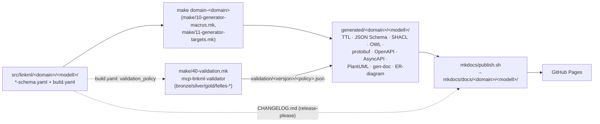

# Artefaktgenerering — kjelder og pipeline

!!! note "Beskrivelse"

    Denne sida svarar presist på to spørsmål for kvar automatisk genererte artefakt i repoet: **korleis vert han generert** (kva `make`-target, kva kommando, kva container), og **kva er kjelda til innhaldet** (kva skjemafelt, `build.yaml`-nøkkel eller annan fil styrer det som står i artefakten).

---

For kommandoreferanse (korleis *køyre* targeta) — sjå
[`COMMANDS.md`](https://github.com/brreg/linkml-datamodellering-no/blob/main/COMMANDS.md).
For prinsippa bak importhierarkiet skjemaa sjølve følgjer — sjå
[`PRINCIPLES.md`](https://github.com/brreg/linkml-datamodellering-no/blob/main/PRINCIPLES.md)
§ 3 og [Importhierarki](importhierarki.md). Denne sida dekkjer laget *mellom*
kjeldeskjema og publisert portal: kva som skjer i `make/*.mk`, kva script
som køyrer inni kvar container, og kvar kvart felt i sluttresultatet
kjem frå.

## 1. Overordna flyt

Alt genereringsarbeid går via containerar (podman) — sjå `make/01-containers.mk`
for dei fire faste kjøyrarane (`LINKML_RUN`, `AVROTIZE_RUN`, `ASYNCAPI_RUN`,
`PYTHON_RUN`, `DOCS_RUN`). `generated/` er alltid byggoutput, aldri kjeldekode
— det som ligg der kan slettast og regenererast frå `src/linkml/` når som helst.

Kvar generator er gata av éin nøkkel under `generators:` i skjemaet sin
`build.yaml` (t.d. `shacl: true`). Filteret vert handheva av det delte
scriptet `src/assets/scripts/makefile/run-parallel-gen.sh`, som grep-ar
`build.yaml` for nøkkelen og køyrer den faktiske kommandoen berre for
skjema der flagget er `true`. Same script fangar òg eventuelle per-skjema
CLI-flagg-overstyringar (`shacl_flags`, `owl_flags`) via `--extra-flags-field`.

## 2. Per-artefakt-tabell

Alle stiar er relative til `generated/<domain>/<modell>/` med mindre anna
er oppgjeve. `<n>` = skjemanamn (filnamn utan `-schema.yaml`).

| Artefakt | `build.yaml`-flagg | Make-target | Kommando (i container) | Output |
|---|---|---|---|---|
| JSON-LD-context | `jsonld_context` | `gen-jsonld-context` | `gen-jsonld-context <schema>` | `<n>-context.jsonld` |
| SHACL-shapes | `shacl` (+ valfri `shacl_flags`) | `gen-shacl` | `gen-shacl ${shacl_flags} <schema>` | `<n>-shapes.ttl` |
| Python-datamodell | `python` | `gen-python` | `gen-python <schema>` | `<n>-model.py` |
| JSON Schema | `json_schema` | `gen-jsonschema` | `gen-json-schema <schema>` | `<n>-schema.json` |
| OWL-ontologi | `owl` (+ valfri `owl_flags`) | `gen-owl` | `gen-owl ${owl_flags:-$OWL_DEFAULT_FLAGS} <schema>` (default: `--skip-vacuous-local-range-axioms --skip-vacuous-min-zero-cardinality-axioms --consolidate-cardinality-axioms`) | `<n>-ontology.ttl` |
| RDF/OWL-skjema | `rdf` | `gen-rdf` | `gen-rdf <schema>` | `<n>-schema.ttl` |
| XSD | `xsd` (krev `json_schema`-output) | `gen-xsd` | 3 steg: avrotize `j2a` (JSON Schema → Avro), avrotize `a2x` (Avro → XSD, namespace frå `id:`), så `fix-xsd-dates.py` (rettar `date`/`date-time`-felt som avrotize elles gjer om til `xs:integer`/`xs:long`) | `<n>-schema.xsd` |
| Protobuf | `protobuf` | `gen-proto` | `gen-proto <schema>` | `<n>-schema.proto` |
| OpenAPI | `openapi` (krev `json_schema`) | `gen-openapi` | eigen `gen-openapi.py` (ikkje ein linkml-kommando — pakkar JSON Schema `$defs` inn i `components/schemas`, hentar `info.title/version/description` frå skjemaet), validert med `openapi-spec-validator` | `<n>-openapi.yaml` |
| AsyncAPI | `asyncapi` (krev `json_schema`) | `gen-asyncapi` | eigen `gen-asyncapi.py` (same mønster som openapi), validert med `asyncapi validate` | `<n>-asyncapi.yaml` |
| ER-diagram (Markdown) | `erdiagram` | `gen-erdiagram` | `gen-erdiagram --no-mergeimports <schema>` → `filter_container.awk` (fjernar containerklassen) → `filter_erdiagram.py` (fjernar importerte klassar) | `<n>-erdiagram-unfiltered.md`, `<n>-erdiagram.md` |
| PlantUML-diagram | `plantuml` | `gen-plantuml` | `gen-plantuml <schema>` → `filter_plantuml.py` i to modus (`filtered` = kun lokale klassar, `full` = alle unntatt containerklassen) → PlantUML-container rendrar SVG | `diagrams/<n>-raw.puml`, `diagrams/<n>-filtered.puml(+.svg)`, `diagrams/<n>.puml(+.svg)` |
| gen-doc (klassedokumentasjon) | `docs` | del av `gen-docs` | `gen-docgen-examples.py` (splittar eksempelfila per klasseinstans) → `gen-doc --template-directory src/assets/templates/docgen --no-mergeimports --no-render-imports --no-hierarchical-class-view --diagram-type mermaid_class_diagram --example-directory ... <schema>` → `sed -i "/Container/d" docs/index.md` | `docgen-examples/*.yaml`, `docs/*.md` (éin per klasse/slot/enum/type/subset + `docs/index.md`) |
| RDF-eksempeldata | `example_rdf` (default `true`) | innebygd i `domain_target`, ikkje eige gen-target | `linkml-convert --schema <schema> --output-format ttl --no-validate --output ... <eksempelfil>` | `<n>-eksempel.ttl` |
| Informasjonsmodell-instans | *(ingen `build.yaml`-gate — køyrer alltid)* | `gen-informasjonsmodell-instance` | eigen `generate-informasjonsmodell.py <schema>` | `src/linkml/<domain>/<modell>/metadata/<modell>-manifest.yaml` |

`docgen_examples: false` (i `generators:`) er eit eige opt-out for
eksempel-splitting i gen-doc-steget, uavhengig av `docs`-flagget.

## 3. Kjeldesporing per artefakttype

### 3.1 Dei reine LinkML-genererte artefakta (JSON-LD, SHACL, Python, JSON Schema, OWL, RDF, protobuf)

Desse har éi kjelde: sjølve `<modell>-schema.yaml` (inkludert alt han
importerer, sidan `linkml gen-*` løyser importhierarkiet). Feltnamn,
`class_uri`/`slot_uri`, `required`, `range`, `multivalued` osv. mappar
direkte over i tilsvarande konsept i målformatet. Container-klassen
(`tree_root: true`) er alltid med i desse artefakta — dei filtrerer han
**ikkje** vekk (til skilnad frå ER-diagram, PlantUML og gen-doc sin
`docs/index.md`, som eksplisitt fjernar containerreferansar).

### 3.2 XSD, OpenAPI, AsyncAPI

Desse har **JSON Schema-artefakten som mellomsteg**, ikkje skjemaet
direkte — dei krev at `json_schema: true` også er sett, og
`run-parallel-gen.sh` handhevar dette via `--check-suffix schema.json`
(feilar tidleg dersom JSON Schema-fila manglar). Innhaldsmessig:

- **XSD**: strukturen kjem frå JSON Schema → Avro → XSD-konverteringa
  (avrotize). `date`/`date-time`-format vert eksplisitt retta i eit eige
  Python-steg (`fix-xsd-dates.py`) fordi avrotize ikkje handterer JSON
  Schema sine logiske datotypar korrekt — dette er ein kjend
  verktøybegrensing, ikkje eit modelleringsval.
- **OpenAPI/AsyncAPI**: sjølve schema-delen (`components/schemas`) er eit
  omskrive JSON Schema (`$defs` → `components/schemas`,
  referansar omskrivne tilsvarande). `info.title`/`info.version`/
  `info.description` hentar frå skjemaet sine `title`/`version`/
  `description`-felt. `paths: {}` er alltid tom — desse artefakta
  beskriv **datamodellen**, ikkje eit faktisk API-endepunkt.

### 3.3 ER-diagram og PlantUML

Begge køyrer `linkml gen-erdiagram`/`gen-plantuml` fyrst (rå output med
*alle* klassar, inkludert importerte og containerklassen), og filtrerer
so i eit eige Python/awk-steg:

- **Filtrert versjon** (`*-filtered.md`/`*-filtered.puml`): berre klassar
  definerte lokalt i skjemaet sitt `classes:`-blokk. Dette er versjonen
  portalen viser som standard.
- **Full versjon** (`*.puml`): alle klassar unntatt containerklassen,
  inkludert importerte klassar frå t.d. `dcat-ap-no`. Lenka som "(full)"
  frå portalen.

Filtreringslogikken les altså **skjemaet sitt eige `classes:`-nøklar**
for å avgjere kva som er "lokalt" — ikkje ei hardkoda liste.

### 3.4 gen-doc (`docs/*.md`, "Modellmetadata"-tabellen)

Malen (`src/assets/templates/docgen/index.md.jinja2`) er ein
tilpassa LinkML-docgen-mal, ikkje standardmalen. Metadata-tabellen på
toppen av kvart skjema sin `docs/index.md` hentar direkte frå LinkML
sitt `schema`-objekt: `name`, `title`, `description`, `id`, `version`,
`license`, `imports`, samt `annotations.utgiver`, `annotations.status`,
`annotations.endringsdato`, `annotations.utgivelsesdato` (silver-
annotasjonane — sjå CLAUDE.md § "Silver-annotasjonar"). Klasse-/slot-/
enum-/type-lister vert generert ved å traversere `schemaview.all_classes()`
m.fl., med bruksmerke ("✅ Brukt lokalt" / "⚠️ Definert lokalt") utrekna
frå kva som faktisk er referert i modellen. Eksempelinnhald i
klassesidene kjem frå `docgen-examples/*.yaml`, som er
eksempelinstansfila (`examples/<modell>-eksempel.yaml`) splitta éin fil
per toppnivå-instans.

### 3.5 Validering (`validation/<versjon>/<policy>.json`)

Policy vert **detektert** frå `build.yaml`-feltet `validation_policy`
(default `bronze` dersom feltet manglar) — sjå `detect-validation-policy.py`.
Sjølve valideringa køyrer i `mcp-linkml-validator`-containeren, som får
inn eit *flatna* skjema (`gen-linkml --mergeimports`) pluss ei eksempelfil
dersom modellen har `tree_root`. Policy-reglane (`src/mcp-linkml-validator/policies/*.yaml`)
er mounta read-only, ikkje bygd inn i imaget, så policy-endringar treng
ikkje ny image-bygging.

Alle tre skrivevegar til `validation/<versjon>/<policy>.json`
(`run-validation.sh`, `save-validation-log.py`, og
`src/mcp-linkml-validator/validate-and-log.py`) går no via den delte
modulen `src/assets/scripts/utils/validation_log.py`, som garanterer same
feltsett i alle tilfelle: `{schema, domain, version, validation_policy,
validated_at, result}`. Fram til dette vart retta skreiv dei tre vegane
ulike feltnamn (`validation_policy` vs `validation_type`, med/utan
`validated_at`) — sjå
[bugs/valideringslogg-json-inkonsistent-skjema.md](https://github.com/brreg/linkml-datamodellering-no/blob/main/bugs/valideringslogg-json-inkonsistent-skjema.md)
(BUG-12, `løyst`) for historikk. Eksisterande, allereie committa
`validation/**/*.json`-filer frå før retting kan framleis ha det gamle
feltnamnet — `mkdocs/lib/scripts/generate-validation-md.py` er uavhengig av
dette (les `validated_at` med fallback, og utleier policy frå `build.yaml`,
aldri frå JSON-feltet).

### 3.6 Informasjonsmodell-instans og modellkatalog

`generate-informasjonsmodell.py` byggjer éin `Informasjonsmodell`-instans
per skjema (skriven til `src/linkml/<domain>/<modell>/metadata/<modell>-manifest.yaml`).
Kjeldene for kvart felt (`schema.yaml`, `build.yaml`, `CODEOWNERS.md`,
lokale klassar, genererte artefaktar) er dokumenterte i full detalj i
[Generering av modellmanifest](modellmanifest-generering.md) — ikkje
gjenteke her.

`make gen-modellkatalog-instance` samlar so alle `**/metadata/*-manifest.yaml`
på tvers av repoet, grupperer dei etter utgjevar (matcha mot
`CODEOWNERS.md` sin `org_uri`), og skriv éi datafil per organisasjon under
`src/linkml/modellkatalog/<catalog>/data/<catalog>/<catalog>.yaml` — dette
er datafila som til slutt vert publisert til Felles Datakatalog via
ModelDCAT-AP-NO. Tilsvarande mønster gjeld `gen-begrepskatalog-instance`
(`collect-concepts.py`) for begrepskatalogen, som samlar `begrep/*.yaml`
frå alle `begrepssamling-*`-katalogar.

`30-instances.mk`-targetet `validate-informasjonsmodell-instance` utleier
`<modell>-manifest.yaml`-stien direkte frå `SCHEMA` (same mønster som
`generate-informasjonsmodell.py` sjølv brukar for filnamnet). Han refererte
tidlegare til den gamle, delte stien `metadata/modelldcat.yaml` — sjå
[bugs/informasjonsmodell-instance-stale-metadata-sti.md](https://github.com/brreg/linkml-datamodellering-no/blob/main/bugs/informasjonsmodell-instance-stale-metadata-sti.md)
(BUG-11, `løyst`) for historikk.

### 3.7 CHANGELOG.md — genereres IKKJE av make-pipelinen

`CHANGELOG.md` per skjema vert **aldri** skriven av noko i `make/` eller
`src/assets/scripts/`. Han vert produsert av `googleapis/release-please-action`
(`.github/workflows/release-please.yml`), konfigurert med éin
release-please-"package" per modellkatalog i `.github/release-please-config.json`.
Release-please les conventional-commit-historikk scopa til kvar
pakke-sti og skriv/oppdaterer `CHANGELOG.md` direkte i release-PR-en.
Same steg (`release-please.yml`) synkroniserer også `schema.yaml` sin
`version:` og `annotations.endringsdato`/`annotations.utgivelsesdato`
til den nye versjonen (via `yq`). Portalen (`mkdocs/lib/sections/versjonslog.sh`)
kopierer so denne fila rått inn i kvart skjema sin publiserte `index.md`
(strippar H1, demoterer `##`→`###`) — sjå § 4.

### 3.8 published-uris.lock — manuelt vedlikehalden ledger

`published-uris.lock` vert **ikkje generert** av noko script. Han er ein
manuelt vedlikehalden, append-only-liste over URI-ar som allereie er
publiserte eksternt (Felles Begrepskatalog/data.norge.no), brukt som ein
vaktmekanisme (`make check-published-uris`, køyrd i `validate.yml`) for
å hindre at publiserte URI-ar vert fjerna eller endra i ettertid.
`mkdocs/publish.sh` **les** fila (eksistenssjekk) for å vise ei
"Publisert til"-kolonne i portalen, men skriv aldri til henne.

## 4. Frå `generated/` til publisert portal (`mkdocs/publish.sh`)

Sjå CLAUDE.md § "Korleis `publish.sh` fungerer" for firestegs-oversikta.
Presiseringar frå kjeldelesing som ikkje står der:

- **Steg 1** gjer òg opprydding av *heile* `mkdocs/docs/<domain>/`-katalogar
  for domene som ikkje lenger finst i `generated/` (ikkje berre tømming av
  eksisterande domene).
- Mellom steg 1 og steg 2 skjer eit usnakka "steg 1.5": eit scan av alle
  `build.yaml` for `submodels:`, som byggjer opp eit foreldre/undermodell-kart
  brukt både i nav-menyen (steg 4) og i kvart skjema sin `index.md`
  (undermodell-boks / undermodell-seksjon).
- **Metadata-tabellen** i den publiserte `index.md` er **ikkje** generert på
  nytt av `publish.sh` — han ekstraherer `## Modellmetadata`-seksjonen
  verbatim frå gen-doc sin eigen `docs/index.md` (awk mellom `## Modellmetadata`
  og neste overskrift). Kjelda til tabellen er difor gen-doc/LinkML sjølv
  (§ 3.4), ikkje `publish.sh`.
- **Artefaktabellen** i domene-`index.md` (`shapes.ttl`, `context.jsonld`,
  `schema.json`, `schema.xsd`, `openapi.yaml`, `asyncapi.yaml`,
  `ontology.ttl`, `schema.ttl`, `model.py`, `schema.proto`, `erdiagram.md`,
  `eksempel.ttl`) vert bygd ved å faktisk sjekke kva filer som finst på disk
  per skjema — ikkje ut frå `build.yaml`-flagga direkte. Ein generator som
  er slått av i `build.yaml` vil difor rett og slett ikkje ha ei fil å
  liste, snarare enn å visast som "utilgjengeleg".
- **Valideringsresultat**-seksjonen re-utleier policy frå `build.yaml` sin
  `validation_policy` (autoritativ), ikkje frå feltet i JSON-fila — sjå § 3.5.

## 5. CI-orkestrering (`.github/workflows/generate.yml`)

Rekkjefølgje: `checkout-source` → `ensure-images` (byggjer/pullar berre
dei container-imaga kvart domene faktisk treng, utleia frå
`src/assets/containers/images.json` sin `required_if_generator_flag`
matcha mot `build.yaml`) → `generate` (matrise per domene: validerer alle
skjema i domenet via `run-validation.sh --manifest`, kopierer eksisterande
`src/linkml/**/validation/<versjon>/` inn i `generated/`, køyrer so
`make domain-<domain>` som genererer alle artefakta frå § 2) → `publish`
(slår saman alle `generated-<domain>`-artefakt-opplastingar, køyrer
`make docs-publish && make docs-build`, deployer til GitHub Pages).

For kva `validate.yml` gjer (nattleg cron + PR + manuell validering,
logglagring, PR-oppretting for oppdaterte valideringsloggar) og korleis du
tolkar loggane frå begge workflowane — sjå
[Monitorering av automasjon](monitorering.md), som dekkjer dette i detalj.

## 6. Kjapp oppslagstabell: "kvar kjem X frå?"

| Du lurer på... | Kjelda er... |
|---|---|
| Klassenamn, slotnamn, `range`, `required` i eit generert format | `<modell>-schema.yaml` sine `classes:`/`slots:` (§ 3.1) |
| "Modellmetadata"-tabellen i portalen | `schema`-metadata + silver-annotasjonar, via gen-doc (§ 3.4, § 4) |
| Kva klassar som vert vist i ER-diagram/PlantUML | Skjemaet sitt eige `classes:`-blokk, filtrert av `filter_erdiagram.py`/`filter_plantuml.py` (§ 3.3) |
| "Valideringsresultat"-seksjonen | `validation/<versjon>/<policy>.json`, policy frå `build.yaml.validation_policy` (§ 3.5) |
| "Versjonslog"-seksjonen | `CHANGELOG.md`, skriven av release-please, ikkje av make-pipelinen (§ 3.7) |
| "Publisert til"-kolonna | Eksistens av `published-uris.lock`, manuelt vedlikehalden (§ 3.8) |
| `Informasjonsmodell`/modellkatalog-oppføringar | `generate-informasjonsmodell.py` — sjå [Generering av modellmanifest](modellmanifest-generering.md) (§ 3.6) |
| Kva artefakt-filer som er lenka i portalen | Faktiske filer på disk i `generated/<domain>/<modell>/`, ikkje `build.yaml`-flagga direkte (§ 4) |

## Sjå òg

- [Arkitekturoversikt](arkitektur-oversikt.md) — heilskapsbiletet: korleis denne pipelinen heng saman med MCP-serverar, CI og eksterne konsumentar
- [Struktur for index.md](index-md-struktur.md) — djupdykk i seksjonane i kvart skjema sin publiserte side
- [Generering av modellmanifest](modellmanifest-generering.md) — fullstendig kjeldetabell for Informasjonsmodell-instansen (§ 3.6)
- [Monitorering av automasjon](monitorering.md) — korleis CI-workflowane faktisk køyrer og korleis du tolkar loggane (§ 5)
