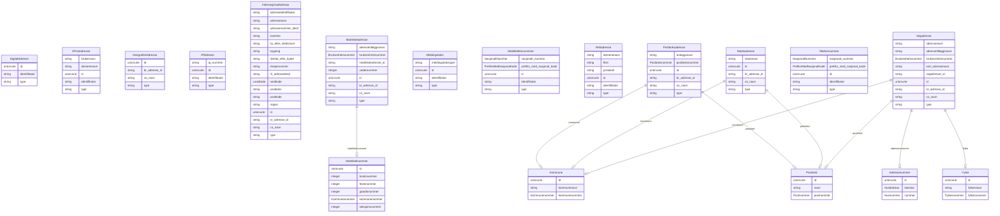

```mermaid
erDiagram
Adressenummer {
    uriorcurie id  
    Husbokstav bokstav  
    Husnummer nummer  
}
DigitalAdresse {
    uriorcurie id  
    string identifikator  
    string type  
}
EPostadresse {
    string brukernavn  
    string domenenavn  
    uriorcurie id  
    string identifikator  
    string type  
}
Fylke {
    uriorcurie id  
    string fylkesnavn  
    Fylkesnummer fylkesnummer  
}
GeografiskAdresse {
    uriorcurie id  
    string br_adresse_id  
    string co_navn  
    string type  
}
IPAdresse {
    string ip_nummer  
    uriorcurie id  
    string identifikator  
    string type  
}
InternasjonalAdresse {
    string adresseidentifikator  
    string adressenavn  
    string adressenummer_tekst  
    string boenhet  
    string by_eller_stedsnavn  
    string bygning  
    string distrikt_eller_bydel  
    string etasjenummer  
    string fri_adressetekst  
    Landkode landkode  
    string postboks  
    string postkode  
    string region  
    uriorcurie id  
    string br_adresse_id  
    string co_navn  
    string type  
}
Kommune {
    uriorcurie id  
    string kommunenavn  
    Kommunenummer kommunenummer  
}
Matrikkeladresse {
    string adressetilleggsnavn  
    Bruksenhetsnummer bruksenhetsnummer  
    string matrikkeladresse_id  
    integer undernummer  
    uriorcurie id  
    string br_adresse_id  
    string co_navn  
    string type  
}
Matrikkelnummer {
    uriorcurie id  
    integer bruksnummer  
    integer festenummer  
    integer gaardsnummer  
    Kommunenummer kommunenummer  
    integer seksjonsnummer  
}
Meldingsboks {
    string meldingsbokstype  
    uriorcurie id  
    string identifikator  
    string type  
}
Mobiltelefonnummer {
    NasjonaltNummer nasjonalt_nummer  
    PrefiksMedNasjonalKode prefiks_med_nasjonal_kode  
    uriorcurie id  
    string identifikator  
    string type  
}
Nettadresse {
    string domenenavn  
    string filsti  
    string protokoll  
    uriorcurie id  
    string identifikator  
    string type  
}
Postboksadresse {
    string anleggsnavn  
    Postboksnummer postboksnummer  
    uriorcurie id  
    string br_adresse_id  
    string co_navn  
    string type  
}
Poststed {
    uriorcurie id  
    string navn  
    Postnummer postnummer  
}
Stedsadresse {
    string stedsnavn  
    uriorcurie id  
    string br_adresse_id  
    string co_navn  
    string type  
}
Telefonnummer {
    NasjonaltNummer nasjonalt_nummer  
    PrefiksMedNasjonalKode prefiks_med_nasjonal_kode  
    uriorcurie id  
    string identifikator  
    string type  
}
Vegadresse {
    string adressenavn  
    string adressetilleggsnavn  
    Bruksenhetsnummer bruksenhetsnummer  
    string kort_adressenavn  
    string vegadresse_id  
    uriorcurie id  
    string br_adresse_id  
    string co_navn  
    string type  
}

Matrikkeladresse ||--|o Matrikkelnummer : "matrikkelnummer"
Postboksadresse ||--|o Kommune : "kommune"
Postboksadresse ||--|o Poststed : "poststed"
Stedsadresse ||--|o Kommune : "kommune"
Stedsadresse ||--|o Poststed : "poststed"
Vegadresse ||--|o Adressenummer : "adressenummer"
Vegadresse ||--|o Fylke : "fylke"
Vegadresse ||--|o Kommune : "kommune"
Vegadresse ||--|o Poststed : "poststed"

```

