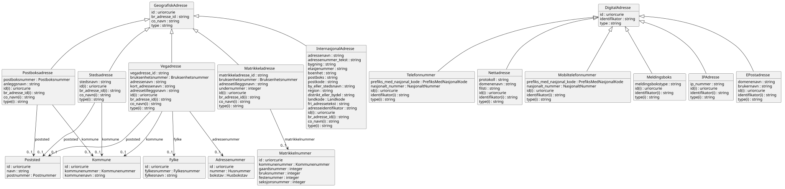

# brreg-felles-adresse


## Om denne modellen

> Denne sida dokumenterer LinkML-modellen brreg-felles-adresse, inkludert klasser, eigenskapar, datatypar, valideringsresultat og genererte artefakter. Informasjonen er generert automatisk frå skjemaet og tilhøyrande byggeproses.

<!--
Felles adresseklassar (geografisk og digital adresse) utleia frå
Brønnøysundregistrene (BR) sin interne BRReferansemodell_v3. Meint for
import frå oreg-domenet sine enhetsregisteret-*-modellar og andre
BR-registermodellar som treng same adressestruktur — sjå
specs/done/felles-typar-enhetsregisteret-fra-br-katalogar.md for
bakgrunn og metode.
-->


---

## Kom i gang

> Her finn du døme på korleis du importerer, validerer og brukar modellen i eigne prosjekt.

### Importer i egne LinkML-skjema

```yaml
imports:
  - https://raw.githubusercontent.com/brreg/linkml-datamodellering-no/brreg-felles-adresse-v0.1.0/src/linkml/felles/brreg-felles-adresse/brreg-felles-adresse-schema
```

### Valider skjemaet mot silver-policy

```bash
make mcp-linkml-valider-modell SCHEMA=src/linkml/felles/brreg-felles-adresse/brreg-felles-adresse-schema.yaml
```

### Valider datafil mot LinkML-skjemaet

```bash
make validate-instance SCHEMA=src/linkml/felles/brreg-felles-adresse/brreg-felles-adresse-schema.yaml INSTANCE=mine-data.yaml
```

### Java-bruk

```xml
<!-- pom.xml -->
<dependency>
    <groupId>org.projectlombok</groupId>
    <artifactId>lombok</artifactId>
    <version>1.18.34</version>
</dependency>
<dependency>
    <groupId>com.fasterxml.jackson.dataformat</groupId>
    <artifactId>jackson-dataformat-yaml</artifactId>
    <version>2.17.2</version>
</dependency>
```

```java
import java.io.File;
import com.fasterxml.jackson.databind.ObjectMapper;
import com.fasterxml.jackson.dataformat.yaml.YAMLFactory;
import no.norge.data.felles.brregfellesadresse.GeografiskAdresse;

ObjectMapper mapper = new ObjectMapper(new YAMLFactory());
GeografiskAdresse geografisk_adresse = mapper.readValue(new File("mine-data.yaml"), GeografiskAdresse.class);
```


### Python-bruk

```bash
pip install linkml-runtime pyyaml
```

```python
from linkml_runtime.loaders import yaml_loader
from brreg_felles_adresse_model import GeografiskAdresse

geografisk_adresse = yaml_loader.load('mine-data.yaml', target_class=GeografiskAdresse)
```


---

## Modellmetadata {#metadata}

> Modellmetadata viser sentrale metadata for modellen, inkludert versjon, status, lisens, identifikatorar og avhengigheiter. Verdiane er henta direkte frå skjemaet.

| Felt | Verdi |
| --- | --- |
| Name | brreg-felles-adresse |
| Title | BRREG felles adresse |
| Description | Gjenbrukbare adresseklassar utleia frå Brønnøysundregistrene (BR) sin interne BRReferansemodell_v3 (MagicDraw/XMI), pakken "Adresse" — eit geografisk adressehierarki (GeografiskAdresse) og eit digitalt adressehierarki (DigitalAdresse), pluss dei adresse-relaterte komplekstypane frå Strukturtypekatalog_v1 (Poststed, Kommune, Fylke, Matrikkelnummer, Adressenummer) som adressehierarkiet er avhengig av. Sjå specs/done/felles-typar-enhetsregisteret-fra-br-katalogar.md for bakgrunn, metode og avklaringane denne modellen byggjer på.
BR sin eigen `Nettadresse`-undertype "Aksesspunkt" er medvite utelaten her: feltet `aksesspunktoperatoer` peikar til `Virksomhet` (definert i brreg-felles-aktoer, som importerer denne modellen) og ville gjort importgrafen sirkulær. Sjå nemnde spec § Funn 4. |
| Schema URI | [https://data.norge.no/felles/brreg-felles-adresse](https://data.norge.no/felles/brreg-felles-adresse) |
| Versjon | 0.1.0 |
| Lisens | [https://data.norge.no/nlod/no/2.0](https://data.norge.no/nlod/no/2.0) |
| Utgiver | [https://data.norge.no/organizations/974760673](https://data.norge.no/organizations/974760673) |
| Status | [http://purl.org/adms/status/UnderDevelopment](http://purl.org/adms/status/UnderDevelopment) |
| Endringsdato | 2026-08-31 |
| Utgivelsesdato | 2026-08-31 |
| Imports | `linkml:types`<br>`../brreg-felles-typer/brreg-felles-typer-schema` |


---

## Avhengigheiter (2) {#avhengigheiter}

> Denne modellen importerer og gjenbruker komponentar frå andre skjema. 
> Importerte klasser og eigenskapar kan vere synlege i diagram, valideringsrapportar og andre analysar sjølv om dei ikkje blir lista som lokale element i denne modellen.

Dette skjemaet importerer følgjande skjema (direkte og transitivt):

```
linkml:types  # direkte import
└── brreg-felles-typer-schema  # direkte import
```

*Sjå [Importhierarki](../../arkitektur/importhierarki.md) for oversikt over heile repoet sitt importhierarki.*

*Importerte modeller: [linkml:types](https://github.com/linkml/linkml-model/blob/main/linkml_model/model/schema/types.yaml), [brreg-felles-typer](../brreg-felles-typer/#datamodell)*


---

## Entity-relationship diagram

> ER-diagrammet viser struktur og relasjonar mellom dei lokale klassane i modellen. Importerte klasser er som standard filtrerte bort for å gjere diagrammet enklare å lese.

[](diagrams/brreg-felles-adresse-filtered.svg)

*Diagrammet viser kun lokale klasser. Klikk for å zoome. [Vis fullstendig diagram med importerte klasser](diagrams/brreg-felles-adresse.svg).*

---

## Datamodell

> Dette er den autoritative kjelda for modellen. Alle tabellar, diagram og artefakt på denne sida er genererte frå dette skjemaet.

Kjelde-datamodell i LinkML-format: [`brreg-felles-adresse-schema.yaml`](https://github.com/brreg/linkml-datamodellering-no/blob/main/src/linkml/felles/brreg-felles-adresse/brreg-felles-adresse-schema.yaml)

---

### Classes (18) {#classes}

> Classes viser klasser som er definerte lokalt i brreg-felles-adresse modellen. 
> Klasser frå importerte modellar er ikkje inkluderte i teljinga, men kan vere refererte frå lokale klasser og kan inngå i valideringsresultat og diagram.  
> Klasser grupperes i Obligatorisk, Anbefalt, Valgfri og Andre (uklassifisert).

#### Andre (18)

| Class | Description |
| --- | --- |
| [Adressenummer](klasser/adressenummer.md) | Adressenummeret (husnummer og eventuell husbokstav) i ei vegadresse. |
| [DigitalAdresse](klasser/digitaladresse.md) | Ei digital adresse. Abstrakt basisklasse for dei konkrete digitale adressetypane under. |
| [EPostadresse](klasser/epostadresse.md) | Ei e-postadresse, delt opp i brukarnamn og domenenavn. |
| [Fylke](klasser/fylke.md) | Eit norsk fylke. |
| [GeografiskAdresse](klasser/geografiskadresse.md) | Ei geografisk adresse. Abstrakt basisklasse for dei konkrete adressetypane under. |
| [InternasjonalAdresse](klasser/internasjonaladresse.md) | Ei adresse i eit anna land enn Noreg, i fri form. |
| [IPAdresse](klasser/ipadresse.md) | Ei IP-adresse. |
| [Kommune](klasser/kommune.md) | Ein norsk kommune. |
| [Matrikkeladresse](klasser/matrikkeladresse.md) | Ei matrikkeladresse (knytt til eit matrikkelnummer). |
| [Matrikkelnummer](klasser/matrikkelnummer.md) | Eit matrikkelnummer (gårds-, bruks-, feste- og seksjonsnummer). |
| [Meldingsboks](klasser/meldingsboks.md) | Ei digital meldingsboks (t.d. Altinn). |
| [Mobiltelefonnummer](klasser/mobiltelefonnummer.md) | Eit mobiltelefonnummer. |
| [Nettadresse](klasser/nettadresse.md) | Ei nettadresse (protokoll, domenenavn og filsti). |
| [Postboksadresse](klasser/postboksadresse.md) | Ei postboksadresse. |
| [Poststed](klasser/poststed.md) | Eit poststed knytt til eit postnummer. |
| [Stedsadresse](klasser/stedsadresse.md) | Ei stadfesta adresse utan vegadresse (t.d. i utmark). |
| [Telefonnummer](klasser/telefonnummer.md) | Eit fasttelefonnummer. |
| [Vegadresse](klasser/vegadresse.md) | Ei vegadresse (adressenavn + adressenummer). |


---

### Slots (52) {#slots}

> Slots viser **eigenskapar** som er definert i eller brukt av lokale klasser i modellen.  
> Eigenskapar grupperes i "Verdiar" som inneheld data, og "Refransar" som refererer til andre klasser.  
> *Defined in* kolonna angir kildeskjemaet for eigenskapen.
#### Verdiar (47)

| Slot | Description | Defined in |
| --- | --- | --- |
| [adresseidentifikator](klasser/adresseidentifikator.md) | Ein ekstern identifikator for adressa (t.d. frå eit utanlandsk adresseregister). | [https://data.norge.no/felles/brreg-felles-adresse](https://data.norge.no/felles/brreg-felles-adresse) |
| [adressenavn](klasser/adressenavn.md) | Namnet på vegen/gata/staden. | [https://data.norge.no/felles/brreg-felles-adresse](https://data.norge.no/felles/brreg-felles-adresse) |
| [adressenummer_tekst](klasser/adressenummer_tekst.md) | Adressenummer som fritekst (for utanlandske adresser med anna format enn norsk husnummer/husbokstav). | [https://data.norge.no/felles/brreg-felles-adresse](https://data.norge.no/felles/brreg-felles-adresse) |
| [adressetilleggsnavn](klasser/adressetilleggsnavn.md) | Tilleggsnamn til adressa (t.d. stadnamn i tillegg til vegadresse). | [https://data.norge.no/felles/brreg-felles-adresse](https://data.norge.no/felles/brreg-felles-adresse) |
| [anleggsnavn](klasser/anleggsnavn.md) | Namnet på anlegget/institusjonen postboksen høyrer til. | [https://data.norge.no/felles/brreg-felles-adresse](https://data.norge.no/felles/brreg-felles-adresse) |
| [boenhet](klasser/boenhet.md) | Bueining/leilegheitsnummer. | [https://data.norge.no/felles/brreg-felles-adresse](https://data.norge.no/felles/brreg-felles-adresse) |
| [bokstav](klasser/bokstav.md) | Husbokstaven, dersom adressa har ein. | [https://data.norge.no/felles/brreg-felles-adresse](https://data.norge.no/felles/brreg-felles-adresse) |
| [br_adresse_id](klasser/br_adresse_id.md) | BR sin interne identifikator for adressa. | [https://data.norge.no/felles/brreg-felles-adresse](https://data.norge.no/felles/brreg-felles-adresse) |
| [brukernavn](klasser/brukernavn.md) | Brukarnamnet (lokaldelen) i e-postadressa. | [https://data.norge.no/felles/brreg-felles-adresse](https://data.norge.no/felles/brreg-felles-adresse) |
| [bruksenhetsnummer](klasser/bruksenhetsnummer.md) | Bruksenhetsnummer (bustadnummer) i adressa, t.d. "H0101". | [https://data.norge.no/felles/brreg-felles-adresse](https://data.norge.no/felles/brreg-felles-adresse) |
| [bruksnummer](klasser/bruksnummer.md) | Bruksnummer i matrikkelen. | [https://data.norge.no/felles/brreg-felles-adresse](https://data.norge.no/felles/brreg-felles-adresse) |
| [by_eller_stedsnavn](klasser/by_eller_stedsnavn.md) | By- eller stadnamn. | [https://data.norge.no/felles/brreg-felles-adresse](https://data.norge.no/felles/brreg-felles-adresse) |
| [bygning](klasser/bygning.md) | Bygningsnamn eller -nummer. | [https://data.norge.no/felles/brreg-felles-adresse](https://data.norge.no/felles/brreg-felles-adresse) |
| [co_navn](klasser/co_navn.md) | C/O-namn (omsorgsperson/-verksemd) knytt til adressa. | [https://data.norge.no/felles/brreg-felles-adresse](https://data.norge.no/felles/brreg-felles-adresse) |
| [distrikt_eller_bydel](klasser/distrikt_eller_bydel.md) | Distrikt eller bydel. | [https://data.norge.no/felles/brreg-felles-adresse](https://data.norge.no/felles/brreg-felles-adresse) |
| [domenenavn](klasser/domenenavn.md) | Domenenamnet i adressa. | [https://data.norge.no/felles/brreg-felles-adresse](https://data.norge.no/felles/brreg-felles-adresse) |
| [etasjenummer](klasser/etasjenummer.md) | Etasjenummer. | [https://data.norge.no/felles/brreg-felles-adresse](https://data.norge.no/felles/brreg-felles-adresse) |
| [festenummer](klasser/festenummer.md) | Festenummer i matrikkelen (for festetomter). | [https://data.norge.no/felles/brreg-felles-adresse](https://data.norge.no/felles/brreg-felles-adresse) |
| [filsti](klasser/filsti.md) | Filstien i nettadressa. | [https://data.norge.no/felles/brreg-felles-adresse](https://data.norge.no/felles/brreg-felles-adresse) |
| [fri_adressetekst](klasser/fri_adressetekst.md) | Heile adressa som fritekst, når ho ikkje kan strukturerast i felta over. | [https://data.norge.no/felles/brreg-felles-adresse](https://data.norge.no/felles/brreg-felles-adresse) |
| [fylkesnavn](klasser/fylkesnavn.md) | Namnet på fylket. | [https://data.norge.no/felles/brreg-felles-adresse](https://data.norge.no/felles/brreg-felles-adresse) |
| [fylkesnummer](klasser/fylkesnummer.md) | Fylkesnummeret. | [https://data.norge.no/felles/brreg-felles-adresse](https://data.norge.no/felles/brreg-felles-adresse) |
| [gaardsnummer](klasser/gaardsnummer.md) | Gårdsnummer i matrikkelen. | [https://data.norge.no/felles/brreg-felles-adresse](https://data.norge.no/felles/brreg-felles-adresse) |
| [id](klasser/id.md) | URI-identifikator for ressursen. | [https://data.norge.no/felles/brreg-felles-adresse](https://data.norge.no/felles/brreg-felles-adresse) |
| [identifikator](klasser/identifikator.md) | Generisk identifikator (form varierer per samanheng — brukt både for digitale adresser og, via brreg-felles-aktoer, for aktørar generelt). | [https://data.norge.no/felles/brreg-felles-adresse](https://data.norge.no/felles/brreg-felles-adresse) |
| [ip_nummer](klasser/ip_nummer.md) | IP-nummeret. | [https://data.norge.no/felles/brreg-felles-adresse](https://data.norge.no/felles/brreg-felles-adresse) |
| [kommunenavn](klasser/kommunenavn.md) | Namnet på kommunen. | [https://data.norge.no/felles/brreg-felles-adresse](https://data.norge.no/felles/brreg-felles-adresse) |
| [kommunenummer](klasser/kommunenummer.md) | Kommunenummeret. | [https://data.norge.no/felles/brreg-felles-adresse](https://data.norge.no/felles/brreg-felles-adresse) |
| [kort_adressenavn](klasser/kort_adressenavn.md) | Forkorta versjon av adressenamnet. | [https://data.norge.no/felles/brreg-felles-adresse](https://data.norge.no/felles/brreg-felles-adresse) |
| [landkode](klasser/landkode.md) | Landet adressa ligg i. | [https://data.norge.no/felles/brreg-felles-adresse](https://data.norge.no/felles/brreg-felles-adresse) |
| [matrikkeladresse_id](klasser/matrikkeladresse_id.md) | BR sin interne identifikator for matrikkeladressa. | [https://data.norge.no/felles/brreg-felles-adresse](https://data.norge.no/felles/brreg-felles-adresse) |
| [meldingsbokstype](klasser/meldingsbokstype.md) | Kva type digital meldingsboks dette er (t.d. Altinn). | [https://data.norge.no/felles/brreg-felles-adresse](https://data.norge.no/felles/brreg-felles-adresse) |
| [nasjonalt_nummer](klasser/nasjonalt_nummer.md) | Telefonnummeret utan landkode/prefiks. | [https://data.norge.no/felles/brreg-felles-adresse](https://data.norge.no/felles/brreg-felles-adresse) |
| [navn](klasser/navn.md) | Namnet på ressursen. | [https://data.norge.no/felles/brreg-felles-adresse](https://data.norge.no/felles/brreg-felles-adresse) |
| [nummer](klasser/nummer.md) | Husnummeret. | [https://data.norge.no/felles/brreg-felles-adresse](https://data.norge.no/felles/brreg-felles-adresse) |
| [postboks](klasser/postboks.md) | Postboksnummer (utanlandsk format). | [https://data.norge.no/felles/brreg-felles-adresse](https://data.norge.no/felles/brreg-felles-adresse) |
| [postboksnummer](klasser/postboksnummer.md) | Nummeret på postboksen. | [https://data.norge.no/felles/brreg-felles-adresse](https://data.norge.no/felles/brreg-felles-adresse) |
| [postkode](klasser/postkode.md) | Utanlandsk postkode (ikkje norsk postnummer). | [https://data.norge.no/felles/brreg-felles-adresse](https://data.norge.no/felles/brreg-felles-adresse) |
| [postnummer](klasser/postnummer.md) | Postnummeret. | [https://data.norge.no/felles/brreg-felles-adresse](https://data.norge.no/felles/brreg-felles-adresse) |
| [prefiks_med_nasjonal_kode](klasser/prefiks_med_nasjonal_kode.md) | Internasjonalt telefonprefiks (landkode), t.d. "+47". | [https://data.norge.no/felles/brreg-felles-adresse](https://data.norge.no/felles/brreg-felles-adresse) |
| [protokoll](klasser/protokoll.md) | Protokollen for nettadressa, t.d. https. | [https://data.norge.no/felles/brreg-felles-adresse](https://data.norge.no/felles/brreg-felles-adresse) |
| [region](klasser/region.md) | Region, delstat eller provins. | [https://data.norge.no/felles/brreg-felles-adresse](https://data.norge.no/felles/brreg-felles-adresse) |
| [seksjonsnummer](klasser/seksjonsnummer.md) | Seksjonsnummer i matrikkelen (for seksjonerte eigedomar). | [https://data.norge.no/felles/brreg-felles-adresse](https://data.norge.no/felles/brreg-felles-adresse) |
| [stedsnavn](klasser/stedsnavn.md) | Namnet på staden (for adresser utan vegadresse). | [https://data.norge.no/felles/brreg-felles-adresse](https://data.norge.no/felles/brreg-felles-adresse) |
| [type](klasser/type.md) | Diskriminator for kva slag adresse dette er. | [https://data.norge.no/felles/brreg-felles-adresse](https://data.norge.no/felles/brreg-felles-adresse) |
| [undernummer](klasser/undernummer.md) | Undernummer for seksjonert eigedom. | [https://data.norge.no/felles/brreg-felles-adresse](https://data.norge.no/felles/brreg-felles-adresse) |
| [vegadresse_id](klasser/vegadresse_id.md) | BR sin interne identifikator for vegadressa. | [https://data.norge.no/felles/brreg-felles-adresse](https://data.norge.no/felles/brreg-felles-adresse) |

#### Referansar (5)

| Slot | Description | Defined in |
| --- | --- | --- |
| [adressenummer](klasser/adressenummer.md) | Husnummer og eventuell husbokstav i vegadressa. | [https://data.norge.no/felles/brreg-felles-adresse](https://data.norge.no/felles/brreg-felles-adresse) |
| [fylke](klasser/fylke.md) | Fylket adressa ligg i. | [https://data.norge.no/felles/brreg-felles-adresse](https://data.norge.no/felles/brreg-felles-adresse) |
| [kommune](klasser/kommune.md) | Kommunen adressa ligg i. | [https://data.norge.no/felles/brreg-felles-adresse](https://data.norge.no/felles/brreg-felles-adresse) |
| [matrikkelnummer](klasser/matrikkelnummer.md) | Matrikkelnummeret adressa er knytt til. | [https://data.norge.no/felles/brreg-felles-adresse](https://data.norge.no/felles/brreg-felles-adresse) |
| [poststed](klasser/poststed.md) | Poststedet adressa høyrer til. | [https://data.norge.no/felles/brreg-felles-adresse](https://data.norge.no/felles/brreg-felles-adresse) |


---

### Enumerations (0) {#enumerations}

> Enumerations viser kontrollerte **verdiområder** som er definert i eller brukt lokalt i modellen.  
> *Defined in* kolonna angir kildeskjemaet for verdiområdet.


*Ingen enumerations definert lokalt eller brukt i denne modellen.*


---

### Types (13) {#types}

> Types viser primitive **verdiformat** som datoar, URI-ar, språkstrengar og andre grunnleggjande datatypar som er definert i eller brukt i modellen.  
> *Defined in* kolonna angir kildeskjemaet for verdiformatet.

| Type | URI | Description | Defined in |
| --- | --- | --- | --- |
| Bruksenhetsnummer | [xsd:string](https://www.w3.org/TR/xmlschema11-2/#string) | Bruksenhetsnummer (bustadnummer) i ei vegadresse, t.d. "H0101". | [https://data.norge.no/felles/brreg-felles-typer](https://data.norge.no/felles/brreg-felles-typer) |
| Fylkesnummer | [xsd:string](https://www.w3.org/TR/xmlschema11-2/#string) | Nummerkode for fylke, jf. SSB sin fylkesinndeling. | [https://data.norge.no/felles/brreg-felles-typer](https://data.norge.no/felles/brreg-felles-typer) |
| Husbokstav | [xsd:string](https://www.w3.org/TR/xmlschema11-2/#string) | Husbokstav i ei vegadresse. | [https://data.norge.no/felles/brreg-felles-typer](https://data.norge.no/felles/brreg-felles-typer) |
| Husnummer | [xsd:string](https://www.w3.org/TR/xmlschema11-2/#string) | Husnummer i ei vegadresse. | [https://data.norge.no/felles/brreg-felles-typer](https://data.norge.no/felles/brreg-felles-typer) |
| integer | [xsd:integer](https://www.w3.org/TR/xmlschema11-2/#integer) | An integer | [linkml:types](https://github.com/linkml/linkml-model/blob/main/linkml_model/model/schema/types.yaml) |
| Kommunenummer | [xsd:string](https://www.w3.org/TR/xmlschema11-2/#string) | Norsk kommunenummer (4 sifer). | [https://data.norge.no/felles/brreg-felles-typer](https://data.norge.no/felles/brreg-felles-typer) |
| Landkode | [xsd:string](https://www.w3.org/TR/xmlschema11-2/#string) | Kode for land. | [https://data.norge.no/felles/brreg-felles-typer](https://data.norge.no/felles/brreg-felles-typer) |
| NasjonaltNummer | [xsd:string](https://www.w3.org/TR/xmlschema11-2/#string) | Telefonnummer utan landkode/prefiks. | [https://data.norge.no/felles/brreg-felles-typer](https://data.norge.no/felles/brreg-felles-typer) |
| Postboksnummer | [xsd:string](https://www.w3.org/TR/xmlschema11-2/#string) | Nummeret på ein postboks. | [https://data.norge.no/felles/brreg-felles-typer](https://data.norge.no/felles/brreg-felles-typer) |
| Postnummer | [xsd:string](https://www.w3.org/TR/xmlschema11-2/#string) | Norsk postnummer (4 sifer). | [https://data.norge.no/felles/brreg-felles-typer](https://data.norge.no/felles/brreg-felles-typer) |
| PrefiksMedNasjonalKode | [xsd:string](https://www.w3.org/TR/xmlschema11-2/#string) | Internasjonalt telefonprefiks (landkode), t.d. "+47". | [https://data.norge.no/felles/brreg-felles-typer](https://data.norge.no/felles/brreg-felles-typer) |
| string | [xsd:string](https://www.w3.org/TR/xmlschema11-2/#string) | A character string | [linkml:types](https://github.com/linkml/linkml-model/blob/main/linkml_model/model/schema/types.yaml) |
| uriorcurie | [xsd:anyURI](https://www.w3.org/TR/xmlschema11-2/#anyURI) | a URI or a CURIE | [linkml:types](https://github.com/linkml/linkml-model/blob/main/linkml_model/model/schema/types.yaml) |

*Importerte typer: [linkml:types](https://github.com/linkml/linkml-model/blob/main/linkml_model/model/schema/types.yaml), [brreg-felles-typer](../brreg-felles-typer/#types)*

---

### Subsets (0) {#subsets}

> Subsets viser **klassifiseringar** av klasser og slots som blir brukt i modellen. For AP-NO-modellar vil dette typisk vere Obligatorisk, Anbefalt og Valgfri.  
> *Defined in* kolonna angir kildeskjemaet for klassifiseringa.

*Ingen subsets definert lokalt eller brukt i denne modellen.*

---

## Genererte artefakter (6) {#generated-artifacts}

> Denne seksjonen listar maskinlesbare artefakt som er genererte frå skjemaet. Artefakta blir brukte til validering, integrasjon, dokumentasjon og kodegenerering.

| Artefakt | Fil |
|----------|-----|
| Modellmanifest ihht Modelldcat-ap-no | [brreg-felles-adresse-manifest.yaml](brreg-felles-adresse-manifest.yaml) |
| SHACL shapes | [brreg-felles-adresse-shapes.ttl](brreg-felles-adresse-shapes.ttl) |
| OWL ontologi | [brreg-felles-adresse-ontology.ttl](brreg-felles-adresse-ontology.ttl) |
| RDF/Turtle skjema | [brreg-felles-adresse-schema.ttl](brreg-felles-adresse-schema.ttl) |
| ER-diagram (Mermaid) | [brreg-felles-adresse-erdiagram.md](brreg-felles-adresse-erdiagram.md) |
| PlantUML-diagram | [brreg-felles-adresse-filtered.svg](diagrams/brreg-felles-adresse-filtered.svg) · [brreg-felles-adresse-filtered.puml](diagrams/brreg-felles-adresse-filtered.puml) · [brreg-felles-adresse.puml](diagrams/brreg-felles-adresse.puml) (full) |

*Full byggekonfigurasjon: [build.yaml](https://github.com/brreg/linkml-datamodellering-no/blob/main/src/linkml/felles/brreg-felles-adresse/build.yaml)*

---


## Valideringsresultat

> Valideringsrapporten viser i kva grad modellen etterlever definerte modelleringsreglar og kvalitetskrav. Resultata kan omfatte både lokale og importerte element avhengig av kva reglar som er evaluerte.

*Siste validering: 2026-08-31T15:17:02.829597+00:00 — v0.1.0 — [policy: silver](../../arkitektur/valideringsregler.md#silver)*

| Status | Feil | Åtvaringar |
|---|---|---|
| ❌ Ikkje godkjent | 1 | 21 |

### Feil (1)

1. **`no_container_class`** — `schema`
   `Ingen tree_root-klasse funnen — kan ikkje sjekke container-klasse-krav`


### Åtvaringar (21)

1. **`all_slots_have_slot_uri`** — `slot:id`
   `Slot 'id' manglar slot_uri — formell RDF-semantikk er ikkje definert`

2. **`all_classes_have_concept_ref`** — `class:GeografiskAdresse`
   `Klasse 'GeografiskAdresse' manglar annotations.begrepsidentifikator som peikar på begrep i https://concept-catalog.fellesdatakatalog.digdir.no/collections`

3. **`all_classes_have_concept_ref`** — `class:Postboksadresse`
   `Klasse 'Postboksadresse' manglar annotations.begrepsidentifikator som peikar på begrep i https://concept-catalog.fellesdatakatalog.digdir.no/collections`

4. **`all_classes_have_concept_ref`** — `class:Stedsadresse`
   `Klasse 'Stedsadresse' manglar annotations.begrepsidentifikator som peikar på begrep i https://concept-catalog.fellesdatakatalog.digdir.no/collections`

5. **`all_classes_have_concept_ref`** — `class:Vegadresse`
   `Klasse 'Vegadresse' manglar annotations.begrepsidentifikator som peikar på begrep i https://concept-catalog.fellesdatakatalog.digdir.no/collections`

6. **`all_classes_have_concept_ref`** — `class:Matrikkeladresse`
   `Klasse 'Matrikkeladresse' manglar annotations.begrepsidentifikator som peikar på begrep i https://concept-catalog.fellesdatakatalog.digdir.no/collections`

7. **`all_classes_have_concept_ref`** — `class:InternasjonalAdresse`
   `Klasse 'InternasjonalAdresse' manglar annotations.begrepsidentifikator som peikar på begrep i https://concept-catalog.fellesdatakatalog.digdir.no/collections`

8. **`all_classes_have_concept_ref`** — `class:DigitalAdresse`
   `Klasse 'DigitalAdresse' manglar annotations.begrepsidentifikator som peikar på begrep i https://concept-catalog.fellesdatakatalog.digdir.no/collections`

9. **`all_classes_have_concept_ref`** — `class:IPAdresse`
   `Klasse 'IPAdresse' manglar annotations.begrepsidentifikator som peikar på begrep i https://concept-catalog.fellesdatakatalog.digdir.no/collections`

10. **`all_classes_have_concept_ref`** — `class:EPostadresse`
   `Klasse 'EPostadresse' manglar annotations.begrepsidentifikator som peikar på begrep i https://concept-catalog.fellesdatakatalog.digdir.no/collections`

11. **`all_classes_have_concept_ref`** — `class:Nettadresse`
   `Klasse 'Nettadresse' manglar annotations.begrepsidentifikator som peikar på begrep i https://concept-catalog.fellesdatakatalog.digdir.no/collections`

12. **`all_classes_have_concept_ref`** — `class:Meldingsboks`
   `Klasse 'Meldingsboks' manglar annotations.begrepsidentifikator som peikar på begrep i https://concept-catalog.fellesdatakatalog.digdir.no/collections`

13. **`all_classes_have_concept_ref`** — `class:Mobiltelefonnummer`
   `Klasse 'Mobiltelefonnummer' manglar annotations.begrepsidentifikator som peikar på begrep i https://concept-catalog.fellesdatakatalog.digdir.no/collections`

14. **`all_classes_have_concept_ref`** — `class:Telefonnummer`
   `Klasse 'Telefonnummer' manglar annotations.begrepsidentifikator som peikar på begrep i https://concept-catalog.fellesdatakatalog.digdir.no/collections`

15. **`all_classes_have_concept_ref`** — `class:Poststed`
   `Klasse 'Poststed' manglar annotations.begrepsidentifikator som peikar på begrep i https://concept-catalog.fellesdatakatalog.digdir.no/collections`

16. **`all_classes_have_concept_ref`** — `class:Kommune`
   `Klasse 'Kommune' manglar annotations.begrepsidentifikator som peikar på begrep i https://concept-catalog.fellesdatakatalog.digdir.no/collections`

17. **`all_classes_have_concept_ref`** — `class:Fylke`
   `Klasse 'Fylke' manglar annotations.begrepsidentifikator som peikar på begrep i https://concept-catalog.fellesdatakatalog.digdir.no/collections`

18. **`all_classes_have_concept_ref`** — `class:Matrikkelnummer`
   `Klasse 'Matrikkelnummer' manglar annotations.begrepsidentifikator som peikar på begrep i https://concept-catalog.fellesdatakatalog.digdir.no/collections`

19. **`all_classes_have_concept_ref`** — `class:Adressenummer`
   `Klasse 'Adressenummer' manglar annotations.begrepsidentifikator som peikar på begrep i https://concept-catalog.fellesdatakatalog.digdir.no/collections`

20. **`schema_has_annotation_oppdateringsfrekvens`** — `schema`
   `schema.annotations.oppdateringsfrekvens manglar`

21. **`missing_required_import`** — `schema`
   `Skjemaet importerer ikkje 'dqv-ap-no-schema'`


---

## Modellanalyse

> Modellanalysen samanliknar dette skjemaet sine lokalt definerte klasse- og slotnavn mot andre skjema i same domene, og flaggar par med høg navnelikskap som eit mogleg duplikat- eller konsolideringssignal.

*Modellanalyse ikkje tilgjengeleg — krev at generate-workflowen har køyrt.*

---

## Kontakt

> Her finn du informasjon om forvaltningsansvarleg, kontaktpunkt og kanal for feilrapportering eller forslag til forbetringar.

**Support:** [GitHub Issues](https://github.com/brreg/linkml-datamodellering-no/issues)

