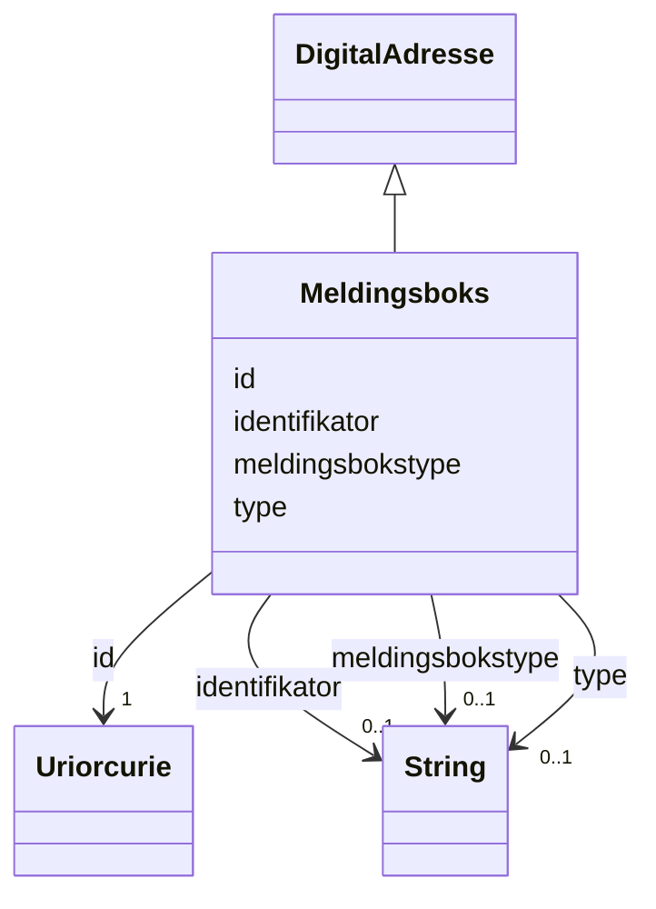

# Class: Meldingsboks 


_Ei digital meldingsboks (t.d. Altinn)._


URI: [brreg_felles_adresse:Meldingsboks](https://data.norge.no/felles/brreg-felles-adresse/Meldingsboks)




!!! note "Om diagrammet"
    Klikk på attributt-radene i klasseboksen ovanfor opnar same side som
    klassenavnet — Mermaid sin `classDiagram`-syntaks støttar berre éin
    klikkbar lenkje per klasseboks, ikkje éin per attributt (BUG-14).
    `## Eigenskapar`-tabellen lenger nede på sida er fasiten for
    slot-spesifikke lenkjer.


## Inheritance
* [DigitalAdresse](digitaladresse.md)
    * **Meldingsboks**


## Class Properties

| Property | Value |
| --- | --- |
| Class URI | [brreg_felles_adresse:Meldingsboks](https://data.norge.no/felles/brreg-felles-adresse/Meldingsboks) |

## Eigenskapar

### Andre

| Navn | Kardinalitet og domene | Beskriving |
| --- | --- | --- |
| [meldingsbokstype](meldingsbokstype.md) | 0..1 <br/> [xsd:string](http://www.w3.org/2001/XMLSchema#string) | Kva type digital meldingsboks dette er (t.d. Altinn). |


### Arva

| Navn | Kardinalitet og domene | Beskriving | Frå |
| --- | --- | --- | --- |
| [id](id.md) | 1 <br/> [xsd:anyURI](http://www.w3.org/2001/XMLSchema#anyURI) | URI-identifikator for ressursen. | [DigitalAdresse](digitaladresse.md) |
| [identifikator](identifikator.md) | 0..1 <br/> [xsd:string](http://www.w3.org/2001/XMLSchema#string) | Identifikator for den digitale adressa (form varierer per undertype). | [DigitalAdresse](digitaladresse.md) |
| [type](type.md) | 0..1 <br/> [xsd:string](http://www.w3.org/2001/XMLSchema#string) | Diskriminator for kva slag digital adresse dette er. | [DigitalAdresse](digitaladresse.md) |


## Identifier and Mapping Information


### Schema Source


* from schema: https://data.norge.no/felles/brreg-felles-adresse


## Mappings

| Mapping Type | Mapped Value |
| ---  | ---  |
| self | brreg_felles_adresse:Meldingsboks |
| native | https://data.norge.no/felles/brreg-felles-adresse/Meldingsboks |


## LinkML Source

<!-- TODO: investigate https://stackoverflow.com/questions/37606292/how-to-create-tabbed-code-blocks-in-mkdocs-or-sphinx -->

### Direct

<details>
```yaml
name: Meldingsboks
description: Ei digital meldingsboks (t.d. Altinn).
from_schema: https://data.norge.no/felles/brreg-felles-adresse
rank: 1000
is_a: DigitalAdresse
slots:
- meldingsbokstype
class_uri: brreg_felles_adresse:Meldingsboks

```
</details>

### Induced

<details>
```yaml
name: Meldingsboks
description: Ei digital meldingsboks (t.d. Altinn).
from_schema: https://data.norge.no/felles/brreg-felles-adresse
rank: 1000
is_a: DigitalAdresse
attributes:
  meldingsbokstype:
    name: meldingsbokstype
    description: Kva type digital meldingsboks dette er (t.d. Altinn).
    from_schema: https://data.norge.no/felles/brreg-felles-adresse
    slot_uri: brreg_felles_adresse:meldingsbokstype
    owner: Meldingsboks
    domain_of:
    - Meldingsboks
    range: string
  id:
    name: id
    description: URI-identifikator for ressursen.
    from_schema: https://data.norge.no/felles/brreg-felles-adresse
    identifier: true
    owner: Meldingsboks
    domain_of:
    - GeografiskAdresse
    - DigitalAdresse
    - Poststed
    - Kommune
    - Fylke
    - Matrikkelnummer
    - Adressenummer
    range: uriorcurie
    required: true
  identifikator:
    name: identifikator
    description: Identifikator for den digitale adressa (form varierer per undertype).
    from_schema: https://data.norge.no/felles/brreg-felles-adresse
    slot_uri: brreg_felles_adresse:identifikator
    owner: Meldingsboks
    domain_of:
    - DigitalAdresse
    range: string
  type:
    name: type
    description: Diskriminator for kva slag digital adresse dette er.
    from_schema: https://data.norge.no/felles/brreg-felles-adresse
    slot_uri: brreg_felles_adresse:type
    owner: Meldingsboks
    domain_of:
    - GeografiskAdresse
    - DigitalAdresse
    range: string
class_uri: brreg_felles_adresse:Meldingsboks

```
</details>