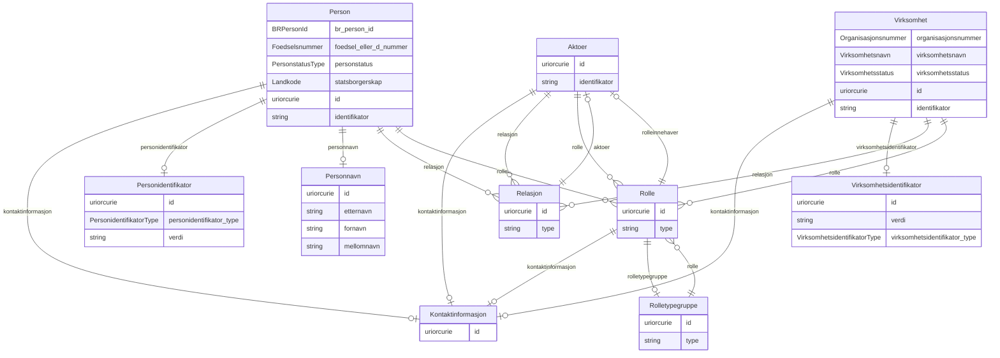

```mermaid
erDiagram
Aktoer {
    uriorcurie id  
    string identifikator  
}
Kontaktinformasjon {
    uriorcurie id  
}
Person {
    BRPersonId br_person_id  
    Foedselsnummer foedsel_eller_d_nummer  
    PersonstatusType personstatus  
    Landkode statsborgerskap  
    uriorcurie id  
    string identifikator  
}
Personidentifikator {
    uriorcurie id  
    PersonidentifikatorType personidentifikator_type  
    string verdi  
}
Personnavn {
    uriorcurie id  
    string etternavn  
    string fornavn  
    string mellomnavn  
}
Relasjon {
    uriorcurie id  
    string type  
}
Rolle {
    uriorcurie id  
    string type  
}
Rolletypegruppe {
    uriorcurie id  
    string type  
}
Virksomhet {
    Organisasjonsnummer organisasjonsnummer  
    Virksomhetsnavn virksomhetsnavn  
    Virksomhetsstatus virksomhetsstatus  
    uriorcurie id  
    string identifikator  
}
Virksomhetsidentifikator {
    uriorcurie id  
    string verdi  
    VirksomhetsidentifikatorType virksomhetsidentifikator_type  
}

Aktoer ||--|o Kontaktinformasjon : "kontaktinformasjon"
Aktoer ||--}o Relasjon : "relasjon"
Aktoer ||--}o Rolle : "rolle"
Person ||--|o Kontaktinformasjon : "kontaktinformasjon"
Person ||--|o Personidentifikator : "personidentifikator"
Person ||--|o Personnavn : "personnavn"
Person ||--}o Relasjon : "relasjon"
Person ||--}o Rolle : "rolle"
Relasjon ||--|o Aktoer : "aktoer"
Rolle ||--|o Aktoer : "rolleinnehaver"
Rolle ||--|o Kontaktinformasjon : "kontaktinformasjon"
Rolle ||--|o Rolletypegruppe : "rolletypegruppe"
Rolletypegruppe ||--}o Rolle : "rolle"
Virksomhet ||--|o Kontaktinformasjon : "kontaktinformasjon"
Virksomhet ||--|o Virksomhetsidentifikator : "virksomhetsidentifikator"
Virksomhet ||--}o Relasjon : "relasjon"
Virksomhet ||--}o Rolle : "rolle"


```
