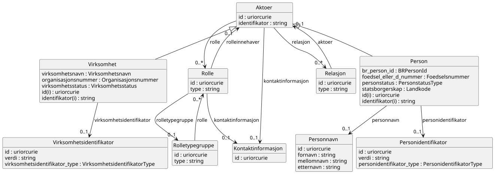

# brreg-felles-aktoer


## Om denne modellen

> Denne sida dokumenterer LinkML-modellen brreg-felles-aktoer, inkludert klasser, eigenskapar, datatypar, valideringsresultat og genererte artefakter. Informasjonen er generert automatisk frå skjemaet og tilhøyrande byggeproses.

<!--
Felles aktørklassar (Aktør, Virksomhet, Person, Rolle m.fl.) utleia frå
Brønnøysundregistrene (BR) sin interne BRReferansemodell_v3. Meint for
import frå oreg-domenet sine enhetsregisteret-*-modellar og andre
BR-registermodellar som treng same aktørstruktur — sjå
specs/done/felles-typar-enhetsregisteret-fra-br-katalogar.md for
bakgrunn og metode.
-->


---

## Kom i gang

> Her finn du døme på korleis du importerer, validerer og brukar modellen i eigne prosjekt.

### Importer i egne LinkML-skjema

```yaml
imports:
  - https://raw.githubusercontent.com/brreg/linkml-datamodellering-no/brreg-felles-aktoer-v0.1.0/src/linkml/felles/brreg-felles-aktoer/brreg-felles-aktoer-schema
```

### Valider skjemaet mot silver-policy

```bash
make mcp-linkml-valider-modell SCHEMA=src/linkml/felles/brreg-felles-aktoer/brreg-felles-aktoer-schema.yaml
```

### Valider datafil mot LinkML-skjemaet

```bash
make validate-instance SCHEMA=src/linkml/felles/brreg-felles-aktoer/brreg-felles-aktoer-schema.yaml INSTANCE=mine-data.yaml
```

### Java-bruk

```xml
<!-- pom.xml -->
<dependency>
    <groupId>org.projectlombok</groupId>
    <artifactId>lombok</artifactId>
    <version>1.18.34</version>
</dependency>
<dependency>
    <groupId>com.fasterxml.jackson.dataformat</groupId>
    <artifactId>jackson-dataformat-yaml</artifactId>
    <version>2.17.2</version>
</dependency>
```

```java
import java.io.File;
import com.fasterxml.jackson.databind.ObjectMapper;
import com.fasterxml.jackson.dataformat.yaml.YAMLFactory;
import no.norge.data.felles.brregfellesaktoer.Aktoer;

ObjectMapper mapper = new ObjectMapper(new YAMLFactory());
Aktoer aktoer = mapper.readValue(new File("mine-data.yaml"), Aktoer.class);
```


### Python-bruk

```bash
pip install linkml-runtime pyyaml
```

```python
from linkml_runtime.loaders import yaml_loader
from brreg_felles_aktoer_model import Aktoer

aktoer = yaml_loader.load('mine-data.yaml', target_class=Aktoer)
```


---

## Modellmetadata {#metadata}

> Modellmetadata viser sentrale metadata for modellen, inkludert versjon, status, lisens, identifikatorar og avhengigheiter. Verdiane er henta direkte frå skjemaet.

| Felt | Verdi |
| --- | --- |
| Name | brreg-felles-aktoer |
| Title | BRREG felles aktør |
| Description | Gjenbrukbare aktørklassar (Aktør, Virksomhet, Person, Rolle m.fl.) utleia frå Brønnøysundregistrene (BR) sin interne BRReferansemodell_v3 (MagicDraw/XMI), pakken "Aktør", pluss dei aktør-relaterte komplekstypane frå Strukturtypekatalog_v1 (Personnavn, Personidentifikator, Virksomhetsidentifikator) som aktørklassane er avhengige av. Importerer brreg-felles-adresse for GeografiskAdresse/DigitalAdresse. Sjå specs/done/felles-typar-enhetsregisteret-fra-br-katalogar.md for bakgrunn, metode og avklaringane denne modellen byggjer på. |
| Schema URI | [https://data.norge.no/felles/brreg-felles-aktoer](https://data.norge.no/felles/brreg-felles-aktoer) |
| Versjon | 0.1.0 |
| Lisens | [https://data.norge.no/nlod/no/2.0](https://data.norge.no/nlod/no/2.0) |
| Utgiver | [https://data.norge.no/organizations/974760673](https://data.norge.no/organizations/974760673) |
| Status | [http://purl.org/adms/status/UnderDevelopment](http://purl.org/adms/status/UnderDevelopment) |
| Endringsdato | 2026-08-31 |
| Utgivelsesdato | 2026-08-31 |
| Imports | `linkml:types`<br>`../brreg-felles-adresse/brreg-felles-adresse-schema` |


---

## Avhengigheiter (3) {#avhengigheiter}

> Denne modellen importerer og gjenbruker komponentar frå andre skjema. 
> Importerte klasser og eigenskapar kan vere synlege i diagram, valideringsrapportar og andre analysar sjølv om dei ikkje blir lista som lokale element i denne modellen.

Dette skjemaet importerer følgjande skjema (direkte og transitivt):

```
linkml:types  # direkte import
└── brreg-felles-typer-schema  # transitiv import
    └── brreg-felles-adresse-schema  # direkte import
```

*Sjå [Importhierarki](../../arkitektur/importhierarki.md) for oversikt over heile repoet sitt importhierarki.*

*Importerte modeller: [linkml:types](https://github.com/linkml/linkml-model/blob/main/linkml_model/model/schema/types.yaml), [brreg-felles-adresse](../brreg-felles-adresse/#datamodell), [brreg-felles-typer](../brreg-felles-typer/#datamodell)*


---

## Entity-relationship diagram

> ER-diagrammet viser struktur og relasjonar mellom dei lokale klassane i modellen. Importerte klasser er som standard filtrerte bort for å gjere diagrammet enklare å lese.

[](diagrams/brreg-felles-aktoer-filtered.svg)

*Diagrammet viser kun lokale klasser. Klikk for å zoome. [Vis fullstendig diagram med importerte klasser](diagrams/brreg-felles-aktoer.svg).*

---

## Datamodell

> Dette er den autoritative kjelda for modellen. Alle tabellar, diagram og artefakt på denne sida er genererte frå dette skjemaet.

Kjelde-datamodell i LinkML-format: [`brreg-felles-aktoer-schema.yaml`](https://github.com/brreg/linkml-datamodellering-no/blob/main/src/linkml/felles/brreg-felles-aktoer/brreg-felles-aktoer-schema.yaml)

---

### Classes (10) {#classes}

> Classes viser klasser som er definerte lokalt i brreg-felles-aktoer modellen. 
> Klasser frå importerte modellar er ikkje inkluderte i teljinga, men kan vere refererte frå lokale klasser og kan inngå i valideringsresultat og diagram.  
> Klasser grupperes i Obligatorisk, Anbefalt, Valgfri og Andre (uklassifisert).

#### Andre (10)

| Class | Description |
| --- | --- |
| [Aktoer](klasser/aktoer.md) | Ein aktør — person eller verksemd. Abstrakt basisklasse for Virksomhet og Person. |
| [Kontaktinformasjon](klasser/kontaktinformasjon.md) | Kontaktinformasjon (digital og/eller geografisk adresse) for ein aktør. |
| [Person](klasser/person.md) | Ein fysisk person. |
| [Personidentifikator](klasser/personidentifikator.md) | Ein identifikator for ein person, med ein type som seier kva slag identifikator det er. |
| [Personnavn](klasser/personnavn.md) | Fullt namn på ein person, delt opp i for-, mellom- og etternamn. |
| [Relasjon](klasser/relasjon.md) | Ein relasjon mellom to aktørar. |
| [Rolle](klasser/rolle.md) | Ei rolle ein aktør har overfor ein annan aktør (t.d. styreleiar, revisor). |
| [Rolletypegruppe](klasser/rolletypegruppe.md) | Ei gruppering av rolletypar (t.d. "styre"). |
| [Virksomhet](klasser/virksomhet.md) | Ei verksemd registrert i Einingsregisteret. |
| [Virksomhetsidentifikator](klasser/virksomhetsidentifikator.md) | Ein identifikator for ei verksemd, med ein type som seier kva slag identifikator det er. |


*Importerte klasser: [brreg-felles-adresse](../brreg-felles-adresse/#classes)*

---

### Slots (27) {#slots}

> Slots viser **eigenskapar** som er definert i eller brukt av lokale klasser i modellen.  
> Eigenskapar grupperes i "Verdiar" som inneheld data, og "Refransar" som refererer til andre klasser.  
> *Defined in* kolonna angir kildeskjemaet for eigenskapen.
#### Verdiar (14)

| Slot | Description | Defined in |
| --- | --- | --- |
| [br_person_id](klasser/br_person_id.md) | BR sin interne identifikator for personen. | [https://data.norge.no/felles/brreg-felles-aktoer](https://data.norge.no/felles/brreg-felles-aktoer) |
| [etternavn](klasser/etternavn.md) | Etternamnet til personen. | [https://data.norge.no/felles/brreg-felles-aktoer](https://data.norge.no/felles/brreg-felles-aktoer) |
| [foedsel_eller_d_nummer](klasser/foedsel_eller_d_nummer.md) | Fødselsnummeret eller D-nummeret til personen. | [https://data.norge.no/felles/brreg-felles-aktoer](https://data.norge.no/felles/brreg-felles-aktoer) |
| [fornavn](klasser/fornavn.md) | Fornamnet til personen. | [https://data.norge.no/felles/brreg-felles-aktoer](https://data.norge.no/felles/brreg-felles-aktoer) |
| [id](klasser/id.md) | URI-identifikator for ressursen. | [https://data.norge.no/felles/brreg-felles-adresse](https://data.norge.no/felles/brreg-felles-adresse) |
| [identifikator](klasser/identifikator.md) | Generisk identifikator (form varierer per samanheng — brukt både for digitale adresser og, via brreg-felles-aktoer, for aktørar generelt). | [https://data.norge.no/felles/brreg-felles-adresse](https://data.norge.no/felles/brreg-felles-adresse) |
| [mellomnavn](klasser/mellomnavn.md) | Mellomnamnet til personen, dersom personen har det. | [https://data.norge.no/felles/brreg-felles-aktoer](https://data.norge.no/felles/brreg-felles-aktoer) |
| [organisasjonsnummer](klasser/organisasjonsnummer.md) | Organisasjonsnummeret til verksemda. | [https://data.norge.no/felles/brreg-felles-aktoer](https://data.norge.no/felles/brreg-felles-aktoer) |
| [personstatus](klasser/personstatus.md) | Statusen til personen. | [https://data.norge.no/felles/brreg-felles-aktoer](https://data.norge.no/felles/brreg-felles-aktoer) |
| [statsborgerskap](klasser/statsborgerskap.md) | Statsborgarskapet til personen. | [https://data.norge.no/felles/brreg-felles-aktoer](https://data.norge.no/felles/brreg-felles-aktoer) |
| [type](klasser/type.md) | Diskriminator for kva slag adresse dette er. | [https://data.norge.no/felles/brreg-felles-adresse](https://data.norge.no/felles/brreg-felles-adresse) |
| [verdi](klasser/verdi.md) | Verdien til identifikatoren. | [https://data.norge.no/felles/brreg-felles-aktoer](https://data.norge.no/felles/brreg-felles-aktoer) |
| [virksomhetsnavn](klasser/virksomhetsnavn.md) | Namnet på verksemda. | [https://data.norge.no/felles/brreg-felles-aktoer](https://data.norge.no/felles/brreg-felles-aktoer) |
| [virksomhetsstatus](klasser/virksomhetsstatus.md) | Statusen til verksemda. | [https://data.norge.no/felles/brreg-felles-aktoer](https://data.norge.no/felles/brreg-felles-aktoer) |

#### Referansar (11)

| Slot | Description | Defined in |
| --- | --- | --- |
| [aktoer](klasser/aktoer.md) | Aktøren relasjonen gjeld. | [https://data.norge.no/felles/brreg-felles-aktoer](https://data.norge.no/felles/brreg-felles-aktoer) |
| [digital_adresse](klasser/digital_adresse.md) | Digital adresse knytt til aktøren/rolla. | [https://data.norge.no/felles/brreg-felles-aktoer](https://data.norge.no/felles/brreg-felles-aktoer) |
| [geografisk_adresse](klasser/geografisk_adresse.md) | Geografisk adresse knytt til aktøren/rolla. | [https://data.norge.no/felles/brreg-felles-aktoer](https://data.norge.no/felles/brreg-felles-aktoer) |
| [kontaktinformasjon](klasser/kontaktinformasjon.md) | Kontaktinformasjon for aktøren/rolla. | [https://data.norge.no/felles/brreg-felles-aktoer](https://data.norge.no/felles/brreg-felles-aktoer) |
| [personidentifikator](klasser/personidentifikator.md) | Identifikatoren for personen. | [https://data.norge.no/felles/brreg-felles-aktoer](https://data.norge.no/felles/brreg-felles-aktoer) |
| [personnavn](klasser/personnavn.md) | Namnet på personen. | [https://data.norge.no/felles/brreg-felles-aktoer](https://data.norge.no/felles/brreg-felles-aktoer) |
| [relasjon](klasser/relasjon.md) | Relasjonar aktøren har til andre aktørar. | [https://data.norge.no/felles/brreg-felles-aktoer](https://data.norge.no/felles/brreg-felles-aktoer) |
| [rolle](klasser/rolle.md) | Roller aktøren har. | [https://data.norge.no/felles/brreg-felles-aktoer](https://data.norge.no/felles/brreg-felles-aktoer) |
| [rolleinnehaver](klasser/rolleinnehaver.md) | Aktøren som innehar rolla. | [https://data.norge.no/felles/brreg-felles-aktoer](https://data.norge.no/felles/brreg-felles-aktoer) |
| [rolletypegruppe](klasser/rolletypegruppe.md) | Rolletypegruppa rolla høyrer til. | [https://data.norge.no/felles/brreg-felles-aktoer](https://data.norge.no/felles/brreg-felles-aktoer) |
| [virksomhetsidentifikator](klasser/virksomhetsidentifikator.md) | Identifikatoren for verksemda. | [https://data.norge.no/felles/brreg-felles-aktoer](https://data.norge.no/felles/brreg-felles-aktoer) |

#### Kodar (2)

| Slot | Description | Defined in |
| --- | --- | --- |
| [personidentifikator_type](klasser/personidentifikator_type.md) | Kva slag personidentifikator dette er. | [https://data.norge.no/felles/brreg-felles-aktoer](https://data.norge.no/felles/brreg-felles-aktoer) |
| [virksomhetsidentifikator_type](klasser/virksomhetsidentifikator_type.md) | Kva slag verksemdsidentifikator dette er. | [https://data.norge.no/felles/brreg-felles-aktoer](https://data.norge.no/felles/brreg-felles-aktoer) |


*Importerte slots: [brreg-felles-adresse](../brreg-felles-adresse/#slots)*

---

### Enumerations (2) {#enumerations}

> Enumerations viser kontrollerte **verdiområder** som er definert i eller brukt lokalt i modellen.  
> *Defined in* kolonna angir kildeskjemaet for verdiområdet.


| Enumeration | Description | Defined in |
| --- | --- | --- |
| [PersonidentifikatorType](klasser/personidentifikatortype.md) | Kva slag personidentifikator ein Personidentifikator inneheld. | [https://data.norge.no/felles/brreg-felles-aktoer](https://data.norge.no/felles/brreg-felles-aktoer) |
| [VirksomhetsidentifikatorType](klasser/virksomhetsidentifikatortype.md) | Kva slag verksemdsidentifikator ein Virksomhetsidentifikator inneheld. | [https://data.norge.no/felles/brreg-felles-aktoer](https://data.norge.no/felles/brreg-felles-aktoer) |


---

### Types (9) {#types}

> Types viser primitive **verdiformat** som datoar, URI-ar, språkstrengar og andre grunnleggjande datatypar som er definert i eller brukt i modellen.  
> *Defined in* kolonna angir kildeskjemaet for verdiformatet.

| Type | URI | Description | Defined in |
| --- | --- | --- | --- |
| BRPersonId | [xsd:string](https://www.w3.org/TR/xmlschema11-2/#string) | BR sin interne identifikator for ein person. | [https://data.norge.no/felles/brreg-felles-typer](https://data.norge.no/felles/brreg-felles-typer) |
| Foedselsnummer | [xsd:string](https://www.w3.org/TR/xmlschema11-2/#string) | Norsk fødselsnummer eller D-nummer (11 sifer). | [https://data.norge.no/felles/brreg-felles-typer](https://data.norge.no/felles/brreg-felles-typer) |
| Landkode | [xsd:string](https://www.w3.org/TR/xmlschema11-2/#string) | Kode for land. | [https://data.norge.no/felles/brreg-felles-typer](https://data.norge.no/felles/brreg-felles-typer) |
| Organisasjonsnummer | [xsd:string](https://www.w3.org/TR/xmlschema11-2/#string) | Organisasjonsnummer for ei norsk verksemd (9 sifer), jf. Einingsregisteret. | [https://data.norge.no/felles/brreg-felles-typer](https://data.norge.no/felles/brreg-felles-typer) |
| PersonstatusType | [xsd:string](https://www.w3.org/TR/xmlschema11-2/#string) | Kode for status på ein person i BR sine register. | [https://data.norge.no/felles/brreg-felles-typer](https://data.norge.no/felles/brreg-felles-typer) |
| string | [xsd:string](https://www.w3.org/TR/xmlschema11-2/#string) | A character string | [linkml:types](https://github.com/linkml/linkml-model/blob/main/linkml_model/model/schema/types.yaml) |
| uriorcurie | [xsd:anyURI](https://www.w3.org/TR/xmlschema11-2/#anyURI) | a URI or a CURIE | [linkml:types](https://github.com/linkml/linkml-model/blob/main/linkml_model/model/schema/types.yaml) |
| Virksomhetsnavn | [xsd:string](https://www.w3.org/TR/xmlschema11-2/#string) | Namnet på ei verksemd, slik det er registrert i Einingsregisteret. | [https://data.norge.no/felles/brreg-felles-typer](https://data.norge.no/felles/brreg-felles-typer) |
| Virksomhetsstatus | [xsd:string](https://www.w3.org/TR/xmlschema11-2/#string) | Kode for status på ei verksemd (t.d. aktiv, konkurs, oppløyst). | [https://data.norge.no/felles/brreg-felles-typer](https://data.norge.no/felles/brreg-felles-typer) |

*Importerte typer: [linkml:types](https://github.com/linkml/linkml-model/blob/main/linkml_model/model/schema/types.yaml), [brreg-felles-typer](../brreg-felles-typer/#types)*

---

### Subsets (0) {#subsets}

> Subsets viser **klassifiseringar** av klasser og slots som blir brukt i modellen. For AP-NO-modellar vil dette typisk vere Obligatorisk, Anbefalt og Valgfri.  
> *Defined in* kolonna angir kildeskjemaet for klassifiseringa.

*Ingen subsets definert lokalt eller brukt i denne modellen.*

---

## Genererte artefakter (6) {#generated-artifacts}

> Denne seksjonen listar maskinlesbare artefakt som er genererte frå skjemaet. Artefakta blir brukte til validering, integrasjon, dokumentasjon og kodegenerering.

| Artefakt | Fil |
|----------|-----|
| Modellmanifest ihht Modelldcat-ap-no | [brreg-felles-aktoer-manifest.yaml](brreg-felles-aktoer-manifest.yaml) |
| SHACL shapes | [brreg-felles-aktoer-shapes.ttl](brreg-felles-aktoer-shapes.ttl) |
| OWL ontologi | [brreg-felles-aktoer-ontology.ttl](brreg-felles-aktoer-ontology.ttl) |
| RDF/Turtle skjema | [brreg-felles-aktoer-schema.ttl](brreg-felles-aktoer-schema.ttl) |
| ER-diagram (Mermaid) | [brreg-felles-aktoer-erdiagram.md](brreg-felles-aktoer-erdiagram.md) |
| PlantUML-diagram | [brreg-felles-aktoer-filtered.svg](diagrams/brreg-felles-aktoer-filtered.svg) · [brreg-felles-aktoer-filtered.puml](diagrams/brreg-felles-aktoer-filtered.puml) · [brreg-felles-aktoer.puml](diagrams/brreg-felles-aktoer.puml) (full) |

*Full byggekonfigurasjon: [build.yaml](https://github.com/brreg/linkml-datamodellering-no/blob/main/src/linkml/felles/brreg-felles-aktoer/build.yaml)*

---

## Valideringsresultat

> Valideringsrapporten viser i kva grad modellen etterlever definerte modelleringsreglar og kvalitetskrav. Resultata kan omfatte både lokale og importerte element avhengig av kva reglar som er evaluerte.

*Valideringsresultat ikkje tilgjengeleg — ingen validering enno.*

---

## Modellanalyse

> Modellanalysen samanliknar dette skjemaet sine lokalt definerte klasse- og slotnavn mot andre skjema i same domene, og flaggar par med høg navnelikskap som eit mogleg duplikat- eller konsolideringssignal.

*Modellanalyse ikkje tilgjengeleg — krev at generate-workflowen har køyrt.*

---

## Kontakt

> Her finn du informasjon om forvaltningsansvarleg, kontaktpunkt og kanal for feilrapportering eller forslag til forbetringar.

**Support:** [GitHub Issues](https://github.com/brreg/linkml-datamodellering-no/issues)

