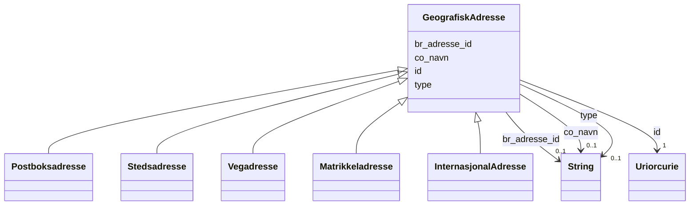

# Class: GeografiskAdresse 


_Ei geografisk adresse. Abstrakt basisklasse for dei konkrete adressetypane under._


URI: [locn:Address](http://www.w3.org/ns/locn#Address)




!!! note "Om diagrammet"
    Klikk på attributt-radene i klasseboksen ovanfor opnar same side som
    klassenavnet — Mermaid sin `classDiagram`-syntaks støttar berre éin
    klikkbar lenkje per klasseboks, ikkje éin per attributt (BUG-14).
    `## Eigenskapar`-tabellen lenger nede på sida er fasiten for
    slot-spesifikke lenkjer.


## Inheritance
* **GeografiskAdresse**
    * [Postboksadresse](postboksadresse.md)
    * [Stedsadresse](stedsadresse.md)
    * [Vegadresse](vegadresse.md)
    * [Matrikkeladresse](matrikkeladresse.md)
    * [InternasjonalAdresse](internasjonaladresse.md)


## Class Properties

| Property | Value |
| --- | --- |
| Class URI | [locn:Address](http://www.w3.org/ns/locn#Address) |

## Eigenskapar

### Andre

| Navn | Kardinalitet og domene | Beskriving |
| --- | --- | --- |
| [id](id.md) | 1 <br/> [xsd:anyURI](http://www.w3.org/2001/XMLSchema#anyURI) | URI-identifikator for ressursen. |
| [br_adresse_id](br_adresse_id.md) | 0..1 <br/> [xsd:string](http://www.w3.org/2001/XMLSchema#string) | BR sin interne identifikator for adressa. |
| [co_navn](co_navn.md) | 0..1 <br/> [xsd:string](http://www.w3.org/2001/XMLSchema#string) | C/O-namn (omsorgsperson/-verksemd) knytt til adressa. |
| [type](type.md) | 0..1 <br/> [xsd:string](http://www.w3.org/2001/XMLSchema#string) | Diskriminator for kva slag geografisk adresse dette er. |


## Usages

| used by | used in | type | used |
| ---  | --- | --- | --- |
| [Aktoer](aktoer.md) | [geografisk_adresse](geografisk_adresse.md) | range | [GeografiskAdresse](geografiskadresse.md) |
| [Virksomhet](virksomhet.md) | [geografisk_adresse](geografisk_adresse.md) | range | [GeografiskAdresse](geografiskadresse.md) |
| [Person](person.md) | [geografisk_adresse](geografisk_adresse.md) | range | [GeografiskAdresse](geografiskadresse.md) |
| [Kontaktinformasjon](kontaktinformasjon.md) | [geografisk_adresse](geografisk_adresse.md) | range | [GeografiskAdresse](geografiskadresse.md) |
| [Rolle](rolle.md) | [geografisk_adresse](geografisk_adresse.md) | range | [GeografiskAdresse](geografiskadresse.md) |


## Identifier and Mapping Information


### Schema Source


* from schema: https://data.norge.no/felles/brreg-felles-geografisk-adresse


## Mappings

| Mapping Type | Mapped Value |
| ---  | ---  |
| self | locn:Address |
| native | https://data.norge.no/felles/brreg-felles-geografisk-adresse/GeografiskAdresse |


## LinkML Source

<!-- TODO: investigate https://stackoverflow.com/questions/37606292/how-to-create-tabbed-code-blocks-in-mkdocs-or-sphinx -->

### Direct

<details>
```yaml
name: GeografiskAdresse
description: Ei geografisk adresse. Abstrakt basisklasse for dei konkrete adressetypane
  under.
from_schema: https://data.norge.no/felles/brreg-felles-geografisk-adresse
slots:
- id
- br_adresse_id
- co_navn
- type
slot_usage:
  br_adresse_id:
    name: br_adresse_id
    description: BR sin interne identifikator for adressa.
  type:
    name: type
    description: Diskriminator for kva slag geografisk adresse dette er.
class_uri: locn:Address

```
</details>

### Induced

<details>
```yaml
name: GeografiskAdresse
description: Ei geografisk adresse. Abstrakt basisklasse for dei konkrete adressetypane
  under.
from_schema: https://data.norge.no/felles/brreg-felles-geografisk-adresse
slot_usage:
  br_adresse_id:
    name: br_adresse_id
    description: BR sin interne identifikator for adressa.
  type:
    name: type
    description: Diskriminator for kva slag geografisk adresse dette er.
attributes:
  id:
    name: id
    description: URI-identifikator for ressursen.
    from_schema: https://data.norge.no/felles/brreg-felles-geografisk-adresse
    identifier: true
    owner: GeografiskAdresse
    domain_of:
    - GeografiskAdresse
    - Poststed
    - Kommune
    - Fylke
    - Matrikkelnummer
    - Adressenummer
    - Aktoer
    - Kontaktinformasjon
    - Rolle
    - Rolletypegruppe
    - Relasjon
    - Personnavn
    - Personidentifikator
    - Virksomhetsidentifikator
    range: uriorcurie
    required: true
  br_adresse_id:
    name: br_adresse_id
    description: BR sin interne identifikator for adressa.
    from_schema: https://data.norge.no/felles/brreg-felles-geografisk-adresse
    slot_uri: brreg_felles_geografisk_adresse:brAdresseId
    owner: GeografiskAdresse
    domain_of:
    - GeografiskAdresse
    range: string
  co_navn:
    name: co_navn
    description: C/O-namn (omsorgsperson/-verksemd) knytt til adressa.
    from_schema: https://data.norge.no/felles/brreg-felles-geografisk-adresse
    slot_uri: brreg_felles_geografisk_adresse:coNavn
    owner: GeografiskAdresse
    domain_of:
    - GeografiskAdresse
    range: string
  type:
    name: type
    description: Diskriminator for kva slag geografisk adresse dette er.
    from_schema: https://data.norge.no/felles/brreg-felles-geografisk-adresse
    slot_uri: brreg_felles_geografisk_adresse:type
    owner: GeografiskAdresse
    domain_of:
    - GeografiskAdresse
    - Rolle
    - Rolletypegruppe
    - Relasjon
    range: string
class_uri: locn:Address

```
</details>