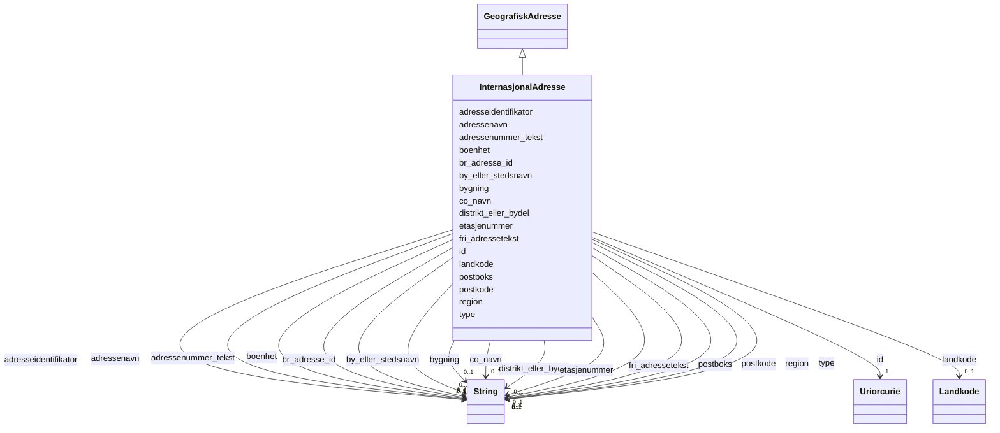

# Class: InternasjonalAdresse 


_Ei adresse i eit anna land enn Noreg, i fri form._


URI: [brreg_felles_adresse:InternasjonalAdresse](https://data.norge.no/felles/brreg-felles-adresse/InternasjonalAdresse)




!!! note "Om diagrammet"
    Klikk på attributt-radene i klasseboksen ovanfor opnar same side som
    klassenavnet — Mermaid sin `classDiagram`-syntaks støttar berre éin
    klikkbar lenkje per klasseboks, ikkje éin per attributt (BUG-14).
    `## Eigenskapar`-tabellen lenger nede på sida er fasiten for
    slot-spesifikke lenkjer.


## Inheritance
* [GeografiskAdresse](geografiskadresse.md)
    * **InternasjonalAdresse**


## Class Properties

| Property | Value |
| --- | --- |
| Class URI | [brreg_felles_adresse:InternasjonalAdresse](https://data.norge.no/felles/brreg-felles-adresse/InternasjonalAdresse) |

## Eigenskapar

### Andre

| Navn | Kardinalitet og domene | Beskriving |
| --- | --- | --- |
| [adressenavn](adressenavn.md) | 0..1 <br/> [xsd:string](http://www.w3.org/2001/XMLSchema#string) | Namnet på vegen/gata/staden. |
| [adressenummer_tekst](adressenummer_tekst.md) | 0..1 <br/> [xsd:string](http://www.w3.org/2001/XMLSchema#string) | Adressenummer som fritekst (ikkje strukturert som Adressenummer-klassen, sidan format varierer mellom land). |
| [bygning](bygning.md) | 0..1 <br/> [xsd:string](http://www.w3.org/2001/XMLSchema#string) | Bygningsnamn eller -nummer. |
| [etasjenummer](etasjenummer.md) | 0..1 <br/> [xsd:string](http://www.w3.org/2001/XMLSchema#string) | Etasjenummer. |
| [boenhet](boenhet.md) | 0..1 <br/> [xsd:string](http://www.w3.org/2001/XMLSchema#string) | Bueining/leilegheitsnummer. |
| [postboks](postboks.md) | 0..1 <br/> [xsd:string](http://www.w3.org/2001/XMLSchema#string) | Postboksnummer (utanlandsk format). |
| [postkode](postkode.md) | 0..1 <br/> [xsd:string](http://www.w3.org/2001/XMLSchema#string) | Utanlandsk postkode (ikkje norsk postnummer). |
| [by_eller_stedsnavn](by_eller_stedsnavn.md) | 0..1 <br/> [xsd:string](http://www.w3.org/2001/XMLSchema#string) | By- eller stadnamn. |
| [region](region.md) | 0..1 <br/> [xsd:string](http://www.w3.org/2001/XMLSchema#string) | Region, delstat eller provins. |
| [distrikt_eller_bydel](distrikt_eller_bydel.md) | 0..1 <br/> [xsd:string](http://www.w3.org/2001/XMLSchema#string) | Distrikt eller bydel. |
| [landkode](landkode.md) | 0..1 <br/> [Landkode](landkode.md) | Landet adressa ligg i. |
| [fri_adressetekst](fri_adressetekst.md) | 0..1 <br/> [xsd:string](http://www.w3.org/2001/XMLSchema#string) | Heile adressa som fritekst, når ho ikkje kan strukturerast i felta over. |
| [adresseidentifikator](adresseidentifikator.md) | 0..1 <br/> [xsd:string](http://www.w3.org/2001/XMLSchema#string) | Ein ekstern identifikator for adressa (t.d. frå eit utanlandsk adresseregister). |


### Arva

| Navn | Kardinalitet og domene | Beskriving | Frå |
| --- | --- | --- | --- |
| [id](id.md) | 1 <br/> [xsd:anyURI](http://www.w3.org/2001/XMLSchema#anyURI) | URI-identifikator for ressursen. | [GeografiskAdresse](geografiskadresse.md) |
| [br_adresse_id](br_adresse_id.md) | 0..1 <br/> [xsd:string](http://www.w3.org/2001/XMLSchema#string) | BR sin interne identifikator for adressa. | [GeografiskAdresse](geografiskadresse.md) |
| [co_navn](co_navn.md) | 0..1 <br/> [xsd:string](http://www.w3.org/2001/XMLSchema#string) | C/O-namn (omsorgsperson/-verksemd) knytt til adressa. | [GeografiskAdresse](geografiskadresse.md) |
| [type](type.md) | 0..1 <br/> [xsd:string](http://www.w3.org/2001/XMLSchema#string) | Diskriminator for kva slag geografisk adresse dette er. | [GeografiskAdresse](geografiskadresse.md) |


## Identifier and Mapping Information


### Schema Source


* from schema: https://data.norge.no/felles/brreg-felles-adresse


## Mappings

| Mapping Type | Mapped Value |
| ---  | ---  |
| self | brreg_felles_adresse:InternasjonalAdresse |
| native | https://data.norge.no/felles/brreg-felles-adresse/InternasjonalAdresse |


## LinkML Source

<!-- TODO: investigate https://stackoverflow.com/questions/37606292/how-to-create-tabbed-code-blocks-in-mkdocs-or-sphinx -->

### Direct

<details>
```yaml
name: InternasjonalAdresse
description: Ei adresse i eit anna land enn Noreg, i fri form.
from_schema: https://data.norge.no/felles/brreg-felles-adresse
is_a: GeografiskAdresse
slots:
- adressenavn
- adressenummer_tekst
- bygning
- etasjenummer
- boenhet
- postboks
- postkode
- by_eller_stedsnavn
- region
- distrikt_eller_bydel
- landkode
- fri_adressetekst
- adresseidentifikator
slot_usage:
  adressenummer_tekst:
    name: adressenummer_tekst
    description: Adressenummer som fritekst (ikkje strukturert som Adressenummer-klassen,
      sidan format varierer mellom land).
class_uri: brreg_felles_adresse:InternasjonalAdresse

```
</details>

### Induced

<details>
```yaml
name: InternasjonalAdresse
description: Ei adresse i eit anna land enn Noreg, i fri form.
from_schema: https://data.norge.no/felles/brreg-felles-adresse
is_a: GeografiskAdresse
slot_usage:
  adressenummer_tekst:
    name: adressenummer_tekst
    description: Adressenummer som fritekst (ikkje strukturert som Adressenummer-klassen,
      sidan format varierer mellom land).
attributes:
  adressenavn:
    name: adressenavn
    description: Namnet på vegen/gata/staden.
    from_schema: https://data.norge.no/felles/brreg-felles-adresse
    slot_uri: brreg_felles_adresse:adressenavn
    owner: InternasjonalAdresse
    domain_of:
    - Vegadresse
    - InternasjonalAdresse
    range: string
  adressenummer_tekst:
    name: adressenummer_tekst
    description: Adressenummer som fritekst (ikkje strukturert som Adressenummer-klassen,
      sidan format varierer mellom land).
    from_schema: https://data.norge.no/felles/brreg-felles-adresse
    slot_uri: brreg_felles_adresse:adressenummerTekst
    owner: InternasjonalAdresse
    domain_of:
    - InternasjonalAdresse
    range: string
  bygning:
    name: bygning
    description: Bygningsnamn eller -nummer.
    from_schema: https://data.norge.no/felles/brreg-felles-adresse
    slot_uri: brreg_felles_adresse:bygning
    owner: InternasjonalAdresse
    domain_of:
    - InternasjonalAdresse
    range: string
  etasjenummer:
    name: etasjenummer
    description: Etasjenummer.
    from_schema: https://data.norge.no/felles/brreg-felles-adresse
    slot_uri: brreg_felles_adresse:etasjenummer
    owner: InternasjonalAdresse
    domain_of:
    - InternasjonalAdresse
    range: string
  boenhet:
    name: boenhet
    description: Bueining/leilegheitsnummer.
    from_schema: https://data.norge.no/felles/brreg-felles-adresse
    slot_uri: brreg_felles_adresse:boenhet
    owner: InternasjonalAdresse
    domain_of:
    - InternasjonalAdresse
    range: string
  postboks:
    name: postboks
    description: Postboksnummer (utanlandsk format).
    from_schema: https://data.norge.no/felles/brreg-felles-adresse
    slot_uri: brreg_felles_adresse:postboks
    owner: InternasjonalAdresse
    domain_of:
    - InternasjonalAdresse
    range: string
  postkode:
    name: postkode
    description: Utanlandsk postkode (ikkje norsk postnummer).
    from_schema: https://data.norge.no/felles/brreg-felles-adresse
    slot_uri: brreg_felles_adresse:postkode
    owner: InternasjonalAdresse
    domain_of:
    - InternasjonalAdresse
    range: string
  by_eller_stedsnavn:
    name: by_eller_stedsnavn
    description: By- eller stadnamn.
    from_schema: https://data.norge.no/felles/brreg-felles-adresse
    slot_uri: brreg_felles_adresse:byEllerStedsnavn
    owner: InternasjonalAdresse
    domain_of:
    - InternasjonalAdresse
    range: string
  region:
    name: region
    description: Region, delstat eller provins.
    from_schema: https://data.norge.no/felles/brreg-felles-adresse
    slot_uri: brreg_felles_adresse:region
    owner: InternasjonalAdresse
    domain_of:
    - InternasjonalAdresse
    range: string
  distrikt_eller_bydel:
    name: distrikt_eller_bydel
    description: Distrikt eller bydel.
    from_schema: https://data.norge.no/felles/brreg-felles-adresse
    slot_uri: brreg_felles_adresse:distriktEllerBydel
    owner: InternasjonalAdresse
    domain_of:
    - InternasjonalAdresse
    range: string
  landkode:
    name: landkode
    description: Landet adressa ligg i.
    from_schema: https://data.norge.no/felles/brreg-felles-adresse
    slot_uri: brreg_felles_adresse:landkode
    owner: InternasjonalAdresse
    domain_of:
    - InternasjonalAdresse
    range: Landkode
  fri_adressetekst:
    name: fri_adressetekst
    description: Heile adressa som fritekst, når ho ikkje kan strukturerast i felta
      over.
    from_schema: https://data.norge.no/felles/brreg-felles-adresse
    slot_uri: brreg_felles_adresse:friAdressetekst
    owner: InternasjonalAdresse
    domain_of:
    - InternasjonalAdresse
    range: string
  adresseidentifikator:
    name: adresseidentifikator
    description: Ein ekstern identifikator for adressa (t.d. frå eit utanlandsk adresseregister).
    from_schema: https://data.norge.no/felles/brreg-felles-adresse
    slot_uri: brreg_felles_adresse:adresseidentifikator
    owner: InternasjonalAdresse
    domain_of:
    - InternasjonalAdresse
    range: string
  id:
    name: id
    description: URI-identifikator for ressursen.
    from_schema: https://data.norge.no/felles/brreg-felles-adresse
    identifier: true
    owner: InternasjonalAdresse
    domain_of:
    - GeografiskAdresse
    - DigitalAdresse
    - Poststed
    - Kommune
    - Fylke
    - Matrikkelnummer
    - Adressenummer
    - Aktoer
    - Kontaktinformasjon
    - Rolle
    - Rolletypegruppe
    - Relasjon
    - Personnavn
    - Personidentifikator
    - Virksomhetsidentifikator
    range: uriorcurie
    required: true
  br_adresse_id:
    name: br_adresse_id
    description: BR sin interne identifikator for adressa.
    from_schema: https://data.norge.no/felles/brreg-felles-adresse
    slot_uri: brreg_felles_adresse:brAdresseId
    owner: InternasjonalAdresse
    domain_of:
    - GeografiskAdresse
    range: string
  co_navn:
    name: co_navn
    description: C/O-namn (omsorgsperson/-verksemd) knytt til adressa.
    from_schema: https://data.norge.no/felles/brreg-felles-adresse
    slot_uri: brreg_felles_adresse:coNavn
    owner: InternasjonalAdresse
    domain_of:
    - GeografiskAdresse
    range: string
  type:
    name: type
    description: Diskriminator for kva slag geografisk adresse dette er.
    from_schema: https://data.norge.no/felles/brreg-felles-adresse
    slot_uri: brreg_felles_adresse:type
    owner: InternasjonalAdresse
    domain_of:
    - GeografiskAdresse
    - DigitalAdresse
    - Rolle
    - Rolletypegruppe
    - Relasjon
    range: string
class_uri: brreg_felles_adresse:InternasjonalAdresse

```
</details>