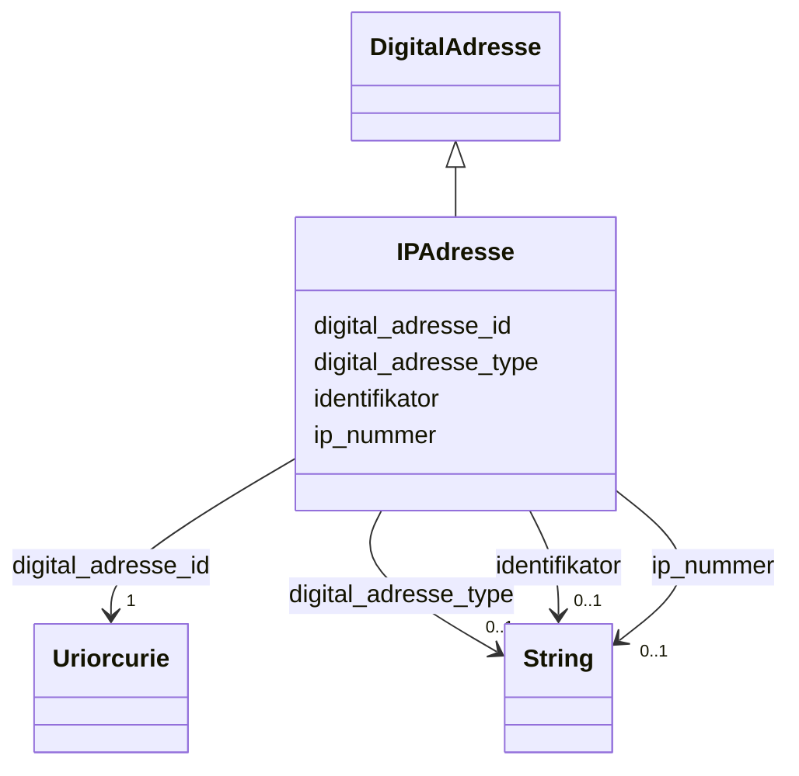

# Class: IPAdresse 


_Ei IP-adresse._


URI: [brreg_felles_digital_adresse:IPAdresse](https://data.norge.no/felles/brreg-felles-digital-adresse/IPAdresse)




!!! note "Om diagrammet"
    Klikk på attributt-radene i klasseboksen ovanfor opnar same side som
    klassenavnet — Mermaid sin `classDiagram`-syntaks støttar berre éin
    klikkbar lenkje per klasseboks, ikkje éin per attributt (BUG-14).
    `## Eigenskapar`-tabellen lenger nede på sida er fasiten for
    slot-spesifikke lenkjer.


## Inheritance
* [DigitalAdresse](digitaladresse.md)
    * **IPAdresse**


## Class Properties

| Property | Value |
| --- | --- |
| Class URI | [brreg_felles_digital_adresse:IPAdresse](https://data.norge.no/felles/brreg-felles-digital-adresse/IPAdresse) |

## Eigenskapar

### Andre

| Navn | Kardinalitet og domene | Beskriving |
| --- | --- | --- |
| [ip_nummer](ip_nummer.md) | 0..1 <br/> [xsd:string](http://www.w3.org/2001/XMLSchema#string) | IP-nummeret. |


### Arva

| Navn | Kardinalitet og domene | Beskriving | Frå |
| --- | --- | --- | --- |
| [digital_adresse_id](digital_adresse_id.md) | 1 <br/> [xsd:anyURI](http://www.w3.org/2001/XMLSchema#anyURI) | URI-identifikator for ressursen. | [DigitalAdresse](digitaladresse.md) |
| [identifikator](identifikator.md) | 0..1 <br/> [xsd:string](http://www.w3.org/2001/XMLSchema#string) | Identifikator for den digitale adressa (form varierer per undertype). | [DigitalAdresse](digitaladresse.md) |
| [digital_adresse_type](digital_adresse_type.md) | 0..1 <br/> [xsd:string](http://www.w3.org/2001/XMLSchema#string) | Diskriminator for kva slag digital adresse dette er. | [DigitalAdresse](digitaladresse.md) |


## Identifier and Mapping Information


### Schema Source


* from schema: https://data.norge.no/felles/brreg-felles-digital-adresse


## Mappings

| Mapping Type | Mapped Value |
| ---  | ---  |
| self | brreg_felles_digital_adresse:IPAdresse |
| native | https://data.norge.no/felles/brreg-felles-digital-adresse/IPAdresse |


## LinkML Source

<!-- TODO: investigate https://stackoverflow.com/questions/37606292/how-to-create-tabbed-code-blocks-in-mkdocs-or-sphinx -->

### Direct

<details>
```yaml
name: IPAdresse
description: Ei IP-adresse.
from_schema: https://data.norge.no/felles/brreg-felles-digital-adresse
is_a: DigitalAdresse
slots:
- ip_nummer
slot_usage:
  ip_nummer:
    name: ip_nummer
    description: IP-nummeret.
class_uri: brreg_felles_digital_adresse:IPAdresse

```
</details>

### Induced

<details>
```yaml
name: IPAdresse
description: Ei IP-adresse.
from_schema: https://data.norge.no/felles/brreg-felles-digital-adresse
is_a: DigitalAdresse
slot_usage:
  ip_nummer:
    name: ip_nummer
    description: IP-nummeret.
attributes:
  ip_nummer:
    name: ip_nummer
    description: IP-nummeret.
    from_schema: https://data.norge.no/felles/brreg-felles-digital-adresse
    slot_uri: brreg_felles_digital_adresse:ipNummer
    owner: IPAdresse
    domain_of:
    - IPAdresse
    range: string
  digital_adresse_id:
    name: digital_adresse_id
    description: URI-identifikator for ressursen.
    from_schema: https://data.norge.no/felles/brreg-felles-digital-adresse
    slot_uri: brreg_felles_digital_adresse:id
    identifier: true
    alias: id
    owner: IPAdresse
    domain_of:
    - DigitalAdresse
    range: uriorcurie
    required: true
  identifikator:
    name: identifikator
    description: Identifikator for den digitale adressa (form varierer per undertype).
    from_schema: https://data.norge.no/felles/brreg-felles-digital-adresse
    slot_uri: brreg_felles_digital_adresse:identifikator
    owner: IPAdresse
    domain_of:
    - DigitalAdresse
    - Aktoer
    range: string
  digital_adresse_type:
    name: digital_adresse_type
    description: Diskriminator for kva slag digital adresse dette er.
    from_schema: https://data.norge.no/felles/brreg-felles-digital-adresse
    slot_uri: brreg_felles_digital_adresse:type
    alias: type
    owner: IPAdresse
    domain_of:
    - DigitalAdresse
    range: string
class_uri: brreg_felles_digital_adresse:IPAdresse

```
</details>