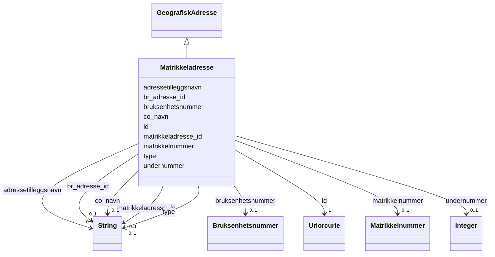

# Class: Matrikkeladresse 


_Ei matrikkeladresse (knytt til eit matrikkelnummer)._


URI: [brreg_felles_geografisk_adresse:Matrikkeladresse](https://data.norge.no/felles/brreg-felles-geografisk-adresse/Matrikkeladresse)




!!! note "Om diagrammet"
    Klikk på attributt-radene i klasseboksen ovanfor opnar same side som
    klassenavnet — Mermaid sin `classDiagram`-syntaks støttar berre éin
    klikkbar lenkje per klasseboks, ikkje éin per attributt (BUG-14).
    `## Eigenskapar`-tabellen lenger nede på sida er fasiten for
    slot-spesifikke lenkjer.


## Inheritance
* [GeografiskAdresse](geografiskadresse.md)
    * **Matrikkeladresse**


## Class Properties

| Property | Value |
| --- | --- |
| Class URI | [brreg_felles_geografisk_adresse:Matrikkeladresse](https://data.norge.no/felles/brreg-felles-geografisk-adresse/Matrikkeladresse) |

## Eigenskapar

### Andre

| Navn | Kardinalitet og domene | Beskriving |
| --- | --- | --- |
| [matrikkeladresse_id](matrikkeladresse_id.md) | 0..1 <br/> [xsd:string](http://www.w3.org/2001/XMLSchema#string) | BR sin interne identifikator for matrikkeladressa. |
| [bruksenhetsnummer](bruksenhetsnummer.md) | 0..1 <br/> [Bruksenhetsnummer](bruksenhetsnummer.md) | Bruksenhetsnummer (bustadnummer) i adressa, t.d. "H0101". |
| [adressetilleggsnavn](adressetilleggsnavn.md) | 0..1 <br/> [xsd:string](http://www.w3.org/2001/XMLSchema#string) | Tilleggsnamn til adressa (t.d. stadnamn i tillegg til vegadresse). |
| [matrikkelnummer](matrikkelnummer.md) | 0..1 <br/> [Matrikkelnummer](matrikkelnummer.md) | Matrikkelnummeret adressa er knytt til. |
| [undernummer](undernummer.md) | 0..1 <br/> [xsd:integer](http://www.w3.org/2001/XMLSchema#integer) | Undernummer for seksjonert eigedom. |


### Arva

| Navn | Kardinalitet og domene | Beskriving | Frå |
| --- | --- | --- | --- |
| [id](id.md) | 1 <br/> [xsd:anyURI](http://www.w3.org/2001/XMLSchema#anyURI) | URI-identifikator for ressursen. | [GeografiskAdresse](geografiskadresse.md) |
| [br_adresse_id](br_adresse_id.md) | 0..1 <br/> [xsd:string](http://www.w3.org/2001/XMLSchema#string) | BR sin interne identifikator for adressa. | [GeografiskAdresse](geografiskadresse.md) |
| [co_navn](co_navn.md) | 0..1 <br/> [xsd:string](http://www.w3.org/2001/XMLSchema#string) | C/O-namn (omsorgsperson/-verksemd) knytt til adressa. | [GeografiskAdresse](geografiskadresse.md) |
| [type](type.md) | 0..1 <br/> [xsd:string](http://www.w3.org/2001/XMLSchema#string) | Diskriminator for kva slag geografisk adresse dette er. | [GeografiskAdresse](geografiskadresse.md) |


## Identifier and Mapping Information


### Schema Source


* from schema: https://data.norge.no/felles/brreg-felles-geografisk-adresse


## Mappings

| Mapping Type | Mapped Value |
| ---  | ---  |
| self | brreg_felles_geografisk_adresse:Matrikkeladresse |
| native | https://data.norge.no/felles/brreg-felles-geografisk-adresse/Matrikkeladresse |


## LinkML Source

<!-- TODO: investigate https://stackoverflow.com/questions/37606292/how-to-create-tabbed-code-blocks-in-mkdocs-or-sphinx -->

### Direct

<details>
```yaml
name: Matrikkeladresse
description: Ei matrikkeladresse (knytt til eit matrikkelnummer).
from_schema: https://data.norge.no/felles/brreg-felles-geografisk-adresse
is_a: GeografiskAdresse
slots:
- matrikkeladresse_id
- bruksenhetsnummer
- adressetilleggsnavn
- matrikkelnummer
- undernummer
slot_usage:
  matrikkeladresse_id:
    name: matrikkeladresse_id
    description: BR sin interne identifikator for matrikkeladressa.
class_uri: brreg_felles_geografisk_adresse:Matrikkeladresse

```
</details>

### Induced

<details>
```yaml
name: Matrikkeladresse
description: Ei matrikkeladresse (knytt til eit matrikkelnummer).
from_schema: https://data.norge.no/felles/brreg-felles-geografisk-adresse
is_a: GeografiskAdresse
slot_usage:
  matrikkeladresse_id:
    name: matrikkeladresse_id
    description: BR sin interne identifikator for matrikkeladressa.
attributes:
  matrikkeladresse_id:
    name: matrikkeladresse_id
    description: BR sin interne identifikator for matrikkeladressa.
    from_schema: https://data.norge.no/felles/brreg-felles-geografisk-adresse
    slot_uri: brreg_felles_geografisk_adresse:matrikkeladresseId
    owner: Matrikkeladresse
    domain_of:
    - Matrikkeladresse
    range: string
  bruksenhetsnummer:
    name: bruksenhetsnummer
    description: Bruksenhetsnummer (bustadnummer) i adressa, t.d. "H0101".
    from_schema: https://data.norge.no/felles/brreg-felles-geografisk-adresse
    slot_uri: brreg_felles_geografisk_adresse:bruksenhetsnummer
    owner: Matrikkeladresse
    domain_of:
    - Vegadresse
    - Matrikkeladresse
    range: Bruksenhetsnummer
  adressetilleggsnavn:
    name: adressetilleggsnavn
    description: Tilleggsnamn til adressa (t.d. stadnamn i tillegg til vegadresse).
    from_schema: https://data.norge.no/felles/brreg-felles-geografisk-adresse
    slot_uri: brreg_felles_geografisk_adresse:adressetilleggsnavn
    owner: Matrikkeladresse
    domain_of:
    - Vegadresse
    - Matrikkeladresse
    range: string
  matrikkelnummer:
    name: matrikkelnummer
    description: Matrikkelnummeret adressa er knytt til.
    from_schema: https://data.norge.no/felles/brreg-felles-geografisk-adresse
    slot_uri: brreg_felles_geografisk_adresse:matrikkelnummer
    owner: Matrikkeladresse
    domain_of:
    - Matrikkeladresse
    range: Matrikkelnummer
  undernummer:
    name: undernummer
    description: Undernummer for seksjonert eigedom.
    from_schema: https://data.norge.no/felles/brreg-felles-geografisk-adresse
    slot_uri: brreg_felles_geografisk_adresse:undernummer
    owner: Matrikkeladresse
    domain_of:
    - Matrikkeladresse
    range: integer
  id:
    name: id
    description: URI-identifikator for ressursen.
    from_schema: https://data.norge.no/felles/brreg-felles-geografisk-adresse
    identifier: true
    owner: Matrikkeladresse
    domain_of:
    - GeografiskAdresse
    - Poststed
    - Kommune
    - Fylke
    - Matrikkelnummer
    - Adressenummer
    - Aktoer
    - Kontaktinformasjon
    - Rolle
    - Rolletypegruppe
    - Relasjon
    - Personnavn
    - Personidentifikator
    - Virksomhetsidentifikator
    range: uriorcurie
    required: true
  br_adresse_id:
    name: br_adresse_id
    description: BR sin interne identifikator for adressa.
    from_schema: https://data.norge.no/felles/brreg-felles-geografisk-adresse
    slot_uri: brreg_felles_geografisk_adresse:brAdresseId
    owner: Matrikkeladresse
    domain_of:
    - GeografiskAdresse
    range: string
  co_navn:
    name: co_navn
    description: C/O-namn (omsorgsperson/-verksemd) knytt til adressa.
    from_schema: https://data.norge.no/felles/brreg-felles-geografisk-adresse
    slot_uri: brreg_felles_geografisk_adresse:coNavn
    owner: Matrikkeladresse
    domain_of:
    - GeografiskAdresse
    range: string
  type:
    name: type
    description: Diskriminator for kva slag geografisk adresse dette er.
    from_schema: https://data.norge.no/felles/brreg-felles-geografisk-adresse
    slot_uri: brreg_felles_geografisk_adresse:type
    owner: Matrikkeladresse
    domain_of:
    - GeografiskAdresse
    - Rolle
    - Rolletypegruppe
    - Relasjon
    range: string
class_uri: brreg_felles_geografisk_adresse:Matrikkeladresse

```
</details>