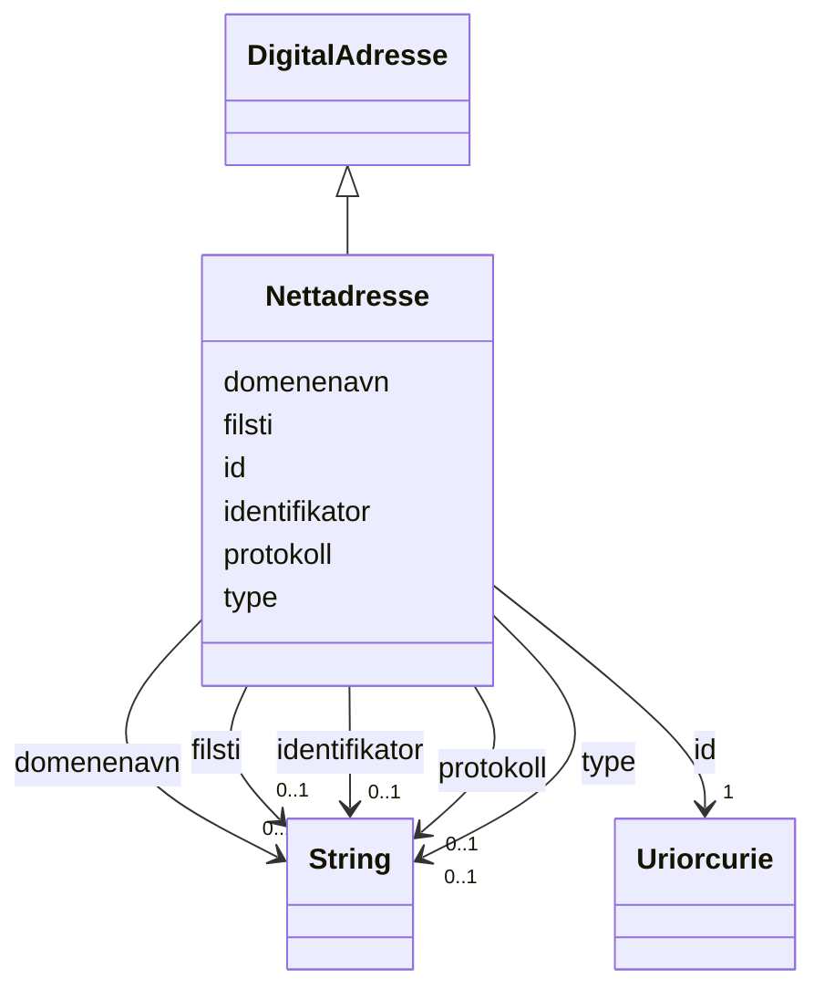

# Class: Nettadresse 


_Ei nettadresse (protokoll, domenenavn og filsti)._


URI: [brreg_felles_adresse:Nettadresse](https://data.norge.no/felles/brreg-felles-adresse/Nettadresse)




!!! note "Om diagrammet"
    Klikk på attributt-radene i klasseboksen ovanfor opnar same side som
    klassenavnet — Mermaid sin `classDiagram`-syntaks støttar berre éin
    klikkbar lenkje per klasseboks, ikkje éin per attributt (BUG-14).
    `## Eigenskapar`-tabellen lenger nede på sida er fasiten for
    slot-spesifikke lenkjer.


## Inheritance
* [DigitalAdresse](digitaladresse.md)
    * **Nettadresse**


## Class Properties

| Property | Value |
| --- | --- |
| Class URI | [brreg_felles_adresse:Nettadresse](https://data.norge.no/felles/brreg-felles-adresse/Nettadresse) |

## Eigenskapar

### Andre

| Navn | Kardinalitet og domene | Beskriving |
| --- | --- | --- |
| [protokoll](protokoll.md) | 0..1 <br/> [xsd:string](http://www.w3.org/2001/XMLSchema#string) | Protokollen for nettadressa, t.d. https. |
| [domenenavn](domenenavn.md) | 0..1 <br/> [xsd:string](http://www.w3.org/2001/XMLSchema#string) | Domenenamnet i adressa. |
| [filsti](filsti.md) | 0..1 <br/> [xsd:string](http://www.w3.org/2001/XMLSchema#string) | Filstien i nettadressa. |


### Arva

| Navn | Kardinalitet og domene | Beskriving | Frå |
| --- | --- | --- | --- |
| [id](id.md) | 1 <br/> [xsd:anyURI](http://www.w3.org/2001/XMLSchema#anyURI) | URI-identifikator for ressursen. | [DigitalAdresse](digitaladresse.md) |
| [identifikator](identifikator.md) | 0..1 <br/> [xsd:string](http://www.w3.org/2001/XMLSchema#string) | Identifikator for den digitale adressa (form varierer per undertype). | [DigitalAdresse](digitaladresse.md) |
| [type](type.md) | 0..1 <br/> [xsd:string](http://www.w3.org/2001/XMLSchema#string) | Diskriminator for kva slag digital adresse dette er. | [DigitalAdresse](digitaladresse.md) |


## Identifier and Mapping Information


### Schema Source


* from schema: https://data.norge.no/felles/brreg-felles-adresse


## Mappings

| Mapping Type | Mapped Value |
| ---  | ---  |
| self | brreg_felles_adresse:Nettadresse |
| native | https://data.norge.no/felles/brreg-felles-adresse/Nettadresse |


## LinkML Source

<!-- TODO: investigate https://stackoverflow.com/questions/37606292/how-to-create-tabbed-code-blocks-in-mkdocs-or-sphinx -->

### Direct

<details>
```yaml
name: Nettadresse
description: Ei nettadresse (protokoll, domenenavn og filsti).
from_schema: https://data.norge.no/felles/brreg-felles-adresse
is_a: DigitalAdresse
slots:
- protokoll
- domenenavn
- filsti
class_uri: brreg_felles_adresse:Nettadresse

```
</details>

### Induced

<details>
```yaml
name: Nettadresse
description: Ei nettadresse (protokoll, domenenavn og filsti).
from_schema: https://data.norge.no/felles/brreg-felles-adresse
is_a: DigitalAdresse
attributes:
  protokoll:
    name: protokoll
    description: Protokollen for nettadressa, t.d. https.
    from_schema: https://data.norge.no/felles/brreg-felles-adresse
    slot_uri: brreg_felles_adresse:protokoll
    owner: Nettadresse
    domain_of:
    - Nettadresse
    range: string
  domenenavn:
    name: domenenavn
    description: Domenenamnet i adressa.
    from_schema: https://data.norge.no/felles/brreg-felles-adresse
    slot_uri: brreg_felles_adresse:domenenavn
    owner: Nettadresse
    domain_of:
    - EPostadresse
    - Nettadresse
    range: string
  filsti:
    name: filsti
    description: Filstien i nettadressa.
    from_schema: https://data.norge.no/felles/brreg-felles-adresse
    slot_uri: brreg_felles_adresse:filsti
    owner: Nettadresse
    domain_of:
    - Nettadresse
    range: string
  id:
    name: id
    description: URI-identifikator for ressursen.
    from_schema: https://data.norge.no/felles/brreg-felles-adresse
    identifier: true
    owner: Nettadresse
    domain_of:
    - GeografiskAdresse
    - DigitalAdresse
    - Poststed
    - Kommune
    - Fylke
    - Matrikkelnummer
    - Adressenummer
    - Aktoer
    - Kontaktinformasjon
    - Rolle
    - Rolletypegruppe
    - Relasjon
    - Personnavn
    - Personidentifikator
    - Virksomhetsidentifikator
    range: uriorcurie
    required: true
  identifikator:
    name: identifikator
    description: Identifikator for den digitale adressa (form varierer per undertype).
    from_schema: https://data.norge.no/felles/brreg-felles-adresse
    slot_uri: brreg_felles_adresse:identifikator
    owner: Nettadresse
    domain_of:
    - DigitalAdresse
    - Aktoer
    range: string
  type:
    name: type
    description: Diskriminator for kva slag digital adresse dette er.
    from_schema: https://data.norge.no/felles/brreg-felles-adresse
    slot_uri: brreg_felles_adresse:type
    owner: Nettadresse
    domain_of:
    - GeografiskAdresse
    - DigitalAdresse
    - Rolle
    - Rolletypegruppe
    - Relasjon
    range: string
class_uri: brreg_felles_adresse:Nettadresse

```
</details>