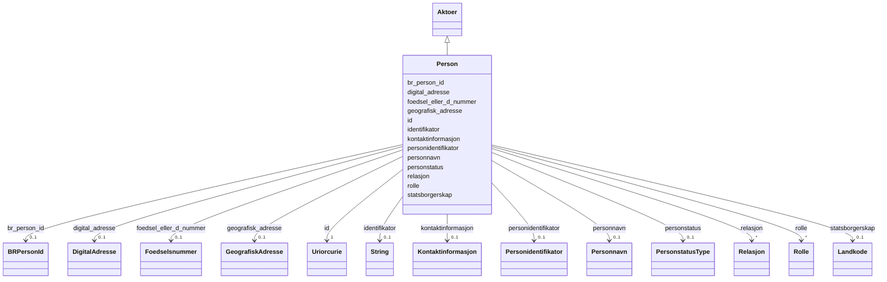

# Class: Person 


_Ein fysisk person._


URI: [foaf:Person](http://xmlns.com/foaf/0.1/Person)




!!! note "Om diagrammet"
    Klikk på attributt-radene i klasseboksen ovanfor opnar same side som
    klassenavnet — Mermaid sin `classDiagram`-syntaks støttar berre éin
    klikkbar lenkje per klasseboks, ikkje éin per attributt (BUG-14).
    `## Eigenskapar`-tabellen lenger nede på sida er fasiten for
    slot-spesifikke lenkjer.


## Inheritance
* [Aktoer](aktoer.md)
    * **Person**


## Class Properties

| Property | Value |
| --- | --- |
| Class URI | [foaf:Person](http://xmlns.com/foaf/0.1/Person) |

## Eigenskapar

### Andre

| Navn | Kardinalitet og domene | Beskriving |
| --- | --- | --- |
| [br_person_id](br_person_id.md) | 0..1 <br/> [BRPersonId](brpersonid.md) | BR sin interne identifikator for personen. |
| [personidentifikator](personidentifikator.md) | 0..1 <br/> [Personidentifikator](personidentifikator.md) | Identifikatoren for personen. |
| [foedsel_eller_d_nummer](foedsel_eller_d_nummer.md) | 0..1 <br/> [Foedselsnummer](foedselsnummer.md) | Fødselsnummeret eller D-nummeret til personen. |
| [personnavn](personnavn.md) | 0..1 <br/> [Personnavn](personnavn.md) | Namnet på personen. |
| [personstatus](personstatus.md) | 0..1 <br/> [PersonstatusType](personstatustype.md) | Statusen til personen. |
| [statsborgerskap](statsborgerskap.md) | 0..1 <br/> [Landkode](landkode.md) | Statsborgarskapet til personen. |


### Arva

| Navn | Kardinalitet og domene | Beskriving | Frå |
| --- | --- | --- | --- |
| [id](id.md) | 1 <br/> [xsd:anyURI](http://www.w3.org/2001/XMLSchema#anyURI) | URI-identifikator for ressursen. | [Aktoer](aktoer.md) |
| [geografisk_adresse](geografisk_adresse.md) | 0..1 <br/> [GeografiskAdresse](geografiskadresse.md) | Geografisk adresse knytt til aktøren/rolla. | [Aktoer](aktoer.md) |
| [kontaktinformasjon](kontaktinformasjon.md) | 0..1 <br/> [Kontaktinformasjon](kontaktinformasjon.md) | Kontaktinformasjon for aktøren/rolla. | [Aktoer](aktoer.md) |
| [rolle](rolle.md) | * <br/> [Rolle](rolle.md) | Roller aktøren har. | [Aktoer](aktoer.md) |
| [identifikator](identifikator.md) | 0..1 <br/> [xsd:string](http://www.w3.org/2001/XMLSchema#string) | Generisk identifikator (form varierer per samanheng — brukt både for digitale adresser og, via brreg-felles-aktoer, for aktørar generelt). | [Aktoer](aktoer.md) |
| [digital_adresse](digital_adresse.md) | 0..1 <br/> [DigitalAdresse](digitaladresse.md) | Digital adresse knytt til aktøren/rolla. | [Aktoer](aktoer.md) |
| [relasjon](relasjon.md) | * <br/> [Relasjon](relasjon.md) | Relasjonar aktøren har til andre aktørar. | [Aktoer](aktoer.md) |


## Identifier and Mapping Information


### Schema Source


* from schema: https://data.norge.no/felles/brreg-felles-aktoer


## Mappings

| Mapping Type | Mapped Value |
| ---  | ---  |
| self | foaf:Person |
| native | https://data.norge.no/felles/brreg-felles-aktoer/Person |


## LinkML Source

<!-- TODO: investigate https://stackoverflow.com/questions/37606292/how-to-create-tabbed-code-blocks-in-mkdocs-or-sphinx -->

### Direct

<details>
```yaml
name: Person
description: Ein fysisk person.
from_schema: https://data.norge.no/felles/brreg-felles-aktoer
rank: 1000
is_a: Aktoer
slots:
- br_person_id
- personidentifikator
- foedsel_eller_d_nummer
- personnavn
- personstatus
- statsborgerskap
class_uri: foaf:Person

```
</details>

### Induced

<details>
```yaml
name: Person
description: Ein fysisk person.
from_schema: https://data.norge.no/felles/brreg-felles-aktoer
rank: 1000
is_a: Aktoer
attributes:
  br_person_id:
    name: br_person_id
    description: BR sin interne identifikator for personen.
    from_schema: https://data.norge.no/felles/brreg-felles-aktoer
    slot_uri: brreg_felles_aktoer:brPersonId
    owner: Person
    domain_of:
    - Person
    range: BRPersonId
  personidentifikator:
    name: personidentifikator
    description: Identifikatoren for personen.
    from_schema: https://data.norge.no/felles/brreg-felles-aktoer
    slot_uri: brreg_felles_aktoer:personidentifikator
    owner: Person
    domain_of:
    - Person
    range: Personidentifikator
  foedsel_eller_d_nummer:
    name: foedsel_eller_d_nummer
    description: Fødselsnummeret eller D-nummeret til personen.
    from_schema: https://data.norge.no/felles/brreg-felles-aktoer
    slot_uri: brreg_felles_aktoer:foedselEllerDNummer
    owner: Person
    domain_of:
    - Person
    range: Foedselsnummer
  personnavn:
    name: personnavn
    description: Namnet på personen.
    from_schema: https://data.norge.no/felles/brreg-felles-aktoer
    slot_uri: brreg_felles_aktoer:personnavn
    owner: Person
    domain_of:
    - Person
    range: Personnavn
  personstatus:
    name: personstatus
    description: Statusen til personen.
    from_schema: https://data.norge.no/felles/brreg-felles-aktoer
    slot_uri: brreg_felles_aktoer:personstatus
    owner: Person
    domain_of:
    - Person
    range: PersonstatusType
  statsborgerskap:
    name: statsborgerskap
    description: Statsborgarskapet til personen.
    from_schema: https://data.norge.no/felles/brreg-felles-aktoer
    slot_uri: brreg_felles_aktoer:statsborgerskap
    owner: Person
    domain_of:
    - Person
    range: Landkode
  id:
    name: id
    description: URI-identifikator for ressursen.
    from_schema: https://data.norge.no/felles/brreg-felles-adresse
    identifier: true
    owner: Person
    domain_of:
    - GeografiskAdresse
    - DigitalAdresse
    - Poststed
    - Kommune
    - Fylke
    - Matrikkelnummer
    - Adressenummer
    - Aktoer
    - Kontaktinformasjon
    - Rolle
    - Rolletypegruppe
    - Relasjon
    - Personnavn
    - Personidentifikator
    - Virksomhetsidentifikator
    range: uriorcurie
    required: true
  geografisk_adresse:
    name: geografisk_adresse
    description: Geografisk adresse knytt til aktøren/rolla.
    from_schema: https://data.norge.no/felles/brreg-felles-aktoer
    slot_uri: brreg_felles_aktoer:geografiskAdresse
    owner: Person
    domain_of:
    - Aktoer
    - Kontaktinformasjon
    - Rolle
    range: GeografiskAdresse
  kontaktinformasjon:
    name: kontaktinformasjon
    description: Kontaktinformasjon for aktøren/rolla.
    from_schema: https://data.norge.no/felles/brreg-felles-aktoer
    slot_uri: brreg_felles_aktoer:kontaktinformasjon
    owner: Person
    domain_of:
    - Aktoer
    - Rolle
    range: Kontaktinformasjon
  rolle:
    name: rolle
    description: Roller aktøren har.
    from_schema: https://data.norge.no/felles/brreg-felles-aktoer
    slot_uri: brreg_felles_aktoer:rolle
    owner: Person
    domain_of:
    - Aktoer
    - Rolletypegruppe
    range: Rolle
    multivalued: true
  identifikator:
    name: identifikator
    description: Generisk identifikator (form varierer per samanheng — brukt både
      for digitale adresser og, via brreg-felles-aktoer, for aktørar generelt).
    from_schema: https://data.norge.no/felles/brreg-felles-adresse
    slot_uri: brreg_felles_adresse:identifikator
    owner: Person
    domain_of:
    - DigitalAdresse
    - Aktoer
    range: string
  digital_adresse:
    name: digital_adresse
    description: Digital adresse knytt til aktøren/rolla.
    from_schema: https://data.norge.no/felles/brreg-felles-aktoer
    slot_uri: brreg_felles_aktoer:digitalAdresse
    owner: Person
    domain_of:
    - Aktoer
    - Kontaktinformasjon
    - Rolle
    range: DigitalAdresse
  relasjon:
    name: relasjon
    description: Relasjonar aktøren har til andre aktørar.
    from_schema: https://data.norge.no/felles/brreg-felles-aktoer
    slot_uri: brreg_felles_aktoer:relasjon
    owner: Person
    domain_of:
    - Aktoer
    range: Relasjon
    multivalued: true
class_uri: foaf:Person

```
</details>