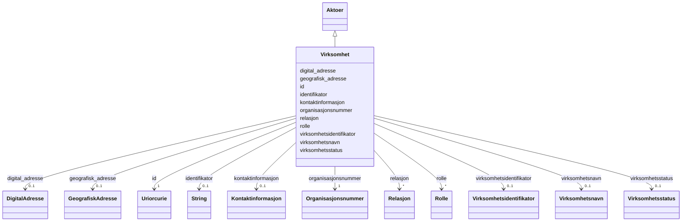

# Class: Virksomhet 


_Ei verksemd registrert i Einingsregisteret._


URI: [rov:RegisteredOrganization](http://www.w3.org/ns/regorg#RegisteredOrganization)




!!! note "Om diagrammet"
    Klikk på attributt-radene i klasseboksen ovanfor opnar same side som
    klassenavnet — Mermaid sin `classDiagram`-syntaks støttar berre éin
    klikkbar lenkje per klasseboks, ikkje éin per attributt (BUG-14).
    `## Eigenskapar`-tabellen lenger nede på sida er fasiten for
    slot-spesifikke lenkjer.


## Inheritance
* [Aktoer](aktoer.md)
    * **Virksomhet**


## Class Properties

| Property | Value |
| --- | --- |
| Class URI | [rov:RegisteredOrganization](http://www.w3.org/ns/regorg#RegisteredOrganization) |

## Eigenskapar

### Andre

| Navn | Kardinalitet og domene | Beskriving |
| --- | --- | --- |
| [virksomhetsidentifikator](virksomhetsidentifikator.md) | 0..1 <br/> [Virksomhetsidentifikator](virksomhetsidentifikator.md) | Identifikatoren for verksemda. |
| [virksomhetsnavn](virksomhetsnavn.md) | 0..1 <br/> [Virksomhetsnavn](virksomhetsnavn.md) | Namnet på verksemda. |
| [organisasjonsnummer](organisasjonsnummer.md) | 1 <br/> [Organisasjonsnummer](organisasjonsnummer.md) | Organisasjonsnummeret til verksemda. |
| [virksomhetsstatus](virksomhetsstatus.md) | 0..1 <br/> [Virksomhetsstatus](virksomhetsstatus.md) | Statusen til verksemda. |


### Arva

| Navn | Kardinalitet og domene | Beskriving | Frå |
| --- | --- | --- | --- |
| [id](id.md) | 1 <br/> [xsd:anyURI](http://www.w3.org/2001/XMLSchema#anyURI) | URI-identifikator for ressursen. | [Aktoer](aktoer.md) |
| [geografisk_adresse](geografisk_adresse.md) | 0..1 <br/> [GeografiskAdresse](geografiskadresse.md) | Geografisk adresse knytt til aktøren/rolla. | [Aktoer](aktoer.md) |
| [kontaktinformasjon](kontaktinformasjon.md) | 0..1 <br/> [Kontaktinformasjon](kontaktinformasjon.md) | Kontaktinformasjon for aktøren/rolla. | [Aktoer](aktoer.md) |
| [rolle](rolle.md) | * <br/> [Rolle](rolle.md) | Roller aktøren har. | [Aktoer](aktoer.md) |
| [identifikator](identifikator.md) | 0..1 <br/> [xsd:string](http://www.w3.org/2001/XMLSchema#string) | Generisk identifikator (form varierer per samanheng — brukt både for digitale adresser og, via brreg-felles-aktoer, for aktørar generelt). | [Aktoer](aktoer.md) |
| [digital_adresse](digital_adresse.md) | 0..1 <br/> [DigitalAdresse](digitaladresse.md) | Digital adresse knytt til aktøren/rolla. | [Aktoer](aktoer.md) |
| [relasjon](relasjon.md) | * <br/> [Relasjon](relasjon.md) | Relasjonar aktøren har til andre aktørar. | [Aktoer](aktoer.md) |


## Identifier and Mapping Information


### Schema Source


* from schema: https://data.norge.no/felles/brreg-felles-aktoer


## Mappings

| Mapping Type | Mapped Value |
| ---  | ---  |
| self | rov:RegisteredOrganization |
| native | https://data.norge.no/felles/brreg-felles-aktoer/Virksomhet |


## LinkML Source

<!-- TODO: investigate https://stackoverflow.com/questions/37606292/how-to-create-tabbed-code-blocks-in-mkdocs-or-sphinx -->

### Direct

<details>
```yaml
name: Virksomhet
description: Ei verksemd registrert i Einingsregisteret.
from_schema: https://data.norge.no/felles/brreg-felles-aktoer
rank: 1000
is_a: Aktoer
slots:
- virksomhetsidentifikator
- virksomhetsnavn
- organisasjonsnummer
- virksomhetsstatus
slot_usage:
  organisasjonsnummer:
    name: organisasjonsnummer
    required: true
class_uri: rov:RegisteredOrganization

```
</details>

### Induced

<details>
```yaml
name: Virksomhet
description: Ei verksemd registrert i Einingsregisteret.
from_schema: https://data.norge.no/felles/brreg-felles-aktoer
rank: 1000
is_a: Aktoer
slot_usage:
  organisasjonsnummer:
    name: organisasjonsnummer
    required: true
attributes:
  virksomhetsidentifikator:
    name: virksomhetsidentifikator
    description: Identifikatoren for verksemda.
    from_schema: https://data.norge.no/felles/brreg-felles-aktoer
    slot_uri: brreg_felles_aktoer:virksomhetsidentifikator
    owner: Virksomhet
    domain_of:
    - Virksomhet
    range: Virksomhetsidentifikator
  virksomhetsnavn:
    name: virksomhetsnavn
    description: Namnet på verksemda.
    from_schema: https://data.norge.no/felles/brreg-felles-aktoer
    slot_uri: brreg_felles_aktoer:virksomhetsnavn
    owner: Virksomhet
    domain_of:
    - Virksomhet
    range: Virksomhetsnavn
  organisasjonsnummer:
    name: organisasjonsnummer
    description: Organisasjonsnummeret til verksemda.
    from_schema: https://data.norge.no/felles/brreg-felles-aktoer
    slot_uri: brreg_felles_aktoer:organisasjonsnummer
    owner: Virksomhet
    domain_of:
    - Virksomhet
    range: Organisasjonsnummer
    required: true
  virksomhetsstatus:
    name: virksomhetsstatus
    description: Statusen til verksemda.
    from_schema: https://data.norge.no/felles/brreg-felles-aktoer
    slot_uri: brreg_felles_aktoer:virksomhetsstatus
    owner: Virksomhet
    domain_of:
    - Virksomhet
    range: Virksomhetsstatus
  id:
    name: id
    description: URI-identifikator for ressursen.
    from_schema: https://data.norge.no/felles/brreg-felles-adresse
    identifier: true
    owner: Virksomhet
    domain_of:
    - GeografiskAdresse
    - DigitalAdresse
    - Poststed
    - Kommune
    - Fylke
    - Matrikkelnummer
    - Adressenummer
    - Aktoer
    - Kontaktinformasjon
    - Rolle
    - Rolletypegruppe
    - Relasjon
    - Personnavn
    - Personidentifikator
    - Virksomhetsidentifikator
    range: uriorcurie
    required: true
  geografisk_adresse:
    name: geografisk_adresse
    description: Geografisk adresse knytt til aktøren/rolla.
    from_schema: https://data.norge.no/felles/brreg-felles-aktoer
    slot_uri: brreg_felles_aktoer:geografiskAdresse
    owner: Virksomhet
    domain_of:
    - Aktoer
    - Kontaktinformasjon
    - Rolle
    range: GeografiskAdresse
  kontaktinformasjon:
    name: kontaktinformasjon
    description: Kontaktinformasjon for aktøren/rolla.
    from_schema: https://data.norge.no/felles/brreg-felles-aktoer
    slot_uri: brreg_felles_aktoer:kontaktinformasjon
    owner: Virksomhet
    domain_of:
    - Aktoer
    - Rolle
    range: Kontaktinformasjon
  rolle:
    name: rolle
    description: Roller aktøren har.
    from_schema: https://data.norge.no/felles/brreg-felles-aktoer
    slot_uri: brreg_felles_aktoer:rolle
    owner: Virksomhet
    domain_of:
    - Aktoer
    - Rolletypegruppe
    range: Rolle
    multivalued: true
  identifikator:
    name: identifikator
    description: Generisk identifikator (form varierer per samanheng — brukt både
      for digitale adresser og, via brreg-felles-aktoer, for aktørar generelt).
    from_schema: https://data.norge.no/felles/brreg-felles-adresse
    slot_uri: brreg_felles_adresse:identifikator
    owner: Virksomhet
    domain_of:
    - DigitalAdresse
    - Aktoer
    range: string
  digital_adresse:
    name: digital_adresse
    description: Digital adresse knytt til aktøren/rolla.
    from_schema: https://data.norge.no/felles/brreg-felles-aktoer
    slot_uri: brreg_felles_aktoer:digitalAdresse
    owner: Virksomhet
    domain_of:
    - Aktoer
    - Kontaktinformasjon
    - Rolle
    range: DigitalAdresse
  relasjon:
    name: relasjon
    description: Relasjonar aktøren har til andre aktørar.
    from_schema: https://data.norge.no/felles/brreg-felles-aktoer
    slot_uri: brreg_felles_aktoer:relasjon
    owner: Virksomhet
    domain_of:
    - Aktoer
    range: Relasjon
    multivalued: true
class_uri: rov:RegisteredOrganization

```
</details>