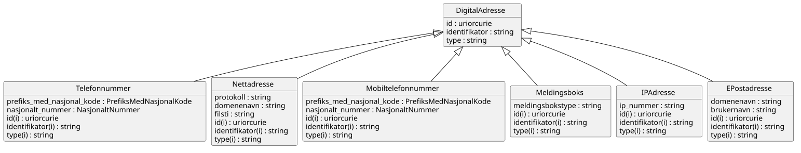

# brreg-felles-digital-adresse


## Om denne modellen

> Denne sida dokumenterer LinkML-modellen brreg-felles-digital-adresse, inkludert klasser, eigenskapar, datatypar, valideringsresultat og genererte artefakter. Informasjonen er generert automatisk frå skjemaet og tilhøyrande byggeproses.

<!--
Felles digitale adresseklassar utleia frå Brønnøysundregistrene (BR) sin
interne BRReferansemodell_v3. Meint for import frå oreg-domenet sine
enhetsregisteret-*-modellar og andre BR-registermodellar som treng same
adressestruktur — sjå
specs/done/felles-typar-enhetsregisteret-fra-br-katalogar.md for
bakgrunn og metode.
-->


---

## Kom i gang

> Her finn du døme på korleis du importerer, validerer og brukar modellen i eigne prosjekt.

### Importer i egne LinkML-skjema

```yaml
imports:
  - https://raw.githubusercontent.com/brreg/linkml-datamodellering-no/brreg-felles-digital-adresse-v0.1.0/src/linkml/felles/brreg-felles-digital-adresse/brreg-felles-digital-adresse-schema
```

### Valider skjemaet mot silver-policy

```bash
make mcp-linkml-valider-modell SCHEMA=src/linkml/felles/brreg-felles-digital-adresse/brreg-felles-digital-adresse-schema.yaml
```

### Valider datafil mot LinkML-skjemaet

```bash
make validate-instance SCHEMA=src/linkml/felles/brreg-felles-digital-adresse/brreg-felles-digital-adresse-schema.yaml INSTANCE=mine-data.yaml
```

### Java-bruk

```xml
<!-- pom.xml -->
<dependency>
    <groupId>org.projectlombok</groupId>
    <artifactId>lombok</artifactId>
    <version>1.18.34</version>
</dependency>
<dependency>
    <groupId>com.fasterxml.jackson.dataformat</groupId>
    <artifactId>jackson-dataformat-yaml</artifactId>
    <version>2.17.2</version>
</dependency>
```

```java
import java.io.File;
import com.fasterxml.jackson.databind.ObjectMapper;
import com.fasterxml.jackson.dataformat.yaml.YAMLFactory;
import no.norge.data.felles.brregfellesdigitaladresse.DigitalAdresse;

ObjectMapper mapper = new ObjectMapper(new YAMLFactory());
DigitalAdresse digital_adresse = mapper.readValue(new File("mine-data.yaml"), DigitalAdresse.class);
```


### Python-bruk

```bash
pip install linkml-runtime pyyaml
```

```python
from linkml_runtime.loaders import yaml_loader
from brreg_felles_digital_adresse_model import DigitalAdresse

digital_adresse = yaml_loader.load('mine-data.yaml', target_class=DigitalAdresse)
```


---

## Modellmetadata {#metadata}

> Modellmetadata viser sentrale metadata for modellen, inkludert versjon, status, lisens, identifikatorar og avhengigheiter. Verdiane er henta direkte frå skjemaet.

| Felt | Verdi |
| --- | --- |
| Name | brreg-felles-digital-adresse |
| Title | BRREG felles digital adresse |
| Description | Gjenbrukbare digitale adresseklassar utleia frå Brønnøysundregistrene (BR) sin interne BRReferansemodell_v3 (MagicDraw/XMI), pakken "Adresse" (DigitalAdresse-hierarkiet). Sjå specs/done/felles-typar-enhetsregisteret-fra-br-katalogar.md for bakgrunn, metode og avklaringane denne modellen byggjer på.
BR sin eigen `Nettadresse`-undertype "Aksesspunkt" er medvite utelaten her: feltet `aksesspunktoperatoer` peikar til `Virksomhet` (definert i brreg-felles-aktoer, som importerer denne modellen) og ville gjort importgrafen sirkulær. Sjå nemnde spec § Funn 4. |
| Schema URI | [https://data.norge.no/felles/brreg-felles-digital-adresse](https://data.norge.no/felles/brreg-felles-digital-adresse) |
| Versjon | 0.1.0 |
| Lisens | [https://data.norge.no/nlod/no/2.0](https://data.norge.no/nlod/no/2.0) |
| Utgiver | [https://data.norge.no/organizations/974760673](https://data.norge.no/organizations/974760673) |
| Status | [http://purl.org/adms/status/UnderDevelopment](http://purl.org/adms/status/UnderDevelopment) |
| Endringsdato | 2026-09-01 |
| Utgivelsesdato | 2026-09-01 |
| Imports | `linkml:types`<br>`../brreg-felles-typer/brreg-felles-typer-schema` |


---

## Avhengigheiter (2) {#avhengigheiter}

> Denne modellen importerer og gjenbruker komponentar frå andre skjema. 
> Importerte klasser og eigenskapar kan vere synlege i diagram, valideringsrapportar og andre analysar sjølv om dei ikkje blir lista som lokale element i denne modellen.

Dette skjemaet importerer følgjande skjema (direkte og transitivt):

```
linkml:types  # direkte import
└── brreg-felles-typer-schema  # direkte import
```

*Sjå [Importhierarki](../../arkitektur/importhierarki.md) for oversikt over heile repoet sitt importhierarki.*

*Importerte modeller: [linkml:types](https://github.com/linkml/linkml-model/blob/main/linkml_model/model/schema/types.yaml), [brreg-felles-typer](../brreg-felles-typer/#datamodell)*


---

## Entity-relationship diagram

> ER-diagrammet viser struktur og relasjonar mellom dei lokale klassane i modellen. Importerte klasser er som standard filtrerte bort for å gjere diagrammet enklare å lese.

[](diagrams/brreg-felles-digital-adresse-filtered.svg)

*Diagrammet viser kun lokale klasser. Klikk for å zoome. [Vis fullstendig diagram med importerte klasser](diagrams/brreg-felles-digital-adresse.svg).*

---

## Datamodell

> Dette er den autoritative kjelda for modellen. Alle tabellar, diagram og artefakt på denne sida er genererte frå dette skjemaet.

Kjelde-datamodell i LinkML-format: [`brreg-felles-digital-adresse-schema.yaml`](https://github.com/brreg/linkml-datamodellering-no/blob/main/src/linkml/felles/brreg-felles-digital-adresse/brreg-felles-digital-adresse-schema.yaml)

---

### Classes (7) {#classes}

> Classes viser klasser som er definerte lokalt i brreg-felles-digital-adresse modellen. 
> Klasser frå importerte modellar er ikkje inkluderte i teljinga, men kan vere refererte frå lokale klasser og kan inngå i valideringsresultat og diagram.  
> Klasser grupperes i Obligatorisk, Anbefalt, Valgfri og Andre (uklassifisert).

#### Andre (7)

| Class | Description |
| --- | --- |
| [DigitalAdresse](klasser/digitaladresse.md) | Ei digital adresse. Abstrakt basisklasse for dei konkrete digitale adressetypane under. |
| [EPostadresse](klasser/epostadresse.md) | Ei e-postadresse, delt opp i brukarnamn og domenenavn. |
| [IPAdresse](klasser/ipadresse.md) | Ei IP-adresse. |
| [Meldingsboks](klasser/meldingsboks.md) | Ei digital meldingsboks (t.d. Altinn). |
| [Mobiltelefonnummer](klasser/mobiltelefonnummer.md) | Eit mobiltelefonnummer. |
| [Nettadresse](klasser/nettadresse.md) | Ei nettadresse (protokoll, domenenavn og filsti). |
| [Telefonnummer](klasser/telefonnummer.md) | Eit fasttelefonnummer. |


---

### Slots (11) {#slots}

> Slots viser **eigenskapar** som er definert i eller brukt av lokale klasser i modellen.  
> Eigenskapar grupperes i "Verdiar" som inneheld data, og "Refransar" som refererer til andre klasser.  
> *Defined in* kolonna angir kildeskjemaet for eigenskapen.
#### Verdiar (11)

| Slot | Description | Defined in |
| --- | --- | --- |
| [brukernavn](klasser/brukernavn.md) | Brukarnamnet (lokaldelen) i e-postadressa. | [https://data.norge.no/felles/brreg-felles-digital-adresse](https://data.norge.no/felles/brreg-felles-digital-adresse) |
| [digital_adresse_id](klasser/digital_adresse_id.md) | URI-identifikator for ressursen. | [https://data.norge.no/felles/brreg-felles-digital-adresse](https://data.norge.no/felles/brreg-felles-digital-adresse) |
| [digital_adresse_type](klasser/digital_adresse_type.md) | Diskriminator for kva slag adresse dette er. | [https://data.norge.no/felles/brreg-felles-digital-adresse](https://data.norge.no/felles/brreg-felles-digital-adresse) |
| [domenenavn](klasser/domenenavn.md) | Domenenamnet i adressa. | [https://data.norge.no/felles/brreg-felles-digital-adresse](https://data.norge.no/felles/brreg-felles-digital-adresse) |
| [filsti](klasser/filsti.md) | Filstien i nettadressa. | [https://data.norge.no/felles/brreg-felles-digital-adresse](https://data.norge.no/felles/brreg-felles-digital-adresse) |
| [identifikator](klasser/identifikator.md) | Generisk identifikator (form varierer per samanheng — brukt både for digitale adresser og, via brreg-felles-aktoer, for aktørar generelt). | [https://data.norge.no/felles/brreg-felles-digital-adresse](https://data.norge.no/felles/brreg-felles-digital-adresse) |
| [ip_nummer](klasser/ip_nummer.md) | IP-nummeret. | [https://data.norge.no/felles/brreg-felles-digital-adresse](https://data.norge.no/felles/brreg-felles-digital-adresse) |
| [meldingsbokstype](klasser/meldingsbokstype.md) | Kva type digital meldingsboks dette er (t.d. Altinn). | [https://data.norge.no/felles/brreg-felles-digital-adresse](https://data.norge.no/felles/brreg-felles-digital-adresse) |
| [nasjonalt_nummer](klasser/nasjonalt_nummer.md) | Telefonnummeret utan landkode/prefiks. | [https://data.norge.no/felles/brreg-felles-digital-adresse](https://data.norge.no/felles/brreg-felles-digital-adresse) |
| [prefiks_med_nasjonal_kode](klasser/prefiks_med_nasjonal_kode.md) | Internasjonalt telefonprefiks (landkode), t.d. "+47". | [https://data.norge.no/felles/brreg-felles-digital-adresse](https://data.norge.no/felles/brreg-felles-digital-adresse) |
| [protokoll](klasser/protokoll.md) | Protokollen for nettadressa, t.d. https. | [https://data.norge.no/felles/brreg-felles-digital-adresse](https://data.norge.no/felles/brreg-felles-digital-adresse) |


---

### Enumerations (0) {#enumerations}

> Enumerations viser kontrollerte **verdiområder** som er definert i eller brukt lokalt i modellen.  
> *Defined in* kolonna angir kildeskjemaet for verdiområdet.


*Ingen enumerations definert lokalt eller brukt i denne modellen.*


---

### Types (4) {#types}

> Types viser primitive **verdiformat** som datoar, URI-ar, språkstrengar og andre grunnleggjande datatypar som er definert i eller brukt i modellen.  
> *Defined in* kolonna angir kildeskjemaet for verdiformatet.

| Type | URI | Description | Defined in |
| --- | --- | --- | --- |
| NasjonaltNummer | [xsd:string](https://www.w3.org/TR/xmlschema11-2/#string) | Telefonnummer utan landkode/prefiks. | [https://data.norge.no/felles/brreg-felles-typer](https://data.norge.no/felles/brreg-felles-typer) |
| PrefiksMedNasjonalKode | [xsd:string](https://www.w3.org/TR/xmlschema11-2/#string) | Internasjonalt telefonprefiks (landkode), t.d. "+47". | [https://data.norge.no/felles/brreg-felles-typer](https://data.norge.no/felles/brreg-felles-typer) |
| string | [xsd:string](https://www.w3.org/TR/xmlschema11-2/#string) | A character string | [linkml:types](https://github.com/linkml/linkml-model/blob/main/linkml_model/model/schema/types.yaml) |
| uriorcurie | [xsd:anyURI](https://www.w3.org/TR/xmlschema11-2/#anyURI) | a URI or a CURIE | [linkml:types](https://github.com/linkml/linkml-model/blob/main/linkml_model/model/schema/types.yaml) |

*Importerte typer: [linkml:types](https://github.com/linkml/linkml-model/blob/main/linkml_model/model/schema/types.yaml), [brreg-felles-typer](../brreg-felles-typer/#types)*

---

### Subsets (0) {#subsets}

> Subsets viser **klassifiseringar** av klasser og slots som blir brukt i modellen. For AP-NO-modellar vil dette typisk vere Obligatorisk, Anbefalt og Valgfri.  
> *Defined in* kolonna angir kildeskjemaet for klassifiseringa.

*Ingen subsets definert lokalt eller brukt i denne modellen.*

---

## Genererte artefakter (12) {#generated-artifacts}

> Denne seksjonen listar maskinlesbare artefakt som er genererte frå skjemaet. Artefakta blir brukte til validering, integrasjon, dokumentasjon og kodegenerering.

| Artefakt | Fil |
|----------|-----|
| Modellmanifest ihht Modelldcat-ap-no | [brreg-felles-digital-adresse-manifest.yaml](brreg-felles-digital-adresse-manifest.yaml) |
| SHACL shapes | [brreg-felles-digital-adresse-shapes.ttl](brreg-felles-digital-adresse-shapes.ttl) |
| JSON-LD kontekst | [brreg-felles-digital-adresse-context.jsonld](brreg-felles-digital-adresse-context.jsonld) |
| JSON Schema | [brreg-felles-digital-adresse-schema.json](brreg-felles-digital-adresse-schema.json) |
| OpenAPI 3.1 | [brreg-felles-digital-adresse-openapi.yaml](brreg-felles-digital-adresse-openapi.yaml) |
| OWL ontologi | [brreg-felles-digital-adresse-ontology.ttl](brreg-felles-digital-adresse-ontology.ttl) |
| RDF/Turtle skjema | [brreg-felles-digital-adresse-schema.ttl](brreg-felles-digital-adresse-schema.ttl) |
| Python-klasser | [brreg-felles-digital-adresse-model.py](brreg-felles-digital-adresse-model.py) |
| Protobuf-skjema | [brreg-felles-digital-adresse-schema.proto](brreg-felles-digital-adresse-schema.proto) |
| GraphQL-skjema | [brreg-felles-digital-adresse-schema.graphql](brreg-felles-digital-adresse-schema.graphql) |
| ER-diagram (Mermaid) | [brreg-felles-digital-adresse-erdiagram.md](brreg-felles-digital-adresse-erdiagram.md) |
| PlantUML-diagram | [brreg-felles-digital-adresse-filtered.svg](diagrams/brreg-felles-digital-adresse-filtered.svg) · [brreg-felles-digital-adresse-filtered.puml](diagrams/brreg-felles-digital-adresse-filtered.puml) · [brreg-felles-digital-adresse.puml](diagrams/brreg-felles-digital-adresse.puml) (full) |

*Full byggekonfigurasjon: [build.yaml](https://github.com/brreg/linkml-datamodellering-no/blob/main/src/linkml/felles/brreg-felles-digital-adresse/build.yaml)*

---

## Valideringsresultat

> Valideringsrapporten viser i kva grad modellen etterlever definerte modelleringsreglar og kvalitetskrav. Resultata kan omfatte både lokale og importerte element avhengig av kva reglar som er evaluerte.

*Valideringsresultat ikkje tilgjengeleg — ingen validering enno.*

---

## Modellanalyse

> Modellanalysen samanliknar dette skjemaet sine lokalt definerte klasse- og slotnavn mot andre skjema i same domene, og flaggar par med høg navnelikskap som eit mogleg duplikat- eller konsolideringssignal.

*Modellanalyse ikkje tilgjengeleg — krev at generate-workflowen har køyrt.*

---

## Kontakt

> Her finn du informasjon om forvaltningsansvarleg, kontaktpunkt og kanal for feilrapportering eller forslag til forbetringar.

**Support:** [GitHub Issues](https://github.com/brreg/linkml-datamodellering-no/issues)

