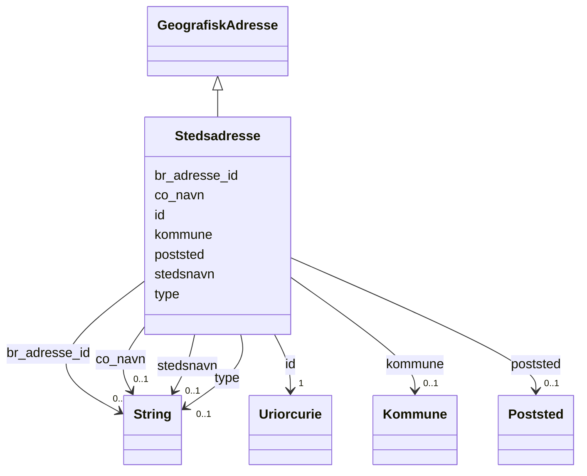

# Class: Stedsadresse 


_Ei stadfesta adresse utan vegadresse (t.d. i utmark)._


URI: [brreg_felles_geografisk_adresse:Stedsadresse](https://data.norge.no/felles/brreg-felles-geografisk-adresse/Stedsadresse)




!!! note "Om diagrammet"
    Klikk på attributt-radene i klasseboksen ovanfor opnar same side som
    klassenavnet — Mermaid sin `classDiagram`-syntaks støttar berre éin
    klikkbar lenkje per klasseboks, ikkje éin per attributt (BUG-14).
    `## Eigenskapar`-tabellen lenger nede på sida er fasiten for
    slot-spesifikke lenkjer.


## Inheritance
* [GeografiskAdresse](geografiskadresse.md)
    * **Stedsadresse**


## Class Properties

| Property | Value |
| --- | --- |
| Class URI | [brreg_felles_geografisk_adresse:Stedsadresse](https://data.norge.no/felles/brreg-felles-geografisk-adresse/Stedsadresse) |

## Eigenskapar

### Andre

| Navn | Kardinalitet og domene | Beskriving |
| --- | --- | --- |
| [stedsnavn](stedsnavn.md) | 0..1 <br/> [xsd:string](http://www.w3.org/2001/XMLSchema#string) | Namnet på staden (for adresser utan vegadresse). |
| [poststed](poststed.md) | 0..1 <br/> [Poststed](poststed.md) | Poststedet adressa høyrer til. |
| [kommune](kommune.md) | 0..1 <br/> [Kommune](kommune.md) | Kommunen adressa ligg i. |


### Arva

| Navn | Kardinalitet og domene | Beskriving | Frå |
| --- | --- | --- | --- |
| [id](id.md) | 1 <br/> [xsd:anyURI](http://www.w3.org/2001/XMLSchema#anyURI) | URI-identifikator for ressursen. | [GeografiskAdresse](geografiskadresse.md) |
| [br_adresse_id](br_adresse_id.md) | 0..1 <br/> [xsd:string](http://www.w3.org/2001/XMLSchema#string) | BR sin interne identifikator for adressa. | [GeografiskAdresse](geografiskadresse.md) |
| [co_navn](co_navn.md) | 0..1 <br/> [xsd:string](http://www.w3.org/2001/XMLSchema#string) | C/O-namn (omsorgsperson/-verksemd) knytt til adressa. | [GeografiskAdresse](geografiskadresse.md) |
| [type](type.md) | 0..1 <br/> [xsd:string](http://www.w3.org/2001/XMLSchema#string) | Diskriminator for kva slag geografisk adresse dette er. | [GeografiskAdresse](geografiskadresse.md) |


## Identifier and Mapping Information


### Schema Source


* from schema: https://data.norge.no/felles/brreg-felles-geografisk-adresse


## Mappings

| Mapping Type | Mapped Value |
| ---  | ---  |
| self | brreg_felles_geografisk_adresse:Stedsadresse |
| native | https://data.norge.no/felles/brreg-felles-geografisk-adresse/Stedsadresse |


## LinkML Source

<!-- TODO: investigate https://stackoverflow.com/questions/37606292/how-to-create-tabbed-code-blocks-in-mkdocs-or-sphinx -->

### Direct

<details>
```yaml
name: Stedsadresse
description: Ei stadfesta adresse utan vegadresse (t.d. i utmark).
from_schema: https://data.norge.no/felles/brreg-felles-geografisk-adresse
rank: 1000
is_a: GeografiskAdresse
slots:
- stedsnavn
- poststed
- kommune
class_uri: brreg_felles_geografisk_adresse:Stedsadresse

```
</details>

### Induced

<details>
```yaml
name: Stedsadresse
description: Ei stadfesta adresse utan vegadresse (t.d. i utmark).
from_schema: https://data.norge.no/felles/brreg-felles-geografisk-adresse
rank: 1000
is_a: GeografiskAdresse
attributes:
  stedsnavn:
    name: stedsnavn
    description: Namnet på staden (for adresser utan vegadresse).
    from_schema: https://data.norge.no/felles/brreg-felles-geografisk-adresse
    slot_uri: brreg_felles_geografisk_adresse:stedsnavn
    owner: Stedsadresse
    domain_of:
    - Stedsadresse
    range: string
  poststed:
    name: poststed
    description: Poststedet adressa høyrer til.
    from_schema: https://data.norge.no/felles/brreg-felles-geografisk-adresse
    slot_uri: brreg_felles_geografisk_adresse:poststed
    owner: Stedsadresse
    domain_of:
    - Postboksadresse
    - Stedsadresse
    - Vegadresse
    range: Poststed
  kommune:
    name: kommune
    description: Kommunen adressa ligg i.
    from_schema: https://data.norge.no/felles/brreg-felles-geografisk-adresse
    slot_uri: brreg_felles_geografisk_adresse:kommune
    owner: Stedsadresse
    domain_of:
    - Postboksadresse
    - Stedsadresse
    - Vegadresse
    range: Kommune
  id:
    name: id
    description: URI-identifikator for ressursen.
    from_schema: https://data.norge.no/felles/brreg-felles-geografisk-adresse
    identifier: true
    owner: Stedsadresse
    domain_of:
    - GeografiskAdresse
    - Poststed
    - Kommune
    - Fylke
    - Matrikkelnummer
    - Adressenummer
    range: uriorcurie
    required: true
  br_adresse_id:
    name: br_adresse_id
    description: BR sin interne identifikator for adressa.
    from_schema: https://data.norge.no/felles/brreg-felles-geografisk-adresse
    slot_uri: brreg_felles_geografisk_adresse:brAdresseId
    owner: Stedsadresse
    domain_of:
    - GeografiskAdresse
    range: string
  co_navn:
    name: co_navn
    description: C/O-namn (omsorgsperson/-verksemd) knytt til adressa.
    from_schema: https://data.norge.no/felles/brreg-felles-geografisk-adresse
    slot_uri: brreg_felles_geografisk_adresse:coNavn
    owner: Stedsadresse
    domain_of:
    - GeografiskAdresse
    range: string
  type:
    name: type
    description: Diskriminator for kva slag geografisk adresse dette er.
    from_schema: https://data.norge.no/felles/brreg-felles-geografisk-adresse
    slot_uri: brreg_felles_geografisk_adresse:type
    owner: Stedsadresse
    domain_of:
    - GeografiskAdresse
    range: string
class_uri: brreg_felles_geografisk_adresse:Stedsadresse

```
</details>