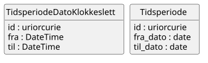

# brreg-felles-tid


## Om denne modellen

> Denne sida dokumenterer LinkML-modellen brreg-felles-tid, inkludert klasser, eigenskapar, datatypar, valideringsresultat og genererte artefakter. Informasjonen er generert automatisk frå skjemaet og tilhøyrande byggeproses.

<!--
Felles tidsperiode-klassar utleia frå Brønnøysundregistrene (BR) sin
interne Strukturtypekatalog_v1. Meint for import frå oreg-domenet sine
enhetsregisteret-*-modellar og andre BR-registermodellar som treng
tidsperiodar — sjå
specs/done/felles-typar-enhetsregisteret-fra-br-katalogar.md for
bakgrunn og metode.
-->


---

## Kom i gang

> Her finn du døme på korleis du importerer, validerer og brukar modellen i eigne prosjekt.

### Importer i egne LinkML-skjema

```yaml
imports:
  - https://raw.githubusercontent.com/brreg/linkml-datamodellering-no/brreg-felles-tid-v0.1.0/src/linkml/felles/brreg-felles-tid/brreg-felles-tid-schema
```

### Valider skjemaet mot silver-policy

```bash
make mcp-linkml-valider-modell SCHEMA=src/linkml/felles/brreg-felles-tid/brreg-felles-tid-schema.yaml
```

### Valider datafil mot LinkML-skjemaet

```bash
make validate-instance SCHEMA=src/linkml/felles/brreg-felles-tid/brreg-felles-tid-schema.yaml INSTANCE=mine-data.yaml
```

### Java-bruk

```xml
<!-- pom.xml -->
<dependency>
    <groupId>org.projectlombok</groupId>
    <artifactId>lombok</artifactId>
    <version>1.18.34</version>
</dependency>
<dependency>
    <groupId>com.fasterxml.jackson.dataformat</groupId>
    <artifactId>jackson-dataformat-yaml</artifactId>
    <version>2.17.2</version>
</dependency>
```

```java
import java.io.File;
import com.fasterxml.jackson.databind.ObjectMapper;
import com.fasterxml.jackson.dataformat.yaml.YAMLFactory;
import no.norge.data.felles.brregfellestid.Tidsperiode;

ObjectMapper mapper = new ObjectMapper(new YAMLFactory());
Tidsperiode tidsperiode = mapper.readValue(new File("mine-data.yaml"), Tidsperiode.class);
```


### Python-bruk

```bash
pip install linkml-runtime pyyaml
```

```python
from linkml_runtime.loaders import yaml_loader
from brreg_felles_tid_model import Tidsperiode

tidsperiode = yaml_loader.load('mine-data.yaml', target_class=Tidsperiode)
```


---

## Modellmetadata {#metadata}

> Modellmetadata viser sentrale metadata for modellen, inkludert versjon, status, lisens, identifikatorar og avhengigheiter. Verdiane er henta direkte frå skjemaet.

| Felt | Verdi |
| --- | --- |
| Name | brreg-felles-tid |
| Title | BRREG felles tid |
| Description | Gjenbrukbare tidsperiode-klassar utleia frå Brønnøysundregistrene (BR) sin interne Strukturtypekatalog_v1 (MagicDraw/XMI), pakken "Komplekstyper" (Tidsperiode, TidsperiodeDatoKlokkeslett). Sjå specs/done/felles-typar-enhetsregisteret-fra-br-katalogar.md for bakgrunn, metode og avklaringane denne modellen byggjer på. |
| Schema URI | [https://data.norge.no/felles/brreg-felles-tid](https://data.norge.no/felles/brreg-felles-tid) |
| Versjon | 0.1.0 |
| Lisens | [https://data.norge.no/nlod/no/2.0](https://data.norge.no/nlod/no/2.0) |
| Utgiver | [https://data.norge.no/organizations/974760673](https://data.norge.no/organizations/974760673) |
| Status | [http://purl.org/adms/status/UnderDevelopment](http://purl.org/adms/status/UnderDevelopment) |
| Endringsdato | 2026-08-31 |
| Utgivelsesdato | 2026-08-31 |
| Imports | `linkml:types`<br>`../brreg-felles-typer/brreg-felles-typer-schema` |


---

## Avhengigheiter (2) {#avhengigheiter}

> Denne modellen importerer og gjenbruker komponentar frå andre skjema. 
> Importerte klasser og eigenskapar kan vere synlege i diagram, valideringsrapportar og andre analysar sjølv om dei ikkje blir lista som lokale element i denne modellen.

Dette skjemaet importerer følgjande skjema (direkte og transitivt):

```
linkml:types  # direkte import
└── brreg-felles-typer-schema  # direkte import
```

*Sjå [Importhierarki](../../arkitektur/importhierarki.md) for oversikt over heile repoet sitt importhierarki.*

*Importerte modeller: [linkml:types](https://github.com/linkml/linkml-model/blob/main/linkml_model/model/schema/types.yaml), [brreg-felles-typer](../brreg-felles-typer/#datamodell)*


---

## Entity-relationship diagram

> ER-diagrammet viser struktur og relasjonar mellom dei lokale klassane i modellen. Importerte klasser er som standard filtrerte bort for å gjere diagrammet enklare å lese.

[](diagrams/brreg-felles-tid-filtered.svg)

*Diagrammet viser kun lokale klasser. Klikk for å zoome. [Vis fullstendig diagram med importerte klasser](diagrams/brreg-felles-tid.svg).*

---

## Datamodell

> Dette er den autoritative kjelda for modellen. Alle tabellar, diagram og artefakt på denne sida er genererte frå dette skjemaet.

Kjelde-datamodell i LinkML-format: [`brreg-felles-tid-schema.yaml`](https://github.com/brreg/linkml-datamodellering-no/blob/main/src/linkml/felles/brreg-felles-tid/brreg-felles-tid-schema.yaml)

---

### Classes (2) {#classes}

> Classes viser klasser som er definerte lokalt i brreg-felles-tid modellen. 
> Klasser frå importerte modellar er ikkje inkluderte i teljinga, men kan vere refererte frå lokale klasser og kan inngå i valideringsresultat og diagram.  
> Klasser grupperes i Obligatorisk, Anbefalt, Valgfri og Andre (uklassifisert).

#### Andre (2)

| Class | Description |
| --- | --- |
| [Tidsperiode](klasser/tidsperiode.md) | Ei tidsperiode avgrensa av ein frå- og til-dato. |
| [TidsperiodeDatoKlokkeslett](klasser/tidsperiodedatoklokkeslett.md) | Ei tidsperiode avgrensa av frå- og til-tidspunkt (dato og klokkeslett). |


---

### Slots (5) {#slots}

> Slots viser **eigenskapar** som er definert i eller brukt av lokale klasser i modellen.  
> Eigenskapar grupperes i "Verdiar" som inneheld data, og "Refransar" som refererer til andre klasser.  
> *Defined in* kolonna angir kildeskjemaet for eigenskapen.
#### Verdiar (5)

| Slot | Description | Defined in |
| --- | --- | --- |
| [fra](klasser/fra.md) | Start-tidspunktet (dato og klokkeslett) for tidsperioden. | [https://data.norge.no/felles/brreg-felles-tid](https://data.norge.no/felles/brreg-felles-tid) |
| [fra_dato](klasser/fra_dato.md) | Startdatoen for tidsperioden. | [https://data.norge.no/felles/brreg-felles-tid](https://data.norge.no/felles/brreg-felles-tid) |
| [id](klasser/id.md) | URI-identifikator for ressursen. | [https://data.norge.no/felles/brreg-felles-tid](https://data.norge.no/felles/brreg-felles-tid) |
| [til](klasser/til.md) | Slutt-tidspunktet (dato og klokkeslett) for tidsperioden. | [https://data.norge.no/felles/brreg-felles-tid](https://data.norge.no/felles/brreg-felles-tid) |
| [til_dato](klasser/til_dato.md) | Sluttdatoen for tidsperioden. | [https://data.norge.no/felles/brreg-felles-tid](https://data.norge.no/felles/brreg-felles-tid) |


---

### Enumerations (0) {#enumerations}

> Enumerations viser kontrollerte **verdiområder** som er definert i eller brukt lokalt i modellen.  
> *Defined in* kolonna angir kildeskjemaet for verdiområdet.


*Ingen enumerations definert lokalt eller brukt i denne modellen.*


---

### Types (3) {#types}

> Types viser primitive **verdiformat** som datoar, URI-ar, språkstrengar og andre grunnleggjande datatypar som er definert i eller brukt i modellen.  
> *Defined in* kolonna angir kildeskjemaet for verdiformatet.

| Type | URI | Description | Defined in |
| --- | --- | --- | --- |
| date | [xsd:date](https://www.w3.org/TR/xmlschema11-2/#date) | a date (year, month and day) in an idealized calendar | [linkml:types](https://github.com/linkml/linkml-model/blob/main/linkml_model/model/schema/types.yaml) |
| DateTime | [xsd:dateTime](https://www.w3.org/TR/xmlschema11-2/#dateTime) | Dato og klokkeslett (xsd:dateTime). | [https://data.norge.no/felles/brreg-felles-typer](https://data.norge.no/felles/brreg-felles-typer) |
| uriorcurie | [xsd:anyURI](https://www.w3.org/TR/xmlschema11-2/#anyURI) | a URI or a CURIE | [linkml:types](https://github.com/linkml/linkml-model/blob/main/linkml_model/model/schema/types.yaml) |

*Importerte typer: [linkml:types](https://github.com/linkml/linkml-model/blob/main/linkml_model/model/schema/types.yaml), [brreg-felles-typer](../brreg-felles-typer/#types)*

---

### Subsets (0) {#subsets}

> Subsets viser **klassifiseringar** av klasser og slots som blir brukt i modellen. For AP-NO-modellar vil dette typisk vere Obligatorisk, Anbefalt og Valgfri.  
> *Defined in* kolonna angir kildeskjemaet for klassifiseringa.

*Ingen subsets definert lokalt eller brukt i denne modellen.*

---

## Genererte artefakter (6) {#generated-artifacts}

> Denne seksjonen listar maskinlesbare artefakt som er genererte frå skjemaet. Artefakta blir brukte til validering, integrasjon, dokumentasjon og kodegenerering.

| Artefakt | Fil |
|----------|-----|
| Modellmanifest ihht Modelldcat-ap-no | [brreg-felles-tid-manifest.yaml](brreg-felles-tid-manifest.yaml) |
| SHACL shapes | [brreg-felles-tid-shapes.ttl](brreg-felles-tid-shapes.ttl) |
| OWL ontologi | [brreg-felles-tid-ontology.ttl](brreg-felles-tid-ontology.ttl) |
| RDF/Turtle skjema | [brreg-felles-tid-schema.ttl](brreg-felles-tid-schema.ttl) |
| ER-diagram (Mermaid) | [brreg-felles-tid-erdiagram.md](brreg-felles-tid-erdiagram.md) |
| PlantUML-diagram | [brreg-felles-tid-filtered.svg](diagrams/brreg-felles-tid-filtered.svg) · [brreg-felles-tid-filtered.puml](diagrams/brreg-felles-tid-filtered.puml) · [brreg-felles-tid.puml](diagrams/brreg-felles-tid.puml) (full) |

*Full byggekonfigurasjon: [build.yaml](https://github.com/brreg/linkml-datamodellering-no/blob/main/src/linkml/felles/brreg-felles-tid/build.yaml)*

---

## Valideringsresultat

> Valideringsrapporten viser i kva grad modellen etterlever definerte modelleringsreglar og kvalitetskrav. Resultata kan omfatte både lokale og importerte element avhengig av kva reglar som er evaluerte.

*Valideringsresultat ikkje tilgjengeleg — ingen validering enno.*

---

## Modellanalyse

> Modellanalysen samanliknar dette skjemaet sine lokalt definerte klasse- og slotnavn mot andre skjema i same domene, og flaggar par med høg navnelikskap som eit mogleg duplikat- eller konsolideringssignal.

*Modellanalyse ikkje tilgjengeleg — krev at generate-workflowen har køyrt.*

---

## Kontakt

> Her finn du informasjon om forvaltningsansvarleg, kontaktpunkt og kanal for feilrapportering eller forslag til forbetringar.

**Support:** [GitHub Issues](https://github.com/brreg/linkml-datamodellering-no/issues)

