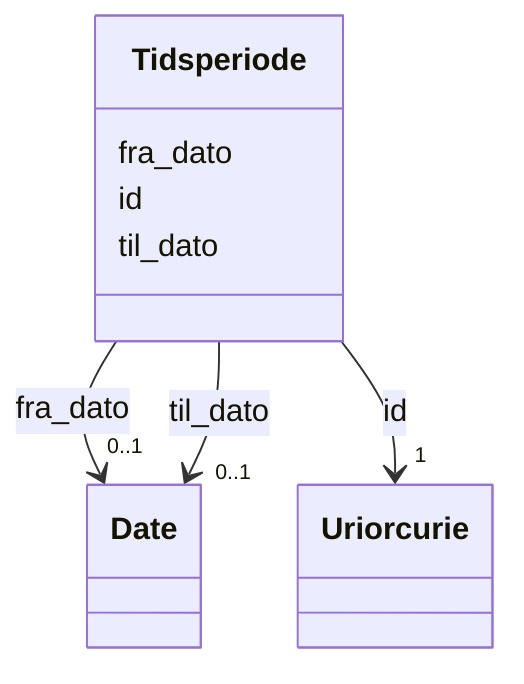

# Class: Tidsperiode 


_Ei tidsperiode avgrensa av ein frå- og til-dato._


URI: [dct:PeriodOfTime](http://purl.org/dc/terms/PeriodOfTime)




!!! note "Om diagrammet"
    Klikk på attributt-radene i klasseboksen ovanfor opnar same side som
    klassenavnet — Mermaid sin `classDiagram`-syntaks støttar berre éin
    klikkbar lenkje per klasseboks, ikkje éin per attributt (BUG-14).
    `## Eigenskapar`-tabellen lenger nede på sida er fasiten for
    slot-spesifikke lenkjer.


<!-- no inheritance hierarchy -->

## Class Properties

| Property | Value |
| --- | --- |
| Class URI | [dct:PeriodOfTime](http://purl.org/dc/terms/PeriodOfTime) |

## Eigenskapar

### Andre

| Navn | Kardinalitet og domene | Beskriving |
| --- | --- | --- |
| [id](id.md) | 1 <br/> [xsd:anyURI](http://www.w3.org/2001/XMLSchema#anyURI) | URI-identifikator for ressursen. |
| [fra_dato](fra_dato.md) | 0..1 <br/> [xsd:date](http://www.w3.org/2001/XMLSchema#date) | Startdatoen for tidsperioden. |
| [til_dato](til_dato.md) | 0..1 <br/> [xsd:date](http://www.w3.org/2001/XMLSchema#date) | Sluttdatoen for tidsperioden. |


## Identifier and Mapping Information


### Schema Source


* from schema: https://data.norge.no/felles/brreg-felles-tid


## Mappings

| Mapping Type | Mapped Value |
| ---  | ---  |
| self | dct:PeriodOfTime |
| native | https://data.norge.no/felles/brreg-felles-tid/Tidsperiode |


## LinkML Source

<!-- TODO: investigate https://stackoverflow.com/questions/37606292/how-to-create-tabbed-code-blocks-in-mkdocs-or-sphinx -->

### Direct

<details>
```yaml
name: Tidsperiode
description: Ei tidsperiode avgrensa av ein frå- og til-dato.
from_schema: https://data.norge.no/felles/brreg-felles-tid
rank: 1000
slots:
- id
- fra_dato
- til_dato
class_uri: dct:PeriodOfTime

```
</details>

### Induced

<details>
```yaml
name: Tidsperiode
description: Ei tidsperiode avgrensa av ein frå- og til-dato.
from_schema: https://data.norge.no/felles/brreg-felles-tid
rank: 1000
attributes:
  id:
    name: id
    description: URI-identifikator for ressursen.
    from_schema: https://data.norge.no/felles/brreg-felles-tid
    identifier: true
    owner: Tidsperiode
    domain_of:
    - Tidsperiode
    - TidsperiodeDatoKlokkeslett
    range: uriorcurie
    required: true
  fra_dato:
    name: fra_dato
    description: Startdatoen for tidsperioden.
    from_schema: https://data.norge.no/felles/brreg-felles-tid
    slot_uri: brreg_felles_tid:fraDato
    owner: Tidsperiode
    domain_of:
    - Tidsperiode
    range: date
  til_dato:
    name: til_dato
    description: Sluttdatoen for tidsperioden.
    from_schema: https://data.norge.no/felles/brreg-felles-tid
    slot_uri: brreg_felles_tid:tilDato
    owner: Tidsperiode
    domain_of:
    - Tidsperiode
    range: date
class_uri: dct:PeriodOfTime

```
</details>