# Class: TidsperiodeDatoKlokkeslett 


_Ei tidsperiode avgrensa av frå- og til-tidspunkt (dato og klokkeslett)._


URI: [brreg_felles_tid:TidsperiodeDatoKlokkeslett](https://data.norge.no/felles/brreg-felles-tid/TidsperiodeDatoKlokkeslett)

```mermaid
 classDiagram
    class TidsperiodeDatoKlokkeslett
    click TidsperiodeDatoKlokkeslett href "../tidsperiodedatoklokkeslett/"
      TidsperiodeDatoKlokkeslett : fra
        
          
    
        
        
        TidsperiodeDatoKlokkeslett --> "0..1" DateTime : fra
        click DateTime href "../datetime/"
    

        
      TidsperiodeDatoKlokkeslett : id
        
          
    
        
        
        TidsperiodeDatoKlokkeslett --> "1" Uriorcurie : id
        click Uriorcurie href "http://www.w3.org/2001/XMLSchema#anyURI"
    

        
      TidsperiodeDatoKlokkeslett : til
        
          
    
        
        
        TidsperiodeDatoKlokkeslett --> "0..1" DateTime : til
        click DateTime href "../datetime/"
    

        
      
```




!!! note "Om diagrammet"
    Klikk på attributt-radene i klasseboksen ovanfor opnar same side som
    klassenavnet — Mermaid sin `classDiagram`-syntaks støttar berre éin
    klikkbar lenkje per klasseboks, ikkje éin per attributt (BUG-14).
    `## Eigenskapar`-tabellen lenger nede på sida er fasiten for
    slot-spesifikke lenkjer.


<!-- no inheritance hierarchy -->

## Class Properties

| Property | Value |
| --- | --- |
| Class URI | [brreg_felles_tid:TidsperiodeDatoKlokkeslett](https://data.norge.no/felles/brreg-felles-tid/TidsperiodeDatoKlokkeslett) |

## Eigenskapar

### Andre

| Navn | Kardinalitet og domene | Beskriving |
| --- | --- | --- |
| [id](id.md) | 1 <br/> [xsd:anyURI](http://www.w3.org/2001/XMLSchema#anyURI) | URI-identifikator for ressursen. |
| [fra](fra.md) | 0..1 <br/> [DateTime](datetime.md) | Start-tidspunktet (dato og klokkeslett) for tidsperioden. |
| [til](til.md) | 0..1 <br/> [DateTime](datetime.md) | Slutt-tidspunktet (dato og klokkeslett) for tidsperioden. |


## Identifier and Mapping Information


### Schema Source


* from schema: https://data.norge.no/felles/brreg-felles-tid


## Mappings

| Mapping Type | Mapped Value |
| ---  | ---  |
| self | brreg_felles_tid:TidsperiodeDatoKlokkeslett |
| native | https://data.norge.no/felles/brreg-felles-tid/TidsperiodeDatoKlokkeslett |


## LinkML Source

<!-- TODO: investigate https://stackoverflow.com/questions/37606292/how-to-create-tabbed-code-blocks-in-mkdocs-or-sphinx -->

### Direct

<details>
```yaml
name: TidsperiodeDatoKlokkeslett
description: Ei tidsperiode avgrensa av frå- og til-tidspunkt (dato og klokkeslett).
from_schema: https://data.norge.no/felles/brreg-felles-tid
rank: 1000
slots:
- id
- fra
- til
class_uri: brreg_felles_tid:TidsperiodeDatoKlokkeslett

```
</details>

### Induced

<details>
```yaml
name: TidsperiodeDatoKlokkeslett
description: Ei tidsperiode avgrensa av frå- og til-tidspunkt (dato og klokkeslett).
from_schema: https://data.norge.no/felles/brreg-felles-tid
rank: 1000
attributes:
  id:
    name: id
    description: URI-identifikator for ressursen.
    from_schema: https://data.norge.no/felles/brreg-felles-tid
    identifier: true
    owner: TidsperiodeDatoKlokkeslett
    domain_of:
    - Tidsperiode
    - TidsperiodeDatoKlokkeslett
    range: uriorcurie
    required: true
  fra:
    name: fra
    description: Start-tidspunktet (dato og klokkeslett) for tidsperioden.
    from_schema: https://data.norge.no/felles/brreg-felles-tid
    slot_uri: brreg_felles_tid:fra
    owner: TidsperiodeDatoKlokkeslett
    domain_of:
    - TidsperiodeDatoKlokkeslett
    range: DateTime
  til:
    name: til
    description: Slutt-tidspunktet (dato og klokkeslett) for tidsperioden.
    from_schema: https://data.norge.no/felles/brreg-felles-tid
    slot_uri: brreg_felles_tid:til
    owner: TidsperiodeDatoKlokkeslett
    domain_of:
    - TidsperiodeDatoKlokkeslett
    range: DateTime
class_uri: brreg_felles_tid:TidsperiodeDatoKlokkeslett

```
</details>