# Class: AdministrasjonContainer 


_Rotcontainer for FINT Administrasjon-instansar._


URI: [https://schema.fintlabs.no/administrasjon/:AdministrasjonContainer](https://schema.fintlabs.no/administrasjon/:AdministrasjonContainer)

```mermaid
 classDiagram
    class AdministrasjonContainer
    click AdministrasjonContainer href "../AdministrasjonContainer/"
      AdministrasjonContainer : aktivitetar
        
          
    
        
        
        AdministrasjonContainer --> "*" Aktivitet : aktivitetar
        click Aktivitet href "../Aktivitet/"
    

        
      AdministrasjonContainer : anlegg
        
          
    
        
        
        AdministrasjonContainer --> "*" Anlegg : anlegg
        click Anlegg href "../Anlegg/"
    

        
      AdministrasjonContainer : ansvar
        
          
    
        
        
        AdministrasjonContainer --> "*" Ansvar : ansvar
        click Ansvar href "../Ansvar/"
    

        
      AdministrasjonContainer : arbeidsforhold
        
          
    
        
        
        AdministrasjonContainer --> "*" Arbeidsforhold : arbeidsforhold
        click Arbeidsforhold href "../Arbeidsforhold/"
    

        
      AdministrasjonContainer : arbeidsforholdstypar
        
          
    
        
        
        AdministrasjonContainer --> "*" Arbeidsforholdstype : arbeidsforholdstypar
        click Arbeidsforholdstype href "../Arbeidsforholdstype/"
    

        
      AdministrasjonContainer : arbeidslokasjoner
        
          
    
        
        
        AdministrasjonContainer --> "*" Arbeidslokasjon : arbeidslokasjoner
        click Arbeidslokasjon href "../Arbeidslokasjon/"
    

        
      AdministrasjonContainer : artar
        
          
    
        
        
        AdministrasjonContainer --> "*" Art : artar
        click Art href "../Art/"
    

        
      AdministrasjonContainer : diverse
        
          
    
        
        
        AdministrasjonContainer --> "*" Diverse : diverse
        click Diverse href "../Diverse/"
    

        
      AdministrasjonContainer : fastlonn
        
          
    
        
        
        AdministrasjonContainer --> "*" Fastlonn : fastlonn
        click Fastlonn href "../Fastlonn/"
    

        
      AdministrasjonContainer : fasttillegg
        
          
    
        
        
        AdministrasjonContainer --> "*" Fasttillegg : fasttillegg
        click Fasttillegg href "../Fasttillegg/"
    

        
      AdministrasjonContainer : formaal
        
          
    
        
        
        AdministrasjonContainer --> "*" Formaal : formaal
        click Formaal href "../Formaal/"
    

        
      AdministrasjonContainer : fravaer
        
          
    
        
        
        AdministrasjonContainer --> "*" Fravaer : fravaer
        click Fravaer href "../Fravaer/"
    

        
      AdministrasjonContainer : fravaersgrunnar
        
          
    
        
        
        AdministrasjonContainer --> "*" Fravaersgrunn : fravaersgrunnar
        click Fravaersgrunn href "../Fravaersgrunn/"
    

        
      AdministrasjonContainer : fravaerstypar
        
          
    
        
        
        AdministrasjonContainer --> "*" Fravaerstype : fravaerstypar
        click Fravaerstype href "../Fravaerstype/"
    

        
      AdministrasjonContainer : fullmakter
        
          
    
        
        
        AdministrasjonContainer --> "*" Fullmakt : fullmakter
        click Fullmakt href "../Fullmakt/"
    

        
      AdministrasjonContainer : funksjonar
        
          
    
        
        
        AdministrasjonContainer --> "*" Funksjon : funksjonar
        click Funksjon href "../Funksjon/"
    

        
      AdministrasjonContainer : fylke
        
          
    
        
        
        AdministrasjonContainer --> "*" Fylke : fylke
        click Fylke href "../Fylke/"
    

        
      AdministrasjonContainer : kjonn
        
          
    
        
        
        AdministrasjonContainer --> "*" Kjonn : kjonn
        click Kjonn href "../Kjonn/"
    

        
      AdministrasjonContainer : kommunar
        
          
    
        
        
        AdministrasjonContainer --> "*" Kommune : kommunar
        click Kommune href "../Kommune/"
    

        
      AdministrasjonContainer : kontaktpersonar
        
          
    
        
        
        AdministrasjonContainer --> "*" Kontaktperson : kontaktpersonar
        click Kontaktperson href "../Kontaktperson/"
    

        
      AdministrasjonContainer : kontrakter
        
          
    
        
        
        AdministrasjonContainer --> "*" Kontrakt : kontrakter
        click Kontrakt href "../Kontrakt/"
    

        
      AdministrasjonContainer : landkodar
        
          
    
        
        
        AdministrasjonContainer --> "*" Landkode : landkodar
        click Landkode href "../Landkode/"
    

        
      AdministrasjonContainer : lonsartar
        
          
    
        
        
        AdministrasjonContainer --> "*" Lonsart : lonsartar
        click Lonsart href "../Lonsart/"
    

        
      AdministrasjonContainer : lopenummer
        
          
    
        
        
        AdministrasjonContainer --> "*" Lopenummer : lopenummer
        click Lopenummer href "../Lopenummer/"
    

        
      AdministrasjonContainer : objekt
        
          
    
        
        
        AdministrasjonContainer --> "*" Objekt : objekt
        click Objekt href "../Objekt/"
    

        
      AdministrasjonContainer : organisasjonselement
        
          
    
        
        
        AdministrasjonContainer --> "*" Organisasjonselement : organisasjonselement
        click Organisasjonselement href "../Organisasjonselement/"
    

        
      AdministrasjonContainer : organisasjonstypar
        
          
    
        
        
        AdministrasjonContainer --> "*" Organisasjonstype : organisasjonstypar
        click Organisasjonstype href "../Organisasjonstype/"
    

        
      AdministrasjonContainer : personalressursar
        
          
    
        
        
        AdministrasjonContainer --> "*" Personalressurs : personalressursar
        click Personalressurs href "../Personalressurs/"
    

        
      AdministrasjonContainer : personalressurskategoriar
        
          
    
        
        
        AdministrasjonContainer --> "*" Personalressurskategori : personalressurskategoriar
        click Personalressurskategori href "../Personalressurskategori/"
    

        
      AdministrasjonContainer : personar
        
          
    
        
        
        AdministrasjonContainer --> "*" Person : personar
        click Person href "../Person/"
    

        
      AdministrasjonContainer : prosjekt
        
          
    
        
        
        AdministrasjonContainer --> "*" Prosjekt : prosjekt
        click Prosjekt href "../Prosjekt/"
    

        
      AdministrasjonContainer : prosjektartar
        
          
    
        
        
        AdministrasjonContainer --> "*" Prosjektart : prosjektartar
        click Prosjektart href "../Prosjektart/"
    

        
      AdministrasjonContainer : rammer
        
          
    
        
        
        AdministrasjonContainer --> "*" Ramme : rammer
        click Ramme href "../Ramme/"
    

        
      AdministrasjonContainer : rollar
        
          
    
        
        
        AdministrasjonContainer --> "*" Rolle : rollar
        click Rolle href "../Rolle/"
    

        
      AdministrasjonContainer : spraak
        
          
    
        
        
        AdministrasjonContainer --> "*" Spraak : spraak
        click Spraak href "../Spraak/"
    

        
      AdministrasjonContainer : stillingskoder
        
          
    
        
        
        AdministrasjonContainer --> "*" Stillingskode : stillingskoder
        click Stillingskode href "../Stillingskode/"
    

        
      AdministrasjonContainer : uketimetall
        
          
    
        
        
        AdministrasjonContainer --> "*" Uketimetall : uketimetall
        click Uketimetall href "../Uketimetall/"
    

        
      AdministrasjonContainer : valuta
        
          
    
        
        
        AdministrasjonContainer --> "*" Valuta : valuta
        click Valuta href "../Valuta/"
    

        
      AdministrasjonContainer : variabellonn
        
          
    
        
        
        AdministrasjonContainer --> "*" Variabellonn : variabellonn
        click Variabellonn href "../Variabellonn/"
    

        
      AdministrasjonContainer : virksomhetar
        
          
    
        
        
        AdministrasjonContainer --> "*" Virksomhet : virksomhetar
        click Virksomhet href "../Virksomhet/"
    

        
      
```





<!-- no inheritance hierarchy -->

## Class Properties

| Property | Value |
| --- | --- |
| Tree Root | Yes |


## Eigenskapar


  
  

  
  

  
  

  
  

  
  

  
  

  
  

  
  

  
  

  
  

  
  

  
  

  
  

  
  

  
  

  
  

  
  

  
  

  
  

  
  

  
  

  
  

  
  

  
  

  
  

  
  

  
  

  
  

  
  

  
  

  
  

  
  

  
  

  
  

  
  

  
  

  
  

  
  

  
  

  
  


  
  

  
  

  
  

  
  

  
  

  
  

  
  

  
  

  
  

  
  

  
  

  
  

  
  

  
  

  
  

  
  

  
  

  
  

  
  

  
  

  
  

  
  

  
  

  
  

  
  

  
  

  
  

  
  

  
  

  
  

  
  

  
  

  
  

  
  

  
  

  
  

  
  

  
  

  
  

  
  


  
  

  
  

  
  

  
  

  
  

  
  

  
  

  
  

  
  

  
  

  
  

  
  

  
  

  
  

  
  

  
  

  
  

  
  

  
  

  
  

  
  

  
  

  
  

  
  

  
  

  
  

  
  

  
  

  
  

  
  

  
  

  
  

  
  

  
  

  
  

  
  

  
  

  
  

  
  

  
  


  
  
  
  
    
  

  
  
  
  
    
  

  
  
  
  
    
  

  
  
  
  
    
  

  
  
  
  
    
  

  
  
  
  
    
  

  
  
  
  
    
  

  
  
  
  
    
  

  
  
  
  
    
  

  
  
  
  
    
  

  
  
  
  
    
  

  
  
  
  
    
  

  
  
  
  
    
  

  
  
  
  
    
  

  
  
  
  
    
  

  
  
  
  
    
  

  
  
  
  
    
  

  
  
  
  
    
  

  
  
  
  
    
  

  
  
  
  
    
  

  
  
  
  
    
  

  
  
  
  
    
  

  
  
  
  
    
  

  
  
  
  
    
  

  
  
  
  
    
  

  
  
  
  
    
  

  
  
  
  
    
  

  
  
  
  
    
  

  
  
  
  
    
  

  
  
  
  
    
  

  
  
  
  
    
  

  
  
  
  
    
  

  
  
  
  
    
  

  
  
  
  
    
  

  
  
  
  
    
  

  
  
  
  
    
  

  
  
  
  
    
  

  
  
  
  
    
  

  
  
  
  
    
  

  
  
  
  
    
  


### Andre

| Namn | Kardinalitet og domene | Beskriving |
| --- | --- | --- |
| [personar](personar.md) | * <br/> [Person](Person.md) |  |
| [kontaktpersonar](kontaktpersonar.md) | * <br/> [Kontaktperson](Kontaktperson.md) |  |
| [virksomhetar](virksomhetar.md) | * <br/> [Virksomhet](Virksomhet.md) |  |
| [landkodar](landkodar.md) | * <br/> [Landkode](Landkode.md) |  |
| [kjonn](kjonn.md) | * <br/> [Kjonn](Kjonn.md) |  |
| [fylke](fylke.md) | * <br/> [Fylke](Fylke.md) |  |
| [kommunar](kommunar.md) | * <br/> [Kommune](Kommune.md) |  |
| [spraak](spraak.md) | * <br/> [Spraak](Spraak.md) |  |
| [valuta](valuta.md) | * <br/> [Valuta](Valuta.md) |  |
| [personalressursar](personalressursar.md) | * <br/> [Personalressurs](Personalressurs.md) |  |
| [arbeidsforhold](arbeidsforhold.md) | * <br/> [Arbeidsforhold](Arbeidsforhold.md) |  |
| [arbeidslokasjoner](arbeidslokasjoner.md) | * <br/> [Arbeidslokasjon](Arbeidslokasjon.md) |  |
| [fastlonn](fastlonn.md) | * <br/> [Fastlonn](Fastlonn.md) |  |
| [fasttillegg](fasttillegg.md) | * <br/> [Fasttillegg](Fasttillegg.md) |  |
| [fravaer](fravaer.md) | * <br/> [Fravaer](Fravaer.md) |  |
| [fullmakter](fullmakter.md) | * <br/> [Fullmakt](Fullmakt.md) |  |
| [organisasjonselement](organisasjonselement.md) | * <br/> [Organisasjonselement](Organisasjonselement.md) |  |
| [rollar](rollar.md) | * <br/> [Rolle](Rolle.md) |  |
| [variabellonn](variabellonn.md) | * <br/> [Variabellonn](Variabellonn.md) |  |
| [aktivitetar](aktivitetar.md) | * <br/> [Aktivitet](Aktivitet.md) |  |
| [anlegg](anlegg.md) | * <br/> [Anlegg](Anlegg.md) |  |
| [ansvar](ansvar.md) | * <br/> [Ansvar](Ansvar.md) |  |
| [artar](artar.md) | * <br/> [Art](Art.md) |  |
| [arbeidsforholdstypar](arbeidsforholdstypar.md) | * <br/> [Arbeidsforholdstype](Arbeidsforholdstype.md) |  |
| [diverse](diverse.md) | * <br/> [Diverse](Diverse.md) |  |
| [formaal](formaal.md) | * <br/> [Formaal](Formaal.md) |  |
| [fravaersgrunnar](fravaersgrunnar.md) | * <br/> [Fravaersgrunn](Fravaersgrunn.md) |  |
| [fravaerstypar](fravaerstypar.md) | * <br/> [Fravaerstype](Fravaerstype.md) |  |
| [funksjonar](funksjonar.md) | * <br/> [Funksjon](Funksjon.md) |  |
| [kontrakter](kontrakter.md) | * <br/> [Kontrakt](Kontrakt.md) |  |
| [lonsartar](lonsartar.md) | * <br/> [Lonsart](Lonsart.md) |  |
| [lopenummer](lopenummer.md) | * <br/> [Lopenummer](Lopenummer.md) |  |
| [objekt](objekt.md) | * <br/> [Objekt](Objekt.md) |  |
| [organisasjonstypar](organisasjonstypar.md) | * <br/> [Organisasjonstype](Organisasjonstype.md) |  |
| [personalressurskategoriar](personalressurskategoriar.md) | * <br/> [Personalressurskategori](Personalressurskategori.md) |  |
| [prosjekt](prosjekt.md) | * <br/> [Prosjekt](Prosjekt.md) |  |
| [prosjektartar](prosjektartar.md) | * <br/> [Prosjektart](Prosjektart.md) |  |
| [rammer](rammer.md) | * <br/> [Ramme](Ramme.md) |  |
| [stillingskoder](stillingskoder.md) | * <br/> [Stillingskode](Stillingskode.md) |  |
| [uketimetall](uketimetall.md) | * <br/> [Uketimetall](Uketimetall.md) |  |


## Identifier and Mapping Information


### Schema Source


* from schema: https://data.norge.no/linkml/fint-administrasjon


## Mappings

| Mapping Type | Mapped Value |
| ---  | ---  |
| self | https://schema.fintlabs.no/administrasjon/:AdministrasjonContainer |
| native | https://schema.fintlabs.no/administrasjon/:AdministrasjonContainer |


## LinkML Source

<!-- TODO: investigate https://stackoverflow.com/questions/37606292/how-to-create-tabbed-code-blocks-in-mkdocs-or-sphinx -->

### Direct

<details>
```yaml
name: AdministrasjonContainer
description: Rotcontainer for FINT Administrasjon-instansar.
from_schema: https://data.norge.no/linkml/fint-administrasjon
attributes:
  personar:
    name: personar
    from_schema: https://data.norge.no/linkml/fint-administrasjon
    rank: 1000
    domain_of:
    - AdministrasjonContainer
    range: Person
    multivalued: true
    inlined: true
    inlined_as_list: true
  kontaktpersonar:
    name: kontaktpersonar
    from_schema: https://data.norge.no/linkml/fint-administrasjon
    rank: 1000
    domain_of:
    - AdministrasjonContainer
    range: Kontaktperson
    multivalued: true
    inlined: true
    inlined_as_list: true
  virksomhetar:
    name: virksomhetar
    from_schema: https://data.norge.no/linkml/fint-administrasjon
    rank: 1000
    domain_of:
    - AdministrasjonContainer
    range: Virksomhet
    multivalued: true
    inlined: true
    inlined_as_list: true
  landkodar:
    name: landkodar
    from_schema: https://data.norge.no/linkml/fint-administrasjon
    rank: 1000
    domain_of:
    - AdministrasjonContainer
    range: Landkode
    multivalued: true
    inlined: true
    inlined_as_list: true
  kjonn:
    name: kjonn
    from_schema: https://data.norge.no/linkml/fint-administrasjon
    rank: 1000
    domain_of:
    - AdministrasjonContainer
    - Person
    range: Kjonn
    multivalued: true
    inlined: true
    inlined_as_list: true
  fylke:
    name: fylke
    from_schema: https://data.norge.no/linkml/fint-administrasjon
    rank: 1000
    domain_of:
    - AdministrasjonContainer
    - Kommune
    range: Fylke
    multivalued: true
    inlined: true
    inlined_as_list: true
  kommunar:
    name: kommunar
    from_schema: https://data.norge.no/linkml/fint-administrasjon
    rank: 1000
    domain_of:
    - AdministrasjonContainer
    range: Kommune
    multivalued: true
    inlined: true
    inlined_as_list: true
  spraak:
    name: spraak
    from_schema: https://data.norge.no/linkml/fint-administrasjon
    rank: 1000
    domain_of:
    - AdministrasjonContainer
    range: Spraak
    multivalued: true
    inlined: true
    inlined_as_list: true
  valuta:
    name: valuta
    from_schema: https://data.norge.no/linkml/fint-administrasjon
    rank: 1000
    domain_of:
    - AdministrasjonContainer
    range: Valuta
    multivalued: true
    inlined: true
    inlined_as_list: true
  personalressursar:
    name: personalressursar
    from_schema: https://data.norge.no/linkml/fint-administrasjon
    rank: 1000
    domain_of:
    - AdministrasjonContainer
    range: Personalressurs
    multivalued: true
    inlined: true
    inlined_as_list: true
  arbeidsforhold:
    name: arbeidsforhold
    from_schema: https://data.norge.no/linkml/fint-administrasjon
    rank: 1000
    domain_of:
    - AdministrasjonContainer
    - Fastlonn
    - Fasttillegg
    - Variabellonn
    - Fravaer
    - Arbeidslokasjon
    - Organisasjonselement
    - Personalressurs
    range: Arbeidsforhold
    multivalued: true
    inlined: true
    inlined_as_list: true
  arbeidslokasjoner:
    name: arbeidslokasjoner
    from_schema: https://data.norge.no/linkml/fint-administrasjon
    rank: 1000
    domain_of:
    - AdministrasjonContainer
    range: Arbeidslokasjon
    multivalued: true
    inlined: true
    inlined_as_list: true
  fastlonn:
    name: fastlonn
    from_schema: https://data.norge.no/linkml/fint-administrasjon
    rank: 1000
    domain_of:
    - AdministrasjonContainer
    - Arbeidsforhold
    range: Fastlonn
    multivalued: true
    inlined: true
    inlined_as_list: true
  fasttillegg:
    name: fasttillegg
    from_schema: https://data.norge.no/linkml/fint-administrasjon
    rank: 1000
    domain_of:
    - AdministrasjonContainer
    - Arbeidsforhold
    range: Fasttillegg
    multivalued: true
    inlined: true
    inlined_as_list: true
  fravaer:
    name: fravaer
    from_schema: https://data.norge.no/linkml/fint-administrasjon
    rank: 1000
    domain_of:
    - AdministrasjonContainer
    - Arbeidsforhold
    range: Fravaer
    multivalued: true
    inlined: true
    inlined_as_list: true
  fullmakter:
    name: fullmakter
    from_schema: https://data.norge.no/linkml/fint-administrasjon
    rank: 1000
    domain_of:
    - AdministrasjonContainer
    range: Fullmakt
    multivalued: true
    inlined: true
    inlined_as_list: true
  organisasjonselement:
    name: organisasjonselement
    from_schema: https://data.norge.no/linkml/fint-administrasjon
    rank: 1000
    domain_of:
    - AdministrasjonContainer
    - Ansvar
    - Fullmakt
    range: Organisasjonselement
    multivalued: true
    inlined: true
    inlined_as_list: true
  rollar:
    name: rollar
    from_schema: https://data.norge.no/linkml/fint-administrasjon
    rank: 1000
    domain_of:
    - AdministrasjonContainer
    range: Rolle
    multivalued: true
    inlined: true
    inlined_as_list: true
  variabellonn:
    name: variabellonn
    from_schema: https://data.norge.no/linkml/fint-administrasjon
    rank: 1000
    domain_of:
    - AdministrasjonContainer
    - Arbeidsforhold
    range: Variabellonn
    multivalued: true
    inlined: true
    inlined_as_list: true
  aktivitetar:
    name: aktivitetar
    from_schema: https://data.norge.no/linkml/fint-administrasjon
    rank: 1000
    domain_of:
    - AdministrasjonContainer
    range: Aktivitet
    multivalued: true
    inlined: true
    inlined_as_list: true
  anlegg:
    name: anlegg
    from_schema: https://data.norge.no/linkml/fint-administrasjon
    rank: 1000
    domain_of:
    - AdministrasjonContainer
    - Kontostreng
    - Fullmakt
    - Arbeidsforhold
    range: Anlegg
    multivalued: true
    inlined: true
    inlined_as_list: true
  ansvar:
    name: ansvar
    from_schema: https://data.norge.no/linkml/fint-administrasjon
    rank: 1000
    domain_of:
    - AdministrasjonContainer
    - Kontostreng
    - Fullmakt
    - Organisasjonselement
    - Arbeidsforhold
    range: Ansvar
    multivalued: true
    inlined: true
    inlined_as_list: true
  artar:
    name: artar
    from_schema: https://data.norge.no/linkml/fint-administrasjon
    rank: 1000
    domain_of:
    - AdministrasjonContainer
    range: Art
    multivalued: true
    inlined: true
    inlined_as_list: true
  arbeidsforholdstypar:
    name: arbeidsforholdstypar
    from_schema: https://data.norge.no/linkml/fint-administrasjon
    rank: 1000
    domain_of:
    - AdministrasjonContainer
    range: Arbeidsforholdstype
    multivalued: true
    inlined: true
    inlined_as_list: true
  diverse:
    name: diverse
    from_schema: https://data.norge.no/linkml/fint-administrasjon
    rank: 1000
    domain_of:
    - AdministrasjonContainer
    - Kontostreng
    - Fullmakt
    - Arbeidsforhold
    range: Diverse
    multivalued: true
    inlined: true
    inlined_as_list: true
  formaal:
    name: formaal
    from_schema: https://data.norge.no/linkml/fint-administrasjon
    rank: 1000
    domain_of:
    - AdministrasjonContainer
    - Kontostreng
    - Fullmakt
    - Arbeidsforhold
    range: Formaal
    multivalued: true
    inlined: true
    inlined_as_list: true
  fravaersgrunnar:
    name: fravaersgrunnar
    from_schema: https://data.norge.no/linkml/fint-administrasjon
    rank: 1000
    domain_of:
    - AdministrasjonContainer
    range: Fravaersgrunn
    multivalued: true
    inlined: true
    inlined_as_list: true
  fravaerstypar:
    name: fravaerstypar
    from_schema: https://data.norge.no/linkml/fint-administrasjon
    rank: 1000
    domain_of:
    - AdministrasjonContainer
    range: Fravaerstype
    multivalued: true
    inlined: true
    inlined_as_list: true
  funksjonar:
    name: funksjonar
    from_schema: https://data.norge.no/linkml/fint-administrasjon
    rank: 1000
    domain_of:
    - AdministrasjonContainer
    range: Funksjon
    multivalued: true
    inlined: true
    inlined_as_list: true
  kontrakter:
    name: kontrakter
    from_schema: https://data.norge.no/linkml/fint-administrasjon
    rank: 1000
    domain_of:
    - AdministrasjonContainer
    range: Kontrakt
    multivalued: true
    inlined: true
    inlined_as_list: true
  lonsartar:
    name: lonsartar
    from_schema: https://data.norge.no/linkml/fint-administrasjon
    rank: 1000
    domain_of:
    - AdministrasjonContainer
    range: Lonsart
    multivalued: true
    inlined: true
    inlined_as_list: true
  lopenummer:
    name: lopenummer
    from_schema: https://data.norge.no/linkml/fint-administrasjon
    rank: 1000
    domain_of:
    - AdministrasjonContainer
    - Kontostreng
    - Fullmakt
    - Arbeidsforhold
    range: Lopenummer
    multivalued: true
    inlined: true
    inlined_as_list: true
  objekt:
    name: objekt
    from_schema: https://data.norge.no/linkml/fint-administrasjon
    rank: 1000
    domain_of:
    - AdministrasjonContainer
    - Kontostreng
    - Fullmakt
    - Arbeidsforhold
    range: Objekt
    multivalued: true
    inlined: true
    inlined_as_list: true
  organisasjonstypar:
    name: organisasjonstypar
    from_schema: https://data.norge.no/linkml/fint-administrasjon
    rank: 1000
    domain_of:
    - AdministrasjonContainer
    range: Organisasjonstype
    multivalued: true
    inlined: true
    inlined_as_list: true
  personalressurskategoriar:
    name: personalressurskategoriar
    from_schema: https://data.norge.no/linkml/fint-administrasjon
    rank: 1000
    domain_of:
    - AdministrasjonContainer
    range: Personalressurskategori
    multivalued: true
    inlined: true
    inlined_as_list: true
  prosjekt:
    name: prosjekt
    from_schema: https://data.norge.no/linkml/fint-administrasjon
    rank: 1000
    domain_of:
    - AdministrasjonContainer
    - Kontostreng
    - Prosjektart
    - Fullmakt
    - Arbeidsforhold
    range: Prosjekt
    multivalued: true
    inlined: true
    inlined_as_list: true
  prosjektartar:
    name: prosjektartar
    from_schema: https://data.norge.no/linkml/fint-administrasjon
    rank: 1000
    domain_of:
    - AdministrasjonContainer
    range: Prosjektart
    multivalued: true
    inlined: true
    inlined_as_list: true
  rammer:
    name: rammer
    from_schema: https://data.norge.no/linkml/fint-administrasjon
    rank: 1000
    domain_of:
    - AdministrasjonContainer
    range: Ramme
    multivalued: true
    inlined: true
    inlined_as_list: true
  stillingskoder:
    name: stillingskoder
    from_schema: https://data.norge.no/linkml/fint-administrasjon
    rank: 1000
    domain_of:
    - AdministrasjonContainer
    range: Stillingskode
    multivalued: true
    inlined: true
    inlined_as_list: true
  uketimetall:
    name: uketimetall
    from_schema: https://data.norge.no/linkml/fint-administrasjon
    rank: 1000
    domain_of:
    - AdministrasjonContainer
    range: Uketimetall
    multivalued: true
    inlined: true
    inlined_as_list: true
tree_root: true

```
</details>

### Induced

<details>
```yaml
name: AdministrasjonContainer
description: Rotcontainer for FINT Administrasjon-instansar.
from_schema: https://data.norge.no/linkml/fint-administrasjon
attributes:
  personar:
    name: personar
    from_schema: https://data.norge.no/linkml/fint-administrasjon
    rank: 1000
    alias: personar
    owner: AdministrasjonContainer
    domain_of:
    - AdministrasjonContainer
    range: Person
    multivalued: true
    inlined_as_list: true
  kontaktpersonar:
    name: kontaktpersonar
    from_schema: https://data.norge.no/linkml/fint-administrasjon
    rank: 1000
    alias: kontaktpersonar
    owner: AdministrasjonContainer
    domain_of:
    - AdministrasjonContainer
    range: Kontaktperson
    multivalued: true
    inlined_as_list: true
  virksomhetar:
    name: virksomhetar
    from_schema: https://data.norge.no/linkml/fint-administrasjon
    rank: 1000
    alias: virksomhetar
    owner: AdministrasjonContainer
    domain_of:
    - AdministrasjonContainer
    range: Virksomhet
    multivalued: true
    inlined_as_list: true
  landkodar:
    name: landkodar
    from_schema: https://data.norge.no/linkml/fint-administrasjon
    rank: 1000
    alias: landkodar
    owner: AdministrasjonContainer
    domain_of:
    - AdministrasjonContainer
    range: Landkode
    multivalued: true
    inlined_as_list: true
  kjonn:
    name: kjonn
    from_schema: https://data.norge.no/linkml/fint-administrasjon
    rank: 1000
    alias: kjonn
    owner: AdministrasjonContainer
    domain_of:
    - AdministrasjonContainer
    - Person
    range: Kjonn
    multivalued: true
    inlined_as_list: true
  fylke:
    name: fylke
    from_schema: https://data.norge.no/linkml/fint-administrasjon
    rank: 1000
    alias: fylke
    owner: AdministrasjonContainer
    domain_of:
    - AdministrasjonContainer
    - Kommune
    range: Fylke
    multivalued: true
    inlined_as_list: true
  kommunar:
    name: kommunar
    from_schema: https://data.norge.no/linkml/fint-administrasjon
    rank: 1000
    alias: kommunar
    owner: AdministrasjonContainer
    domain_of:
    - AdministrasjonContainer
    range: Kommune
    multivalued: true
    inlined_as_list: true
  spraak:
    name: spraak
    from_schema: https://data.norge.no/linkml/fint-administrasjon
    rank: 1000
    alias: spraak
    owner: AdministrasjonContainer
    domain_of:
    - AdministrasjonContainer
    range: Spraak
    multivalued: true
    inlined_as_list: true
  valuta:
    name: valuta
    from_schema: https://data.norge.no/linkml/fint-administrasjon
    rank: 1000
    alias: valuta
    owner: AdministrasjonContainer
    domain_of:
    - AdministrasjonContainer
    range: Valuta
    multivalued: true
    inlined_as_list: true
  personalressursar:
    name: personalressursar
    from_schema: https://data.norge.no/linkml/fint-administrasjon
    rank: 1000
    alias: personalressursar
    owner: AdministrasjonContainer
    domain_of:
    - AdministrasjonContainer
    range: Personalressurs
    multivalued: true
    inlined_as_list: true
  arbeidsforhold:
    name: arbeidsforhold
    from_schema: https://data.norge.no/linkml/fint-administrasjon
    rank: 1000
    alias: arbeidsforhold
    owner: AdministrasjonContainer
    domain_of:
    - AdministrasjonContainer
    - Fastlonn
    - Fasttillegg
    - Variabellonn
    - Fravaer
    - Arbeidslokasjon
    - Organisasjonselement
    - Personalressurs
    range: Arbeidsforhold
    multivalued: true
    inlined_as_list: true
  arbeidslokasjoner:
    name: arbeidslokasjoner
    from_schema: https://data.norge.no/linkml/fint-administrasjon
    rank: 1000
    alias: arbeidslokasjoner
    owner: AdministrasjonContainer
    domain_of:
    - AdministrasjonContainer
    range: Arbeidslokasjon
    multivalued: true
    inlined_as_list: true
  fastlonn:
    name: fastlonn
    from_schema: https://data.norge.no/linkml/fint-administrasjon
    rank: 1000
    alias: fastlonn
    owner: AdministrasjonContainer
    domain_of:
    - AdministrasjonContainer
    - Arbeidsforhold
    range: Fastlonn
    multivalued: true
    inlined_as_list: true
  fasttillegg:
    name: fasttillegg
    from_schema: https://data.norge.no/linkml/fint-administrasjon
    rank: 1000
    alias: fasttillegg
    owner: AdministrasjonContainer
    domain_of:
    - AdministrasjonContainer
    - Arbeidsforhold
    range: Fasttillegg
    multivalued: true
    inlined_as_list: true
  fravaer:
    name: fravaer
    from_schema: https://data.norge.no/linkml/fint-administrasjon
    rank: 1000
    alias: fravaer
    owner: AdministrasjonContainer
    domain_of:
    - AdministrasjonContainer
    - Arbeidsforhold
    range: Fravaer
    multivalued: true
    inlined_as_list: true
  fullmakter:
    name: fullmakter
    from_schema: https://data.norge.no/linkml/fint-administrasjon
    rank: 1000
    alias: fullmakter
    owner: AdministrasjonContainer
    domain_of:
    - AdministrasjonContainer
    range: Fullmakt
    multivalued: true
    inlined_as_list: true
  organisasjonselement:
    name: organisasjonselement
    from_schema: https://data.norge.no/linkml/fint-administrasjon
    rank: 1000
    alias: organisasjonselement
    owner: AdministrasjonContainer
    domain_of:
    - AdministrasjonContainer
    - Ansvar
    - Fullmakt
    range: Organisasjonselement
    multivalued: true
    inlined_as_list: true
  rollar:
    name: rollar
    from_schema: https://data.norge.no/linkml/fint-administrasjon
    rank: 1000
    alias: rollar
    owner: AdministrasjonContainer
    domain_of:
    - AdministrasjonContainer
    range: Rolle
    multivalued: true
    inlined_as_list: true
  variabellonn:
    name: variabellonn
    from_schema: https://data.norge.no/linkml/fint-administrasjon
    rank: 1000
    alias: variabellonn
    owner: AdministrasjonContainer
    domain_of:
    - AdministrasjonContainer
    - Arbeidsforhold
    range: Variabellonn
    multivalued: true
    inlined_as_list: true
  aktivitetar:
    name: aktivitetar
    from_schema: https://data.norge.no/linkml/fint-administrasjon
    rank: 1000
    alias: aktivitetar
    owner: AdministrasjonContainer
    domain_of:
    - AdministrasjonContainer
    range: Aktivitet
    multivalued: true
    inlined_as_list: true
  anlegg:
    name: anlegg
    from_schema: https://data.norge.no/linkml/fint-administrasjon
    rank: 1000
    alias: anlegg
    owner: AdministrasjonContainer
    domain_of:
    - AdministrasjonContainer
    - Kontostreng
    - Fullmakt
    - Arbeidsforhold
    range: Anlegg
    multivalued: true
    inlined_as_list: true
  ansvar:
    name: ansvar
    from_schema: https://data.norge.no/linkml/fint-administrasjon
    rank: 1000
    alias: ansvar
    owner: AdministrasjonContainer
    domain_of:
    - AdministrasjonContainer
    - Kontostreng
    - Fullmakt
    - Organisasjonselement
    - Arbeidsforhold
    range: Ansvar
    multivalued: true
    inlined_as_list: true
  artar:
    name: artar
    from_schema: https://data.norge.no/linkml/fint-administrasjon
    rank: 1000
    alias: artar
    owner: AdministrasjonContainer
    domain_of:
    - AdministrasjonContainer
    range: Art
    multivalued: true
    inlined_as_list: true
  arbeidsforholdstypar:
    name: arbeidsforholdstypar
    from_schema: https://data.norge.no/linkml/fint-administrasjon
    rank: 1000
    alias: arbeidsforholdstypar
    owner: AdministrasjonContainer
    domain_of:
    - AdministrasjonContainer
    range: Arbeidsforholdstype
    multivalued: true
    inlined_as_list: true
  diverse:
    name: diverse
    from_schema: https://data.norge.no/linkml/fint-administrasjon
    rank: 1000
    alias: diverse
    owner: AdministrasjonContainer
    domain_of:
    - AdministrasjonContainer
    - Kontostreng
    - Fullmakt
    - Arbeidsforhold
    range: Diverse
    multivalued: true
    inlined_as_list: true
  formaal:
    name: formaal
    from_schema: https://data.norge.no/linkml/fint-administrasjon
    rank: 1000
    alias: formaal
    owner: AdministrasjonContainer
    domain_of:
    - AdministrasjonContainer
    - Kontostreng
    - Fullmakt
    - Arbeidsforhold
    range: Formaal
    multivalued: true
    inlined_as_list: true
  fravaersgrunnar:
    name: fravaersgrunnar
    from_schema: https://data.norge.no/linkml/fint-administrasjon
    rank: 1000
    alias: fravaersgrunnar
    owner: AdministrasjonContainer
    domain_of:
    - AdministrasjonContainer
    range: Fravaersgrunn
    multivalued: true
    inlined_as_list: true
  fravaerstypar:
    name: fravaerstypar
    from_schema: https://data.norge.no/linkml/fint-administrasjon
    rank: 1000
    alias: fravaerstypar
    owner: AdministrasjonContainer
    domain_of:
    - AdministrasjonContainer
    range: Fravaerstype
    multivalued: true
    inlined_as_list: true
  funksjonar:
    name: funksjonar
    from_schema: https://data.norge.no/linkml/fint-administrasjon
    rank: 1000
    alias: funksjonar
    owner: AdministrasjonContainer
    domain_of:
    - AdministrasjonContainer
    range: Funksjon
    multivalued: true
    inlined_as_list: true
  kontrakter:
    name: kontrakter
    from_schema: https://data.norge.no/linkml/fint-administrasjon
    rank: 1000
    alias: kontrakter
    owner: AdministrasjonContainer
    domain_of:
    - AdministrasjonContainer
    range: Kontrakt
    multivalued: true
    inlined_as_list: true
  lonsartar:
    name: lonsartar
    from_schema: https://data.norge.no/linkml/fint-administrasjon
    rank: 1000
    alias: lonsartar
    owner: AdministrasjonContainer
    domain_of:
    - AdministrasjonContainer
    range: Lonsart
    multivalued: true
    inlined_as_list: true
  lopenummer:
    name: lopenummer
    from_schema: https://data.norge.no/linkml/fint-administrasjon
    rank: 1000
    alias: lopenummer
    owner: AdministrasjonContainer
    domain_of:
    - AdministrasjonContainer
    - Kontostreng
    - Fullmakt
    - Arbeidsforhold
    range: Lopenummer
    multivalued: true
    inlined_as_list: true
  objekt:
    name: objekt
    from_schema: https://data.norge.no/linkml/fint-administrasjon
    rank: 1000
    alias: objekt
    owner: AdministrasjonContainer
    domain_of:
    - AdministrasjonContainer
    - Kontostreng
    - Fullmakt
    - Arbeidsforhold
    range: Objekt
    multivalued: true
    inlined_as_list: true
  organisasjonstypar:
    name: organisasjonstypar
    from_schema: https://data.norge.no/linkml/fint-administrasjon
    rank: 1000
    alias: organisasjonstypar
    owner: AdministrasjonContainer
    domain_of:
    - AdministrasjonContainer
    range: Organisasjonstype
    multivalued: true
    inlined_as_list: true
  personalressurskategoriar:
    name: personalressurskategoriar
    from_schema: https://data.norge.no/linkml/fint-administrasjon
    rank: 1000
    alias: personalressurskategoriar
    owner: AdministrasjonContainer
    domain_of:
    - AdministrasjonContainer
    range: Personalressurskategori
    multivalued: true
    inlined_as_list: true
  prosjekt:
    name: prosjekt
    from_schema: https://data.norge.no/linkml/fint-administrasjon
    rank: 1000
    alias: prosjekt
    owner: AdministrasjonContainer
    domain_of:
    - AdministrasjonContainer
    - Kontostreng
    - Prosjektart
    - Fullmakt
    - Arbeidsforhold
    range: Prosjekt
    multivalued: true
    inlined_as_list: true
  prosjektartar:
    name: prosjektartar
    from_schema: https://data.norge.no/linkml/fint-administrasjon
    rank: 1000
    alias: prosjektartar
    owner: AdministrasjonContainer
    domain_of:
    - AdministrasjonContainer
    range: Prosjektart
    multivalued: true
    inlined_as_list: true
  rammer:
    name: rammer
    from_schema: https://data.norge.no/linkml/fint-administrasjon
    rank: 1000
    alias: rammer
    owner: AdministrasjonContainer
    domain_of:
    - AdministrasjonContainer
    range: Ramme
    multivalued: true
    inlined_as_list: true
  stillingskoder:
    name: stillingskoder
    from_schema: https://data.norge.no/linkml/fint-administrasjon
    rank: 1000
    alias: stillingskoder
    owner: AdministrasjonContainer
    domain_of:
    - AdministrasjonContainer
    range: Stillingskode
    multivalued: true
    inlined_as_list: true
  uketimetall:
    name: uketimetall
    from_schema: https://data.norge.no/linkml/fint-administrasjon
    rank: 1000
    alias: uketimetall
    owner: AdministrasjonContainer
    domain_of:
    - AdministrasjonContainer
    range: Uketimetall
    multivalued: true
    inlined_as_list: true
tree_root: true

```
</details>