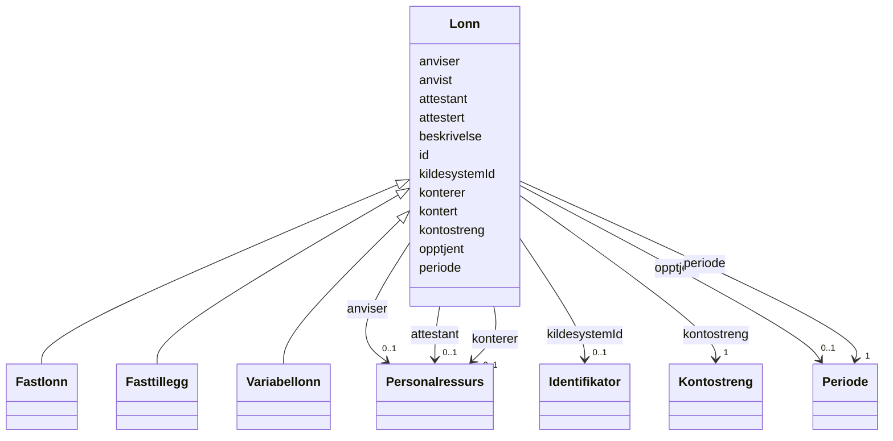

# Class: Lonn 


_Informasjon om lønn for eit arbeidsforhold (abstrakt base)._


* __NOTE__: this is an abstract class and should not be instantiated directly


URI: [adm:Lonn](https://schema.fintlabs.no/administrasjon/Lonn)





## Inheritance
* **Lonn**
    * [Fastlonn](fastlonn.md)
    * [Fasttillegg](fasttillegg.md)
    * [Variabellonn](variabellonn.md)


## Class Properties

| Property | Value |
| --- | --- |
| Class URI | [adm:Lonn](https://schema.fintlabs.no/administrasjon/Lonn) |


## Eigenskapar


  
  

  
  

  
  

  
  

  
  

  
  

  
  

  
  

  
  

  
  

  
  

  
  


  
  

  
  

  
  

  
  

  
  

  
  

  
  

  
  

  
  

  
  

  
  

  
  


  
  

  
  

  
  

  
  

  
  

  
  

  
  

  
  

  
  

  
  

  
  

  
  


  
  
  
  
    
  

  
  
  
  
    
  

  
  
  
  
    
  

  
  
  
  
    
  

  
  
  
  
    
  

  
  
  
  
    
  

  
  
  
  
    
  

  
  
  
  
    
  

  
  
  
  
    
  

  
  
  
  
    
  

  
  
  
  
    
  

  
  
  
  
    
  


### Andre

| Namn | Kardinalitet og domene | Beskriving |
| --- | --- | --- |
| [id](id.md) | 1 <br/> [Uriorcurie](uriorcurie.md) | URI-identifikator for ressursen |
| [anvist](anvist.md) | 0..1 <br/> [Datetime](datetime.md) | Tidspunkt då lønn vart anvist |
| [attestert](attestert.md) | 0..1 <br/> [Datetime](datetime.md) | Tidspunkt då lønn vart attestert |
| [beskrivelse](beskrivelse.md) | 1 <br/> [String](string.md) | Beskriving av lønn til føring på lønnslipp |
| [kildesystemId](kildesystemid.md) | 0..1 <br/> [Identifikator](identifikator.md) | Kjeldesystemets unike identifikator for lønn |
| [kontert](kontert.md) | 0..1 <br/> [Datetime](datetime.md) | Tidspunkt då lønn vart kontert |
| [kontostreng](kontostreng.md) | 1 <br/> [Kontostreng](kontostreng.md) | Kontering av lønn |
| [opptjent](opptjent.md) | 0..1 <br/> [Periode](periode.md) | Periode der lønn vart opptent |
| [periode](periode.md) | 1 <br/> [Periode](periode.md) | Periode lønn vert utbetalt |
| [anviser](anviser.md) | 0..1 <br/> [Personalressurs](personalressurs.md) | Personalressurs som har anvist lønsmeldinga etter fullmakt |
| [konterer](konterer.md) | 0..1 <br/> [Personalressurs](personalressurs.md) | Personalressurs som har kontert lønsmeldinga etter fullmakt |
| [attestant](attestant.md) | 0..1 <br/> [Personalressurs](personalressurs.md) | Personalressurs som har attestert lønsmeldinga etter fullmakt |


## Identifier and Mapping Information


### Schema Source


* from schema: https://data.norge.no/linkml/fint-administrasjon


## Mappings

| Mapping Type | Mapped Value |
| ---  | ---  |
| self | adm:Lonn |
| native | https://schema.fintlabs.no/administrasjon/:Lonn |


## LinkML Source

<!-- TODO: investigate https://stackoverflow.com/questions/37606292/how-to-create-tabbed-code-blocks-in-mkdocs-or-sphinx -->

### Direct

<details>
```yaml
name: Lonn
description: Informasjon om lønn for eit arbeidsforhold (abstrakt base).
from_schema: https://data.norge.no/linkml/fint-administrasjon
abstract: true
slots:
- id
attributes:
  anvist:
    name: anvist
    description: Tidspunkt då lønn vart anvist.
    in_subset:
    - Valgfri
    from_schema: https://data.norge.no/linkml/fint-administrasjon
    rank: 1000
    slot_uri: adm:anvist
    domain_of:
    - Lonn
    range: datetime
  attestert:
    name: attestert
    description: Tidspunkt då lønn vart attestert.
    in_subset:
    - Valgfri
    from_schema: https://data.norge.no/linkml/fint-administrasjon
    rank: 1000
    slot_uri: adm:attestert
    domain_of:
    - Lonn
    range: datetime
  beskrivelse:
    name: beskrivelse
    description: Beskriving av lønn til føring på lønnslipp.
    in_subset:
    - Obligatorisk
    from_schema: https://data.norge.no/linkml/fint-administrasjon
    rank: 1000
    slot_uri: adm:beskrivelse
    domain_of:
    - Lonn
    - Rolle
    - Periode
    range: string
    required: true
  kildesystemId:
    name: kildesystemId
    description: Kjeldesystemets unike identifikator for lønn.
    in_subset:
    - Valgfri
    from_schema: https://data.norge.no/linkml/fint-administrasjon
    rank: 1000
    slot_uri: adm:kildesystemId
    domain_of:
    - Lonn
    - Fravaer
    range: Identifikator
    inlined: true
  kontert:
    name: kontert
    description: Tidspunkt då lønn vart kontert.
    in_subset:
    - Valgfri
    from_schema: https://data.norge.no/linkml/fint-administrasjon
    rank: 1000
    slot_uri: adm:kontert
    domain_of:
    - Lonn
    range: datetime
  kontostreng:
    name: kontostreng
    description: Kontering av lønn.
    in_subset:
    - Obligatorisk
    from_schema: https://data.norge.no/linkml/fint-administrasjon
    rank: 1000
    slot_uri: adm:kontostreng
    domain_of:
    - Lonn
    range: Kontostreng
    required: true
    inlined: true
  opptjent:
    name: opptjent
    description: Periode der lønn vart opptent.
    in_subset:
    - Valgfri
    from_schema: https://data.norge.no/linkml/fint-administrasjon
    rank: 1000
    slot_uri: adm:opptjent
    domain_of:
    - Lonn
    range: Periode
    inlined: true
  periode:
    name: periode
    description: Periode lønn vert utbetalt.
    in_subset:
    - Obligatorisk
    from_schema: https://data.norge.no/linkml/fint-administrasjon
    rank: 1000
    slot_uri: adm:periode
    domain_of:
    - Lonn
    - Fravaer
    range: Periode
    required: true
    inlined: true
  anviser:
    name: anviser
    description: Personalressurs som har anvist lønsmeldinga etter fullmakt.
    in_subset:
    - Valgfri
    from_schema: https://data.norge.no/linkml/fint-administrasjon
    rank: 1000
    slot_uri: adm:anviser
    domain_of:
    - Lonn
    range: Personalressurs
  konterer:
    name: konterer
    description: Personalressurs som har kontert lønsmeldinga etter fullmakt.
    in_subset:
    - Valgfri
    from_schema: https://data.norge.no/linkml/fint-administrasjon
    rank: 1000
    slot_uri: adm:konterer
    domain_of:
    - Lonn
    range: Personalressurs
  attestant:
    name: attestant
    description: Personalressurs som har attestert lønsmeldinga etter fullmakt.
    in_subset:
    - Valgfri
    from_schema: https://data.norge.no/linkml/fint-administrasjon
    rank: 1000
    slot_uri: adm:attestant
    domain_of:
    - Lonn
    range: Personalressurs
class_uri: adm:Lonn

```
</details>

### Induced

<details>
```yaml
name: Lonn
description: Informasjon om lønn for eit arbeidsforhold (abstrakt base).
from_schema: https://data.norge.no/linkml/fint-administrasjon
abstract: true
attributes:
  anvist:
    name: anvist
    description: Tidspunkt då lønn vart anvist.
    in_subset:
    - Valgfri
    from_schema: https://data.norge.no/linkml/fint-administrasjon
    rank: 1000
    slot_uri: adm:anvist
    alias: anvist
    owner: Lonn
    domain_of:
    - Lonn
    range: datetime
  attestert:
    name: attestert
    description: Tidspunkt då lønn vart attestert.
    in_subset:
    - Valgfri
    from_schema: https://data.norge.no/linkml/fint-administrasjon
    rank: 1000
    slot_uri: adm:attestert
    alias: attestert
    owner: Lonn
    domain_of:
    - Lonn
    range: datetime
  beskrivelse:
    name: beskrivelse
    description: Beskriving av lønn til føring på lønnslipp.
    in_subset:
    - Obligatorisk
    from_schema: https://data.norge.no/linkml/fint-administrasjon
    rank: 1000
    slot_uri: adm:beskrivelse
    alias: beskrivelse
    owner: Lonn
    domain_of:
    - Lonn
    - Rolle
    - Periode
    range: string
    required: true
  kildesystemId:
    name: kildesystemId
    description: Kjeldesystemets unike identifikator for lønn.
    in_subset:
    - Valgfri
    from_schema: https://data.norge.no/linkml/fint-administrasjon
    rank: 1000
    slot_uri: adm:kildesystemId
    alias: kildesystemId
    owner: Lonn
    domain_of:
    - Lonn
    - Fravaer
    range: Identifikator
    inlined: true
  kontert:
    name: kontert
    description: Tidspunkt då lønn vart kontert.
    in_subset:
    - Valgfri
    from_schema: https://data.norge.no/linkml/fint-administrasjon
    rank: 1000
    slot_uri: adm:kontert
    alias: kontert
    owner: Lonn
    domain_of:
    - Lonn
    range: datetime
  kontostreng:
    name: kontostreng
    description: Kontering av lønn.
    in_subset:
    - Obligatorisk
    from_schema: https://data.norge.no/linkml/fint-administrasjon
    rank: 1000
    slot_uri: adm:kontostreng
    alias: kontostreng
    owner: Lonn
    domain_of:
    - Lonn
    range: Kontostreng
    required: true
    inlined: true
  opptjent:
    name: opptjent
    description: Periode der lønn vart opptent.
    in_subset:
    - Valgfri
    from_schema: https://data.norge.no/linkml/fint-administrasjon
    rank: 1000
    slot_uri: adm:opptjent
    alias: opptjent
    owner: Lonn
    domain_of:
    - Lonn
    range: Periode
    inlined: true
  periode:
    name: periode
    description: Periode lønn vert utbetalt.
    in_subset:
    - Obligatorisk
    from_schema: https://data.norge.no/linkml/fint-administrasjon
    rank: 1000
    slot_uri: adm:periode
    alias: periode
    owner: Lonn
    domain_of:
    - Lonn
    - Fravaer
    range: Periode
    required: true
    inlined: true
  anviser:
    name: anviser
    description: Personalressurs som har anvist lønsmeldinga etter fullmakt.
    in_subset:
    - Valgfri
    from_schema: https://data.norge.no/linkml/fint-administrasjon
    rank: 1000
    slot_uri: adm:anviser
    alias: anviser
    owner: Lonn
    domain_of:
    - Lonn
    range: Personalressurs
  konterer:
    name: konterer
    description: Personalressurs som har kontert lønsmeldinga etter fullmakt.
    in_subset:
    - Valgfri
    from_schema: https://data.norge.no/linkml/fint-administrasjon
    rank: 1000
    slot_uri: adm:konterer
    alias: konterer
    owner: Lonn
    domain_of:
    - Lonn
    range: Personalressurs
  attestant:
    name: attestant
    description: Personalressurs som har attestert lønsmeldinga etter fullmakt.
    in_subset:
    - Valgfri
    from_schema: https://data.norge.no/linkml/fint-administrasjon
    rank: 1000
    slot_uri: adm:attestant
    alias: attestant
    owner: Lonn
    domain_of:
    - Lonn
    range: Personalressurs
  id:
    name: id
    description: URI-identifikator for ressursen.
    from_schema: https://data.norge.no/linkml/fint-administrasjon
    rank: 1000
    identifier: true
    alias: id
    owner: Lonn
    domain_of:
    - Lonn
    - Fravaer
    - Fullmakt
    - Rolle
    - Arbeidslokasjon
    - Organisasjonselement
    - Personalressurs
    - Arbeidsforhold
    - Begrep
    - Valuta
    - Person
    - Kontaktperson
    - Virksomhet
    range: uriorcurie
    required: true
class_uri: adm:Lonn

```
</details>