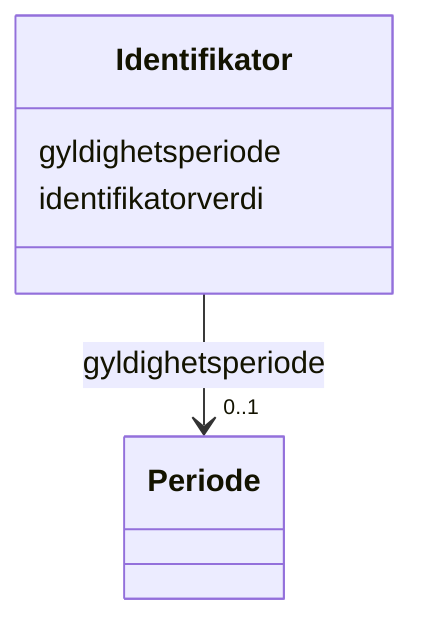

# Class: Identifikator 


_Unik identifikasjon til eit objekt._


URI: [fint:Identifikator](https://schema.fintlabs.no/Identifikator)





<!-- no inheritance hierarchy -->

## Class Properties

| Property | Value |
| --- | --- |
| Class URI | [fint:Identifikator](https://schema.fintlabs.no/Identifikator) |


## Eigenskapar


  
  

  
  


  
  

  
  


  
  

  
  


  
  
  
  
    
  

  
  
  
  
    
  


### Andre

| Namn | Kardinalitet og domene | Beskriving |
| --- | --- | --- |
| [identifikatorverdi](identifikatorverdi.md) | 1 <br/> [String](String.md) | Ein konkret kombinasjon av teikn og/eller bokstavar som utgjer ein bestemt id... |
| [gyldighetsperiode](gyldighetsperiode.md) | 0..1 <br/> [Periode](Periode.md) | Perioden ein gjeven identifikator er gyldig |


## Usages

| used by | used in | type | used |
| ---  | --- | --- | --- |
| [Mappe](Mappe.md) | [mappeId](mappeId.md) | range | [Identifikator](Identifikator.md) |
| [Saksmappe](Saksmappe.md) | [mappeId](mappeId.md) | range | [Identifikator](Identifikator.md) |
| [Arkivressurs](Arkivressurs.md) | [kildesystemId](kildesystemId.md) | range | [Identifikator](Identifikator.md) |
| [Sak](Sak.md) | [mappeId](mappeId.md) | range | [Identifikator](Identifikator.md) |
| [Personalmappe](Personalmappe.md) | [mappeId](mappeId.md) | range | [Identifikator](Identifikator.md) |
| [DispensasjonAutomatiskFredaKulturminne](DispensasjonAutomatiskFredaKulturminne.md) | [soeknadsnummer](soeknadsnummer.md) | range | [Identifikator](Identifikator.md) |
| [DispensasjonAutomatiskFredaKulturminne](DispensasjonAutomatiskFredaKulturminne.md) | [mappeId](mappeId.md) | range | [Identifikator](Identifikator.md) |
| [TilskuddFartoy](TilskuddFartoy.md) | [soeknadsnummer](soeknadsnummer.md) | range | [Identifikator](Identifikator.md) |
| [TilskuddFartoy](TilskuddFartoy.md) | [mappeId](mappeId.md) | range | [Identifikator](Identifikator.md) |
| [TilskuddFredaBygningPrivatEie](TilskuddFredaBygningPrivatEie.md) | [soeknadsnummer](soeknadsnummer.md) | range | [Identifikator](Identifikator.md) |
| [TilskuddFredaBygningPrivatEie](TilskuddFredaBygningPrivatEie.md) | [mappeId](mappeId.md) | range | [Identifikator](Identifikator.md) |
| [SoeknadDrosjeloeyve](SoeknadDrosjeloeyve.md) | [mappeId](mappeId.md) | range | [Identifikator](Identifikator.md) |
| [Enhet](Enhet.md) | [organisasjonsnummer](organisasjonsnummer.md) | range | [Identifikator](Identifikator.md) |
| [Valuta](Valuta.md) | [bokstavkode](bokstavkode.md) | range | [Identifikator](Identifikator.md) |
| [Valuta](Valuta.md) | [nummerkode](nummerkode.md) | range | [Identifikator](Identifikator.md) |
| [Person](Person.md) | [fodselsnummer](fodselsnummer.md) | range | [Identifikator](Identifikator.md) |
| [Virksomhet](Virksomhet.md) | [virksomhetsId](virksomhetsId.md) | range | [Identifikator](Identifikator.md) |
| [Virksomhet](Virksomhet.md) | [organisasjonsnummer](organisasjonsnummer.md) | range | [Identifikator](Identifikator.md) |


## Identifier and Mapping Information


### Schema Source


* from schema: https://data.norge.no/linkml/fint-arkiv


## Mappings

| Mapping Type | Mapped Value |
| ---  | ---  |
| self | fint:Identifikator |
| native | https://schema.fintlabs.no/arkiv/:Identifikator |


## LinkML Source

<!-- TODO: investigate https://stackoverflow.com/questions/37606292/how-to-create-tabbed-code-blocks-in-mkdocs-or-sphinx -->

### Direct

<details>
```yaml
name: Identifikator
description: Unik identifikasjon til eit objekt.
from_schema: https://data.norge.no/linkml/fint-arkiv
attributes:
  identifikatorverdi:
    name: identifikatorverdi
    description: Ein konkret kombinasjon av teikn og/eller bokstavar som utgjer ein
      bestemt identifikator.
    from_schema: https://data.norge.no/linkml/fint-common
    rank: 1000
    slot_uri: fint:identifikatorverdi
    domain_of:
    - Identifikator
    range: string
    required: true
  gyldighetsperiode:
    name: gyldighetsperiode
    description: Perioden ein gjeven identifikator er gyldig.
    from_schema: https://data.norge.no/linkml/fint-common
    slot_uri: fint:gyldighetsperiode
    domain_of:
    - AdministrativEnhet
    - DokumentStatus
    - DokumentType
    - Format
    - JournalpostType
    - JournalStatus
    - Klassifikasjonstype
    - KorrespondansepartType
    - Merknadstype
    - PartRolle
    - Rolle
    - Saksmappetype
    - Saksstatus
    - Skjermingshjemmel
    - Tilgangsgruppe
    - Tilgangsrestriksjon
    - TilknyttetRegistreringSom
    - Variantformat
    - Begrep
    - Identifikator
    range: Periode
    inlined: true
class_uri: fint:Identifikator

```
</details>

### Induced

<details>
```yaml
name: Identifikator
description: Unik identifikasjon til eit objekt.
from_schema: https://data.norge.no/linkml/fint-arkiv
attributes:
  identifikatorverdi:
    name: identifikatorverdi
    description: Ein konkret kombinasjon av teikn og/eller bokstavar som utgjer ein
      bestemt identifikator.
    from_schema: https://data.norge.no/linkml/fint-common
    rank: 1000
    slot_uri: fint:identifikatorverdi
    alias: identifikatorverdi
    owner: Identifikator
    domain_of:
    - Identifikator
    range: string
    required: true
  gyldighetsperiode:
    name: gyldighetsperiode
    description: Perioden ein gjeven identifikator er gyldig.
    from_schema: https://data.norge.no/linkml/fint-common
    slot_uri: fint:gyldighetsperiode
    alias: gyldighetsperiode
    owner: Identifikator
    domain_of:
    - AdministrativEnhet
    - DokumentStatus
    - DokumentType
    - Format
    - JournalpostType
    - JournalStatus
    - Klassifikasjonstype
    - KorrespondansepartType
    - Merknadstype
    - PartRolle
    - Rolle
    - Saksmappetype
    - Saksstatus
    - Skjermingshjemmel
    - Tilgangsgruppe
    - Tilgangsrestriksjon
    - TilknyttetRegistreringSom
    - Variantformat
    - Begrep
    - Identifikator
    range: Periode
    inlined: true
class_uri: fint:Identifikator

```
</details>