# Class: Saksmappe 


_Abstrakt spesialisering av Mappe som svarar til ei "sak" i Noark._


* __NOTE__: this is an abstract class and should not be instantiated directly


URI: [ark:Saksmappe](https://schema.fintlabs.no/arkiv/Saksmappe)

```mermaid
 classDiagram
    class Saksmappe
    click Saksmappe href "../Saksmappe/"
      Mappe <|-- Saksmappe
        click Mappe href "../Mappe/"
      

      Saksmappe <|-- Sak
        click Sak href "../Sak/"
      Saksmappe <|-- Personalmappe
        click Personalmappe href "../Personalmappe/"
      Saksmappe <|-- DispensasjonAutomatiskFredaKulturminne
        click DispensasjonAutomatiskFredaKulturminne href "../DispensasjonAutomatiskFredaKulturminne/"
      Saksmappe <|-- TilskuddFartoy
        click TilskuddFartoy href "../TilskuddFartoy/"
      Saksmappe <|-- TilskuddFredaBygningPrivatEie
        click TilskuddFredaBygningPrivatEie href "../TilskuddFredaBygningPrivatEie/"
      Saksmappe <|-- SoeknadDrosjeloeyve
        click SoeknadDrosjeloeyve href "../SoeknadDrosjeloeyve/"
      

      Saksmappe : administrativEnhet
        
          
    
        
        
        Saksmappe --> "1" AdministrativEnhet : administrativEnhet
        click AdministrativEnhet href "../AdministrativEnhet/"
    

        
      Saksmappe : arkivdel
        
          
    
        
        
        Saksmappe --> "0..1" Arkivdel : arkivdel
        click Arkivdel href "../Arkivdel/"
    

        
      Saksmappe : avsluttetAv
        
          
    
        
        
        Saksmappe --> "0..1" Arkivressurs : avsluttetAv
        click Arkivressurs href "../Arkivressurs/"
    

        
      Saksmappe : avsluttetDato
        
      Saksmappe : beskrivelse
        
      Saksmappe : id
        
      Saksmappe : journalenhet
        
          
    
        
        
        Saksmappe --> "0..1" AdministrativEnhet : journalenhet
        click AdministrativEnhet href "../AdministrativEnhet/"
    

        
      Saksmappe : journalpost
        
          
    
        
        
        Saksmappe --> "*" Journalpost : journalpost
        click Journalpost href "../Journalpost/"
    

        
      Saksmappe : klasse
        
          
    
        
        
        Saksmappe --> "*" Klasse : klasse
        click Klasse href "../Klasse/"
    

        
      Saksmappe : mappeId
        
          
    
        
        
        Saksmappe --> "0..1" Identifikator : mappeId
        click Identifikator href "../Identifikator/"
    

        
      Saksmappe : merknad
        
          
    
        
        
        Saksmappe --> "*" Merknad : merknad
        click Merknad href "../Merknad/"
    

        
      Saksmappe : noekkelord
        
      Saksmappe : offentligTittel
        
      Saksmappe : opprettetAv
        
          
    
        
        
        Saksmappe --> "1" Arkivressurs : opprettetAv
        click Arkivressurs href "../Arkivressurs/"
    

        
      Saksmappe : opprettetDato
        
      Saksmappe : part
        
          
    
        
        
        Saksmappe --> "*" Part : part
        click Part href "../Part/"
    

        
      Saksmappe : saksaar
        
      Saksmappe : saksansvarlig
        
          
    
        
        
        Saksmappe --> "1" Arkivressurs : saksansvarlig
        click Arkivressurs href "../Arkivressurs/"
    

        
      Saksmappe : saksdato
        
      Saksmappe : saksmappetype
        
          
    
        
        
        Saksmappe --> "0..1" Saksmappetype : saksmappetype
        click Saksmappetype href "../Saksmappetype/"
    

        
      Saksmappe : sakssekvensnummer
        
      Saksmappe : saksstatus
        
          
    
        
        
        Saksmappe --> "1" Saksstatus : saksstatus
        click Saksstatus href "../Saksstatus/"
    

        
      Saksmappe : skjerming
        
          
    
        
        
        Saksmappe --> "0..1" Skjerming : skjerming
        click Skjerming href "../Skjerming/"
    

        
      Saksmappe : tilgangsgruppe
        
          
    
        
        
        Saksmappe --> "0..1" Tilgangsgruppe : tilgangsgruppe
        click Tilgangsgruppe href "../Tilgangsgruppe/"
    

        
      Saksmappe : tittel
        
      Saksmappe : utlaantDato
        
      
```





## Inheritance
* [Mappe](Mappe.md)
    * **Saksmappe**
        * [Sak](Sak.md)
        * [Personalmappe](Personalmappe.md)
        * [DispensasjonAutomatiskFredaKulturminne](DispensasjonAutomatiskFredaKulturminne.md)
        * [TilskuddFartoy](TilskuddFartoy.md)
        * [TilskuddFredaBygningPrivatEie](TilskuddFredaBygningPrivatEie.md)
        * [SoeknadDrosjeloeyve](SoeknadDrosjeloeyve.md)


## Class Properties

| Property | Value |
| --- | --- |
| Class URI | [ark:Saksmappe](https://schema.fintlabs.no/arkiv/Saksmappe) |


## Eigenskapar


  
  

  
  

  
  

  
  

  
  

  
  

  
  

  
  

  
  

  
  

  
  


  
  

  
  

  
  

  
  

  
  

  
  

  
  

  
  

  
  

  
  

  
  


  
  

  
  

  
  

  
  

  
  

  
  

  
  

  
  

  
  

  
  

  
  


  
  
  
  
    
  

  
  
  
  
    
  

  
  
  
  
    
  

  
  
  
  
    
  

  
  
  
  
    
  

  
  
  
  
    
  

  
  
  
  
    
  

  
  
  
  
    
  

  
  
  
  
    
  

  
  
  
  
    
  

  
  
  
  
    
  


### Andre

| Namn | Kardinalitet og domene | Beskriving |
| --- | --- | --- |
| [journalpost](journalpost.md) | * <br/> [Journalpost](Journalpost.md) | Journalpostar knytt til saksmappa |
| [saksaar](saksaar.md) | 0..1 <br/> [String](String.md) | Inngår i M003 mappeID — viser året saksmappa vart oppretta |
| [saksdato](saksdato.md) | 0..1 <br/> [Datetime](Datetime.md) | Datoen saka er oppretta |
| [sakssekvensnummer](sakssekvensnummer.md) | 0..1 <br/> [String](String.md) | Inngår i M003 mappeID — viser rekkjefølgja saksmappene vart oppretta |
| [utlaantDato](utlaantDato.md) | 0..1 <br/> [Datetime](Datetime.md) | Dato ein fysisk saksmappe eller journalpost vart utlånt |
| [saksmappetype](saksmappetype.md) | 0..1 <br/> [Saksmappetype](Saksmappetype.md) | Type saksmappe |
| [saksstatus](saksstatus.md) | 1 <br/> [Saksstatus](Saksstatus.md) | Status til saksmappa |
| [tilgangsgruppe](tilgangsgruppe.md) | 0..1 <br/> [Tilgangsgruppe](Tilgangsgruppe.md) | Tilgangsgruppe som har tilgang til saksmappa |
| [journalenhet](journalenhet.md) | 0..1 <br/> [AdministrativEnhet](AdministrativEnhet.md) | Eining med arkivmessig ansvar for saksmappa |
| [administrativEnhet](administrativEnhet.md) | 1 <br/> [AdministrativEnhet](AdministrativEnhet.md) | Administrativ eining som har ansvar for saksbehandlinga |
| [saksansvarlig](saksansvarlig.md) | 1 <br/> [Arkivressurs](Arkivressurs.md) | Person som er saksansvarleg |


### Arva

| Namn | Kardinalitet og domene | Beskriving | Frå |
| --- | --- | --- | --- || [id](id.md) | 1 <br/> [Uriorcurie](Uriorcurie.md) | URI-identifikator for ressursen | [Mappe](Mappe.md) |
| [avsluttetDato](avsluttetDato.md) | 0..1 <br/> [Datetime](Datetime.md) | Dato og klokkeslett når arkivenheten vart avslutta/lukka | [Mappe](Mappe.md) |
| [beskrivelse](beskrivelse.md) | 0..1 <br/> [String](String.md) | Tekstleg skildring av arkivenheten | [Mappe](Mappe.md) |
| [klasse](klasse.md) | * <br/> [Klasse](Klasse.md) | Klassifisering av mappe | [Mappe](Mappe.md) |
| [mappeId](mappeId.md) | 0..1 <br/> [Identifikator](Identifikator.md) | Eintydig identifikasjon av mappa innanfor arkivet | [Mappe](Mappe.md) |
| [merknad](merknad.md) | * <br/> [Merknad](Merknad.md) | Merknader knytt til mappe | [Mappe](Mappe.md) |
| [noekkelord](noekkelord.md) | * <br/> [String](String.md) | Nøkkelord som skildrar innhaldet | [Mappe](Mappe.md) |
| [offentligTittel](offentligTittel.md) | 0..1 <br/> [String](String.md) | Offentleg tittel der skjerma ord er fjerna | [Mappe](Mappe.md) |
| [opprettetDato](opprettetDato.md) | 0..1 <br/> [Datetime](Datetime.md) | Dato og klokkeslett arkivenheten vart oppretta/registrert | [Mappe](Mappe.md) |
| [part](part.md) | * <br/> [Part](Part.md) | Partar til mappe | [Mappe](Mappe.md) |
| [skjerming](skjerming.md) | 0..1 <br/> [Skjerming](Skjerming.md) | Skjerming av mappe | [Mappe](Mappe.md) |
| [tittel](tittel.md) | 0..1 <br/> [String](String.md) | Tittel eller namn på arkivenheten | [Mappe](Mappe.md) |
| [arkivdel](arkivdel.md) | 0..1 <br/> [Arkivdel](Arkivdel.md) | Arkivdel mappa tilhøyrer | [Mappe](Mappe.md) |
| [avsluttetAv](avsluttetAv.md) | 0..1 <br/> [Arkivressurs](Arkivressurs.md) | Person som avslutta/lukka arkivenheten | [Mappe](Mappe.md) |
| [opprettetAv](opprettetAv.md) | 1 <br/> [Arkivressurs](Arkivressurs.md) | Person som oppretta/registrerte arkivenheten | [Mappe](Mappe.md) |


## Identifier and Mapping Information


### Schema Source


* from schema: https://data.norge.no/linkml/fint-arkiv


## Mappings

| Mapping Type | Mapped Value |
| ---  | ---  |
| self | ark:Saksmappe |
| native | https://schema.fintlabs.no/arkiv/:Saksmappe |


## LinkML Source

<!-- TODO: investigate https://stackoverflow.com/questions/37606292/how-to-create-tabbed-code-blocks-in-mkdocs-or-sphinx -->

### Direct

<details>
```yaml
name: Saksmappe
description: Abstrakt spesialisering av Mappe som svarar til ei "sak" i Noark.
from_schema: https://data.norge.no/linkml/fint-arkiv
is_a: Mappe
abstract: true
attributes:
  journalpost:
    name: journalpost
    description: Journalpostar knytt til saksmappa.
    in_subset:
    - Valgfri
    from_schema: https://data.norge.no/linkml/fint-arkiv
    rank: 1000
    slot_uri: ark:journalpost
    domain_of:
    - Saksmappe
    range: Journalpost
    multivalued: true
  saksaar:
    name: saksaar
    description: Inngår i M003 mappeID — viser året saksmappa vart oppretta.
    in_subset:
    - Valgfri
    from_schema: https://data.norge.no/linkml/fint-arkiv
    rank: 1000
    slot_uri: ark:saksaar
    domain_of:
    - Saksmappe
    range: string
  saksdato:
    name: saksdato
    description: Datoen saka er oppretta.
    in_subset:
    - Valgfri
    from_schema: https://data.norge.no/linkml/fint-arkiv
    rank: 1000
    slot_uri: ark:saksdato
    domain_of:
    - Saksmappe
    range: datetime
  sakssekvensnummer:
    name: sakssekvensnummer
    description: Inngår i M003 mappeID — viser rekkjefølgja saksmappene vart oppretta.
    in_subset:
    - Valgfri
    from_schema: https://data.norge.no/linkml/fint-arkiv
    rank: 1000
    slot_uri: ark:sakssekvensnummer
    domain_of:
    - Saksmappe
    range: string
  utlaantDato:
    name: utlaantDato
    description: Dato ein fysisk saksmappe eller journalpost vart utlånt.
    in_subset:
    - Valgfri
    from_schema: https://data.norge.no/linkml/fint-arkiv
    rank: 1000
    slot_uri: ark:utlaantDato
    domain_of:
    - Saksmappe
    range: datetime
  saksmappetype:
    name: saksmappetype
    description: Type saksmappe.
    in_subset:
    - Valgfri
    from_schema: https://data.norge.no/linkml/fint-arkiv
    rank: 1000
    slot_uri: ark:saksmappetype
    domain_of:
    - Saksmappe
    range: Saksmappetype
  saksstatus:
    name: saksstatus
    description: Status til saksmappa.
    in_subset:
    - Obligatorisk
    from_schema: https://data.norge.no/linkml/fint-arkiv
    rank: 1000
    slot_uri: ark:saksstatus
    domain_of:
    - Saksmappe
    range: Saksstatus
    required: true
  tilgangsgruppe:
    name: tilgangsgruppe
    description: Tilgangsgruppe som har tilgang til saksmappa.
    in_subset:
    - Valgfri
    from_schema: https://data.norge.no/linkml/fint-arkiv
    rank: 1000
    slot_uri: ark:tilgangsgruppe
    domain_of:
    - Saksmappe
    - Registrering
    range: Tilgangsgruppe
  journalenhet:
    name: journalenhet
    description: Eining med arkivmessig ansvar for saksmappa.
    in_subset:
    - Valgfri
    from_schema: https://data.norge.no/linkml/fint-arkiv
    rank: 1000
    slot_uri: ark:journalenhet
    domain_of:
    - Saksmappe
    - Journalpost
    range: AdministrativEnhet
  administrativEnhet:
    name: administrativEnhet
    description: Administrativ eining som har ansvar for saksbehandlinga.
    in_subset:
    - Obligatorisk
    from_schema: https://data.norge.no/linkml/fint-arkiv
    rank: 1000
    slot_uri: ark:administrativEnhet
    domain_of:
    - Saksmappe
    - Registrering
    - Tilgang
    range: AdministrativEnhet
    required: true
  saksansvarlig:
    name: saksansvarlig
    description: Person som er saksansvarleg.
    in_subset:
    - Obligatorisk
    from_schema: https://data.norge.no/linkml/fint-arkiv
    rank: 1000
    slot_uri: ark:saksansvarlig
    domain_of:
    - Saksmappe
    range: Arkivressurs
    required: true
class_uri: ark:Saksmappe

```
</details>

### Induced

<details>
```yaml
name: Saksmappe
description: Abstrakt spesialisering av Mappe som svarar til ei "sak" i Noark.
from_schema: https://data.norge.no/linkml/fint-arkiv
is_a: Mappe
abstract: true
attributes:
  journalpost:
    name: journalpost
    description: Journalpostar knytt til saksmappa.
    in_subset:
    - Valgfri
    from_schema: https://data.norge.no/linkml/fint-arkiv
    rank: 1000
    slot_uri: ark:journalpost
    alias: journalpost
    owner: Saksmappe
    domain_of:
    - Saksmappe
    range: Journalpost
    multivalued: true
  saksaar:
    name: saksaar
    description: Inngår i M003 mappeID — viser året saksmappa vart oppretta.
    in_subset:
    - Valgfri
    from_schema: https://data.norge.no/linkml/fint-arkiv
    rank: 1000
    slot_uri: ark:saksaar
    alias: saksaar
    owner: Saksmappe
    domain_of:
    - Saksmappe
    range: string
  saksdato:
    name: saksdato
    description: Datoen saka er oppretta.
    in_subset:
    - Valgfri
    from_schema: https://data.norge.no/linkml/fint-arkiv
    rank: 1000
    slot_uri: ark:saksdato
    alias: saksdato
    owner: Saksmappe
    domain_of:
    - Saksmappe
    range: datetime
  sakssekvensnummer:
    name: sakssekvensnummer
    description: Inngår i M003 mappeID — viser rekkjefølgja saksmappene vart oppretta.
    in_subset:
    - Valgfri
    from_schema: https://data.norge.no/linkml/fint-arkiv
    rank: 1000
    slot_uri: ark:sakssekvensnummer
    alias: sakssekvensnummer
    owner: Saksmappe
    domain_of:
    - Saksmappe
    range: string
  utlaantDato:
    name: utlaantDato
    description: Dato ein fysisk saksmappe eller journalpost vart utlånt.
    in_subset:
    - Valgfri
    from_schema: https://data.norge.no/linkml/fint-arkiv
    rank: 1000
    slot_uri: ark:utlaantDato
    alias: utlaantDato
    owner: Saksmappe
    domain_of:
    - Saksmappe
    range: datetime
  saksmappetype:
    name: saksmappetype
    description: Type saksmappe.
    in_subset:
    - Valgfri
    from_schema: https://data.norge.no/linkml/fint-arkiv
    rank: 1000
    slot_uri: ark:saksmappetype
    alias: saksmappetype
    owner: Saksmappe
    domain_of:
    - Saksmappe
    range: Saksmappetype
  saksstatus:
    name: saksstatus
    description: Status til saksmappa.
    in_subset:
    - Obligatorisk
    from_schema: https://data.norge.no/linkml/fint-arkiv
    rank: 1000
    slot_uri: ark:saksstatus
    alias: saksstatus
    owner: Saksmappe
    domain_of:
    - Saksmappe
    range: Saksstatus
    required: true
  tilgangsgruppe:
    name: tilgangsgruppe
    description: Tilgangsgruppe som har tilgang til saksmappa.
    in_subset:
    - Valgfri
    from_schema: https://data.norge.no/linkml/fint-arkiv
    rank: 1000
    slot_uri: ark:tilgangsgruppe
    alias: tilgangsgruppe
    owner: Saksmappe
    domain_of:
    - Saksmappe
    - Registrering
    range: Tilgangsgruppe
  journalenhet:
    name: journalenhet
    description: Eining med arkivmessig ansvar for saksmappa.
    in_subset:
    - Valgfri
    from_schema: https://data.norge.no/linkml/fint-arkiv
    rank: 1000
    slot_uri: ark:journalenhet
    alias: journalenhet
    owner: Saksmappe
    domain_of:
    - Saksmappe
    - Journalpost
    range: AdministrativEnhet
  administrativEnhet:
    name: administrativEnhet
    description: Administrativ eining som har ansvar for saksbehandlinga.
    in_subset:
    - Obligatorisk
    from_schema: https://data.norge.no/linkml/fint-arkiv
    rank: 1000
    slot_uri: ark:administrativEnhet
    alias: administrativEnhet
    owner: Saksmappe
    domain_of:
    - Saksmappe
    - Registrering
    - Tilgang
    range: AdministrativEnhet
    required: true
  saksansvarlig:
    name: saksansvarlig
    description: Person som er saksansvarleg.
    in_subset:
    - Obligatorisk
    from_schema: https://data.norge.no/linkml/fint-arkiv
    rank: 1000
    slot_uri: ark:saksansvarlig
    alias: saksansvarlig
    owner: Saksmappe
    domain_of:
    - Saksmappe
    range: Arkivressurs
    required: true
  id:
    name: id
    description: URI-identifikator for ressursen.
    from_schema: https://data.norge.no/linkml/fint-arkiv
    rank: 1000
    identifier: true
    alias: id
    owner: Saksmappe
    domain_of:
    - Mappe
    - Registrering
    - AdministrativEnhet
    - Arkivdel
    - Arkivressurs
    - Autorisasjon
    - Dokumentfil
    - Klassifikasjonssystem
    - Tilgang
    - Dokumentbeskrivelse
    - DokumentStatus
    - DokumentType
    - Format
    - JournalpostType
    - JournalStatus
    - Klassifikasjonstype
    - KorrespondansepartType
    - Merknadstype
    - PartRolle
    - Rolle
    - Saksmappetype
    - Saksstatus
    - Skjermingshjemmel
    - Tilgangsgruppe
    - Tilgangsrestriksjon
    - TilknyttetRegistreringSom
    - Variantformat
    - Begrep
    - Valuta
    - Person
    - Kontaktperson
    - Virksomhet
    range: uriorcurie
    required: true
  avsluttetDato:
    name: avsluttetDato
    description: Dato og klokkeslett når arkivenheten vart avslutta/lukka.
    in_subset:
    - Valgfri
    from_schema: https://data.norge.no/linkml/fint-arkiv
    rank: 1000
    slot_uri: ark:avsluttetDato
    alias: avsluttetDato
    owner: Saksmappe
    domain_of:
    - Mappe
    - Klassifikasjonssystem
    range: datetime
  beskrivelse:
    name: beskrivelse
    description: Tekstleg skildring av arkivenheten.
    in_subset:
    - Valgfri
    from_schema: https://data.norge.no/linkml/fint-arkiv
    rank: 1000
    slot_uri: ark:beskrivelse
    alias: beskrivelse
    owner: Saksmappe
    domain_of:
    - Mappe
    - Registrering
    - Klassifikasjonssystem
    - Dokumentbeskrivelse
    - Periode
    range: string
  klasse:
    name: klasse
    description: Klassifisering av mappe.
    in_subset:
    - Valgfri
    from_schema: https://data.norge.no/linkml/fint-arkiv
    rank: 1000
    slot_uri: ark:klasse
    alias: klasse
    owner: Saksmappe
    domain_of:
    - Mappe
    - Registrering
    - Klassifikasjonssystem
    range: Klasse
    multivalued: true
    inlined: true
    inlined_as_list: true
  mappeId:
    name: mappeId
    description: Eintydig identifikasjon av mappa innanfor arkivet.
    in_subset:
    - Valgfri
    from_schema: https://data.norge.no/linkml/fint-arkiv
    rank: 1000
    slot_uri: ark:mappeId
    alias: mappeId
    owner: Saksmappe
    domain_of:
    - Mappe
    range: Identifikator
    inlined: true
  merknad:
    name: merknad
    description: Merknader knytt til mappe.
    in_subset:
    - Valgfri
    from_schema: https://data.norge.no/linkml/fint-arkiv
    rank: 1000
    slot_uri: ark:merknad
    alias: merknad
    owner: Saksmappe
    domain_of:
    - Mappe
    - Registrering
    range: Merknad
    multivalued: true
    inlined: true
    inlined_as_list: true
  noekkelord:
    name: noekkelord
    description: Nøkkelord som skildrar innhaldet.
    in_subset:
    - Valgfri
    from_schema: https://data.norge.no/linkml/fint-arkiv
    rank: 1000
    slot_uri: ark:noekkelord
    alias: noekkelord
    owner: Saksmappe
    domain_of:
    - Mappe
    range: string
    multivalued: true
  offentligTittel:
    name: offentligTittel
    description: Offentleg tittel der skjerma ord er fjerna.
    in_subset:
    - Valgfri
    from_schema: https://data.norge.no/linkml/fint-arkiv
    rank: 1000
    slot_uri: ark:offentligTittel
    alias: offentligTittel
    owner: Saksmappe
    domain_of:
    - Mappe
    - Registrering
    range: string
  opprettetDato:
    name: opprettetDato
    description: Dato og klokkeslett arkivenheten vart oppretta/registrert.
    in_subset:
    - Valgfri
    from_schema: https://data.norge.no/linkml/fint-arkiv
    rank: 1000
    slot_uri: ark:opprettetDato
    alias: opprettetDato
    owner: Saksmappe
    domain_of:
    - Mappe
    - Registrering
    - Klassifikasjonssystem
    - Dokumentbeskrivelse
    range: datetime
  part:
    name: part
    description: Partar til mappe.
    in_subset:
    - Valgfri
    from_schema: https://data.norge.no/linkml/fint-arkiv
    rank: 1000
    slot_uri: ark:part
    alias: part
    owner: Saksmappe
    domain_of:
    - Mappe
    - Registrering
    - Dokumentbeskrivelse
    range: Part
    multivalued: true
    inlined: true
    inlined_as_list: true
  skjerming:
    name: skjerming
    description: Skjerming av mappe.
    in_subset:
    - Valgfri
    from_schema: https://data.norge.no/linkml/fint-arkiv
    rank: 1000
    slot_uri: ark:skjerming
    alias: skjerming
    owner: Saksmappe
    domain_of:
    - Mappe
    - Registrering
    - Dokumentbeskrivelse
    - Klasse
    - Korrespondansepart
    range: Skjerming
    inlined: true
  tittel:
    name: tittel
    description: Tittel eller namn på arkivenheten.
    in_subset:
    - Valgfri
    from_schema: https://data.norge.no/linkml/fint-arkiv
    rank: 1000
    slot_uri: ark:tittel
    alias: tittel
    owner: Saksmappe
    domain_of:
    - Mappe
    - Registrering
    - Arkivdel
    - Klassifikasjonssystem
    - Tilgang
    - Dokumentbeskrivelse
    - Klasse
    range: string
  arkivdel:
    name: arkivdel
    description: Arkivdel mappa tilhøyrer.
    in_subset:
    - Valgfri
    from_schema: https://data.norge.no/linkml/fint-arkiv
    rank: 1000
    slot_uri: ark:arkivdel
    alias: arkivdel
    owner: Saksmappe
    domain_of:
    - Mappe
    - Registrering
    - Klassifikasjonssystem
    - Tilgang
    range: Arkivdel
  avsluttetAv:
    name: avsluttetAv
    description: Person som avslutta/lukka arkivenheten.
    in_subset:
    - Valgfri
    from_schema: https://data.norge.no/linkml/fint-arkiv
    rank: 1000
    slot_uri: ark:avsluttetAv
    alias: avsluttetAv
    owner: Saksmappe
    domain_of:
    - Mappe
    - Klassifikasjonssystem
    range: Arkivressurs
  opprettetAv:
    name: opprettetAv
    description: Person som oppretta/registrerte arkivenheten.
    in_subset:
    - Obligatorisk
    from_schema: https://data.norge.no/linkml/fint-arkiv
    rank: 1000
    slot_uri: ark:opprettetAv
    alias: opprettetAv
    owner: Saksmappe
    domain_of:
    - Mappe
    - Registrering
    - Klassifikasjonssystem
    - Dokumentbeskrivelse
    - Dokumentobjekt
    range: Arkivressurs
    required: true
class_uri: ark:Saksmappe

```
</details>