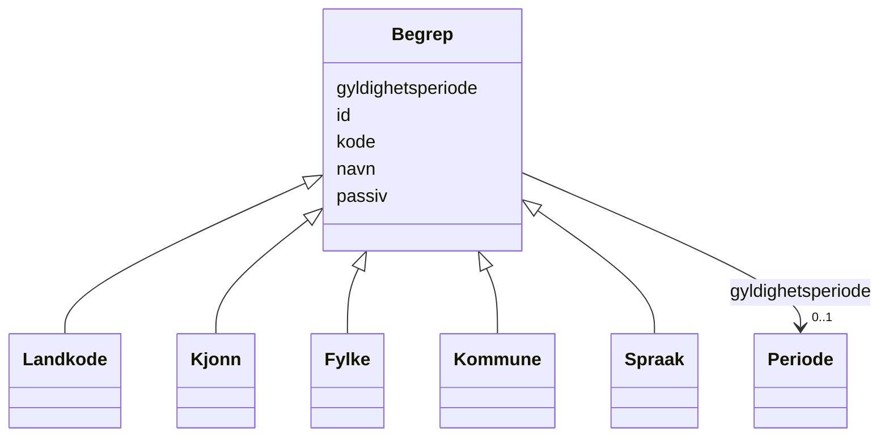

# Class: Begrep 


_Abstrakt fellesbase for alle FINT-kodeverk._


* __NOTE__: this is an abstract class and should not be instantiated directly


URI: [fint:Begrep](https://schema.fintlabs.no/Begrep)





## Inheritance
* **Begrep**
    * [Landkode](Landkode.md)
    * [Kjonn](Kjonn.md)
    * [Fylke](Fylke.md)
    * [Kommune](Kommune.md)
    * [Spraak](Spraak.md)


## Class Properties

| Property | Value |
| --- | --- |
| Class URI | [fint:Begrep](https://schema.fintlabs.no/Begrep) |


## Eigenskapar


  
  

  
  

  
  

  
  

  
  


  
  

  
  

  
  

  
  

  
  


  
  

  
  

  
  

  
  

  
  


  
  
  
  
    
  

  
  
  
  
    
  

  
  
  
  
    
  

  
  
  
  
    
  

  
  
  
  
    
  


### Andre

| Namn | Kardinalitet og domene | Beskriving |
| --- | --- | --- |
| [id](id.md) | 1 <br/> [Uriorcurie](Uriorcurie.md) | URI-identifikator (tilsvarar systemId/fakturanummer/transaksjonsId i FINT) |
| [kode](kode.md) | 1 <br/> [String](String.md) | Verdi som identifiserer omgrepet |
| [navn](navn.md) | 1 <br/> [String](String.md) | Hovudnamn for omgrepet |
| [gyldighetsperiode](gyldighetsperiode.md) | 0..1 <br/> [Periode](Periode.md) | Angir gyldighetsperioden for eit omgrep/kode |
| [passiv](passiv.md) | 0..1 <br/> [Boolean](Boolean.md) | Angir at koden er passiv og ikkje kan veljast |


## Identifier and Mapping Information


### Schema Source


* from schema: https://data.norge.no/linkml/fint-okonomi


## Mappings

| Mapping Type | Mapped Value |
| ---  | ---  |
| self | fint:Begrep |
| native | https://schema.fintlabs.no/okonomi/:Begrep |


## LinkML Source

<!-- TODO: investigate https://stackoverflow.com/questions/37606292/how-to-create-tabbed-code-blocks-in-mkdocs-or-sphinx -->

### Direct

<details>
```yaml
name: Begrep
description: Abstrakt fellesbase for alle FINT-kodeverk.
from_schema: https://data.norge.no/linkml/fint-okonomi
abstract: true
slots:
- id
attributes:
  kode:
    name: kode
    description: Verdi som identifiserer omgrepet.
    in_subset:
    - Obligatorisk
    from_schema: https://data.norge.no/linkml/fint-common
    slot_uri: fint:kode
    domain_of:
    - Vare
    - Merverdiavgift
    - Valuta
    - Begrep
    range: string
    required: true
  navn:
    name: navn
    description: Hovudnamn for omgrepet.
    in_subset:
    - Obligatorisk
    from_schema: https://data.norge.no/linkml/fint-common
    slot_uri: fint:navn
    domain_of:
    - Fakturautsteder
    - Leverandorgruppe
    - Vare
    - Merverdiavgift
    - Valuta
    - Begrep
    - Person
    - Kontaktperson
    range: string
    required: true
  gyldighetsperiode:
    name: gyldighetsperiode
    description: Angir gyldighetsperioden for eit omgrep/kode.
    in_subset:
    - Valgfri
    from_schema: https://data.norge.no/linkml/fint-common
    slot_uri: fint:gyldighetsperiode
    domain_of:
    - Vare
    - Merverdiavgift
    - Valuta
    - Begrep
    - Identifikator
    range: Periode
    inlined: true
  passiv:
    name: passiv
    description: Angir at koden er passiv og ikkje kan veljast.
    in_subset:
    - Valgfri
    from_schema: https://data.norge.no/linkml/fint-common
    slot_uri: fint:passiv
    domain_of:
    - Vare
    - Merverdiavgift
    - Valuta
    - Begrep
    range: boolean
class_uri: fint:Begrep

```
</details>

### Induced

<details>
```yaml
name: Begrep
description: Abstrakt fellesbase for alle FINT-kodeverk.
from_schema: https://data.norge.no/linkml/fint-okonomi
abstract: true
attributes:
  kode:
    name: kode
    description: Verdi som identifiserer omgrepet.
    in_subset:
    - Obligatorisk
    from_schema: https://data.norge.no/linkml/fint-common
    slot_uri: fint:kode
    alias: kode
    owner: Begrep
    domain_of:
    - Vare
    - Merverdiavgift
    - Valuta
    - Begrep
    range: string
    required: true
  navn:
    name: navn
    description: Hovudnamn for omgrepet.
    in_subset:
    - Obligatorisk
    from_schema: https://data.norge.no/linkml/fint-common
    slot_uri: fint:navn
    alias: navn
    owner: Begrep
    domain_of:
    - Fakturautsteder
    - Leverandorgruppe
    - Vare
    - Merverdiavgift
    - Valuta
    - Begrep
    - Person
    - Kontaktperson
    range: string
    required: true
  gyldighetsperiode:
    name: gyldighetsperiode
    description: Angir gyldighetsperioden for eit omgrep/kode.
    in_subset:
    - Valgfri
    from_schema: https://data.norge.no/linkml/fint-common
    slot_uri: fint:gyldighetsperiode
    alias: gyldighetsperiode
    owner: Begrep
    domain_of:
    - Vare
    - Merverdiavgift
    - Valuta
    - Begrep
    - Identifikator
    range: Periode
    inlined: true
  passiv:
    name: passiv
    description: Angir at koden er passiv og ikkje kan veljast.
    in_subset:
    - Valgfri
    from_schema: https://data.norge.no/linkml/fint-common
    slot_uri: fint:passiv
    alias: passiv
    owner: Begrep
    domain_of:
    - Vare
    - Merverdiavgift
    - Valuta
    - Begrep
    range: boolean
  id:
    name: id
    description: URI-identifikator (tilsvarar systemId/fakturanummer/transaksjonsId
      i FINT).
    from_schema: https://data.norge.no/linkml/fint-okonomi
    rank: 1000
    identifier: true
    alias: id
    owner: Begrep
    domain_of:
    - Faktura
    - Fakturagrunnlag
    - Fakturautsteder
    - Transaksjon
    - Postering
    - Leverandor
    - Leverandorgruppe
    - Vare
    - Merverdiavgift
    - Valuta
    - Begrep
    - Person
    - Kontaktperson
    - Virksomhet
    range: uriorcurie
    required: true
class_uri: fint:Begrep

```
</details>