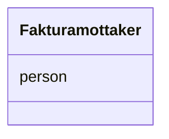

# Class: Fakturamottaker 


_Aktør som skal betale faktura (kompleks datatype)._


URI: [okn:Fakturamottaker](https://schema.fintlabs.no/okonomi/Fakturamottaker)





<!-- no inheritance hierarchy -->

## Class Properties

| Property | Value |
| --- | --- |
| Class URI | [okn:Fakturamottaker](https://schema.fintlabs.no/okonomi/Fakturamottaker) |


## Eigenskapar


  
  


  
  


  
  


  
  
  
  
    
  


### Andre

| Namn | Kardinalitet og domene | Beskriving |
| --- | --- | --- |
| [person](person.md) | 1 <br/> [Uriorcurie](Uriorcurie.md) | Referanse til Person (Administrasjon) som skal betale faktura |


## Usages

| used by | used in | type | used |
| ---  | --- | --- | --- |
| [Fakturagrunnlag](Fakturagrunnlag.md) | [mottaker](mottaker.md) | range | [Fakturamottaker](Fakturamottaker.md) |


## Identifier and Mapping Information


### Schema Source


* from schema: https://data.norge.no/linkml/fint-okonomi


## Mappings

| Mapping Type | Mapped Value |
| ---  | ---  |
| self | okn:Fakturamottaker |
| native | https://schema.fintlabs.no/okonomi/:Fakturamottaker |


## LinkML Source

<!-- TODO: investigate https://stackoverflow.com/questions/37606292/how-to-create-tabbed-code-blocks-in-mkdocs-or-sphinx -->

### Direct

<details>
```yaml
name: Fakturamottaker
description: Aktør som skal betale faktura (kompleks datatype).
from_schema: https://data.norge.no/linkml/fint-okonomi
attributes:
  person:
    name: person
    description: Referanse til Person (Administrasjon) som skal betale faktura.
    in_subset:
    - Obligatorisk
    from_schema: https://data.norge.no/linkml/fint-okonomi
    rank: 1000
    slot_uri: okn:person
    domain_of:
    - Fakturamottaker
    - Leverandor
    range: uriorcurie
    required: true
class_uri: okn:Fakturamottaker

```
</details>

### Induced

<details>
```yaml
name: Fakturamottaker
description: Aktør som skal betale faktura (kompleks datatype).
from_schema: https://data.norge.no/linkml/fint-okonomi
attributes:
  person:
    name: person
    description: Referanse til Person (Administrasjon) som skal betale faktura.
    in_subset:
    - Obligatorisk
    from_schema: https://data.norge.no/linkml/fint-okonomi
    rank: 1000
    slot_uri: okn:person
    alias: person
    owner: Fakturamottaker
    domain_of:
    - Fakturamottaker
    - Leverandor
    range: uriorcurie
    required: true
class_uri: okn:Fakturamottaker

```
</details>