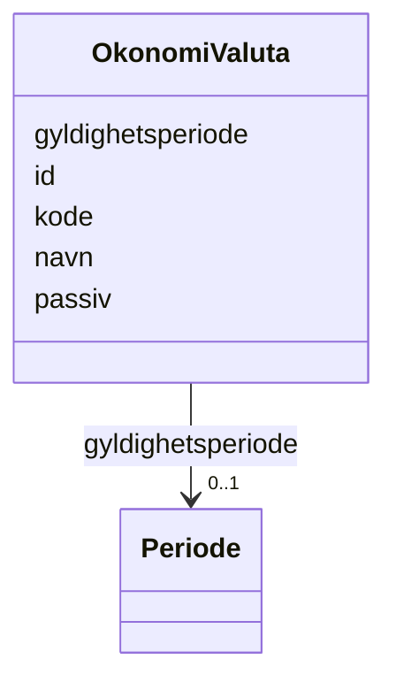

# Class: OkonomiValuta 


_Valuta for transaksjonsbeløp._


URI: [okn:Valuta](https://schema.fintlabs.no/okonomi/Valuta)





<!-- no inheritance hierarchy -->

## Class Properties

| Property | Value |
| --- | --- |
| Class URI | [okn:Valuta](https://schema.fintlabs.no/okonomi/Valuta) |


## Eigenskapar


  
  

  
  

  
  

  
  

  
  


  
  

  
  

  
  

  
  

  
  


  
  

  
  

  
  

  
  

  
  


  
  
  
  
    
  

  
  
  
  
    
  

  
  
  
  
    
  

  
  
  
  
    
  

  
  
  
  
    
  


### Andre

| Namn | Kardinalitet og domene | Beskriving |
| --- | --- | --- |
| [id](id.md) | 1 <br/> [Uriorcurie](uriorcurie.md) | URI-identifikator for ressursen |
| [kode](kode.md) | 1 <br/> [String](string.md) | Valutakode (t |
| [navn](navn.md) | 1 <br/> [String](string.md) | Namn på valutaen |
| [gyldighetsperiode](gyldighetsperiode.md) | 0..1 <br/> [Periode](periode.md) |  |
| [passiv](passiv.md) | 0..1 <br/> [Boolean](boolean.md) |  |


## Usages

| used by | used in | type | used |
| ---  | --- | --- | --- |
| [OkonomiContainer](okonomicontainer.md) | [valutaer](valutaer.md) | range | [OkonomiValuta](okonomivaluta.md) |
| [Transaksjon](transaksjon.md) | [valuta](valuta.md) | range | [OkonomiValuta](okonomivaluta.md) |


## Identifier and Mapping Information


### Schema Source


* from schema: https://data.norge.no/linkml/fint-okonomi


## Mappings

| Mapping Type | Mapped Value |
| ---  | ---  |
| self | okn:Valuta |
| native | https://schema.fintlabs.no/okonomi/:OkonomiValuta |


## LinkML Source

<!-- TODO: investigate https://stackoverflow.com/questions/37606292/how-to-create-tabbed-code-blocks-in-mkdocs-or-sphinx -->

### Direct

<details>
```yaml
name: OkonomiValuta
description: Valuta for transaksjonsbeløp.
from_schema: https://data.norge.no/linkml/fint-okonomi
slots:
- id
attributes:
  kode:
    name: kode
    description: Valutakode (t.d. NOK, EUR, USD).
    in_subset:
    - Obligatorisk
    from_schema: https://data.norge.no/linkml/fint-okonomi
    slot_uri: okn:kode
    domain_of:
    - Vare
    - Merverdiavgift
    - OkonomiValuta
    - Begrep
    range: string
    required: true
  navn:
    name: navn
    description: Namn på valutaen.
    in_subset:
    - Obligatorisk
    from_schema: https://data.norge.no/linkml/fint-okonomi
    slot_uri: okn:namn
    domain_of:
    - Fakturautsteder
    - Leverandorgruppe
    - Vare
    - Merverdiavgift
    - OkonomiValuta
    - Begrep
    - Valuta
    - Person
    - Kontaktperson
    range: string
    required: true
  gyldighetsperiode:
    name: gyldighetsperiode
    in_subset:
    - Valgfri
    from_schema: https://data.norge.no/linkml/fint-okonomi
    slot_uri: okn:gyldighetsperiode
    domain_of:
    - Vare
    - Merverdiavgift
    - OkonomiValuta
    - Begrep
    - Identifikator
    range: Periode
    inlined: true
  passiv:
    name: passiv
    in_subset:
    - Valgfri
    from_schema: https://data.norge.no/linkml/fint-okonomi
    slot_uri: okn:passiv
    domain_of:
    - Vare
    - Merverdiavgift
    - OkonomiValuta
    - Begrep
    range: boolean
class_uri: okn:Valuta

```
</details>

### Induced

<details>
```yaml
name: OkonomiValuta
description: Valuta for transaksjonsbeløp.
from_schema: https://data.norge.no/linkml/fint-okonomi
attributes:
  kode:
    name: kode
    description: Valutakode (t.d. NOK, EUR, USD).
    in_subset:
    - Obligatorisk
    from_schema: https://data.norge.no/linkml/fint-okonomi
    slot_uri: okn:kode
    alias: kode
    owner: OkonomiValuta
    domain_of:
    - Vare
    - Merverdiavgift
    - OkonomiValuta
    - Begrep
    range: string
    required: true
  navn:
    name: navn
    description: Namn på valutaen.
    in_subset:
    - Obligatorisk
    from_schema: https://data.norge.no/linkml/fint-okonomi
    slot_uri: okn:namn
    alias: navn
    owner: OkonomiValuta
    domain_of:
    - Fakturautsteder
    - Leverandorgruppe
    - Vare
    - Merverdiavgift
    - OkonomiValuta
    - Begrep
    - Valuta
    - Person
    - Kontaktperson
    range: string
    required: true
  gyldighetsperiode:
    name: gyldighetsperiode
    in_subset:
    - Valgfri
    from_schema: https://data.norge.no/linkml/fint-okonomi
    slot_uri: okn:gyldighetsperiode
    alias: gyldighetsperiode
    owner: OkonomiValuta
    domain_of:
    - Vare
    - Merverdiavgift
    - OkonomiValuta
    - Begrep
    - Identifikator
    range: Periode
    inlined: true
  passiv:
    name: passiv
    in_subset:
    - Valgfri
    from_schema: https://data.norge.no/linkml/fint-okonomi
    slot_uri: okn:passiv
    alias: passiv
    owner: OkonomiValuta
    domain_of:
    - Vare
    - Merverdiavgift
    - OkonomiValuta
    - Begrep
    range: boolean
  id:
    name: id
    description: URI-identifikator for ressursen.
    from_schema: https://data.norge.no/linkml/fint-okonomi
    rank: 1000
    identifier: true
    alias: id
    owner: OkonomiValuta
    domain_of:
    - Faktura
    - Fakturagrunnlag
    - Fakturautsteder
    - Transaksjon
    - Postering
    - Leverandor
    - Leverandorgruppe
    - Vare
    - Merverdiavgift
    - OkonomiValuta
    - Begrep
    - Valuta
    - Person
    - Kontaktperson
    - Virksomhet
    range: uriorcurie
    required: true
class_uri: okn:Valuta

```
</details>