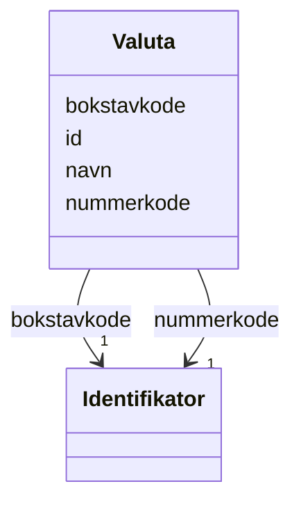

# Class: Valuta 


_Valutakodar for offisielle valutaer._


URI: [fint:Valuta](https://schema.fintlabs.no/Valuta)





<!-- no inheritance hierarchy -->

## Class Properties

| Property | Value |
| --- | --- |
| Class URI | [fint:Valuta](https://schema.fintlabs.no/Valuta) |


## Eigenskapar


  
  

  
  

  
  

  
  


  
  

  
  

  
  

  
  


  
  

  
  

  
  

  
  


  
  
  
  
    
  

  
  
  
  
    
  

  
  
  
  
    
  

  
  
  
  
    
  


### Andre

| Namn | Kardinalitet og domene | Beskriving |
| --- | --- | --- |
| [id](id.md) | 1 <br/> [Uriorcurie](Uriorcurie.md) | URI-identifikator (tilsvarar systemId i FINT) |
| [bokstavkode](bokstavkode.md) | 1 <br/> [Identifikator](Identifikator.md) | Bokstavkode for aktuell valuta |
| [navn](navn.md) | 1 <br/> [String](String.md) | Namn på valuta |
| [nummerkode](nummerkode.md) | 1 <br/> [Identifikator](Identifikator.md) | Nummerkode for aktuell valuta |


## Identifier and Mapping Information


### Schema Source


* from schema: https://data.norge.no/linkml/fint-personvern


## Mappings

| Mapping Type | Mapped Value |
| ---  | ---  |
| self | fint:Valuta |
| native | https://schema.fintlabs.no/personvern/:Valuta |


## LinkML Source

<!-- TODO: investigate https://stackoverflow.com/questions/37606292/how-to-create-tabbed-code-blocks-in-mkdocs-or-sphinx -->

### Direct

<details>
```yaml
name: Valuta
description: Valutakodar for offisielle valutaer.
from_schema: https://data.norge.no/linkml/fint-personvern
slots:
- id
attributes:
  bokstavkode:
    name: bokstavkode
    description: Bokstavkode for aktuell valuta.
    in_subset:
    - Obligatorisk
    from_schema: https://data.norge.no/linkml/fint-common
    rank: 1000
    slot_uri: fint:bokstavkode
    domain_of:
    - Valuta
    range: Identifikator
    required: true
    inlined: true
  navn:
    name: navn
    description: Namn på valuta.
    in_subset:
    - Obligatorisk
    from_schema: https://data.norge.no/linkml/fint-common
    slot_uri: fint:valutaNavn
    domain_of:
    - Tjeneste
    - Behandlingsgrunnlag
    - Personopplysning
    - Begrep
    - Valuta
    - Person
    - Kontaktperson
    range: string
    required: true
  nummerkode:
    name: nummerkode
    description: Nummerkode for aktuell valuta.
    in_subset:
    - Obligatorisk
    from_schema: https://data.norge.no/linkml/fint-common
    rank: 1000
    slot_uri: fint:nummerkode
    domain_of:
    - Valuta
    range: Identifikator
    required: true
    inlined: true
class_uri: fint:Valuta

```
</details>

### Induced

<details>
```yaml
name: Valuta
description: Valutakodar for offisielle valutaer.
from_schema: https://data.norge.no/linkml/fint-personvern
attributes:
  bokstavkode:
    name: bokstavkode
    description: Bokstavkode for aktuell valuta.
    in_subset:
    - Obligatorisk
    from_schema: https://data.norge.no/linkml/fint-common
    rank: 1000
    slot_uri: fint:bokstavkode
    alias: bokstavkode
    owner: Valuta
    domain_of:
    - Valuta
    range: Identifikator
    required: true
    inlined: true
  navn:
    name: navn
    description: Namn på valuta.
    in_subset:
    - Obligatorisk
    from_schema: https://data.norge.no/linkml/fint-common
    slot_uri: fint:valutaNavn
    alias: navn
    owner: Valuta
    domain_of:
    - Tjeneste
    - Behandlingsgrunnlag
    - Personopplysning
    - Begrep
    - Valuta
    - Person
    - Kontaktperson
    range: string
    required: true
  nummerkode:
    name: nummerkode
    description: Nummerkode for aktuell valuta.
    in_subset:
    - Obligatorisk
    from_schema: https://data.norge.no/linkml/fint-common
    rank: 1000
    slot_uri: fint:nummerkode
    alias: nummerkode
    owner: Valuta
    domain_of:
    - Valuta
    range: Identifikator
    required: true
    inlined: true
  id:
    name: id
    description: URI-identifikator (tilsvarar systemId i FINT).
    from_schema: https://data.norge.no/linkml/fint-personvern
    rank: 1000
    identifier: true
    alias: id
    owner: Valuta
    domain_of:
    - Behandling
    - Samtykke
    - Tjeneste
    - Behandlingsgrunnlag
    - Personopplysning
    - Begrep
    - Valuta
    - Person
    - Kontaktperson
    - Virksomhet
    range: uriorcurie
    required: true
class_uri: fint:Valuta

```
</details>