# fint-ressurs

```mermaid
erDiagram
Adresse {
    stringList adresselinje  
    string postnummer  
    string poststed  
}
Applikasjon {
    uriorcurie id  
    string beskrivelse  
    string navn  
}
Applikasjonskategori {
    uriorcurie id  
    string kode  
    string navn  
    boolean passiv  
}
Applikasjonsressurs {
    uriorcurie id  
    string beskrivelse  
    uriorcurie eier  
    integer enhetskostnad  
    boolean kreverGodkjenning  
    integer lisensantall  
    string navn  
}
Applikasjonsressurstilgjengelighet {
    uriorcurie id  
    uriorcurie konsument  
    integer lisensantall  
}
Brukertype {
    uriorcurie id  
    string kode  
    string navn  
    boolean passiv  
}
DigitalEnhet {
    uriorcurie id  
    uriorcurie administrator  
    uriorcurie eier  
    boolean flerbrukerenhet  
    string navn  
    uriorcurie personalressurs  
    boolean privateid  
    string serienummer  
}
Elev {
    uriorcurie id  
}
Enhetsgruppe {
    uriorcurie id  
    string navn  
    uriorcurie organisasjonsenhet  
}
Enhetsgruppemedlemskap {
    uriorcurie id  
}
Enhetstype {
    uriorcurie id  
    string kode  
    string navn  
    boolean passiv  
}
Fylke {
    uriorcurie id  
    string kode  
    string navn  
    boolean passiv  
}
Handhevingstype {
    uriorcurie id  
    string kode  
    string navn  
    boolean passiv  
}
Identifikator {
    string identifikatorverdi  
}
Identitet {
    uriorcurie id  
    uriorcurie personalressurs  
}
Kjonn {
    uriorcurie id  
    string kode  
    string navn  
    boolean passiv  
}
Kommune {
    uriorcurie id  
    string kode  
    string navn  
    boolean passiv  
}
Kontaktinformasjon {
    string epostadresse  
    string mobiltelefonnummer  
    string nettsted  
    string sip  
    string telefonnummer  
}
Kontaktperson {
    uriorcurie id  
    string type  
}
Landkode {
    uriorcurie id  
    string kode  
    string navn  
    boolean passiv  
}
Lisensmodell {
    uriorcurie id  
    string kode  
    string navn  
    boolean passiv  
}
Periode {
    string beskrivelse  
    datetime slutt  
    datetime start  
}
Person {
    uriorcurie id  
    string bilde  
    date fodselsdato  
    uriorcurieList laerling  
    uriorcurie otungdom  
    uriorcurie personalressurs  
}
Personnavn {
    string etternavn  
    string fornavn  
    string mellomnavn  
}
Plattform {
    uriorcurie id  
    string kode  
    string navn  
    boolean passiv  
}
Produsent {
    uriorcurie id  
    string kode  
    string navn  
    boolean passiv  
}
Rettighet {
    uriorcurie id  
    string beskrivelse  
    string kode  
    string navn  
    boolean passiv  
}
Spraak {
    uriorcurie id  
    string kode  
    string navn  
    boolean passiv  
}
Status {
    uriorcurie id  
    string kode  
    string navn  
    boolean passiv  
}

Adresse ||--|o Landkode : "land"
Applikasjon ||--|| Periode : "gyldighetsperiode"
Applikasjon ||--}o Applikasjonskategori : "applikasjonskategori"
Applikasjon ||--}o Applikasjonsressurs : "applikasjonsressurs"
Applikasjon ||--}o Plattform : "plattform"
Applikasjonskategori ||--|o Periode : "gyldighetsperiode"
Applikasjonsressurs ||--|o Handhevingstype : "handhevingstype"
Applikasjonsressurs ||--|o Lisensmodell : "lisensmodell"
Applikasjonsressurs ||--|| Applikasjon : "applikasjon"
Applikasjonsressurs ||--|| Periode : "gyldighetsperiode"
Applikasjonsressurs ||--}o Applikasjonsressurstilgjengelighet : "ressurstilgjengelighet"
Applikasjonsressurs ||--}| Brukertype : "brukertype"
Applikasjonsressurstilgjengelighet ||--|| Applikasjonsressurs : "ressursRef"
Applikasjonsressurstilgjengelighet ||--|| Periode : "gyldighetsperiode"
Brukertype ||--|o Periode : "gyldighetsperiode"
DigitalEnhet ||--|o Elev : "elev"
DigitalEnhet ||--|o Identifikator : "dataobjektId"
DigitalEnhet ||--|o Produsent : "produsent"
DigitalEnhet ||--|o Status : "status"
DigitalEnhet ||--|| Enhetstype : "enhetstype"
DigitalEnhet ||--|| Plattform : "plattform"
DigitalEnhet ||--}o Enhetsgruppemedlemskap : "enhetsgruppemedlemskap"
Elev ||--|o Identifikator : "elevnummer"
Elev ||--|o Person : "person"
Enhetsgruppe ||--|| Enhetstype : "enhetstype"
Enhetsgruppe ||--|| Plattform : "plattform"
Enhetsgruppe ||--}o Enhetsgruppemedlemskap : "enhetsgruppemedlemskap"
Enhetsgruppemedlemskap ||--|| DigitalEnhet : "digitalEnhet"
Enhetsgruppemedlemskap ||--|| Enhetsgruppe : "enhetsgruppe"
Enhetstype ||--|o Periode : "gyldighetsperiode"
Fylke ||--|o Periode : "gyldighetsperiode"
Fylke ||--}o Kommune : "kommune"
Handhevingstype ||--|o Periode : "gyldighetsperiode"
Identifikator ||--|o Periode : "gyldighetsperiode"
Identitet ||--}o Rettighet : "rettighet"
Kjonn ||--|o Periode : "gyldighetsperiode"
Kommune ||--|o Periode : "gyldighetsperiode"
Kommune ||--|| Fylke : "fylke"
Kontaktperson ||--|o Kontaktinformasjon : "kontaktinformasjon"
Kontaktperson ||--|o Personnavn : "kontaktperson_navn"
Kontaktperson ||--}o Person : "kontaktperson"
Landkode ||--|o Periode : "gyldighetsperiode"
Lisensmodell ||--|o Periode : "gyldighetsperiode"
Person ||--|o Adresse : "bostedsadresse, postadresse"
Person ||--|o Elev : "elev"
Person ||--|o Kjonn : "kjonn"
Person ||--|o Kommune : "kommune"
Person ||--|o Kontaktinformasjon : "kontaktinformasjon"
Person ||--|o Spraak : "maalform, morsmaal"
Person ||--|| Identifikator : "fodselsnummer"
Person ||--|| Personnavn : "person_navn"
Person ||--}o Kontaktperson : "parorende"
Person ||--}o Landkode : "statsborgerskap"
Person ||--}o Person : "foreldre, foreldreansvar"
Plattform ||--|o Periode : "gyldighetsperiode"
Produsent ||--|o Periode : "gyldighetsperiode"
Rettighet ||--|o Periode : "gyldighetsperiode"
Rettighet ||--}o Identitet : "identitet"
Spraak ||--|o Periode : "gyldighetsperiode"
Status ||--|o Periode : "gyldighetsperiode"

```

FINT-domenemodell for ressursstyring. Dekkjer tre sub-pakkar: ressurs.eiendel (applikasjonar og lisensressursar), ressurs.datautstyr (digitale einingar og einingsgrupper) og ressurs.tilgang (identitetar og rettigheiter).

URI: https://data.norge.no/linkml/fint-ressurs

Name: fint-ressurs

## Classes

| Class | Description |
| --- | --- |
| [Applikasjon](klasser/applikasjon.md) | Ein applikasjon med tilhøyrande ressursar |
| [Applikasjonskategori](klasser/applikasjonskategori.md) | Kategori av applikasjonar |
| [Applikasjonsressurs](klasser/applikasjonsressurs.md) | Informasjon om kor ein applikasjon kan nyttast (lisensressurs) |
| [Applikasjonsressurstilgjengelighet](klasser/applikasjonsressurstilgjengelighet.md) | Kva organisasjonselements brukarar som har tilgang til ein ressurs |
| [Brukertype](klasser/brukertype.md) | Dei ulike brukartypane som kan nytte lisensen |
| [DigitalEnhet](klasser/digitalenhet.md) | Ei digital eining som t |
| [Enhetsgruppe](klasser/enhetsgruppe.md) | Ei gruppering av einsarta digitale einingar |
| [Enhetsgruppemedlemskap](klasser/enhetsgruppemedlemskap.md) | Medlemskap mellom ei digital eining og ei einingsgruppe |
| [Enhetstype](klasser/enhetstype.md) | Type digital eining |
| [Handhevingstype](klasser/handhevingstype.md) | Korleis ulike lisensmodellar kan handhevast |
| [Identitet](klasser/identitet.md) | Identitet som identifiserer innehavaren av rettigheiter i organisasjonen |
| [Lisensmodell](klasser/lisensmodell.md) | Lisensmodellar som kan knytast til ein lisens |
| [Plattform](klasser/plattform.md) | Plattforma tenesta kan leverast på |
| [Produsent](klasser/produsent.md) | Produsent av ei digital eining |
| [Rettighet](klasser/rettighet.md) | Ei namngitt rettighet |
| [Status](klasser/status.md) | Status på ei digital eining i fagsystemet |

## Slots

| Slot | Description |
| --- | --- |
| [administrator](klasser/administrator.md) | Referanse til Organisasjonselement som administrerer eininga |
| [applikasjon](klasser/applikasjon.md) | Applikasjonen ressursen (lisensen) er knytt til |
| [applikasjonar](klasser/applikasjonar.md) |  |
| [applikasjonskategori](klasser/applikasjonskategori.md) | Kategoriar av applikasjonar |
| [applikasjonskategoriar](klasser/applikasjonskategoriar.md) |  |
| [applikasjonsressurs](klasser/applikasjonsressurs.md) | Ulike ressursar (lisensar) knytt til ein applikasjon |
| [applikasjonsressursar](klasser/applikasjonsressursar.md) |  |
| [applikasjonsressurstilgjengelegheit](klasser/applikasjonsressurstilgjengelegheit.md) |  |
| [brukertypar](klasser/brukertypar.md) |  |
| [brukertype](klasser/brukertype.md) | For kva brukertypar lisensen er gyldig |
| [dataobjektId](klasser/dataobjektid.md) | Einingsens ID i datakatalogen |
| [digitaleEiningar](klasser/digitaleeiningar.md) |  |
| [digitalEnhet](klasser/digitalenhet.md) | Den digitale eininga dette medlemskapet tilhøyrer |
| [eier](klasser/eier.md) | Referanse til Organisasjonselement som har eigarskap |
| [einingsgruppedmedlemskap](klasser/einingsgruppedmedlemskap.md) |  |
| [einingsgrupper](klasser/einingsgrupper.md) |  |
| [einingstypar](klasser/einingstypar.md) |  |
| [enhetsgruppe](klasser/enhetsgruppe.md) | Einingsgruppen dette medlemskapet tilhøyrer |
| [enhetsgruppemedlemskap](klasser/enhetsgruppemedlemskap.md) | Einingsgruppemelemskap |
| [enhetskostnad](klasser/enhetskostnad.md) | Kostnad per ressurs |
| [enhetstype](klasser/enhetstype.md) | Type digital eining |
| [flerbrukerenhet](klasser/flerbrukerenhet.md) | Kvifor eininga er ein- eller flerbrukarenheit |
| [handhaevingstypar](klasser/handhaevingstypar.md) |  |
| [handhevingstype](klasser/handhevingstype.md) | Korleis lisensmodellen skal handhevast |
| [identitet](klasser/identitet.md) | Identitetar knytt til rettigheta |
| [identitetar](klasser/identitetar.md) |  |
| [konsument](klasser/konsument.md) | Referanse til Organisasjonselement som har tilgang til ressursen |
| [kreverGodkjenning](klasser/krevergodkjenning.md) | True dersom tildeling av ressursen krev godkjenning |
| [lisensantall](klasser/lisensantall.md) | Totalt tal på lisensar |
| [lisensmodell](klasser/lisensmodell.md) | Lisensmodellen applikasjonsressursen har |
| [lisensmodellar](klasser/lisensmodellar.md) |  |
| [organisasjonsenhet](klasser/organisasjonsenhet.md) | Referanse til Organisasjonselement grupperinga er tilknytt |
| [personalressurs](klasser/personalressurs.md) | Referanse til Personalressurs (Administrasjon) |
| [plattform](klasser/plattform.md) | Plattforma ressursen er knytt til |
| [plattformar](klasser/plattformar.md) |  |
| [privateid](klasser/privateid.md) | Angir om eininga er eigd av organisasjonen eller privatperson |
| [produsent](klasser/produsent.md) | Namn på produsenten av eininga |
| [produsentar](klasser/produsentar.md) |  |
| [ressursRef](klasser/ressursref.md) | Ressursen organisasjonselementet har tilgang til |
| [ressurstilgjengelighet](klasser/ressurstilgjengelighet.md) | Angir kva organisasjonseining og kor mange ressursar som skal tilordnast |
| [rettigheiter](klasser/rettigheiter.md) |  |
| [rettighet](klasser/rettighet.md) | Rettigheiter knytt til identiteten |
| [serienummer](klasser/serienummer.md) | Unikt serienummer frå einingsprodusentens |
| [status](klasser/status.md) | Status på eininga i fagsystemet |
| [statusar](klasser/statusar.md) |  |

## Enumerations

| Enumeration | Description |
| --- | --- |

## Types

| Type | Description |
| --- | --- |

## Subsets

| Subset | Description |
| --- | --- |
| [Anbefalt](klasser/anbefalt.md) | Anbefalt eigensskap |
| [Obligatorisk](klasser/obligatorisk.md) | Obligatorisk eigensskap |
| [Valgfri](klasser/valgfri.md) | Valfri eigensskap |

## Generated artifacts

| Artefakt | Fil |
|----------|-----|
| SHACL shapes | [fint-ressurs-shapes.ttl](fint-ressurs-shapes.ttl) |
| JSON-LD kontekst | [fint-ressurs-context.jsonld](fint-ressurs-context.jsonld) |
| JSON Schema | [fint-ressurs-schema.json](fint-ressurs-schema.json) |
| OWL ontologi | [fint-ressurs-ontology.ttl](fint-ressurs-ontology.ttl) |
| RDF/Turtle skjema | [fint-ressurs-schema.ttl](fint-ressurs-schema.ttl) |
| Python-klasser | [fint-ressurs-model.py](fint-ressurs-model.py) |
| ER-diagram (Mermaid) | [fint-ressurs-erdiagram.md](fint-ressurs-erdiagram.md) |
| Eksempeldata (Turtle) | [fint-ressurs-eksempel.ttl](fint-ressurs-eksempel.ttl) |
