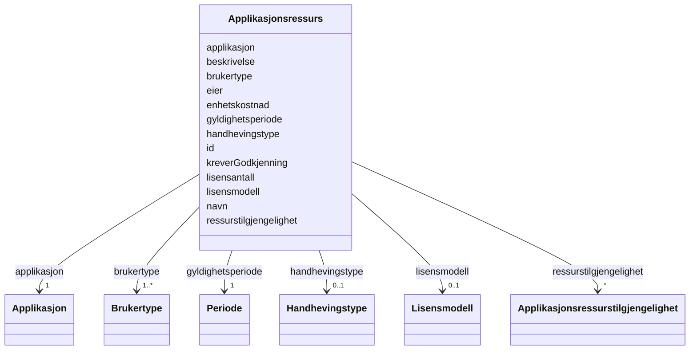

# Class: Applikasjonsressurs 


_Informasjon om kor ein applikasjon kan nyttast (lisensressurs)._


URI: [res:Applikasjonsressurs](https://schema.fintlabs.no/ressurs/Applikasjonsressurs)





<!-- no inheritance hierarchy -->

## Class Properties

| Property | Value |
| --- | --- |
| Class URI | [res:Applikasjonsressurs](https://schema.fintlabs.no/ressurs/Applikasjonsressurs) |


## Eigenskapar


  
  

  
  

  
  

  
  

  
  

  
  

  
  

  
  

  
  

  
  

  
  

  
  

  
  


  
  

  
  

  
  

  
  

  
  

  
  

  
  

  
  

  
  

  
  

  
  

  
  

  
  


  
  

  
  

  
  

  
  

  
  

  
  

  
  

  
  

  
  

  
  

  
  

  
  

  
  


  
  
  
  
    
  

  
  
  
  
    
  

  
  
  
  
    
  

  
  
  
  
    
  

  
  
  
  
    
  

  
  
  
  
    
  

  
  
  
  
    
  

  
  
  
  
    
  

  
  
  
  
    
  

  
  
  
  
    
  

  
  
  
  
    
  

  
  
  
  
    
  

  
  
  
  
    
  


### Andre

| Namn | Kardinalitet og domene | Beskriving |
| --- | --- | --- |
| [id](id.md) | 1 <br/> [Uriorcurie](Uriorcurie.md) | URI-identifikator (tilsvarar systemId i FINT) |
| [navn](navn.md) | 1 <br/> [String](String.md) |  |
| [beskrivelse](beskrivelse.md) | 0..1 <br/> [String](String.md) |  |
| [gyldighetsperiode](gyldighetsperiode.md) | 1 <br/> [Periode](Periode.md) | Start- og sluttdato for gyldighetsperioden til ressursen |
| [enhetskostnad](enhetskostnad.md) | 0..1 <br/> [Integer](Integer.md) | Kostnad per ressurs |
| [kreverGodkjenning](kreverGodkjenning.md) | 0..1 <br/> [Boolean](Boolean.md) | True dersom tildeling av ressursen krev godkjenning av leiar/tenestteforvalta... |
| [lisensantall](lisensantall.md) | 0..1 <br/> [Integer](Integer.md) | Totalt tal på lisensar |
| [eier](eier.md) | 1 <br/> [Uriorcurie](Uriorcurie.md) | Referanse til Organisasjonselement som har eigarskap til lisensen |
| [applikasjon](applikasjon.md) | 1 <br/> [Applikasjon](Applikasjon.md) | Applikasjonen denne ressursen (lisensen) er knytt til |
| [brukertype](brukertype.md) | 1..* <br/> [Brukertype](Brukertype.md) | For kva brukertypar denne lisensen er gyldig |
| [handhevingstype](handhevingstype.md) | 0..1 <br/> [Handhevingstype](Handhevingstype.md) | Korleis det skal handhevast når lisensantall vert overskredet (Håndhevingstyp... |
| [lisensmodell](lisensmodell.md) | 0..1 <br/> [Lisensmodell](Lisensmodell.md) | Kva lisensmodell applikasjonsressursen har |
| [ressurstilgjengelighet](ressurstilgjengelighet.md) | * <br/> [Applikasjonsressurstilgjengelighet](Applikasjonsressurstilgjengelighet.md) | Angir kva organisasjonseining og kor mange ressursar som skal tilordnast |


## Usages

| used by | used in | type | used |
| ---  | --- | --- | --- |
| [RessursContainer](RessursContainer.md) | [applikasjonsressursar](applikasjonsressursar.md) | range | [Applikasjonsressurs](Applikasjonsressurs.md) |
| [Applikasjon](Applikasjon.md) | [ressurs](ressurs.md) | range | [Applikasjonsressurs](Applikasjonsressurs.md) |
| [Applikasjonsressurstilgjengelighet](Applikasjonsressurstilgjengelighet.md) | [ressurs](ressurs.md) | range | [Applikasjonsressurs](Applikasjonsressurs.md) |


## Identifier and Mapping Information


### Schema Source


* from schema: https://data.norge.no/linkml/fint-ressurs


## Mappings

| Mapping Type | Mapped Value |
| ---  | ---  |
| self | res:Applikasjonsressurs |
| native | https://schema.fintlabs.no/ressurs/:Applikasjonsressurs |


## LinkML Source

<!-- TODO: investigate https://stackoverflow.com/questions/37606292/how-to-create-tabbed-code-blocks-in-mkdocs-or-sphinx -->

### Direct

<details>
```yaml
name: Applikasjonsressurs
description: Informasjon om kor ein applikasjon kan nyttast (lisensressurs).
from_schema: https://data.norge.no/linkml/fint-ressurs
slots:
- id
attributes:
  navn:
    name: navn
    in_subset:
    - Obligatorisk
    from_schema: https://data.norge.no/linkml/fint-ressurs
    slot_uri: res:navn
    domain_of:
    - Applikasjon
    - Applikasjonsressurs
    - DigitalEnhet
    - Enhetsgruppe
    - Rettighet
    - Applikasjonskategori
    - Brukertype
    - Enhetstype
    - Handhevingstype
    - Lisensmodell
    - Plattform
    - Produsent
    - Status
    - Begrep
    - Valuta
    - Person
    - Kontaktperson
    range: string
    required: true
  beskrivelse:
    name: beskrivelse
    in_subset:
    - Valgfri
    from_schema: https://data.norge.no/linkml/fint-ressurs
    slot_uri: res:beskrivelse
    domain_of:
    - Applikasjon
    - Applikasjonsressurs
    - Rettighet
    - Periode
    range: string
  gyldighetsperiode:
    name: gyldighetsperiode
    description: Start- og sluttdato for gyldighetsperioden til ressursen.
    in_subset:
    - Obligatorisk
    from_schema: https://data.norge.no/linkml/fint-ressurs
    slot_uri: res:gyldighetsperiode
    domain_of:
    - Applikasjon
    - Applikasjonsressurs
    - Applikasjonsressurstilgjengelighet
    - Rettighet
    - Applikasjonskategori
    - Brukertype
    - Enhetstype
    - Handhevingstype
    - Lisensmodell
    - Plattform
    - Produsent
    - Status
    - Begrep
    - Identifikator
    range: Periode
    required: true
    inlined: true
  enhetskostnad:
    name: enhetskostnad
    description: Kostnad per ressurs.
    in_subset:
    - Valgfri
    from_schema: https://data.norge.no/linkml/fint-ressurs
    rank: 1000
    slot_uri: res:enhetskostnad
    domain_of:
    - Applikasjonsressurs
    range: integer
  kreverGodkjenning:
    name: kreverGodkjenning
    description: 'True dersom tildeling av ressursen krev godkjenning av leiar/tenestteforvaltar
      eller tenesteeigr.

      '
    in_subset:
    - Anbefalt
    from_schema: https://data.norge.no/linkml/fint-ressurs
    rank: 1000
    slot_uri: res:kreverGodkjenning
    domain_of:
    - Applikasjonsressurs
    range: boolean
  lisensantall:
    name: lisensantall
    description: Totalt tal på lisensar.
    in_subset:
    - Anbefalt
    from_schema: https://data.norge.no/linkml/fint-ressurs
    rank: 1000
    slot_uri: res:lisensantall
    domain_of:
    - Applikasjonsressurs
    - Applikasjonsressurstilgjengelighet
    range: integer
  eier:
    name: eier
    description: Referanse til Organisasjonselement som har eigarskap til lisensen.
    in_subset:
    - Obligatorisk
    from_schema: https://data.norge.no/linkml/fint-ressurs
    rank: 1000
    slot_uri: res:eier
    domain_of:
    - Applikasjonsressurs
    - DigitalEnhet
    range: uriorcurie
    required: true
  applikasjon:
    name: applikasjon
    description: Applikasjonen denne ressursen (lisensen) er knytt til.
    in_subset:
    - Obligatorisk
    from_schema: https://data.norge.no/linkml/fint-ressurs
    rank: 1000
    slot_uri: res:applikasjon
    domain_of:
    - Applikasjonsressurs
    range: Applikasjon
    required: true
  brukertype:
    name: brukertype
    description: For kva brukertypar denne lisensen er gyldig.
    in_subset:
    - Obligatorisk
    from_schema: https://data.norge.no/linkml/fint-ressurs
    rank: 1000
    slot_uri: res:brukertype
    domain_of:
    - Applikasjonsressurs
    range: Brukertype
    required: true
    multivalued: true
  handhevingstype:
    name: handhevingstype
    description: Korleis det skal handhevast når lisensantall vert overskredet (Håndhevingstype).
    in_subset:
    - Valgfri
    from_schema: https://data.norge.no/linkml/fint-ressurs
    rank: 1000
    slot_uri: res:handhevingstype
    domain_of:
    - Applikasjonsressurs
    range: Handhevingstype
  lisensmodell:
    name: lisensmodell
    description: Kva lisensmodell applikasjonsressursen har.
    in_subset:
    - Valgfri
    from_schema: https://data.norge.no/linkml/fint-ressurs
    rank: 1000
    slot_uri: res:lisensmodell
    domain_of:
    - Applikasjonsressurs
    range: Lisensmodell
  ressurstilgjengelighet:
    name: ressurstilgjengelighet
    description: Angir kva organisasjonseining og kor mange ressursar som skal tilordnast.
    in_subset:
    - Valgfri
    from_schema: https://data.norge.no/linkml/fint-ressurs
    rank: 1000
    slot_uri: res:ressurstilgjengelighet
    domain_of:
    - Applikasjonsressurs
    range: Applikasjonsressurstilgjengelighet
    multivalued: true
class_uri: res:Applikasjonsressurs

```
</details>

### Induced

<details>
```yaml
name: Applikasjonsressurs
description: Informasjon om kor ein applikasjon kan nyttast (lisensressurs).
from_schema: https://data.norge.no/linkml/fint-ressurs
attributes:
  navn:
    name: navn
    in_subset:
    - Obligatorisk
    from_schema: https://data.norge.no/linkml/fint-ressurs
    slot_uri: res:navn
    alias: navn
    owner: Applikasjonsressurs
    domain_of:
    - Applikasjon
    - Applikasjonsressurs
    - DigitalEnhet
    - Enhetsgruppe
    - Rettighet
    - Applikasjonskategori
    - Brukertype
    - Enhetstype
    - Handhevingstype
    - Lisensmodell
    - Plattform
    - Produsent
    - Status
    - Begrep
    - Valuta
    - Person
    - Kontaktperson
    range: string
    required: true
  beskrivelse:
    name: beskrivelse
    in_subset:
    - Valgfri
    from_schema: https://data.norge.no/linkml/fint-ressurs
    slot_uri: res:beskrivelse
    alias: beskrivelse
    owner: Applikasjonsressurs
    domain_of:
    - Applikasjon
    - Applikasjonsressurs
    - Rettighet
    - Periode
    range: string
  gyldighetsperiode:
    name: gyldighetsperiode
    description: Start- og sluttdato for gyldighetsperioden til ressursen.
    in_subset:
    - Obligatorisk
    from_schema: https://data.norge.no/linkml/fint-ressurs
    slot_uri: res:gyldighetsperiode
    alias: gyldighetsperiode
    owner: Applikasjonsressurs
    domain_of:
    - Applikasjon
    - Applikasjonsressurs
    - Applikasjonsressurstilgjengelighet
    - Rettighet
    - Applikasjonskategori
    - Brukertype
    - Enhetstype
    - Handhevingstype
    - Lisensmodell
    - Plattform
    - Produsent
    - Status
    - Begrep
    - Identifikator
    range: Periode
    required: true
    inlined: true
  enhetskostnad:
    name: enhetskostnad
    description: Kostnad per ressurs.
    in_subset:
    - Valgfri
    from_schema: https://data.norge.no/linkml/fint-ressurs
    rank: 1000
    slot_uri: res:enhetskostnad
    alias: enhetskostnad
    owner: Applikasjonsressurs
    domain_of:
    - Applikasjonsressurs
    range: integer
  kreverGodkjenning:
    name: kreverGodkjenning
    description: 'True dersom tildeling av ressursen krev godkjenning av leiar/tenestteforvaltar
      eller tenesteeigr.

      '
    in_subset:
    - Anbefalt
    from_schema: https://data.norge.no/linkml/fint-ressurs
    rank: 1000
    slot_uri: res:kreverGodkjenning
    alias: kreverGodkjenning
    owner: Applikasjonsressurs
    domain_of:
    - Applikasjonsressurs
    range: boolean
  lisensantall:
    name: lisensantall
    description: Totalt tal på lisensar.
    in_subset:
    - Anbefalt
    from_schema: https://data.norge.no/linkml/fint-ressurs
    rank: 1000
    slot_uri: res:lisensantall
    alias: lisensantall
    owner: Applikasjonsressurs
    domain_of:
    - Applikasjonsressurs
    - Applikasjonsressurstilgjengelighet
    range: integer
  eier:
    name: eier
    description: Referanse til Organisasjonselement som har eigarskap til lisensen.
    in_subset:
    - Obligatorisk
    from_schema: https://data.norge.no/linkml/fint-ressurs
    rank: 1000
    slot_uri: res:eier
    alias: eier
    owner: Applikasjonsressurs
    domain_of:
    - Applikasjonsressurs
    - DigitalEnhet
    range: uriorcurie
    required: true
  applikasjon:
    name: applikasjon
    description: Applikasjonen denne ressursen (lisensen) er knytt til.
    in_subset:
    - Obligatorisk
    from_schema: https://data.norge.no/linkml/fint-ressurs
    rank: 1000
    slot_uri: res:applikasjon
    alias: applikasjon
    owner: Applikasjonsressurs
    domain_of:
    - Applikasjonsressurs
    range: Applikasjon
    required: true
  brukertype:
    name: brukertype
    description: For kva brukertypar denne lisensen er gyldig.
    in_subset:
    - Obligatorisk
    from_schema: https://data.norge.no/linkml/fint-ressurs
    rank: 1000
    slot_uri: res:brukertype
    alias: brukertype
    owner: Applikasjonsressurs
    domain_of:
    - Applikasjonsressurs
    range: Brukertype
    required: true
    multivalued: true
  handhevingstype:
    name: handhevingstype
    description: Korleis det skal handhevast når lisensantall vert overskredet (Håndhevingstype).
    in_subset:
    - Valgfri
    from_schema: https://data.norge.no/linkml/fint-ressurs
    rank: 1000
    slot_uri: res:handhevingstype
    alias: handhevingstype
    owner: Applikasjonsressurs
    domain_of:
    - Applikasjonsressurs
    range: Handhevingstype
  lisensmodell:
    name: lisensmodell
    description: Kva lisensmodell applikasjonsressursen har.
    in_subset:
    - Valgfri
    from_schema: https://data.norge.no/linkml/fint-ressurs
    rank: 1000
    slot_uri: res:lisensmodell
    alias: lisensmodell
    owner: Applikasjonsressurs
    domain_of:
    - Applikasjonsressurs
    range: Lisensmodell
  ressurstilgjengelighet:
    name: ressurstilgjengelighet
    description: Angir kva organisasjonseining og kor mange ressursar som skal tilordnast.
    in_subset:
    - Valgfri
    from_schema: https://data.norge.no/linkml/fint-ressurs
    rank: 1000
    slot_uri: res:ressurstilgjengelighet
    alias: ressurstilgjengelighet
    owner: Applikasjonsressurs
    domain_of:
    - Applikasjonsressurs
    range: Applikasjonsressurstilgjengelighet
    multivalued: true
  id:
    name: id
    description: URI-identifikator (tilsvarar systemId i FINT).
    from_schema: https://data.norge.no/linkml/fint-ressurs
    rank: 1000
    identifier: true
    alias: id
    owner: Applikasjonsressurs
    domain_of:
    - Applikasjon
    - Applikasjonsressurs
    - Applikasjonsressurstilgjengelighet
    - DigitalEnhet
    - Enhetsgruppe
    - Enhetsgruppemedlemskap
    - Identitet
    - Rettighet
    - Applikasjonskategori
    - Brukertype
    - Enhetstype
    - Handhevingstype
    - Lisensmodell
    - Plattform
    - Produsent
    - Status
    - Begrep
    - Valuta
    - Person
    - Kontaktperson
    - Virksomhet
    range: uriorcurie
    required: true
class_uri: res:Applikasjonsressurs

```
</details>