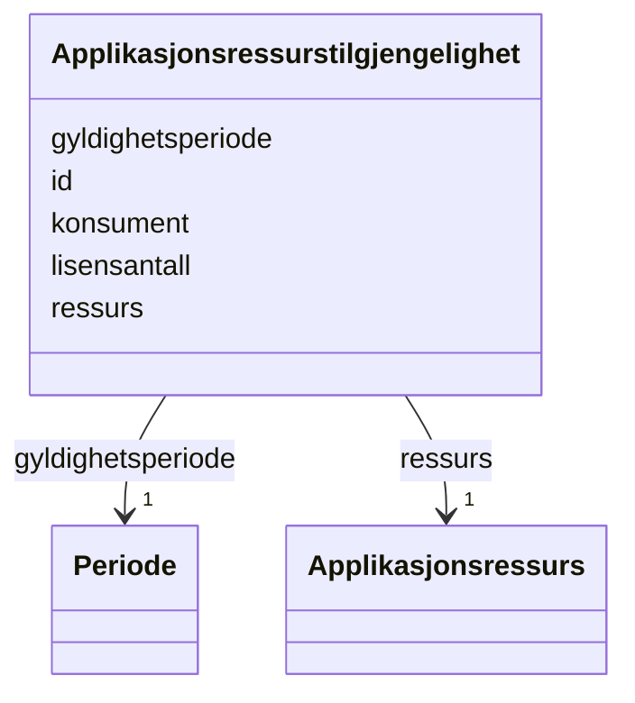

# Class: Applikasjonsressurstilgjengelighet 


_Kva organisasjonselements brukarar som har tilgang til ein ressurs._


URI: [res:Applikasjonsressurstilgjengelighet](https://schema.fintlabs.no/ressurs/Applikasjonsressurstilgjengelighet)





<!-- no inheritance hierarchy -->

## Class Properties

| Property | Value |
| --- | --- |
| Class URI | [res:Applikasjonsressurstilgjengelighet](https://schema.fintlabs.no/ressurs/Applikasjonsressurstilgjengelighet) |


## Eigenskapar


  
  

  
  

  
  

  
  

  
  


  
  

  
  

  
  

  
  

  
  


  
  

  
  

  
  

  
  

  
  


  
  
  
  
    
  

  
  
  
  
    
  

  
  
  
  
    
  

  
  
  
  
    
  

  
  
  
  
    
  


### Andre

| Namn | Kardinalitet og domene | Beskriving |
| --- | --- | --- |
| [id](id.md) | 1 <br/> [Uriorcurie](uriorcurie.md) | URI-identifikator for ressursen |
| [gyldighetsperiode](gyldighetsperiode.md) | 1 <br/> [Periode](periode.md) | Gyldighetsperioden til applikasjonsressurstilgjengelegheita |
| [lisensantall](lisensantall.md) | 0..1 <br/> [Integer](integer.md) | Totalt tal på lisensar tilgjengeleg for brukarar i konsumenten |
| [konsument](konsument.md) | 1 <br/> [Uriorcurie](uriorcurie.md) | Referanse til Organisasjonselement som har tilgang til denne ressursen |
| [ressurs](ressurs.md) | 1 <br/> [Applikasjonsressurs](applikasjonsressurs.md) | Ressursen organisasjonselementet har tilgang til |


## Usages

| used by | used in | type | used |
| ---  | --- | --- | --- |
| [RessursContainer](ressurscontainer.md) | [applikasjonsressurstilgjengelegheit](applikasjonsressurstilgjengelegheit.md) | range | [Applikasjonsressurstilgjengelighet](applikasjonsressurstilgjengelighet.md) |
| [Applikasjonsressurs](applikasjonsressurs.md) | [ressurstilgjengelighet](ressurstilgjengelighet.md) | range | [Applikasjonsressurstilgjengelighet](applikasjonsressurstilgjengelighet.md) |


## Identifier and Mapping Information


### Schema Source


* from schema: https://data.norge.no/linkml/fint-ressurs


## Mappings

| Mapping Type | Mapped Value |
| ---  | ---  |
| self | res:Applikasjonsressurstilgjengelighet |
| native | https://schema.fintlabs.no/ressurs/:Applikasjonsressurstilgjengelighet |


## LinkML Source

<!-- TODO: investigate https://stackoverflow.com/questions/37606292/how-to-create-tabbed-code-blocks-in-mkdocs-or-sphinx -->

### Direct

<details>
```yaml
name: Applikasjonsressurstilgjengelighet
description: Kva organisasjonselements brukarar som har tilgang til ein ressurs.
from_schema: https://data.norge.no/linkml/fint-ressurs
slots:
- id
attributes:
  gyldighetsperiode:
    name: gyldighetsperiode
    description: Gyldighetsperioden til applikasjonsressurstilgjengelegheita.
    in_subset:
    - Obligatorisk
    from_schema: https://data.norge.no/linkml/fint-ressurs
    slot_uri: res:gyldighetsperiode
    domain_of:
    - Applikasjon
    - Applikasjonsressurs
    - Applikasjonsressurstilgjengelighet
    - Rettighet
    - Applikasjonskategori
    - Brukertype
    - Enhetstype
    - Handhevingstype
    - Lisensmodell
    - Plattform
    - Produsent
    - Status
    - Begrep
    - Identifikator
    range: Periode
    required: true
    inlined: true
  lisensantall:
    name: lisensantall
    description: Totalt tal på lisensar tilgjengeleg for brukarar i konsumenten.
    in_subset:
    - Valgfri
    from_schema: https://data.norge.no/linkml/fint-ressurs
    slot_uri: res:lisensantall
    domain_of:
    - Applikasjonsressurs
    - Applikasjonsressurstilgjengelighet
    range: integer
  konsument:
    name: konsument
    description: Referanse til Organisasjonselement som har tilgang til denne ressursen.
    in_subset:
    - Obligatorisk
    from_schema: https://data.norge.no/linkml/fint-ressurs
    rank: 1000
    slot_uri: res:konsument
    domain_of:
    - Applikasjonsressurstilgjengelighet
    range: uriorcurie
    required: true
  ressurs:
    name: ressurs
    description: Ressursen organisasjonselementet har tilgang til.
    in_subset:
    - Obligatorisk
    from_schema: https://data.norge.no/linkml/fint-ressurs
    slot_uri: res:ressursRef
    domain_of:
    - Applikasjon
    - Applikasjonsressurstilgjengelighet
    range: Applikasjonsressurs
    required: true
class_uri: res:Applikasjonsressurstilgjengelighet

```
</details>

### Induced

<details>
```yaml
name: Applikasjonsressurstilgjengelighet
description: Kva organisasjonselements brukarar som har tilgang til ein ressurs.
from_schema: https://data.norge.no/linkml/fint-ressurs
attributes:
  gyldighetsperiode:
    name: gyldighetsperiode
    description: Gyldighetsperioden til applikasjonsressurstilgjengelegheita.
    in_subset:
    - Obligatorisk
    from_schema: https://data.norge.no/linkml/fint-ressurs
    slot_uri: res:gyldighetsperiode
    alias: gyldighetsperiode
    owner: Applikasjonsressurstilgjengelighet
    domain_of:
    - Applikasjon
    - Applikasjonsressurs
    - Applikasjonsressurstilgjengelighet
    - Rettighet
    - Applikasjonskategori
    - Brukertype
    - Enhetstype
    - Handhevingstype
    - Lisensmodell
    - Plattform
    - Produsent
    - Status
    - Begrep
    - Identifikator
    range: Periode
    required: true
    inlined: true
  lisensantall:
    name: lisensantall
    description: Totalt tal på lisensar tilgjengeleg for brukarar i konsumenten.
    in_subset:
    - Valgfri
    from_schema: https://data.norge.no/linkml/fint-ressurs
    slot_uri: res:lisensantall
    alias: lisensantall
    owner: Applikasjonsressurstilgjengelighet
    domain_of:
    - Applikasjonsressurs
    - Applikasjonsressurstilgjengelighet
    range: integer
  konsument:
    name: konsument
    description: Referanse til Organisasjonselement som har tilgang til denne ressursen.
    in_subset:
    - Obligatorisk
    from_schema: https://data.norge.no/linkml/fint-ressurs
    rank: 1000
    slot_uri: res:konsument
    alias: konsument
    owner: Applikasjonsressurstilgjengelighet
    domain_of:
    - Applikasjonsressurstilgjengelighet
    range: uriorcurie
    required: true
  ressurs:
    name: ressurs
    description: Ressursen organisasjonselementet har tilgang til.
    in_subset:
    - Obligatorisk
    from_schema: https://data.norge.no/linkml/fint-ressurs
    slot_uri: res:ressursRef
    alias: ressurs
    owner: Applikasjonsressurstilgjengelighet
    domain_of:
    - Applikasjon
    - Applikasjonsressurstilgjengelighet
    range: Applikasjonsressurs
    required: true
  id:
    name: id
    description: URI-identifikator for ressursen.
    from_schema: https://data.norge.no/linkml/fint-ressurs
    rank: 1000
    identifier: true
    alias: id
    owner: Applikasjonsressurstilgjengelighet
    domain_of:
    - Applikasjon
    - Applikasjonsressurs
    - Applikasjonsressurstilgjengelighet
    - DigitalEnhet
    - Enhetsgruppe
    - Enhetsgruppemedlemskap
    - Identitet
    - Rettighet
    - Applikasjonskategori
    - Brukertype
    - Enhetstype
    - Handhevingstype
    - Lisensmodell
    - Plattform
    - Produsent
    - Status
    - Begrep
    - Valuta
    - Person
    - Kontaktperson
    - Virksomhet
    range: uriorcurie
    required: true
class_uri: res:Applikasjonsressurstilgjengelighet

```
</details>