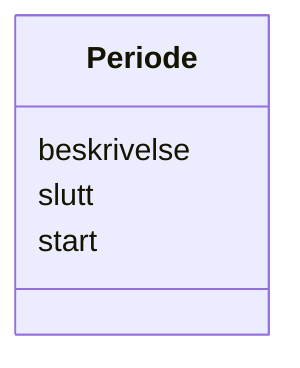

# Class: Periode 


_Tidsperiode med obligatorisk start og valfri slutt._


URI: [fint:Periode](https://schema.fintlabs.no/Periode)





<!-- no inheritance hierarchy -->

## Class Properties

| Property | Value |
| --- | --- |
| Class URI | [fint:Periode](https://schema.fintlabs.no/Periode) |


## Eigenskapar


  
  

  
  

  
  


  
  

  
  

  
  


  
  

  
  

  
  


  
  
  
  
    
  

  
  
  
  
    
  

  
  
  
  
    
  


### Andre

| Namn | Kardinalitet og domene | Beskriving |
| --- | --- | --- |
| [beskrivelse](beskrivelse.md) | 0..1 <br/> [String](String.md) | Beskriven namn på perioden |
| [start](start.md) | 1 <br/> [Datetime](Datetime.md) | Frå tidspunkt |
| [slutt](slutt.md) | 0..1 <br/> [Datetime](Datetime.md) | Til tidspunkt |


## Usages

| used by | used in | type | used |
| ---  | --- | --- | --- |
| [Applikasjon](Applikasjon.md) | [gyldighetsperiode](gyldighetsperiode.md) | range | [Periode](Periode.md) |
| [Applikasjonsressurs](Applikasjonsressurs.md) | [gyldighetsperiode](gyldighetsperiode.md) | range | [Periode](Periode.md) |
| [Applikasjonsressurstilgjengelighet](Applikasjonsressurstilgjengelighet.md) | [gyldighetsperiode](gyldighetsperiode.md) | range | [Periode](Periode.md) |
| [Rettighet](Rettighet.md) | [gyldighetsperiode](gyldighetsperiode.md) | range | [Periode](Periode.md) |
| [Applikasjonskategori](Applikasjonskategori.md) | [gyldighetsperiode](gyldighetsperiode.md) | range | [Periode](Periode.md) |
| [Brukertype](Brukertype.md) | [gyldighetsperiode](gyldighetsperiode.md) | range | [Periode](Periode.md) |
| [Enhetstype](Enhetstype.md) | [gyldighetsperiode](gyldighetsperiode.md) | range | [Periode](Periode.md) |
| [Handhevingstype](Handhevingstype.md) | [gyldighetsperiode](gyldighetsperiode.md) | range | [Periode](Periode.md) |
| [Lisensmodell](Lisensmodell.md) | [gyldighetsperiode](gyldighetsperiode.md) | range | [Periode](Periode.md) |
| [Plattform](Plattform.md) | [gyldighetsperiode](gyldighetsperiode.md) | range | [Periode](Periode.md) |
| [Produsent](Produsent.md) | [gyldighetsperiode](gyldighetsperiode.md) | range | [Periode](Periode.md) |
| [Status](Status.md) | [gyldighetsperiode](gyldighetsperiode.md) | range | [Periode](Periode.md) |
| [Begrep](Begrep.md) | [gyldighetsperiode](gyldighetsperiode.md) | range | [Periode](Periode.md) |
| [Identifikator](Identifikator.md) | [gyldighetsperiode](gyldighetsperiode.md) | range | [Periode](Periode.md) |
| [Landkode](Landkode.md) | [gyldighetsperiode](gyldighetsperiode.md) | range | [Periode](Periode.md) |
| [Kjonn](Kjonn.md) | [gyldighetsperiode](gyldighetsperiode.md) | range | [Periode](Periode.md) |
| [Fylke](Fylke.md) | [gyldighetsperiode](gyldighetsperiode.md) | range | [Periode](Periode.md) |
| [Kommune](Kommune.md) | [gyldighetsperiode](gyldighetsperiode.md) | range | [Periode](Periode.md) |
| [Spraak](Spraak.md) | [gyldighetsperiode](gyldighetsperiode.md) | range | [Periode](Periode.md) |


## Identifier and Mapping Information


### Schema Source


* from schema: https://data.norge.no/linkml/fint-ressurs


## Mappings

| Mapping Type | Mapped Value |
| ---  | ---  |
| self | fint:Periode |
| native | https://schema.fintlabs.no/ressurs/:Periode |


## LinkML Source

<!-- TODO: investigate https://stackoverflow.com/questions/37606292/how-to-create-tabbed-code-blocks-in-mkdocs-or-sphinx -->

### Direct

<details>
```yaml
name: Periode
description: Tidsperiode med obligatorisk start og valfri slutt.
from_schema: https://data.norge.no/linkml/fint-ressurs
attributes:
  beskrivelse:
    name: beskrivelse
    description: Beskriven namn på perioden.
    from_schema: https://data.norge.no/linkml/fint-common
    slot_uri: fint:beskrivelse
    domain_of:
    - Applikasjon
    - Applikasjonsressurs
    - Rettighet
    - Periode
    range: string
  start:
    name: start
    description: Frå tidspunkt.
    from_schema: https://data.norge.no/linkml/fint-common
    rank: 1000
    slot_uri: fint:start
    domain_of:
    - Periode
    range: datetime
    required: true
  slutt:
    name: slutt
    description: Til tidspunkt.
    from_schema: https://data.norge.no/linkml/fint-common
    rank: 1000
    slot_uri: fint:slutt
    domain_of:
    - Periode
    range: datetime
class_uri: fint:Periode

```
</details>

### Induced

<details>
```yaml
name: Periode
description: Tidsperiode med obligatorisk start og valfri slutt.
from_schema: https://data.norge.no/linkml/fint-ressurs
attributes:
  beskrivelse:
    name: beskrivelse
    description: Beskriven namn på perioden.
    from_schema: https://data.norge.no/linkml/fint-common
    slot_uri: fint:beskrivelse
    alias: beskrivelse
    owner: Periode
    domain_of:
    - Applikasjon
    - Applikasjonsressurs
    - Rettighet
    - Periode
    range: string
  start:
    name: start
    description: Frå tidspunkt.
    from_schema: https://data.norge.no/linkml/fint-common
    rank: 1000
    slot_uri: fint:start
    alias: start
    owner: Periode
    domain_of:
    - Periode
    range: datetime
    required: true
  slutt:
    name: slutt
    description: Til tidspunkt.
    from_schema: https://data.norge.no/linkml/fint-common
    rank: 1000
    slot_uri: fint:slutt
    alias: slutt
    owner: Periode
    domain_of:
    - Periode
    range: datetime
class_uri: fint:Periode

```
</details>