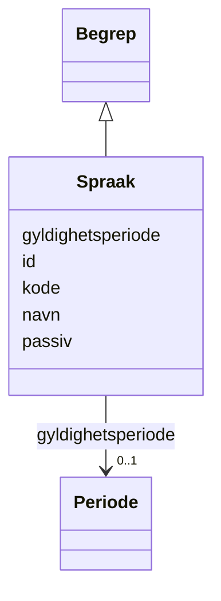

# Class: Spraak 


_Verdiar for språk (2 bokstavar)._


URI: [fint:Spraak](https://schema.fintlabs.no/Spraak)





## Inheritance
* [Begrep](Begrep.md)
    * **Spraak**


## Class Properties

| Property | Value |
| --- | --- |
| Class URI | [fint:Spraak](https://schema.fintlabs.no/Spraak) |


## Eigenskapar


### Arva

| Namn | Kardinalitet og domene | Beskriving | Frå |
| --- | --- | --- | --- || [id](id.md) | 1 <br/> [Uriorcurie](Uriorcurie.md) | URI-identifikator (tilsvarar systemId i FINT) | [Begrep](Begrep.md) |
| [kode](kode.md) | 1 <br/> [String](String.md) | Verdi som identifiserer omgrepet | [Begrep](Begrep.md) |
| [navn](navn.md) | 1 <br/> [String](String.md) | Hovudnamn for omgrepet | [Begrep](Begrep.md) |
| [gyldighetsperiode](gyldighetsperiode.md) | 0..1 <br/> [Periode](Periode.md) | Angir gyldighetsperioden for eit omgrep/kode | [Begrep](Begrep.md) |
| [passiv](passiv.md) | 0..1 <br/> [Boolean](Boolean.md) | Angir at koden er passiv og ikkje kan veljast | [Begrep](Begrep.md) |


## Usages

| used by | used in | type | used |
| ---  | --- | --- | --- |
| [Person](Person.md) | [maalform](maalform.md) | range | [Spraak](Spraak.md) |
| [Person](Person.md) | [morsmaal](morsmaal.md) | range | [Spraak](Spraak.md) |


## Identifier and Mapping Information


### Schema Source


* from schema: https://data.norge.no/linkml/fint-ressurs


## Mappings

| Mapping Type | Mapped Value |
| ---  | ---  |
| self | fint:Spraak |
| native | https://schema.fintlabs.no/ressurs/:Spraak |


## LinkML Source

<!-- TODO: investigate https://stackoverflow.com/questions/37606292/how-to-create-tabbed-code-blocks-in-mkdocs-or-sphinx -->

### Direct

<details>
```yaml
name: Spraak
description: Verdiar for språk (2 bokstavar).
from_schema: https://data.norge.no/linkml/fint-ressurs
is_a: Begrep
class_uri: fint:Spraak

```
</details>

### Induced

<details>
```yaml
name: Spraak
description: Verdiar for språk (2 bokstavar).
from_schema: https://data.norge.no/linkml/fint-ressurs
is_a: Begrep
attributes:
  id:
    name: id
    description: URI-identifikator (tilsvarar systemId i FINT).
    from_schema: https://data.norge.no/linkml/fint-ressurs
    rank: 1000
    identifier: true
    alias: id
    owner: Spraak
    domain_of:
    - Applikasjon
    - Applikasjonsressurs
    - Applikasjonsressurstilgjengelighet
    - DigitalEnhet
    - Enhetsgruppe
    - Enhetsgruppemedlemskap
    - Identitet
    - Rettighet
    - Applikasjonskategori
    - Brukertype
    - Enhetstype
    - Handhevingstype
    - Lisensmodell
    - Plattform
    - Produsent
    - Status
    - Begrep
    - Valuta
    - Person
    - Kontaktperson
    - Virksomhet
    range: uriorcurie
    required: true
  kode:
    name: kode
    description: Verdi som identifiserer omgrepet.
    in_subset:
    - Obligatorisk
    from_schema: https://data.norge.no/linkml/fint-common
    slot_uri: fint:kode
    alias: kode
    owner: Spraak
    domain_of:
    - Rettighet
    - Applikasjonskategori
    - Brukertype
    - Enhetstype
    - Handhevingstype
    - Lisensmodell
    - Plattform
    - Produsent
    - Status
    - Begrep
    range: string
    required: true
  navn:
    name: navn
    description: Hovudnamn for omgrepet.
    in_subset:
    - Obligatorisk
    from_schema: https://data.norge.no/linkml/fint-common
    slot_uri: fint:navn
    alias: navn
    owner: Spraak
    domain_of:
    - Applikasjon
    - Applikasjonsressurs
    - DigitalEnhet
    - Enhetsgruppe
    - Rettighet
    - Applikasjonskategori
    - Brukertype
    - Enhetstype
    - Handhevingstype
    - Lisensmodell
    - Plattform
    - Produsent
    - Status
    - Begrep
    - Valuta
    - Person
    - Kontaktperson
    range: string
    required: true
  gyldighetsperiode:
    name: gyldighetsperiode
    description: Angir gyldighetsperioden for eit omgrep/kode.
    in_subset:
    - Valgfri
    from_schema: https://data.norge.no/linkml/fint-common
    slot_uri: fint:gyldighetsperiode
    alias: gyldighetsperiode
    owner: Spraak
    domain_of:
    - Applikasjon
    - Applikasjonsressurs
    - Applikasjonsressurstilgjengelighet
    - Rettighet
    - Applikasjonskategori
    - Brukertype
    - Enhetstype
    - Handhevingstype
    - Lisensmodell
    - Plattform
    - Produsent
    - Status
    - Begrep
    - Identifikator
    range: Periode
    inlined: true
  passiv:
    name: passiv
    description: Angir at koden er passiv og ikkje kan veljast.
    in_subset:
    - Valgfri
    from_schema: https://data.norge.no/linkml/fint-common
    slot_uri: fint:passiv
    alias: passiv
    owner: Spraak
    domain_of:
    - Rettighet
    - Applikasjonskategori
    - Brukertype
    - Enhetstype
    - Handhevingstype
    - Lisensmodell
    - Plattform
    - Produsent
    - Status
    - Begrep
    range: boolean
class_uri: fint:Spraak

```
</details>