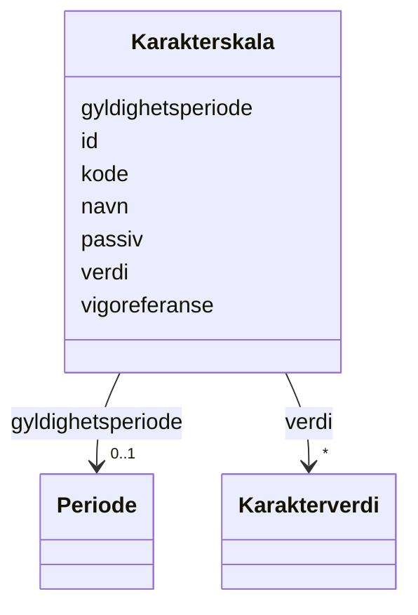

# Class: Karakterskala 


_Skala for karaktersetjing (t.d. 1-6, Bestått/Ikkje bestått)._


URI: [utd:Karakterskala](https://schema.fintlabs.no/utdanning/Karakterskala)





<!-- no inheritance hierarchy -->

## Class Properties

| Property | Value |
| --- | --- |
| Class URI | [utd:Karakterskala](https://schema.fintlabs.no/utdanning/Karakterskala) |


## Eigenskapar


  
  

  
  

  
  

  
  

  
  

  
  

  
  


  
  

  
  

  
  

  
  

  
  

  
  

  
  


  
  

  
  

  
  

  
  

  
  

  
  

  
  


  
  
  
  
    
  

  
  
  
  
    
  

  
  
  
  
    
  

  
  
  
  
    
  

  
  
  
  
    
  

  
  
  
  
    
  

  
  
  
  
    
  


### Andre

| Namn | Kardinalitet og domene | Beskriving |
| --- | --- | --- |
| [id](id.md) | 1 <br/> [Uriorcurie](uriorcurie.md) | URI-identifikator for ressursen |
| [kode](kode.md) | 1 <br/> [String](string.md) |  |
| [navn](navn.md) | 1 <br/> [String](string.md) |  |
| [gyldighetsperiode](gyldighetsperiode.md) | 0..1 <br/> [Periode](periode.md) |  |
| [passiv](passiv.md) | 0..1 <br/> [Boolean](boolean.md) |  |
| [verdi](verdi.md) | * <br/> [Karakterverdi](karakterverdi.md) | Karakterverdiar i denne skalaen |
| [vigoreferanse](vigoreferanse.md) | 0..1 <br/> [Uriorcurie](uriorcurie.md) | Referanse til Vigo-systemet |


## Usages

| used by | used in | type | used |
| ---  | --- | --- | --- |
| [UtdanningContainer](utdanningcontainer.md) | [karakterskalaer](karakterskalaer.md) | range | [Karakterskala](karakterskala.md) |
| [Karakterverdi](karakterverdi.md) | [skala](skala.md) | range | [Karakterskala](karakterskala.md) |


## Identifier and Mapping Information


### Schema Source


* from schema: https://data.norge.no/linkml/fint-utdanning


## Mappings

| Mapping Type | Mapped Value |
| ---  | ---  |
| self | utd:Karakterskala |
| native | https://schema.fintlabs.no/utdanning/:Karakterskala |


## LinkML Source

<!-- TODO: investigate https://stackoverflow.com/questions/37606292/how-to-create-tabbed-code-blocks-in-mkdocs-or-sphinx -->

### Direct

<details>
```yaml
name: Karakterskala
description: Skala for karaktersetjing (t.d. 1-6, Bestått/Ikkje bestått).
from_schema: https://data.norge.no/linkml/fint-utdanning
slots:
- id
attributes:
  kode:
    name: kode
    in_subset:
    - Obligatorisk
    from_schema: https://data.norge.no/linkml/fint-utdanning
    slot_uri: utd:kode
    domain_of:
    - Avbruddsaarsak
    - Betalingsstatus
    - Bevistype
    - Brevtype
    - Eksamensform
    - Elevkategori
    - Fagmerknad
    - Fagstatus
    - Fravartype
    - Fullfortkode
    - Karakterskala
    - Karakterstatus
    - Karakterverdi
    - OtEnhet
    - OtStatus
    - Provestatus
    - Skoleaar
    - Skoleeiertype
    - Termin
    - Tilrettelegging
    - Varseltype
    - Vitnemalsmerknad
    - Begrep
    range: string
    required: true
  navn:
    name: navn
    in_subset:
    - Obligatorisk
    from_schema: https://data.norge.no/linkml/fint-utdanning
    slot_uri: utd:navn
    domain_of:
    - Gruppe
    - Skole
    - Eksamen
    - Rom
    - Time
    - Avbruddsaarsak
    - Betalingsstatus
    - Bevistype
    - Brevtype
    - Eksamensform
    - Elevkategori
    - Fagmerknad
    - Fagstatus
    - Fravartype
    - Fullfortkode
    - Karakterskala
    - Karakterstatus
    - Karakterverdi
    - OtEnhet
    - OtStatus
    - Provestatus
    - Skoleaar
    - Skoleeiertype
    - Termin
    - Tilrettelegging
    - Varseltype
    - Vitnemalsmerknad
    - Begrep
    - Valuta
    - Person
    - Kontaktperson
    range: string
    required: true
  gyldighetsperiode:
    name: gyldighetsperiode
    in_subset:
    - Valgfri
    from_schema: https://data.norge.no/linkml/fint-utdanning
    slot_uri: utd:gyldighetsperiode
    domain_of:
    - Gruppemedlemskap
    - Avbruddsaarsak
    - Betalingsstatus
    - Bevistype
    - Brevtype
    - Eksamensform
    - Elevkategori
    - Fagmerknad
    - Fagstatus
    - Fravartype
    - Fullfortkode
    - Karakterskala
    - Karakterstatus
    - Karakterverdi
    - OtEnhet
    - OtStatus
    - Provestatus
    - Skoleaar
    - Skoleeiertype
    - Termin
    - Tilrettelegging
    - Varseltype
    - Vitnemalsmerknad
    - Begrep
    - Identifikator
    range: Periode
    inlined: true
  passiv:
    name: passiv
    in_subset:
    - Valgfri
    from_schema: https://data.norge.no/linkml/fint-utdanning
    slot_uri: utd:passiv
    domain_of:
    - Avbruddsaarsak
    - Betalingsstatus
    - Bevistype
    - Brevtype
    - Eksamensform
    - Elevkategori
    - Fagmerknad
    - Fagstatus
    - Fravartype
    - Fullfortkode
    - Karakterskala
    - Karakterstatus
    - Karakterverdi
    - OtEnhet
    - OtStatus
    - Provestatus
    - Skoleaar
    - Skoleeiertype
    - Termin
    - Tilrettelegging
    - Varseltype
    - Vitnemalsmerknad
    - Begrep
    range: boolean
  verdi:
    name: verdi
    description: Karakterverdiar i denne skalaen.
    in_subset:
    - Valgfri
    from_schema: https://data.norge.no/linkml/fint-utdanning
    rank: 1000
    slot_uri: utd:verdi
    domain_of:
    - Karakterskala
    range: Karakterverdi
    multivalued: true
  vigoreferanse:
    name: vigoreferanse
    description: Referanse til Vigo-systemet.
    in_subset:
    - Valgfri
    from_schema: https://data.norge.no/linkml/fint-utdanning
    slot_uri: utd:vigoreferanse
    domain_of:
    - Skole
    - Arstrinn
    - Programomrade
    - Utdanningsprogram
    - Fag
    - Karakterskala
    range: uriorcurie
class_uri: utd:Karakterskala

```
</details>

### Induced

<details>
```yaml
name: Karakterskala
description: Skala for karaktersetjing (t.d. 1-6, Bestått/Ikkje bestått).
from_schema: https://data.norge.no/linkml/fint-utdanning
attributes:
  kode:
    name: kode
    in_subset:
    - Obligatorisk
    from_schema: https://data.norge.no/linkml/fint-utdanning
    slot_uri: utd:kode
    alias: kode
    owner: Karakterskala
    domain_of:
    - Avbruddsaarsak
    - Betalingsstatus
    - Bevistype
    - Brevtype
    - Eksamensform
    - Elevkategori
    - Fagmerknad
    - Fagstatus
    - Fravartype
    - Fullfortkode
    - Karakterskala
    - Karakterstatus
    - Karakterverdi
    - OtEnhet
    - OtStatus
    - Provestatus
    - Skoleaar
    - Skoleeiertype
    - Termin
    - Tilrettelegging
    - Varseltype
    - Vitnemalsmerknad
    - Begrep
    range: string
    required: true
  navn:
    name: navn
    in_subset:
    - Obligatorisk
    from_schema: https://data.norge.no/linkml/fint-utdanning
    slot_uri: utd:navn
    alias: navn
    owner: Karakterskala
    domain_of:
    - Gruppe
    - Skole
    - Eksamen
    - Rom
    - Time
    - Avbruddsaarsak
    - Betalingsstatus
    - Bevistype
    - Brevtype
    - Eksamensform
    - Elevkategori
    - Fagmerknad
    - Fagstatus
    - Fravartype
    - Fullfortkode
    - Karakterskala
    - Karakterstatus
    - Karakterverdi
    - OtEnhet
    - OtStatus
    - Provestatus
    - Skoleaar
    - Skoleeiertype
    - Termin
    - Tilrettelegging
    - Varseltype
    - Vitnemalsmerknad
    - Begrep
    - Valuta
    - Person
    - Kontaktperson
    range: string
    required: true
  gyldighetsperiode:
    name: gyldighetsperiode
    in_subset:
    - Valgfri
    from_schema: https://data.norge.no/linkml/fint-utdanning
    slot_uri: utd:gyldighetsperiode
    alias: gyldighetsperiode
    owner: Karakterskala
    domain_of:
    - Gruppemedlemskap
    - Avbruddsaarsak
    - Betalingsstatus
    - Bevistype
    - Brevtype
    - Eksamensform
    - Elevkategori
    - Fagmerknad
    - Fagstatus
    - Fravartype
    - Fullfortkode
    - Karakterskala
    - Karakterstatus
    - Karakterverdi
    - OtEnhet
    - OtStatus
    - Provestatus
    - Skoleaar
    - Skoleeiertype
    - Termin
    - Tilrettelegging
    - Varseltype
    - Vitnemalsmerknad
    - Begrep
    - Identifikator
    range: Periode
    inlined: true
  passiv:
    name: passiv
    in_subset:
    - Valgfri
    from_schema: https://data.norge.no/linkml/fint-utdanning
    slot_uri: utd:passiv
    alias: passiv
    owner: Karakterskala
    domain_of:
    - Avbruddsaarsak
    - Betalingsstatus
    - Bevistype
    - Brevtype
    - Eksamensform
    - Elevkategori
    - Fagmerknad
    - Fagstatus
    - Fravartype
    - Fullfortkode
    - Karakterskala
    - Karakterstatus
    - Karakterverdi
    - OtEnhet
    - OtStatus
    - Provestatus
    - Skoleaar
    - Skoleeiertype
    - Termin
    - Tilrettelegging
    - Varseltype
    - Vitnemalsmerknad
    - Begrep
    range: boolean
  verdi:
    name: verdi
    description: Karakterverdiar i denne skalaen.
    in_subset:
    - Valgfri
    from_schema: https://data.norge.no/linkml/fint-utdanning
    rank: 1000
    slot_uri: utd:verdi
    alias: verdi
    owner: Karakterskala
    domain_of:
    - Karakterskala
    range: Karakterverdi
    multivalued: true
  vigoreferanse:
    name: vigoreferanse
    description: Referanse til Vigo-systemet.
    in_subset:
    - Valgfri
    from_schema: https://data.norge.no/linkml/fint-utdanning
    slot_uri: utd:vigoreferanse
    alias: vigoreferanse
    owner: Karakterskala
    domain_of:
    - Skole
    - Arstrinn
    - Programomrade
    - Utdanningsprogram
    - Fag
    - Karakterskala
    range: uriorcurie
  id:
    name: id
    description: URI-identifikator for ressursen.
    from_schema: https://data.norge.no/linkml/fint-utdanning
    rank: 1000
    identifier: true
    alias: id
    owner: Karakterskala
    domain_of:
    - Gruppe
    - Gruppemedlemskap
    - Utdanningsforhold
    - Elev
    - Elevforhold
    - Elevtilrettelegging
    - Skole
    - Skoleressurs
    - Varsel
    - Eksamen
    - Rom
    - Time
    - FagvurderingAbstrakt
    - OrdensvurderingAbstrakt
    - Anmerkninger
    - Elevfravar
    - Elevvurdering
    - Fravarsoversikt
    - Fraversregistrering
    - Karakterhistorie
    - Sensor
    - AvlagtProve
    - Laerling
    - OtUngdom
    - Avbruddsaarsak
    - Betalingsstatus
    - Bevistype
    - Brevtype
    - Eksamensform
    - Elevkategori
    - Fagmerknad
    - Fagstatus
    - Fravartype
    - Fullfortkode
    - Karakterskala
    - Karakterstatus
    - Karakterverdi
    - OtEnhet
    - OtStatus
    - Provestatus
    - Skoleaar
    - Skoleeiertype
    - Termin
    - Tilrettelegging
    - Varseltype
    - Vitnemalsmerknad
    - Begrep
    - Valuta
    - Person
    - Kontaktperson
    - Virksomhet
    range: uriorcurie
    required: true
class_uri: utd:Karakterskala

```
</details>