# Class: UtdanningContainer 


_Rotcontainer for FINT Utdanning-instansar._


URI: [https://schema.fintlabs.no/utdanning/:UtdanningContainer](https://schema.fintlabs.no/utdanning/:UtdanningContainer)

```mermaid
 classDiagram
    class UtdanningContainer
    click UtdanningContainer href "../UtdanningContainer/"
      UtdanningContainer : anmerkningar
        
          
    
        
        
        UtdanningContainer --> "*" Anmerkninger : anmerkningar
        click Anmerkninger href "../Anmerkninger/"
    

        
      UtdanningContainer : arstrinn
        
          
    
        
        
        UtdanningContainer --> "*" Arstrinn : arstrinn
        click Arstrinn href "../Arstrinn/"
    

        
      UtdanningContainer : avbruddsaarsaker
        
          
    
        
        
        UtdanningContainer --> "*" Avbruddsaarsak : avbruddsaarsaker
        click Avbruddsaarsak href "../Avbruddsaarsak/"
    

        
      UtdanningContainer : avlagteprover
        
          
    
        
        
        UtdanningContainer --> "*" AvlagtProve : avlagteprover
        click AvlagtProve href "../AvlagtProve/"
    

        
      UtdanningContainer : betalingsstatus
        
          
    
        
        
        UtdanningContainer --> "*" Betalingsstatus : betalingsstatus
        click Betalingsstatus href "../Betalingsstatus/"
    

        
      UtdanningContainer : bevistypar
        
          
    
        
        
        UtdanningContainer --> "*" Bevistype : bevistypar
        click Bevistype href "../Bevistype/"
    

        
      UtdanningContainer : brevtypar
        
          
    
        
        
        UtdanningContainer --> "*" Brevtype : brevtypar
        click Brevtype href "../Brevtype/"
    

        
      UtdanningContainer : eksamen
        
          
    
        
        
        UtdanningContainer --> "*" Eksamen : eksamen
        click Eksamen href "../Eksamen/"
    

        
      UtdanningContainer : eksamensformer
        
          
    
        
        
        UtdanningContainer --> "*" Eksamensform : eksamensformer
        click Eksamensform href "../Eksamensform/"
    

        
      UtdanningContainer : eksamensgruppemedlemskap
        
          
    
        
        
        UtdanningContainer --> "*" Eksamensgruppemedlemskap : eksamensgruppemedlemskap
        click Eksamensgruppemedlemskap href "../Eksamensgruppemedlemskap/"
    

        
      UtdanningContainer : eksamensgrupper
        
          
    
        
        
        UtdanningContainer --> "*" Eksamensgruppe : eksamensgrupper
        click Eksamensgruppe href "../Eksamensgruppe/"
    

        
      UtdanningContainer : eksamensvurdering
        
          
    
        
        
        UtdanningContainer --> "*" Eksamensvurdering : eksamensvurdering
        click Eksamensvurdering href "../Eksamensvurdering/"
    

        
      UtdanningContainer : elevar
        
          
    
        
        
        UtdanningContainer --> "*" Elev : elevar
        click Elev href "../Elev/"
    

        
      UtdanningContainer : elevforhold
        
          
    
        
        
        UtdanningContainer --> "*" Elevforhold : elevforhold
        click Elevforhold href "../Elevforhold/"
    

        
      UtdanningContainer : elevfravar
        
          
    
        
        
        UtdanningContainer --> "*" Elevfravar : elevfravar
        click Elevfravar href "../Elevfravar/"
    

        
      UtdanningContainer : elevkategoriar
        
          
    
        
        
        UtdanningContainer --> "*" Elevkategori : elevkategoriar
        click Elevkategori href "../Elevkategori/"
    

        
      UtdanningContainer : elevtilrettelegging
        
          
    
        
        
        UtdanningContainer --> "*" Elevtilrettelegging : elevtilrettelegging
        click Elevtilrettelegging href "../Elevtilrettelegging/"
    

        
      UtdanningContainer : elevvurdering
        
          
    
        
        
        UtdanningContainer --> "*" Elevvurdering : elevvurdering
        click Elevvurdering href "../Elevvurdering/"
    

        
      UtdanningContainer : fag
        
          
    
        
        
        UtdanningContainer --> "*" Fag : fag
        click Fag href "../Fag/"
    

        
      UtdanningContainer : faggruppemedlemskap
        
          
    
        
        
        UtdanningContainer --> "*" Faggruppemedlemskap : faggruppemedlemskap
        click Faggruppemedlemskap href "../Faggruppemedlemskap/"
    

        
      UtdanningContainer : faggrupper
        
          
    
        
        
        UtdanningContainer --> "*" Faggruppe : faggrupper
        click Faggruppe href "../Faggruppe/"
    

        
      UtdanningContainer : fagmerknader
        
          
    
        
        
        UtdanningContainer --> "*" Fagmerknad : fagmerknader
        click Fagmerknad href "../Fagmerknad/"
    

        
      UtdanningContainer : fagstatus
        
          
    
        
        
        UtdanningContainer --> "*" Fagstatus : fagstatus
        click Fagstatus href "../Fagstatus/"
    

        
      UtdanningContainer : fravarsoversikt
        
          
    
        
        
        UtdanningContainer --> "*" Fravarsoversikt : fravarsoversikt
        click Fravarsoversikt href "../Fravarsoversikt/"
    

        
      UtdanningContainer : fravartypar
        
          
    
        
        
        UtdanningContainer --> "*" Fravartype : fravartypar
        click Fravartype href "../Fravartype/"
    

        
      UtdanningContainer : fraversregistrering
        
          
    
        
        
        UtdanningContainer --> "*" Fraversregistrering : fraversregistrering
        click Fraversregistrering href "../Fraversregistrering/"
    

        
      UtdanningContainer : fullfortkoder
        
          
    
        
        
        UtdanningContainer --> "*" Fullfortkode : fullfortkoder
        click Fullfortkode href "../Fullfortkode/"
    

        
      UtdanningContainer : halvaarsfagvurdering
        
          
    
        
        
        UtdanningContainer --> "*" Halvaarsfagvurdering : halvaarsfagvurdering
        click Halvaarsfagvurdering href "../Halvaarsfagvurdering/"
    

        
      UtdanningContainer : halvaarsordensvurdering
        
          
    
        
        
        UtdanningContainer --> "*" Halvaarsordensvurdering : halvaarsordensvurdering
        click Halvaarsordensvurdering href "../Halvaarsordensvurdering/"
    

        
      UtdanningContainer : karakterhistorie
        
          
    
        
        
        UtdanningContainer --> "*" Karakterhistorie : karakterhistorie
        click Karakterhistorie href "../Karakterhistorie/"
    

        
      UtdanningContainer : karakterskalaer
        
          
    
        
        
        UtdanningContainer --> "*" Karakterskala : karakterskalaer
        click Karakterskala href "../Karakterskala/"
    

        
      UtdanningContainer : karakterstatus
        
          
    
        
        
        UtdanningContainer --> "*" Karakterstatus : karakterstatus
        click Karakterstatus href "../Karakterstatus/"
    

        
      UtdanningContainer : karakterverdiar
        
          
    
        
        
        UtdanningContainer --> "*" Karakterverdi : karakterverdiar
        click Karakterverdi href "../Karakterverdi/"
    

        
      UtdanningContainer : klassemedlemskap
        
          
    
        
        
        UtdanningContainer --> "*" Klassemedlemskap : klassemedlemskap
        click Klassemedlemskap href "../Klassemedlemskap/"
    

        
      UtdanningContainer : klasser
        
          
    
        
        
        UtdanningContainer --> "*" Klasse : klasser
        click Klasse href "../Klasse/"
    

        
      UtdanningContainer : kontaktlaerergruppemedlemskap
        
          
    
        
        
        UtdanningContainer --> "*" Kontaktlaerergruppemedlemskap : kontaktlaerergruppemedlemskap
        click Kontaktlaerergruppemedlemskap href "../Kontaktlaerergruppemedlemskap/"
    

        
      UtdanningContainer : kontaktlaerergrupper
        
          
    
        
        
        UtdanningContainer --> "*" Kontaktlaerergruppe : kontaktlaerergrupper
        click Kontaktlaerergruppe href "../Kontaktlaerergruppe/"
    

        
      UtdanningContainer : laerlingar
        
          
    
        
        
        UtdanningContainer --> "*" Laerling : laerlingar
        click Laerling href "../Laerling/"
    

        
      UtdanningContainer : otEnheter
        
          
    
        
        
        UtdanningContainer --> "*" OtEnhet : otEnheter
        click OtEnhet href "../OtEnhet/"
    

        
      UtdanningContainer : otStatus
        
          
    
        
        
        UtdanningContainer --> "*" OtStatus : otStatus
        click OtStatus href "../OtStatus/"
    

        
      UtdanningContainer : otUngdom
        
          
    
        
        
        UtdanningContainer --> "*" OtUngdom : otUngdom
        click OtUngdom href "../OtUngdom/"
    

        
      UtdanningContainer : persongruppemedlemskap
        
          
    
        
        
        UtdanningContainer --> "*" Persongruppemedlemskap : persongruppemedlemskap
        click Persongruppemedlemskap href "../Persongruppemedlemskap/"
    

        
      UtdanningContainer : persongrupper
        
          
    
        
        
        UtdanningContainer --> "*" Persongruppe : persongrupper
        click Persongruppe href "../Persongruppe/"
    

        
      UtdanningContainer : programomrademedlemskap
        
          
    
        
        
        UtdanningContainer --> "*" Programomrademedlemskap : programomrademedlemskap
        click Programomrademedlemskap href "../Programomrademedlemskap/"
    

        
      UtdanningContainer : programomrader
        
          
    
        
        
        UtdanningContainer --> "*" Programomrade : programomrader
        click Programomrade href "../Programomrade/"
    

        
      UtdanningContainer : provestatuser
        
          
    
        
        
        UtdanningContainer --> "*" Provestatus : provestatuser
        click Provestatus href "../Provestatus/"
    

        
      UtdanningContainer : rom
        
          
    
        
        
        UtdanningContainer --> "*" Rom : rom
        click Rom href "../Rom/"
    

        
      UtdanningContainer : sensor
        
          
    
        
        
        UtdanningContainer --> "*" Sensor : sensor
        click Sensor href "../Sensor/"
    

        
      UtdanningContainer : skolar
        
          
    
        
        
        UtdanningContainer --> "*" Skole : skolar
        click Skole href "../Skole/"
    

        
      UtdanningContainer : skoleaar
        
          
    
        
        
        UtdanningContainer --> "*" Skoleaar : skoleaar
        click Skoleaar href "../Skoleaar/"
    

        
      UtdanningContainer : skoleeijartypar
        
          
    
        
        
        UtdanningContainer --> "*" Skoleeiertype : skoleeijartypar
        click Skoleeiertype href "../Skoleeiertype/"
    

        
      UtdanningContainer : skoleressursar
        
          
    
        
        
        UtdanningContainer --> "*" Skoleressurs : skoleressursar
        click Skoleressurs href "../Skoleressurs/"
    

        
      UtdanningContainer : sluttfagvurdering
        
          
    
        
        
        UtdanningContainer --> "*" Sluttfagvurdering : sluttfagvurdering
        click Sluttfagvurdering href "../Sluttfagvurdering/"
    

        
      UtdanningContainer : sluttordensvurdering
        
          
    
        
        
        UtdanningContainer --> "*" Sluttordensvurdering : sluttordensvurdering
        click Sluttordensvurdering href "../Sluttordensvurdering/"
    

        
      UtdanningContainer : terminar
        
          
    
        
        
        UtdanningContainer --> "*" Termin : terminar
        click Termin href "../Termin/"
    

        
      UtdanningContainer : tilrettelegging
        
          
    
        
        
        UtdanningContainer --> "*" Tilrettelegging : tilrettelegging
        click Tilrettelegging href "../Tilrettelegging/"
    

        
      UtdanningContainer : timar
        
          
    
        
        
        UtdanningContainer --> "*" Time : timar
        click Time href "../Time/"
    

        
      UtdanningContainer : underveisfagvurdering
        
          
    
        
        
        UtdanningContainer --> "*" Underveisfagvurdering : underveisfagvurdering
        click Underveisfagvurdering href "../Underveisfagvurdering/"
    

        
      UtdanningContainer : underveisordensvurdering
        
          
    
        
        
        UtdanningContainer --> "*" Underveisordensvurdering : underveisordensvurdering
        click Underveisordensvurdering href "../Underveisordensvurdering/"
    

        
      UtdanningContainer : undervisningsforhold
        
          
    
        
        
        UtdanningContainer --> "*" Undervisningsforhold : undervisningsforhold
        click Undervisningsforhold href "../Undervisningsforhold/"
    

        
      UtdanningContainer : undervisningsgruppemedlemskap
        
          
    
        
        
        UtdanningContainer --> "*" Undervisningsgruppemedlemskap : undervisningsgruppemedlemskap
        click Undervisningsgruppemedlemskap href "../Undervisningsgruppemedlemskap/"
    

        
      UtdanningContainer : undervisningsgrupper
        
          
    
        
        
        UtdanningContainer --> "*" Undervisningsgruppe : undervisningsgrupper
        click Undervisningsgruppe href "../Undervisningsgruppe/"
    

        
      UtdanningContainer : utdanningsprogram
        
          
    
        
        
        UtdanningContainer --> "*" Utdanningsprogram : utdanningsprogram
        click Utdanningsprogram href "../Utdanningsprogram/"
    

        
      UtdanningContainer : varsel
        
          
    
        
        
        UtdanningContainer --> "*" Varsel : varsel
        click Varsel href "../Varsel/"
    

        
      UtdanningContainer : varseltypar
        
          
    
        
        
        UtdanningContainer --> "*" Varseltype : varseltypar
        click Varseltype href "../Varseltype/"
    

        
      UtdanningContainer : vitnemalsmerknad
        
          
    
        
        
        UtdanningContainer --> "*" Vitnemalsmerknad : vitnemalsmerknad
        click Vitnemalsmerknad href "../Vitnemalsmerknad/"
    

        
      
```





<!-- no inheritance hierarchy -->

## Class Properties

| Property | Value |
| --- | --- |
| Tree Root | Yes |


## Eigenskapar


  
  

  
  

  
  

  
  

  
  

  
  

  
  

  
  

  
  

  
  

  
  

  
  

  
  

  
  

  
  

  
  

  
  

  
  

  
  

  
  

  
  

  
  

  
  

  
  

  
  

  
  

  
  

  
  

  
  

  
  

  
  

  
  

  
  

  
  

  
  

  
  

  
  

  
  

  
  

  
  

  
  

  
  

  
  

  
  

  
  

  
  

  
  

  
  

  
  

  
  

  
  

  
  

  
  

  
  

  
  

  
  

  
  

  
  

  
  

  
  

  
  

  
  

  
  

  
  

  
  

  
  


  
  

  
  

  
  

  
  

  
  

  
  

  
  

  
  

  
  

  
  

  
  

  
  

  
  

  
  

  
  

  
  

  
  

  
  

  
  

  
  

  
  

  
  

  
  

  
  

  
  

  
  

  
  

  
  

  
  

  
  

  
  

  
  

  
  

  
  

  
  

  
  

  
  

  
  

  
  

  
  

  
  

  
  

  
  

  
  

  
  

  
  

  
  

  
  

  
  

  
  

  
  

  
  

  
  

  
  

  
  

  
  

  
  

  
  

  
  

  
  

  
  

  
  

  
  

  
  

  
  

  
  


  
  

  
  

  
  

  
  

  
  

  
  

  
  

  
  

  
  

  
  

  
  

  
  

  
  

  
  

  
  

  
  

  
  

  
  

  
  

  
  

  
  

  
  

  
  

  
  

  
  

  
  

  
  

  
  

  
  

  
  

  
  

  
  

  
  

  
  

  
  

  
  

  
  

  
  

  
  

  
  

  
  

  
  

  
  

  
  

  
  

  
  

  
  

  
  

  
  

  
  

  
  

  
  

  
  

  
  

  
  

  
  

  
  

  
  

  
  

  
  

  
  

  
  

  
  

  
  

  
  

  
  


  
  
  
  
    
  

  
  
  
  
    
  

  
  
  
  
    
  

  
  
  
  
    
  

  
  
  
  
    
  

  
  
  
  
    
  

  
  
  
  
    
  

  
  
  
  
    
  

  
  
  
  
    
  

  
  
  
  
    
  

  
  
  
  
    
  

  
  
  
  
    
  

  
  
  
  
    
  

  
  
  
  
    
  

  
  
  
  
    
  

  
  
  
  
    
  

  
  
  
  
    
  

  
  
  
  
    
  

  
  
  
  
    
  

  
  
  
  
    
  

  
  
  
  
    
  

  
  
  
  
    
  

  
  
  
  
    
  

  
  
  
  
    
  

  
  
  
  
    
  

  
  
  
  
    
  

  
  
  
  
    
  

  
  
  
  
    
  

  
  
  
  
    
  

  
  
  
  
    
  

  
  
  
  
    
  

  
  
  
  
    
  

  
  
  
  
    
  

  
  
  
  
    
  

  
  
  
  
    
  

  
  
  
  
    
  

  
  
  
  
    
  

  
  
  
  
    
  

  
  
  
  
    
  

  
  
  
  
    
  

  
  
  
  
    
  

  
  
  
  
    
  

  
  
  
  
    
  

  
  
  
  
    
  

  
  
  
  
    
  

  
  
  
  
    
  

  
  
  
  
    
  

  
  
  
  
    
  

  
  
  
  
    
  

  
  
  
  
    
  

  
  
  
  
    
  

  
  
  
  
    
  

  
  
  
  
    
  

  
  
  
  
    
  

  
  
  
  
    
  

  
  
  
  
    
  

  
  
  
  
    
  

  
  
  
  
    
  

  
  
  
  
    
  

  
  
  
  
    
  

  
  
  
  
    
  

  
  
  
  
    
  

  
  
  
  
    
  

  
  
  
  
    
  

  
  
  
  
    
  

  
  
  
  
    
  


### Andre

| Namn | Kardinalitet og domene | Beskriving |
| --- | --- | --- |
| [elevar](elevar.md) | * <br/> [Elev](elev.md) |  |
| [skolar](skolar.md) | * <br/> [Skole](skole.md) |  |
| [skoleressursar](skoleressursar.md) | * <br/> [Skoleressurs](skoleressurs.md) |  |
| [elevforhold](elevforhold.md) | * <br/> [Elevforhold](elevforhold.md) |  |
| [elevtilrettelegging](elevtilrettelegging.md) | * <br/> [Elevtilrettelegging](elevtilrettelegging.md) |  |
| [klasser](klasser.md) | * <br/> [Klasse](klasse.md) |  |
| [klassemedlemskap](klassemedlemskap.md) | * <br/> [Klassemedlemskap](klassemedlemskap.md) |  |
| [kontaktlaerergrupper](kontaktlaerergrupper.md) | * <br/> [Kontaktlaerergruppe](kontaktlaerergruppe.md) |  |
| [kontaktlaerergruppemedlemskap](kontaktlaerergruppemedlemskap.md) | * <br/> [Kontaktlaerergruppemedlemskap](kontaktlaerergruppemedlemskap.md) |  |
| [persongrupper](persongrupper.md) | * <br/> [Persongruppe](persongruppe.md) |  |
| [persongruppemedlemskap](persongruppemedlemskap.md) | * <br/> [Persongruppemedlemskap](persongruppemedlemskap.md) |  |
| [varsel](varsel.md) | * <br/> [Varsel](varsel.md) |  |
| [arstrinn](arstrinn.md) | * <br/> [Arstrinn](arstrinn.md) |  |
| [programomrader](programomrader.md) | * <br/> [Programomrade](programomrade.md) |  |
| [programomrademedlemskap](programomrademedlemskap.md) | * <br/> [Programomrademedlemskap](programomrademedlemskap.md) |  |
| [utdanningsprogram](utdanningsprogram.md) | * <br/> [Utdanningsprogram](utdanningsprogram.md) |  |
| [eksamen](eksamen.md) | * <br/> [Eksamen](eksamen.md) |  |
| [fag](fag.md) | * <br/> [Fag](fag.md) |  |
| [faggrupper](faggrupper.md) | * <br/> [Faggruppe](faggruppe.md) |  |
| [faggruppemedlemskap](faggruppemedlemskap.md) | * <br/> [Faggruppemedlemskap](faggruppemedlemskap.md) |  |
| [rom](rom.md) | * <br/> [Rom](rom.md) |  |
| [timar](timar.md) | * <br/> [Time](time.md) |  |
| [undervisningsforhold](undervisningsforhold.md) | * <br/> [Undervisningsforhold](undervisningsforhold.md) |  |
| [undervisningsgrupper](undervisningsgrupper.md) | * <br/> [Undervisningsgruppe](undervisningsgruppe.md) |  |
| [undervisningsgruppemedlemskap](undervisningsgruppemedlemskap.md) | * <br/> [Undervisningsgruppemedlemskap](undervisningsgruppemedlemskap.md) |  |
| [anmerkningar](anmerkningar.md) | * <br/> [Anmerkninger](anmerkninger.md) |  |
| [eksamensgrupper](eksamensgrupper.md) | * <br/> [Eksamensgruppe](eksamensgruppe.md) |  |
| [eksamensgruppemedlemskap](eksamensgruppemedlemskap.md) | * <br/> [Eksamensgruppemedlemskap](eksamensgruppemedlemskap.md) |  |
| [eksamensvurdering](eksamensvurdering.md) | * <br/> [Eksamensvurdering](eksamensvurdering.md) |  |
| [elevfravar](elevfravar.md) | * <br/> [Elevfravar](elevfravar.md) |  |
| [elevvurdering](elevvurdering.md) | * <br/> [Elevvurdering](elevvurdering.md) |  |
| [fravarsoversikt](fravarsoversikt.md) | * <br/> [Fravarsoversikt](fravarsoversikt.md) |  |
| [fraversregistrering](fraversregistrering.md) | * <br/> [Fraversregistrering](fraversregistrering.md) |  |
| [halvaarsfagvurdering](halvaarsfagvurdering.md) | * <br/> [Halvaarsfagvurdering](halvaarsfagvurdering.md) |  |
| [halvaarsordensvurdering](halvaarsordensvurdering.md) | * <br/> [Halvaarsordensvurdering](halvaarsordensvurdering.md) |  |
| [karakterhistorie](karakterhistorie.md) | * <br/> [Karakterhistorie](karakterhistorie.md) |  |
| [sensor](sensor.md) | * <br/> [Sensor](sensor.md) |  |
| [sluttfagvurdering](sluttfagvurdering.md) | * <br/> [Sluttfagvurdering](sluttfagvurdering.md) |  |
| [sluttordensvurdering](sluttordensvurdering.md) | * <br/> [Sluttordensvurdering](sluttordensvurdering.md) |  |
| [underveisfagvurdering](underveisfagvurdering.md) | * <br/> [Underveisfagvurdering](underveisfagvurdering.md) |  |
| [underveisordensvurdering](underveisordensvurdering.md) | * <br/> [Underveisordensvurdering](underveisordensvurdering.md) |  |
| [avlagteprover](avlagteprover.md) | * <br/> [AvlagtProve](avlagtprove.md) |  |
| [laerlingar](laerlingar.md) | * <br/> [Laerling](laerling.md) |  |
| [otUngdom](otungdom.md) | * <br/> [OtUngdom](otungdom.md) |  |
| [avbruddsaarsaker](avbruddsaarsaker.md) | * <br/> [Avbruddsaarsak](avbruddsaarsak.md) |  |
| [betalingsstatus](betalingsstatus.md) | * <br/> [Betalingsstatus](betalingsstatus.md) |  |
| [bevistypar](bevistypar.md) | * <br/> [Bevistype](bevistype.md) |  |
| [brevtypar](brevtypar.md) | * <br/> [Brevtype](brevtype.md) |  |
| [eksamensformer](eksamensformer.md) | * <br/> [Eksamensform](eksamensform.md) |  |
| [elevkategoriar](elevkategoriar.md) | * <br/> [Elevkategori](elevkategori.md) |  |
| [fagmerknader](fagmerknader.md) | * <br/> [Fagmerknad](fagmerknad.md) |  |
| [fagstatus](fagstatus.md) | * <br/> [Fagstatus](fagstatus.md) |  |
| [fravartypar](fravartypar.md) | * <br/> [Fravartype](fravartype.md) |  |
| [fullfortkoder](fullfortkoder.md) | * <br/> [Fullfortkode](fullfortkode.md) |  |
| [karakterskalaer](karakterskalaer.md) | * <br/> [Karakterskala](karakterskala.md) |  |
| [karakterstatus](karakterstatus.md) | * <br/> [Karakterstatus](karakterstatus.md) |  |
| [karakterverdiar](karakterverdiar.md) | * <br/> [Karakterverdi](karakterverdi.md) |  |
| [otEnheter](otenheter.md) | * <br/> [OtEnhet](otenhet.md) |  |
| [otStatus](otstatus.md) | * <br/> [OtStatus](otstatus.md) |  |
| [provestatuser](provestatuser.md) | * <br/> [Provestatus](provestatus.md) |  |
| [skoleaar](skoleaar.md) | * <br/> [Skoleaar](skoleaar.md) |  |
| [skoleeijartypar](skoleeijartypar.md) | * <br/> [Skoleeiertype](skoleeiertype.md) |  |
| [terminar](terminar.md) | * <br/> [Termin](termin.md) |  |
| [tilrettelegging](tilrettelegging.md) | * <br/> [Tilrettelegging](tilrettelegging.md) |  |
| [varseltypar](varseltypar.md) | * <br/> [Varseltype](varseltype.md) |  |
| [vitnemalsmerknad](vitnemalsmerknad.md) | * <br/> [Vitnemalsmerknad](vitnemalsmerknad.md) |  |


## Identifier and Mapping Information


### Schema Source


* from schema: https://data.norge.no/linkml/fint-utdanning


## Mappings

| Mapping Type | Mapped Value |
| ---  | ---  |
| self | https://schema.fintlabs.no/utdanning/:UtdanningContainer |
| native | https://schema.fintlabs.no/utdanning/:UtdanningContainer |


## LinkML Source

<!-- TODO: investigate https://stackoverflow.com/questions/37606292/how-to-create-tabbed-code-blocks-in-mkdocs-or-sphinx -->

### Direct

<details>
```yaml
name: UtdanningContainer
description: Rotcontainer for FINT Utdanning-instansar.
from_schema: https://data.norge.no/linkml/fint-utdanning
attributes:
  elevar:
    name: elevar
    from_schema: https://data.norge.no/linkml/fint-utdanning
    rank: 1000
    domain_of:
    - UtdanningContainer
    range: Elev
    multivalued: true
    inlined: true
    inlined_as_list: true
  skolar:
    name: skolar
    from_schema: https://data.norge.no/linkml/fint-utdanning
    rank: 1000
    domain_of:
    - UtdanningContainer
    range: Skole
    multivalued: true
    inlined: true
    inlined_as_list: true
  skoleressursar:
    name: skoleressursar
    from_schema: https://data.norge.no/linkml/fint-utdanning
    rank: 1000
    domain_of:
    - UtdanningContainer
    range: Skoleressurs
    multivalued: true
    inlined: true
    inlined_as_list: true
  elevforhold:
    name: elevforhold
    from_schema: https://data.norge.no/linkml/fint-utdanning
    rank: 1000
    domain_of:
    - UtdanningContainer
    - Klassemedlemskap
    - Kontaktlaerergruppemedlemskap
    - Persongruppemedlemskap
    - Programomrademedlemskap
    - Faggruppemedlemskap
    - Undervisningsgruppemedlemskap
    - Eksamensgruppemedlemskap
    - Elevfravar
    - Elevvurdering
    - Fravarsoversikt
    range: Elevforhold
    multivalued: true
    inlined: true
    inlined_as_list: true
  elevtilrettelegging:
    name: elevtilrettelegging
    from_schema: https://data.norge.no/linkml/fint-utdanning
    rank: 1000
    domain_of:
    - UtdanningContainer
    range: Elevtilrettelegging
    multivalued: true
    inlined: true
    inlined_as_list: true
  klasser:
    name: klasser
    from_schema: https://data.norge.no/linkml/fint-utdanning
    rank: 1000
    domain_of:
    - UtdanningContainer
    range: Klasse
    multivalued: true
    inlined: true
    inlined_as_list: true
  klassemedlemskap:
    name: klassemedlemskap
    from_schema: https://data.norge.no/linkml/fint-utdanning
    rank: 1000
    domain_of:
    - UtdanningContainer
    - Elevforhold
    - Klasse
    range: Klassemedlemskap
    multivalued: true
    inlined: true
    inlined_as_list: true
  kontaktlaerergrupper:
    name: kontaktlaerergrupper
    from_schema: https://data.norge.no/linkml/fint-utdanning
    rank: 1000
    domain_of:
    - UtdanningContainer
    range: Kontaktlaerergruppe
    multivalued: true
    inlined: true
    inlined_as_list: true
  kontaktlaerergruppemedlemskap:
    name: kontaktlaerergruppemedlemskap
    from_schema: https://data.norge.no/linkml/fint-utdanning
    rank: 1000
    domain_of:
    - UtdanningContainer
    - Elevforhold
    range: Kontaktlaerergruppemedlemskap
    multivalued: true
    inlined: true
    inlined_as_list: true
  persongrupper:
    name: persongrupper
    from_schema: https://data.norge.no/linkml/fint-utdanning
    rank: 1000
    domain_of:
    - UtdanningContainer
    range: Persongruppe
    multivalued: true
    inlined: true
    inlined_as_list: true
  persongruppemedlemskap:
    name: persongruppemedlemskap
    from_schema: https://data.norge.no/linkml/fint-utdanning
    rank: 1000
    domain_of:
    - UtdanningContainer
    - Elevforhold
    - Persongruppe
    range: Persongruppemedlemskap
    multivalued: true
    inlined: true
    inlined_as_list: true
  varsel:
    name: varsel
    from_schema: https://data.norge.no/linkml/fint-utdanning
    rank: 1000
    domain_of:
    - UtdanningContainer
    - Faggruppemedlemskap
    range: Varsel
    multivalued: true
    inlined: true
    inlined_as_list: true
  arstrinn:
    name: arstrinn
    from_schema: https://data.norge.no/linkml/fint-utdanning
    rank: 1000
    domain_of:
    - UtdanningContainer
    range: Arstrinn
    multivalued: true
    inlined: true
    inlined_as_list: true
  programomrader:
    name: programomrader
    from_schema: https://data.norge.no/linkml/fint-utdanning
    rank: 1000
    domain_of:
    - UtdanningContainer
    range: Programomrade
    multivalued: true
    inlined: true
    inlined_as_list: true
  programomrademedlemskap:
    name: programomrademedlemskap
    from_schema: https://data.norge.no/linkml/fint-utdanning
    rank: 1000
    domain_of:
    - UtdanningContainer
    - Elevforhold
    range: Programomrademedlemskap
    multivalued: true
    inlined: true
    inlined_as_list: true
  utdanningsprogram:
    name: utdanningsprogram
    from_schema: https://data.norge.no/linkml/fint-utdanning
    rank: 1000
    domain_of:
    - UtdanningContainer
    - Skole
    range: Utdanningsprogram
    multivalued: true
    inlined: true
    inlined_as_list: true
  eksamen:
    name: eksamen
    from_schema: https://data.norge.no/linkml/fint-utdanning
    rank: 1000
    domain_of:
    - UtdanningContainer
    - Rom
    - Eksamensgruppe
    range: Eksamen
    multivalued: true
    inlined: true
    inlined_as_list: true
  fag:
    name: fag
    from_schema: https://data.norge.no/linkml/fint-utdanning
    rank: 1000
    domain_of:
    - UtdanningContainer
    - Skole
    - Faggruppe
    - Undervisningsgruppe
    - FagvurderingAbstrakt
    - Eksamensgruppe
    - Fravarsoversikt
    range: Fag
    multivalued: true
    inlined: true
    inlined_as_list: true
  faggrupper:
    name: faggrupper
    from_schema: https://data.norge.no/linkml/fint-utdanning
    rank: 1000
    domain_of:
    - UtdanningContainer
    range: Faggruppe
    multivalued: true
    inlined: true
    inlined_as_list: true
  faggruppemedlemskap:
    name: faggruppemedlemskap
    from_schema: https://data.norge.no/linkml/fint-utdanning
    rank: 1000
    domain_of:
    - UtdanningContainer
    - Elevforhold
    - Varsel
    - Faggruppe
    range: Faggruppemedlemskap
    multivalued: true
    inlined: true
    inlined_as_list: true
  rom:
    name: rom
    from_schema: https://data.norge.no/linkml/fint-utdanning
    rank: 1000
    domain_of:
    - UtdanningContainer
    - Eksamen
    - Time
    range: Rom
    multivalued: true
    inlined: true
    inlined_as_list: true
  timar:
    name: timar
    from_schema: https://data.norge.no/linkml/fint-utdanning
    rank: 1000
    domain_of:
    - UtdanningContainer
    range: Time
    multivalued: true
    inlined: true
    inlined_as_list: true
  undervisningsforhold:
    name: undervisningsforhold
    from_schema: https://data.norge.no/linkml/fint-utdanning
    rank: 1000
    domain_of:
    - UtdanningContainer
    - Klasse
    - Kontaktlaerergruppe
    - Persongruppe
    - Time
    - Undervisningsgruppe
    - Eksamensgruppe
    range: Undervisningsforhold
    multivalued: true
    inlined: true
    inlined_as_list: true
  undervisningsgrupper:
    name: undervisningsgrupper
    from_schema: https://data.norge.no/linkml/fint-utdanning
    rank: 1000
    domain_of:
    - UtdanningContainer
    range: Undervisningsgruppe
    multivalued: true
    inlined: true
    inlined_as_list: true
  undervisningsgruppemedlemskap:
    name: undervisningsgruppemedlemskap
    from_schema: https://data.norge.no/linkml/fint-utdanning
    rank: 1000
    domain_of:
    - UtdanningContainer
    - Elevforhold
    range: Undervisningsgruppemedlemskap
    multivalued: true
    inlined: true
    inlined_as_list: true
  anmerkningar:
    name: anmerkningar
    from_schema: https://data.norge.no/linkml/fint-utdanning
    rank: 1000
    domain_of:
    - UtdanningContainer
    range: Anmerkninger
    multivalued: true
    inlined: true
    inlined_as_list: true
  eksamensgrupper:
    name: eksamensgrupper
    from_schema: https://data.norge.no/linkml/fint-utdanning
    rank: 1000
    domain_of:
    - UtdanningContainer
    range: Eksamensgruppe
    multivalued: true
    inlined: true
    inlined_as_list: true
  eksamensgruppemedlemskap:
    name: eksamensgruppemedlemskap
    from_schema: https://data.norge.no/linkml/fint-utdanning
    rank: 1000
    domain_of:
    - UtdanningContainer
    - Elevforhold
    range: Eksamensgruppemedlemskap
    multivalued: true
    inlined: true
    inlined_as_list: true
  eksamensvurdering:
    name: eksamensvurdering
    from_schema: https://data.norge.no/linkml/fint-utdanning
    rank: 1000
    domain_of:
    - UtdanningContainer
    - Elevvurdering
    range: Eksamensvurdering
    multivalued: true
    inlined: true
    inlined_as_list: true
  elevfravar:
    name: elevfravar
    from_schema: https://data.norge.no/linkml/fint-utdanning
    rank: 1000
    domain_of:
    - UtdanningContainer
    - Elevforhold
    - Fraversregistrering
    range: Elevfravar
    multivalued: true
    inlined: true
    inlined_as_list: true
  elevvurdering:
    name: elevvurdering
    from_schema: https://data.norge.no/linkml/fint-utdanning
    rank: 1000
    domain_of:
    - UtdanningContainer
    - Elevforhold
    - Eksamensvurdering
    - Halvaarsfagvurdering
    - Halvaarsordensvurdering
    - Sluttfagvurdering
    - Sluttordensvurdering
    - Underveisfagvurdering
    - Underveisordensvurdering
    range: Elevvurdering
    multivalued: true
    inlined: true
    inlined_as_list: true
  fravarsoversikt:
    name: fravarsoversikt
    from_schema: https://data.norge.no/linkml/fint-utdanning
    rank: 1000
    domain_of:
    - UtdanningContainer
    range: Fravarsoversikt
    multivalued: true
    inlined: true
    inlined_as_list: true
  fraversregistrering:
    name: fraversregistrering
    from_schema: https://data.norge.no/linkml/fint-utdanning
    rank: 1000
    domain_of:
    - UtdanningContainer
    - Elevfravar
    range: Fraversregistrering
    multivalued: true
    inlined: true
    inlined_as_list: true
  halvaarsfagvurdering:
    name: halvaarsfagvurdering
    from_schema: https://data.norge.no/linkml/fint-utdanning
    rank: 1000
    domain_of:
    - UtdanningContainer
    - Elevvurdering
    range: Halvaarsfagvurdering
    multivalued: true
    inlined: true
    inlined_as_list: true
  halvaarsordensvurdering:
    name: halvaarsordensvurdering
    from_schema: https://data.norge.no/linkml/fint-utdanning
    rank: 1000
    domain_of:
    - UtdanningContainer
    - Elevvurdering
    range: Halvaarsordensvurdering
    multivalued: true
    inlined: true
    inlined_as_list: true
  karakterhistorie:
    name: karakterhistorie
    from_schema: https://data.norge.no/linkml/fint-utdanning
    rank: 1000
    domain_of:
    - UtdanningContainer
    - Eksamensvurdering
    - Sluttfagvurdering
    range: Karakterhistorie
    multivalued: true
    inlined: true
    inlined_as_list: true
  sensor:
    name: sensor
    from_schema: https://data.norge.no/linkml/fint-utdanning
    rank: 1000
    domain_of:
    - UtdanningContainer
    - Skoleressurs
    - Eksamensgruppe
    range: Sensor
    multivalued: true
    inlined: true
    inlined_as_list: true
  sluttfagvurdering:
    name: sluttfagvurdering
    from_schema: https://data.norge.no/linkml/fint-utdanning
    rank: 1000
    domain_of:
    - UtdanningContainer
    - Elevvurdering
    range: Sluttfagvurdering
    multivalued: true
    inlined: true
    inlined_as_list: true
  sluttordensvurdering:
    name: sluttordensvurdering
    from_schema: https://data.norge.no/linkml/fint-utdanning
    rank: 1000
    domain_of:
    - UtdanningContainer
    - Elevvurdering
    range: Sluttordensvurdering
    multivalued: true
    inlined: true
    inlined_as_list: true
  underveisfagvurdering:
    name: underveisfagvurdering
    from_schema: https://data.norge.no/linkml/fint-utdanning
    rank: 1000
    domain_of:
    - UtdanningContainer
    - Elevvurdering
    range: Underveisfagvurdering
    multivalued: true
    inlined: true
    inlined_as_list: true
  underveisordensvurdering:
    name: underveisordensvurdering
    from_schema: https://data.norge.no/linkml/fint-utdanning
    rank: 1000
    domain_of:
    - UtdanningContainer
    - Elevvurdering
    range: Underveisordensvurdering
    multivalued: true
    inlined: true
    inlined_as_list: true
  avlagteprover:
    name: avlagteprover
    from_schema: https://data.norge.no/linkml/fint-utdanning
    rank: 1000
    domain_of:
    - UtdanningContainer
    range: AvlagtProve
    multivalued: true
    inlined: true
    inlined_as_list: true
  laerlingar:
    name: laerlingar
    from_schema: https://data.norge.no/linkml/fint-utdanning
    rank: 1000
    domain_of:
    - UtdanningContainer
    range: Laerling
    multivalued: true
    inlined: true
    inlined_as_list: true
  otUngdom:
    name: otUngdom
    from_schema: https://data.norge.no/linkml/fint-utdanning
    rank: 1000
    domain_of:
    - UtdanningContainer
    range: OtUngdom
    multivalued: true
    inlined: true
    inlined_as_list: true
  avbruddsaarsaker:
    name: avbruddsaarsaker
    from_schema: https://data.norge.no/linkml/fint-utdanning
    rank: 1000
    domain_of:
    - UtdanningContainer
    range: Avbruddsaarsak
    multivalued: true
    inlined: true
    inlined_as_list: true
  betalingsstatus:
    name: betalingsstatus
    from_schema: https://data.norge.no/linkml/fint-utdanning
    rank: 1000
    domain_of:
    - UtdanningContainer
    - Eksamensgruppemedlemskap
    range: Betalingsstatus
    multivalued: true
    inlined: true
    inlined_as_list: true
  bevistypar:
    name: bevistypar
    from_schema: https://data.norge.no/linkml/fint-utdanning
    rank: 1000
    domain_of:
    - UtdanningContainer
    range: Bevistype
    multivalued: true
    inlined: true
    inlined_as_list: true
  brevtypar:
    name: brevtypar
    from_schema: https://data.norge.no/linkml/fint-utdanning
    rank: 1000
    domain_of:
    - UtdanningContainer
    range: Brevtype
    multivalued: true
    inlined: true
    inlined_as_list: true
  eksamensformer:
    name: eksamensformer
    from_schema: https://data.norge.no/linkml/fint-utdanning
    rank: 1000
    domain_of:
    - UtdanningContainer
    range: Eksamensform
    multivalued: true
    inlined: true
    inlined_as_list: true
  elevkategoriar:
    name: elevkategoriar
    from_schema: https://data.norge.no/linkml/fint-utdanning
    rank: 1000
    domain_of:
    - UtdanningContainer
    range: Elevkategori
    multivalued: true
    inlined: true
    inlined_as_list: true
  fagmerknader:
    name: fagmerknader
    from_schema: https://data.norge.no/linkml/fint-utdanning
    rank: 1000
    domain_of:
    - UtdanningContainer
    range: Fagmerknad
    multivalued: true
    inlined: true
    inlined_as_list: true
  fagstatus:
    name: fagstatus
    from_schema: https://data.norge.no/linkml/fint-utdanning
    rank: 1000
    domain_of:
    - UtdanningContainer
    - Faggruppemedlemskap
    range: Fagstatus
    multivalued: true
    inlined: true
    inlined_as_list: true
  fravartypar:
    name: fravartypar
    from_schema: https://data.norge.no/linkml/fint-utdanning
    rank: 1000
    domain_of:
    - UtdanningContainer
    range: Fravartype
    multivalued: true
    inlined: true
    inlined_as_list: true
  fullfortkoder:
    name: fullfortkoder
    from_schema: https://data.norge.no/linkml/fint-utdanning
    rank: 1000
    domain_of:
    - UtdanningContainer
    range: Fullfortkode
    multivalued: true
    inlined: true
    inlined_as_list: true
  karakterskalaer:
    name: karakterskalaer
    from_schema: https://data.norge.no/linkml/fint-utdanning
    rank: 1000
    domain_of:
    - UtdanningContainer
    range: Karakterskala
    multivalued: true
    inlined: true
    inlined_as_list: true
  karakterstatus:
    name: karakterstatus
    from_schema: https://data.norge.no/linkml/fint-utdanning
    rank: 1000
    domain_of:
    - UtdanningContainer
    - Karakterhistorie
    range: Karakterstatus
    multivalued: true
    inlined: true
    inlined_as_list: true
  karakterverdiar:
    name: karakterverdiar
    from_schema: https://data.norge.no/linkml/fint-utdanning
    rank: 1000
    domain_of:
    - UtdanningContainer
    range: Karakterverdi
    multivalued: true
    inlined: true
    inlined_as_list: true
  otEnheter:
    name: otEnheter
    from_schema: https://data.norge.no/linkml/fint-utdanning
    rank: 1000
    domain_of:
    - UtdanningContainer
    range: OtEnhet
    multivalued: true
    inlined: true
    inlined_as_list: true
  otStatus:
    name: otStatus
    from_schema: https://data.norge.no/linkml/fint-utdanning
    rank: 1000
    domain_of:
    - UtdanningContainer
    range: OtStatus
    multivalued: true
    inlined: true
    inlined_as_list: true
  provestatuser:
    name: provestatuser
    from_schema: https://data.norge.no/linkml/fint-utdanning
    rank: 1000
    domain_of:
    - UtdanningContainer
    range: Provestatus
    multivalued: true
    inlined: true
    inlined_as_list: true
  skoleaar:
    name: skoleaar
    from_schema: https://data.norge.no/linkml/fint-utdanning
    rank: 1000
    domain_of:
    - UtdanningContainer
    - Elevforhold
    - Klasse
    - Kontaktlaerergruppe
    - Persongruppe
    - Faggruppe
    - Undervisningsgruppe
    - FagvurderingAbstrakt
    - OrdensvurderingAbstrakt
    - Anmerkninger
    - Eksamensgruppe
    range: Skoleaar
    multivalued: true
    inlined: true
    inlined_as_list: true
  skoleeijartypar:
    name: skoleeijartypar
    from_schema: https://data.norge.no/linkml/fint-utdanning
    rank: 1000
    domain_of:
    - UtdanningContainer
    range: Skoleeiertype
    multivalued: true
    inlined: true
    inlined_as_list: true
  terminar:
    name: terminar
    from_schema: https://data.norge.no/linkml/fint-utdanning
    rank: 1000
    domain_of:
    - UtdanningContainer
    range: Termin
    multivalued: true
    inlined: true
    inlined_as_list: true
  tilrettelegging:
    name: tilrettelegging
    from_schema: https://data.norge.no/linkml/fint-utdanning
    rank: 1000
    domain_of:
    - UtdanningContainer
    - Elevforhold
    - Elevtilrettelegging
    - Fag
    range: Tilrettelegging
    multivalued: true
    inlined: true
    inlined_as_list: true
  varseltypar:
    name: varseltypar
    from_schema: https://data.norge.no/linkml/fint-utdanning
    rank: 1000
    domain_of:
    - UtdanningContainer
    range: Varseltype
    multivalued: true
    inlined: true
    inlined_as_list: true
  vitnemalsmerknad:
    name: vitnemalsmerknad
    from_schema: https://data.norge.no/linkml/fint-utdanning
    rank: 1000
    domain_of:
    - UtdanningContainer
    - Elevvurdering
    range: Vitnemalsmerknad
    multivalued: true
    inlined: true
    inlined_as_list: true
tree_root: true

```
</details>

### Induced

<details>
```yaml
name: UtdanningContainer
description: Rotcontainer for FINT Utdanning-instansar.
from_schema: https://data.norge.no/linkml/fint-utdanning
attributes:
  elevar:
    name: elevar
    from_schema: https://data.norge.no/linkml/fint-utdanning
    rank: 1000
    alias: elevar
    owner: UtdanningContainer
    domain_of:
    - UtdanningContainer
    range: Elev
    multivalued: true
    inlined_as_list: true
  skolar:
    name: skolar
    from_schema: https://data.norge.no/linkml/fint-utdanning
    rank: 1000
    alias: skolar
    owner: UtdanningContainer
    domain_of:
    - UtdanningContainer
    range: Skole
    multivalued: true
    inlined_as_list: true
  skoleressursar:
    name: skoleressursar
    from_schema: https://data.norge.no/linkml/fint-utdanning
    rank: 1000
    alias: skoleressursar
    owner: UtdanningContainer
    domain_of:
    - UtdanningContainer
    range: Skoleressurs
    multivalued: true
    inlined_as_list: true
  elevforhold:
    name: elevforhold
    from_schema: https://data.norge.no/linkml/fint-utdanning
    rank: 1000
    alias: elevforhold
    owner: UtdanningContainer
    domain_of:
    - UtdanningContainer
    - Klassemedlemskap
    - Kontaktlaerergruppemedlemskap
    - Persongruppemedlemskap
    - Programomrademedlemskap
    - Faggruppemedlemskap
    - Undervisningsgruppemedlemskap
    - Eksamensgruppemedlemskap
    - Elevfravar
    - Elevvurdering
    - Fravarsoversikt
    range: Elevforhold
    multivalued: true
    inlined_as_list: true
  elevtilrettelegging:
    name: elevtilrettelegging
    from_schema: https://data.norge.no/linkml/fint-utdanning
    rank: 1000
    alias: elevtilrettelegging
    owner: UtdanningContainer
    domain_of:
    - UtdanningContainer
    range: Elevtilrettelegging
    multivalued: true
    inlined_as_list: true
  klasser:
    name: klasser
    from_schema: https://data.norge.no/linkml/fint-utdanning
    rank: 1000
    alias: klasser
    owner: UtdanningContainer
    domain_of:
    - UtdanningContainer
    range: Klasse
    multivalued: true
    inlined_as_list: true
  klassemedlemskap:
    name: klassemedlemskap
    from_schema: https://data.norge.no/linkml/fint-utdanning
    rank: 1000
    alias: klassemedlemskap
    owner: UtdanningContainer
    domain_of:
    - UtdanningContainer
    - Elevforhold
    - Klasse
    range: Klassemedlemskap
    multivalued: true
    inlined_as_list: true
  kontaktlaerergrupper:
    name: kontaktlaerergrupper
    from_schema: https://data.norge.no/linkml/fint-utdanning
    rank: 1000
    alias: kontaktlaerergrupper
    owner: UtdanningContainer
    domain_of:
    - UtdanningContainer
    range: Kontaktlaerergruppe
    multivalued: true
    inlined_as_list: true
  kontaktlaerergruppemedlemskap:
    name: kontaktlaerergruppemedlemskap
    from_schema: https://data.norge.no/linkml/fint-utdanning
    rank: 1000
    alias: kontaktlaerergruppemedlemskap
    owner: UtdanningContainer
    domain_of:
    - UtdanningContainer
    - Elevforhold
    range: Kontaktlaerergruppemedlemskap
    multivalued: true
    inlined_as_list: true
  persongrupper:
    name: persongrupper
    from_schema: https://data.norge.no/linkml/fint-utdanning
    rank: 1000
    alias: persongrupper
    owner: UtdanningContainer
    domain_of:
    - UtdanningContainer
    range: Persongruppe
    multivalued: true
    inlined_as_list: true
  persongruppemedlemskap:
    name: persongruppemedlemskap
    from_schema: https://data.norge.no/linkml/fint-utdanning
    rank: 1000
    alias: persongruppemedlemskap
    owner: UtdanningContainer
    domain_of:
    - UtdanningContainer
    - Elevforhold
    - Persongruppe
    range: Persongruppemedlemskap
    multivalued: true
    inlined_as_list: true
  varsel:
    name: varsel
    from_schema: https://data.norge.no/linkml/fint-utdanning
    rank: 1000
    alias: varsel
    owner: UtdanningContainer
    domain_of:
    - UtdanningContainer
    - Faggruppemedlemskap
    range: Varsel
    multivalued: true
    inlined_as_list: true
  arstrinn:
    name: arstrinn
    from_schema: https://data.norge.no/linkml/fint-utdanning
    rank: 1000
    alias: arstrinn
    owner: UtdanningContainer
    domain_of:
    - UtdanningContainer
    range: Arstrinn
    multivalued: true
    inlined_as_list: true
  programomrader:
    name: programomrader
    from_schema: https://data.norge.no/linkml/fint-utdanning
    rank: 1000
    alias: programomrader
    owner: UtdanningContainer
    domain_of:
    - UtdanningContainer
    range: Programomrade
    multivalued: true
    inlined_as_list: true
  programomrademedlemskap:
    name: programomrademedlemskap
    from_schema: https://data.norge.no/linkml/fint-utdanning
    rank: 1000
    alias: programomrademedlemskap
    owner: UtdanningContainer
    domain_of:
    - UtdanningContainer
    - Elevforhold
    range: Programomrademedlemskap
    multivalued: true
    inlined_as_list: true
  utdanningsprogram:
    name: utdanningsprogram
    from_schema: https://data.norge.no/linkml/fint-utdanning
    rank: 1000
    alias: utdanningsprogram
    owner: UtdanningContainer
    domain_of:
    - UtdanningContainer
    - Skole
    range: Utdanningsprogram
    multivalued: true
    inlined_as_list: true
  eksamen:
    name: eksamen
    from_schema: https://data.norge.no/linkml/fint-utdanning
    rank: 1000
    alias: eksamen
    owner: UtdanningContainer
    domain_of:
    - UtdanningContainer
    - Rom
    - Eksamensgruppe
    range: Eksamen
    multivalued: true
    inlined_as_list: true
  fag:
    name: fag
    from_schema: https://data.norge.no/linkml/fint-utdanning
    rank: 1000
    alias: fag
    owner: UtdanningContainer
    domain_of:
    - UtdanningContainer
    - Skole
    - Faggruppe
    - Undervisningsgruppe
    - FagvurderingAbstrakt
    - Eksamensgruppe
    - Fravarsoversikt
    range: Fag
    multivalued: true
    inlined_as_list: true
  faggrupper:
    name: faggrupper
    from_schema: https://data.norge.no/linkml/fint-utdanning
    rank: 1000
    alias: faggrupper
    owner: UtdanningContainer
    domain_of:
    - UtdanningContainer
    range: Faggruppe
    multivalued: true
    inlined_as_list: true
  faggruppemedlemskap:
    name: faggruppemedlemskap
    from_schema: https://data.norge.no/linkml/fint-utdanning
    rank: 1000
    alias: faggruppemedlemskap
    owner: UtdanningContainer
    domain_of:
    - UtdanningContainer
    - Elevforhold
    - Varsel
    - Faggruppe
    range: Faggruppemedlemskap
    multivalued: true
    inlined_as_list: true
  rom:
    name: rom
    from_schema: https://data.norge.no/linkml/fint-utdanning
    rank: 1000
    alias: rom
    owner: UtdanningContainer
    domain_of:
    - UtdanningContainer
    - Eksamen
    - Time
    range: Rom
    multivalued: true
    inlined_as_list: true
  timar:
    name: timar
    from_schema: https://data.norge.no/linkml/fint-utdanning
    rank: 1000
    alias: timar
    owner: UtdanningContainer
    domain_of:
    - UtdanningContainer
    range: Time
    multivalued: true
    inlined_as_list: true
  undervisningsforhold:
    name: undervisningsforhold
    from_schema: https://data.norge.no/linkml/fint-utdanning
    rank: 1000
    alias: undervisningsforhold
    owner: UtdanningContainer
    domain_of:
    - UtdanningContainer
    - Klasse
    - Kontaktlaerergruppe
    - Persongruppe
    - Time
    - Undervisningsgruppe
    - Eksamensgruppe
    range: Undervisningsforhold
    multivalued: true
    inlined_as_list: true
  undervisningsgrupper:
    name: undervisningsgrupper
    from_schema: https://data.norge.no/linkml/fint-utdanning
    rank: 1000
    alias: undervisningsgrupper
    owner: UtdanningContainer
    domain_of:
    - UtdanningContainer
    range: Undervisningsgruppe
    multivalued: true
    inlined_as_list: true
  undervisningsgruppemedlemskap:
    name: undervisningsgruppemedlemskap
    from_schema: https://data.norge.no/linkml/fint-utdanning
    rank: 1000
    alias: undervisningsgruppemedlemskap
    owner: UtdanningContainer
    domain_of:
    - UtdanningContainer
    - Elevforhold
    range: Undervisningsgruppemedlemskap
    multivalued: true
    inlined_as_list: true
  anmerkningar:
    name: anmerkningar
    from_schema: https://data.norge.no/linkml/fint-utdanning
    rank: 1000
    alias: anmerkningar
    owner: UtdanningContainer
    domain_of:
    - UtdanningContainer
    range: Anmerkninger
    multivalued: true
    inlined_as_list: true
  eksamensgrupper:
    name: eksamensgrupper
    from_schema: https://data.norge.no/linkml/fint-utdanning
    rank: 1000
    alias: eksamensgrupper
    owner: UtdanningContainer
    domain_of:
    - UtdanningContainer
    range: Eksamensgruppe
    multivalued: true
    inlined_as_list: true
  eksamensgruppemedlemskap:
    name: eksamensgruppemedlemskap
    from_schema: https://data.norge.no/linkml/fint-utdanning
    rank: 1000
    alias: eksamensgruppemedlemskap
    owner: UtdanningContainer
    domain_of:
    - UtdanningContainer
    - Elevforhold
    range: Eksamensgruppemedlemskap
    multivalued: true
    inlined_as_list: true
  eksamensvurdering:
    name: eksamensvurdering
    from_schema: https://data.norge.no/linkml/fint-utdanning
    rank: 1000
    alias: eksamensvurdering
    owner: UtdanningContainer
    domain_of:
    - UtdanningContainer
    - Elevvurdering
    range: Eksamensvurdering
    multivalued: true
    inlined_as_list: true
  elevfravar:
    name: elevfravar
    from_schema: https://data.norge.no/linkml/fint-utdanning
    rank: 1000
    alias: elevfravar
    owner: UtdanningContainer
    domain_of:
    - UtdanningContainer
    - Elevforhold
    - Fraversregistrering
    range: Elevfravar
    multivalued: true
    inlined_as_list: true
  elevvurdering:
    name: elevvurdering
    from_schema: https://data.norge.no/linkml/fint-utdanning
    rank: 1000
    alias: elevvurdering
    owner: UtdanningContainer
    domain_of:
    - UtdanningContainer
    - Elevforhold
    - Eksamensvurdering
    - Halvaarsfagvurdering
    - Halvaarsordensvurdering
    - Sluttfagvurdering
    - Sluttordensvurdering
    - Underveisfagvurdering
    - Underveisordensvurdering
    range: Elevvurdering
    multivalued: true
    inlined_as_list: true
  fravarsoversikt:
    name: fravarsoversikt
    from_schema: https://data.norge.no/linkml/fint-utdanning
    rank: 1000
    alias: fravarsoversikt
    owner: UtdanningContainer
    domain_of:
    - UtdanningContainer
    range: Fravarsoversikt
    multivalued: true
    inlined_as_list: true
  fraversregistrering:
    name: fraversregistrering
    from_schema: https://data.norge.no/linkml/fint-utdanning
    rank: 1000
    alias: fraversregistrering
    owner: UtdanningContainer
    domain_of:
    - UtdanningContainer
    - Elevfravar
    range: Fraversregistrering
    multivalued: true
    inlined_as_list: true
  halvaarsfagvurdering:
    name: halvaarsfagvurdering
    from_schema: https://data.norge.no/linkml/fint-utdanning
    rank: 1000
    alias: halvaarsfagvurdering
    owner: UtdanningContainer
    domain_of:
    - UtdanningContainer
    - Elevvurdering
    range: Halvaarsfagvurdering
    multivalued: true
    inlined_as_list: true
  halvaarsordensvurdering:
    name: halvaarsordensvurdering
    from_schema: https://data.norge.no/linkml/fint-utdanning
    rank: 1000
    alias: halvaarsordensvurdering
    owner: UtdanningContainer
    domain_of:
    - UtdanningContainer
    - Elevvurdering
    range: Halvaarsordensvurdering
    multivalued: true
    inlined_as_list: true
  karakterhistorie:
    name: karakterhistorie
    from_schema: https://data.norge.no/linkml/fint-utdanning
    rank: 1000
    alias: karakterhistorie
    owner: UtdanningContainer
    domain_of:
    - UtdanningContainer
    - Eksamensvurdering
    - Sluttfagvurdering
    range: Karakterhistorie
    multivalued: true
    inlined_as_list: true
  sensor:
    name: sensor
    from_schema: https://data.norge.no/linkml/fint-utdanning
    rank: 1000
    alias: sensor
    owner: UtdanningContainer
    domain_of:
    - UtdanningContainer
    - Skoleressurs
    - Eksamensgruppe
    range: Sensor
    multivalued: true
    inlined_as_list: true
  sluttfagvurdering:
    name: sluttfagvurdering
    from_schema: https://data.norge.no/linkml/fint-utdanning
    rank: 1000
    alias: sluttfagvurdering
    owner: UtdanningContainer
    domain_of:
    - UtdanningContainer
    - Elevvurdering
    range: Sluttfagvurdering
    multivalued: true
    inlined_as_list: true
  sluttordensvurdering:
    name: sluttordensvurdering
    from_schema: https://data.norge.no/linkml/fint-utdanning
    rank: 1000
    alias: sluttordensvurdering
    owner: UtdanningContainer
    domain_of:
    - UtdanningContainer
    - Elevvurdering
    range: Sluttordensvurdering
    multivalued: true
    inlined_as_list: true
  underveisfagvurdering:
    name: underveisfagvurdering
    from_schema: https://data.norge.no/linkml/fint-utdanning
    rank: 1000
    alias: underveisfagvurdering
    owner: UtdanningContainer
    domain_of:
    - UtdanningContainer
    - Elevvurdering
    range: Underveisfagvurdering
    multivalued: true
    inlined_as_list: true
  underveisordensvurdering:
    name: underveisordensvurdering
    from_schema: https://data.norge.no/linkml/fint-utdanning
    rank: 1000
    alias: underveisordensvurdering
    owner: UtdanningContainer
    domain_of:
    - UtdanningContainer
    - Elevvurdering
    range: Underveisordensvurdering
    multivalued: true
    inlined_as_list: true
  avlagteprover:
    name: avlagteprover
    from_schema: https://data.norge.no/linkml/fint-utdanning
    rank: 1000
    alias: avlagteprover
    owner: UtdanningContainer
    domain_of:
    - UtdanningContainer
    range: AvlagtProve
    multivalued: true
    inlined_as_list: true
  laerlingar:
    name: laerlingar
    from_schema: https://data.norge.no/linkml/fint-utdanning
    rank: 1000
    alias: laerlingar
    owner: UtdanningContainer
    domain_of:
    - UtdanningContainer
    range: Laerling
    multivalued: true
    inlined_as_list: true
  otUngdom:
    name: otUngdom
    from_schema: https://data.norge.no/linkml/fint-utdanning
    rank: 1000
    alias: otUngdom
    owner: UtdanningContainer
    domain_of:
    - UtdanningContainer
    range: OtUngdom
    multivalued: true
    inlined_as_list: true
  avbruddsaarsaker:
    name: avbruddsaarsaker
    from_schema: https://data.norge.no/linkml/fint-utdanning
    rank: 1000
    alias: avbruddsaarsaker
    owner: UtdanningContainer
    domain_of:
    - UtdanningContainer
    range: Avbruddsaarsak
    multivalued: true
    inlined_as_list: true
  betalingsstatus:
    name: betalingsstatus
    from_schema: https://data.norge.no/linkml/fint-utdanning
    rank: 1000
    alias: betalingsstatus
    owner: UtdanningContainer
    domain_of:
    - UtdanningContainer
    - Eksamensgruppemedlemskap
    range: Betalingsstatus
    multivalued: true
    inlined_as_list: true
  bevistypar:
    name: bevistypar
    from_schema: https://data.norge.no/linkml/fint-utdanning
    rank: 1000
    alias: bevistypar
    owner: UtdanningContainer
    domain_of:
    - UtdanningContainer
    range: Bevistype
    multivalued: true
    inlined_as_list: true
  brevtypar:
    name: brevtypar
    from_schema: https://data.norge.no/linkml/fint-utdanning
    rank: 1000
    alias: brevtypar
    owner: UtdanningContainer
    domain_of:
    - UtdanningContainer
    range: Brevtype
    multivalued: true
    inlined_as_list: true
  eksamensformer:
    name: eksamensformer
    from_schema: https://data.norge.no/linkml/fint-utdanning
    rank: 1000
    alias: eksamensformer
    owner: UtdanningContainer
    domain_of:
    - UtdanningContainer
    range: Eksamensform
    multivalued: true
    inlined_as_list: true
  elevkategoriar:
    name: elevkategoriar
    from_schema: https://data.norge.no/linkml/fint-utdanning
    rank: 1000
    alias: elevkategoriar
    owner: UtdanningContainer
    domain_of:
    - UtdanningContainer
    range: Elevkategori
    multivalued: true
    inlined_as_list: true
  fagmerknader:
    name: fagmerknader
    from_schema: https://data.norge.no/linkml/fint-utdanning
    rank: 1000
    alias: fagmerknader
    owner: UtdanningContainer
    domain_of:
    - UtdanningContainer
    range: Fagmerknad
    multivalued: true
    inlined_as_list: true
  fagstatus:
    name: fagstatus
    from_schema: https://data.norge.no/linkml/fint-utdanning
    rank: 1000
    alias: fagstatus
    owner: UtdanningContainer
    domain_of:
    - UtdanningContainer
    - Faggruppemedlemskap
    range: Fagstatus
    multivalued: true
    inlined_as_list: true
  fravartypar:
    name: fravartypar
    from_schema: https://data.norge.no/linkml/fint-utdanning
    rank: 1000
    alias: fravartypar
    owner: UtdanningContainer
    domain_of:
    - UtdanningContainer
    range: Fravartype
    multivalued: true
    inlined_as_list: true
  fullfortkoder:
    name: fullfortkoder
    from_schema: https://data.norge.no/linkml/fint-utdanning
    rank: 1000
    alias: fullfortkoder
    owner: UtdanningContainer
    domain_of:
    - UtdanningContainer
    range: Fullfortkode
    multivalued: true
    inlined_as_list: true
  karakterskalaer:
    name: karakterskalaer
    from_schema: https://data.norge.no/linkml/fint-utdanning
    rank: 1000
    alias: karakterskalaer
    owner: UtdanningContainer
    domain_of:
    - UtdanningContainer
    range: Karakterskala
    multivalued: true
    inlined_as_list: true
  karakterstatus:
    name: karakterstatus
    from_schema: https://data.norge.no/linkml/fint-utdanning
    rank: 1000
    alias: karakterstatus
    owner: UtdanningContainer
    domain_of:
    - UtdanningContainer
    - Karakterhistorie
    range: Karakterstatus
    multivalued: true
    inlined_as_list: true
  karakterverdiar:
    name: karakterverdiar
    from_schema: https://data.norge.no/linkml/fint-utdanning
    rank: 1000
    alias: karakterverdiar
    owner: UtdanningContainer
    domain_of:
    - UtdanningContainer
    range: Karakterverdi
    multivalued: true
    inlined_as_list: true
  otEnheter:
    name: otEnheter
    from_schema: https://data.norge.no/linkml/fint-utdanning
    rank: 1000
    alias: otEnheter
    owner: UtdanningContainer
    domain_of:
    - UtdanningContainer
    range: OtEnhet
    multivalued: true
    inlined_as_list: true
  otStatus:
    name: otStatus
    from_schema: https://data.norge.no/linkml/fint-utdanning
    rank: 1000
    alias: otStatus
    owner: UtdanningContainer
    domain_of:
    - UtdanningContainer
    range: OtStatus
    multivalued: true
    inlined_as_list: true
  provestatuser:
    name: provestatuser
    from_schema: https://data.norge.no/linkml/fint-utdanning
    rank: 1000
    alias: provestatuser
    owner: UtdanningContainer
    domain_of:
    - UtdanningContainer
    range: Provestatus
    multivalued: true
    inlined_as_list: true
  skoleaar:
    name: skoleaar
    from_schema: https://data.norge.no/linkml/fint-utdanning
    rank: 1000
    alias: skoleaar
    owner: UtdanningContainer
    domain_of:
    - UtdanningContainer
    - Elevforhold
    - Klasse
    - Kontaktlaerergruppe
    - Persongruppe
    - Faggruppe
    - Undervisningsgruppe
    - FagvurderingAbstrakt
    - OrdensvurderingAbstrakt
    - Anmerkninger
    - Eksamensgruppe
    range: Skoleaar
    multivalued: true
    inlined_as_list: true
  skoleeijartypar:
    name: skoleeijartypar
    from_schema: https://data.norge.no/linkml/fint-utdanning
    rank: 1000
    alias: skoleeijartypar
    owner: UtdanningContainer
    domain_of:
    - UtdanningContainer
    range: Skoleeiertype
    multivalued: true
    inlined_as_list: true
  terminar:
    name: terminar
    from_schema: https://data.norge.no/linkml/fint-utdanning
    rank: 1000
    alias: terminar
    owner: UtdanningContainer
    domain_of:
    - UtdanningContainer
    range: Termin
    multivalued: true
    inlined_as_list: true
  tilrettelegging:
    name: tilrettelegging
    from_schema: https://data.norge.no/linkml/fint-utdanning
    rank: 1000
    alias: tilrettelegging
    owner: UtdanningContainer
    domain_of:
    - UtdanningContainer
    - Elevforhold
    - Elevtilrettelegging
    - Fag
    range: Tilrettelegging
    multivalued: true
    inlined_as_list: true
  varseltypar:
    name: varseltypar
    from_schema: https://data.norge.no/linkml/fint-utdanning
    rank: 1000
    alias: varseltypar
    owner: UtdanningContainer
    domain_of:
    - UtdanningContainer
    range: Varseltype
    multivalued: true
    inlined_as_list: true
  vitnemalsmerknad:
    name: vitnemalsmerknad
    from_schema: https://data.norge.no/linkml/fint-utdanning
    rank: 1000
    alias: vitnemalsmerknad
    owner: UtdanningContainer
    domain_of:
    - UtdanningContainer
    - Elevvurdering
    range: Vitnemalsmerknad
    multivalued: true
    inlined_as_list: true
tree_root: true

```
</details>