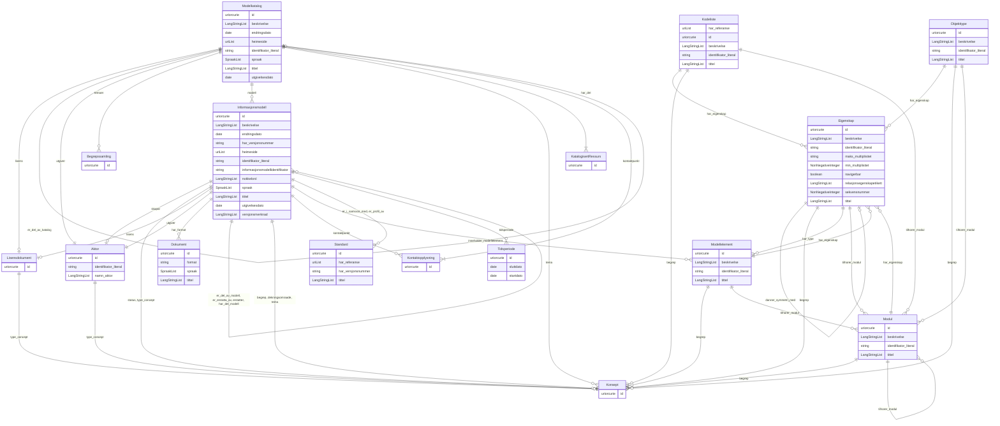

```mermaid
erDiagram
Aktor {
    uriorcurie id  
    string identifikator_literal  
    LangStringList namn_aktor  
}
Begrepssamling {
    uriorcurie id  
}
Dokument {
    uriorcurie id  
    string format  
    SpraakList spraak  
    LangStringList tittel  
}
Eigenskap {
    uriorcurie id  
    LangStringList beskrivelse  
    string identifikator_literal  
    string maks_multiplisitet  
    NonNegativeInteger min_multiplisitet  
    boolean navigerbar  
    LangStringList relasjonsegenskapetikett  
    NonNegativeInteger sekvensnummer  
    LangStringList tittel  
}
Informasjonsmodell {
    uriorcurie id  
    LangStringList beskrivelse  
    date endringsdato  
    string har_versjonsnummer  
    uriList heimeside  
    string identifikator_literal  
    string informasjonsmodellidentifikator  
    LangStringList nokkelord  
    SpraakList spraak  
    LangStringList tittel  
    date utgivelsesdato  
    LangStringList versjonsmerknad  
}
KatalogisertRessurs {
    uriorcurie id  
}
Kodeliste {
    uriList har_referanse  
    uriorcurie id  
    LangStringList beskrivelse  
    string identifikator_literal  
    LangStringList tittel  
}
Konsept {
    uriorcurie id  
}
Kontaktopplysning {
    uriorcurie id  
}
Lisensdokument {
    uriorcurie id  
}
Modelkatalog {
    uriorcurie id  
    LangStringList beskrivelse  
    date endringsdato  
    uriList heimeside  
    string identifikator_literal  
    SpraakList spraak  
    LangStringList tittel  
    date utgivelsesdato  
}
Modellelement {
    uriorcurie id  
    LangStringList beskrivelse  
    string identifikator_literal  
    LangStringList tittel  
}
Modul {
    uriorcurie id  
    LangStringList beskrivelse  
    string identifikator_literal  
    LangStringList tittel  
}
Objekttype {
    uriorcurie id  
    LangStringList beskrivelse  
    string identifikator_literal  
    LangStringList tittel  
}
Standard {
    uriorcurie id  
    uriList har_referanse  
    string har_versjonsnummer  
    LangStringList tittel  
}
Tidsperiode {
    uriorcurie id  
    date sluttdato  
    date startdato  
}

Aktor ||--|o Konsept : "type_concept"
Eigenskap ||--|o Eigenskap : "danner_symmetri_med"
Eigenskap ||--}o Konsept : "begrep"
Eigenskap ||--}o Modellelement : "har_type"
Eigenskap ||--}o Modul : "tilhorer_modul"
Informasjonsmodell ||--|o Aktor : "skapar"
Informasjonsmodell ||--|o Konsept : "status, type_concept"
Informasjonsmodell ||--|o Lisensdokument : "lisens"
Informasjonsmodell ||--|| Aktor : "utgiver"
Informasjonsmodell ||--}o Dokument : "har_format"
Informasjonsmodell ||--}o Informasjonsmodell : "er_del_av_modell, er_erstatta_av, erstatter, har_del_modell"
Informasjonsmodell ||--}o Konsept : "begrep, dekningsomraade, tema"
Informasjonsmodell ||--}o Kontaktopplysning : "kontaktpunkt"
Informasjonsmodell ||--}o Modellelement : "inneholder_modellelement"
Informasjonsmodell ||--}o Standard : "er_i_samsvar_med, er_profil_av"
Informasjonsmodell ||--}o Tidsperiode : "tidsperiode"
Kodeliste ||--}o Eigenskap : "har_eigenskap"
Kodeliste ||--}o Konsept : "begrep"
Kodeliste ||--}o Modul : "tilhorer_modul"
Lisensdokument ||--|o Konsept : "type_concept"
Modelkatalog ||--|o Lisensdokument : "lisens"
Modelkatalog ||--|o Modelkatalog : "er_del_av_katalog"
Modelkatalog ||--|| Aktor : "utgiver"
Modelkatalog ||--}o Begrepssamling : "temaer"
Modelkatalog ||--}o Informasjonsmodell : "modell"
Modelkatalog ||--}o Konsept : "tema"
Modelkatalog ||--}| KatalogisertRessurs : "har_del"
Modelkatalog ||--}| Kontaktopplysning : "kontaktpunkt"
Modellelement ||--}o Eigenskap : "har_eigenskap"
Modellelement ||--}o Konsept : "begrep"
Modellelement ||--}o Modul : "tilhorer_modul"
Modul ||--}o Eigenskap : "har_eigenskap"
Modul ||--}o Konsept : "begrep"
Modul ||--}o Modul : "tilhorer_modul"
Objekttype ||--}o Eigenskap : "har_eigenskap"
Objekttype ||--}o Konsept : "begrep"
Objekttype ||--}o Modul : "tilhorer_modul"

```

